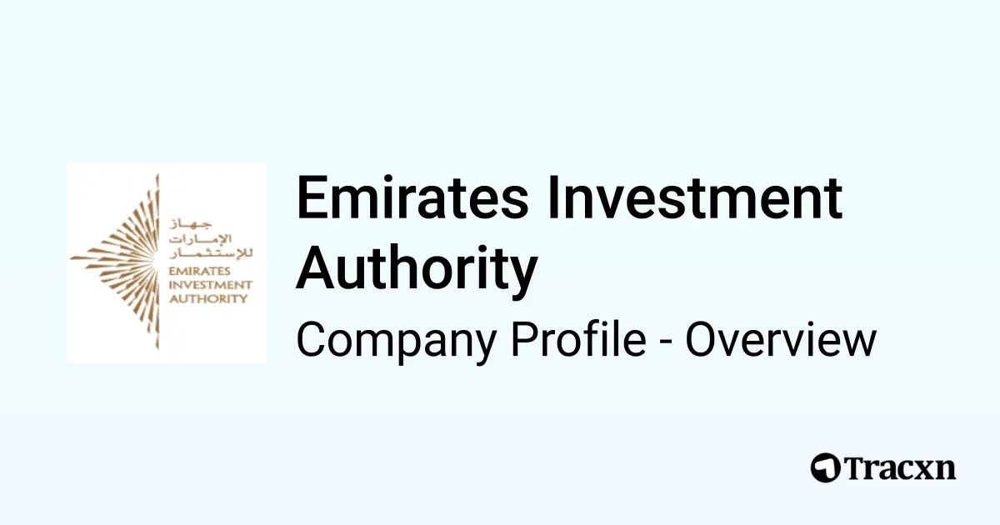

## Table of Contents

## What is the Emirates Investment Authority (EIA)?

The Emirates Investment Authority (EIA) is a government organization in the United Arab Emirates. It manages and invests money for the country. The EIA helps to grow the UAE's wealth by investing in different things like businesses, real estate, and other financial assets.

The EIA works to make sure the UAE's money is safe and grows over time. It follows rules to make smart investment choices. By doing this, the EIA helps the UAE's economy and supports projects that can benefit the country and its people.

## When was the Emirates Investment Authority established?

The Emirates Investment Authority (EIA) was set up in 2007. This was done by the government of the United Arab Emirates to handle their money and investments better.

The EIA helps the UAE by investing in many different things. It works to make the country's money grow and keep it safe. This helps the economy and supports important projects in the UAE.

## What are the main objectives of the EIA?

The main goal of the Emirates Investment Authority (EIA) is to grow the UAE's money by making smart investments. They put money into different things like businesses, real estate, and other financial assets. This helps to increase the country's wealth over time. The EIA follows strict rules to make sure their investment choices are good and safe.

Another important aim of the EIA is to help the UAE's economy. By investing wisely, they can support projects that benefit the country and its people. This can lead to more jobs and better living conditions. The EIA's work is all about making the UAE stronger and more prosperous in the long run.

## How is the EIA structured?

The Emirates Investment Authority (EIA) has a clear structure to help it do its job well. At the top, there is a Board of Directors. This group makes the big decisions about where to invest the UAE's money. The Board is made up of important people from the government and other experts. They meet regularly to talk about the EIA's plans and check how the investments are doing.

Below the Board of Directors, there are different teams that handle the day-to-day work. These teams include people who find new investment opportunities, manage the money, and make sure everything follows the rules. Each team has its own leader who reports to the Board. This setup helps the EIA to work smoothly and make smart choices about where to put the country's money.

## Who oversees the operations of the EIA?

The operations of the Emirates Investment Authority (EIA) are overseen by the Board of Directors. This group is made up of important government officials and experts who make the big decisions about where to invest the UAE's money. They meet regularly to discuss the EIA's plans and check on how the investments are doing.

Below the Board of Directors, there are different teams that handle the daily work. These teams include people who look for new places to invest, manage the money, and make sure everything follows the rules. Each team has a leader who reports to the Board, helping the EIA run smoothly and make smart choices about investments.

## What types of investments does the EIA focus on?

The Emirates Investment Authority (EIA) focuses on a variety of investments to grow the UAE's wealth. They invest in businesses, which means they might buy shares in companies that they think will do well in the future. They also put money into real estate, like buildings and land, hoping these will increase in value over time. Another area they focus on is infrastructure, such as roads and bridges, which can help the country grow.

In addition to these, the EIA also looks at financial assets like stocks, bonds, and other securities. These can be from different countries and industries, which helps spread the risk. The EIA's goal is to have a mix of investments so that if one type does not do well, others might balance it out. By doing this, they aim to keep the UAE's money safe and growing over time.

## How does the EIA contribute to the UAE's economy?

The Emirates Investment Authority (EIA) helps the UAE's economy by making smart investments with the country's money. They put money into different things like businesses, real estate, and infrastructure. This helps create more jobs and brings more money into the UAE. When the EIA invests in businesses, it can help them grow and succeed, which is good for the economy. They also invest in things like roads and buildings, which can make the country a better place to live and work.

By spreading investments across many different areas, the EIA helps keep the UAE's money safe and growing. If one type of investment does not do well, other investments might balance it out. This careful approach helps the UAE's wealth increase over time. As the EIA's investments grow, more money can be used for important projects that benefit the people of the UAE. This way, the EIA plays a big role in making the country stronger and more prosperous.

## What are some notable investments made by the EIA?

The Emirates Investment Authority (EIA) has made many important investments. One big investment was in real estate. They bought a lot of buildings and land in different countries. This helps them make money from rent and when they sell the property for a higher price later. Another investment was in businesses. The EIA bought shares in many companies, especially in areas like technology and energy. This helps those companies grow and makes the UAE's money grow too.

The EIA also put money into infrastructure projects. They invested in things like roads, bridges, and ports in the UAE and other places. These projects help make it easier for people to move around and for businesses to work better. This can bring more jobs and money to the UAE. Another type of investment the EIA made was in financial assets. They bought stocks, bonds, and other securities from different countries and industries. This helps spread the risk and keeps the UAE's money safe and growing.

## How does the EIA manage risk in its investment portfolio?

The Emirates Investment Authority (EIA) manages risk in its investment portfolio by spreading its money across many different types of investments. They put money into things like businesses, real estate, and financial assets like stocks and bonds. By doing this, if one type of investment does not do well, other investments might still be doing okay. This way, the EIA can balance out the losses and keep the UAE's money safe.

The EIA also follows strict rules and uses experts to make smart choices about where to invest. They study the markets carefully and only invest in things that they think will grow over time. This helps them avoid big risks and make sure the UAE's money keeps growing. By being careful and planning well, the EIA helps protect and increase the country's wealth.

## What is the EIA's approach to sustainable and ethical investing?

The Emirates Investment Authority (EIA) cares about sustainable and ethical investing. They want to make sure their investments help the environment and follow good ethical rules. The EIA looks for companies that care about the planet and treat people well. They might invest in businesses that use clean energy or work to reduce waste. This helps make the world a better place while also growing the UAE's money.

The EIA also follows strict rules to make sure their investments are ethical. They check that the companies they invest in do not harm people or the environment. The EIA believes that by investing in a responsible way, they can help the UAE's economy grow while also doing good for the world. This approach makes sure that the UAE's money is used in a way that everyone can feel good about.

## How does the EIA collaborate with other global investment entities?

The Emirates Investment Authority (EIA) works with other big investment groups from around the world. They do this to share ideas and find new places to put their money. By talking and working together, the EIA can learn about new markets and investment chances that they might not know about on their own. This helps them make smarter choices about where to invest the UAE's money.

Sometimes, the EIA joins with other investors to put money into big projects. This can be things like building new roads or starting new businesses. By working together, they can share the costs and the risks. This way, the EIA can help make these big projects happen while also keeping the UAE's money safe and growing.

## What are the future strategic plans of the EIA?

The Emirates Investment Authority (EIA) wants to keep growing the UAE's money in the future. They plan to do this by looking for new places to invest around the world. The EIA will focus on areas like technology, clean energy, and other new industries that they think will do well. They also want to use new technology to make their investments safer and smarter. By doing this, they hope to find more ways to make the UAE's money grow over time.

Another important part of the EIA's future plans is to keep investing in a way that helps the environment and follows good ethical rules. They will look for more companies that care about the planet and treat people well. The EIA believes that by investing responsibly, they can help the UAE's economy while also making the world a better place. This approach will guide their choices about where to put the country's money in the future.

## What is EIA's Approach to Investment and Management?

The Emirates Investment Authority (EIA) employs a strategic and multifaceted approach to investment and management, carefully balancing risk with opportunity to optimize returns. A core aspect of EIA's investment strategy is diversification, which helps mitigate risk across various asset classes and geographies. By investing in a broad spectrum of sectors, including infrastructure, finance, technology, and renewable energy, EIA ensures that its portfolio is well-positioned to capture growth opportunities while buffering against sector-specific downturns.

Central to EIA's investment strategy is risk management. The EIA employs advanced risk assessment tools and models to identify potential risks in its investment ventures. This involves a comprehensive analysis of market trends, geopolitical developments, and macroeconomic indicators. Risk is quantified using statistical measures like Value at Risk (VaR) and stress testing scenarios to predict the impact of unfavorable events on the portfolio. For instance, VaR is used to estimate the potential loss of an investment portfolio over a defined period for a given confidence interval, defined mathematically as:

$$
VaR = \text{maximum potential loss} \times \sqrt{\frac{\text{Time Horizon}}{\text{Number of Observations}}}
$$

EIA's diversified portfolio extends beyond geographic boundaries, investing in emerging and developed markets alike. This geographic diversification helps in hedging the portfolio against region-specific risks and capitalizing on growth potential in different parts of the world.

Governance and oversight are critical components of EIA's management framework, ensuring that operations align with the principles of transparency and efficiency. The EIA adheres to stringent compliance standards and regulatory requirements, maintaining a robust system of checks and balances. An independent board of directors oversees strategic decision-making, ensuring that investments align with the EIA's broader objectives of sustainable economic diversification and long-term growth for the UAE economy. Regular audits and performance evaluations are conducted to monitor the effectiveness of management practices and investment outcomes, facilitating continuous improvement.

Moreover, EIA employs a comprehensive set of performance metrics and benchmarks to evaluate investment success and align its strategies with market trends. This adaptive approach enables timely responses to changing economic conditions, reinforcing EIA's commitment to prudent and progressive investment management.

## References & Further Reading

[1]: Bergstra, J., Bardenet, R., Bengio, Y., & Kégl, B. (2011). ["Algorithms for Hyper-Parameter Optimization."](https://dl.acm.org/doi/10.5555/2986459.2986743) Advances in Neural Information Processing Systems 24.

[2]: ["Advances in Financial Machine Learning"](https://www.amazon.com/Advances-Financial-Machine-Learning-Marcos/dp/1119482089) by Marcos Lopez de Prado

[3]: ["Evidence-Based Technical Analysis: Applying the Scientific Method and Statistical Inference to Trading Signals"](https://www.amazon.com/Evidence-Based-Technical-Analysis-Scientific-Statistical/dp/0470008741) by David Aronson

[4]: ["Machine Learning for Algorithmic Trading"](https://github.com/stefan-jansen/machine-learning-for-trading) by Stefan Jansen

[5]: ["Quantitative Trading: How to Build Your Own Algorithmic Trading Business"](https://www.amazon.com/Quantitative-Trading-Build-Algorithmic-Business/dp/1119800064) by Ernest P. Chan