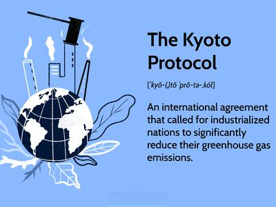

In a world increasingly focused on combating climate change, Emissions Reduction Purchase Agreements (ERPAs) have become critical. These agreements facilitate the trade of carbon credits, which are essential for regulating and incentivizing reductions in greenhouse gas emissions. Carbon credits serve as a mechanism to monitor and control the volume of emissions, effectively putting a price on carbon to encourage industries and nations to adopt cleaner technologies and reduce their carbon footprints. This pricing mechanism can be vital in ensuring alignment with international climate agreements, such as the Paris Agreement, which set targets for limiting temperature rises due to global warming.

ERPAs are legal contracts that play a vital role in emissions trading, allowing countries and corporations to participate in the global effort to hit their emissions targets. These contracts define the terms by which parties agree to trade a given quantity of emission reductions, clarifying buyer and seller obligations, delivery schedules, and penalties for non-compliance or default. By legally binding entities to specific emission reduction targets, ERPAs help amplify the effectiveness of carbon markets, simultaneously fueling economic growth and encouraging sustainability.



This article explores the components and significance of ERPAs, dissecting the intricacies of these contractual agreements and their pivotal role in carbon-offset projects. Additionally, it examines how algorithmic trading is transforming the emissions reduction marketplace, enhancing efficiency and providing new strategic opportunities for market participants. Collectively, these factors underscore the importance of ERPAs in promoting economically viable paths toward significant emission reduction.

## Table of Contents

## What is an ERPA?

An Emissions Reduction Purchase Agreement (ERPA) is a contractual arrangement that facilitates the buying and selling of carbon credits. Carbon credits serve as permits allowing entities to emit a specific amount of greenhouse gases, and ERPAs provide the legal framework for these transactions. Entities engage in ERPAs to either offset emissions surpassing their allocated levels or to sell surplus credits obtained through emissions reduction initiatives. This process aligns with international emissions trading systems and can directly influence a company or country's ability to meet regulatory requirements and carbon neutrality targets.

ERPAs are structured around key elements, each crucial to the effective functioning of the agreement. The quantity of emissions reductions is a primary consideration, stipulating the volume of carbon credits being traded. The pricing mechanism within an ERPA determines the cost of these credits, influenced by market conditions and negotiated terms between the parties. Delivery schedules specify time frames within which the emissions credits must be transferred from seller to buyer, ensuring timely compliance with regulatory or voluntary commitments.

Obligations outlined in ERPAs ensure that both buyers and sellers adhere to specific responsibilities and standards. For sellers, this often involves verification and certification of the emissions reductions by accredited bodies. Buyers, on the other hand, commit to purchasing the credits within the agreed terms and conditions. These agreements are crucial in managing risks associated with carbon markets and ensuring that projects aimed at reducing emissions are financially viable and environmentally effective. 

Through ERPAs, countries and corporations can strategically manage their carbon portfolios, facilitating a balance between economic activities and environmental responsibilities. As the global emphasis on reducing carbon footprints intensifies, the role of ERPAs in emissions trading systems becomes increasingly important, offering structured, legally binding means for environmental accountability and sustainable development.

## Understanding ERPAs

Emissions Reduction Purchase Agreements (ERPAs) serve as critical tools for managing project risks by clearly defining the rights and obligations of each party involved in carbon-offset projects. These agreements are essential for the successful execution of projects aimed at reducing greenhouse gas emissions. By establishing clear frameworks, ERPAs help minimize disputes and ensure that all involved entities have a shared understanding of their roles and responsibilities.

A key aspect of ERPAs is their ability to outline commercial terms such as pricing structures and the [volume](/wiki/volume-trading-strategy) of emissions reductions, thereby providing a structured framework for emissions trading. These agreements specify the agreed-upon price for carbon credits and the quantity of emissions reductions to be delivered, ensuring transparency and predictability in market transactions. This structured approach not only facilitates smoother transactions but also attracts investment in carbon-offset projects by making financial returns more predictable.

The International Emissions Trading Association (IETA) plays a pivotal role in setting the standards for ERPAs. By establishing guidelines and best practices, IETA ensures transparency and consistency across the emissions trading market. These standards help maintain market integrity, foster trust among participants, and facilitate the development of a global carbon market. By adhering to IETA standards, ERPAs ensure that carbon-offset projects are not only environmentally effective but also economically viable.

In summary, ERPAs are indispensable for the effective management of carbon-offset projects. They provide a comprehensive framework that clarifies rights and obligations, outlines commercial terms, and adheres to standardized guidelines, thereby mitigating project risks and ensuring the success of emissions trading initiatives.

## The Components of an ERPA

Emissions Reduction Purchase Agreements (ERPAs) are pivotal in structuring the trade of carbon credits, encompassing several critical components. At the core of an ERPA is the defined quantity and price of carbon credits. This specifies the volume of emissions reductions to be traded and the agreed-upon financial value for these credits. For instance, a typical agreement may quantify carbon credits in metric tons of CO2 equivalent and set a price per ton that takes into account current market conditions and future projections.

The delivery and payment schedules outlined within an ERPA ensure clarity and accountability between the parties involved. These schedules delineate when the carbon credits will be transferred and when payments are due. They are often structured to align with project milestones or phases of emissions reduction, ensuring a coherent timeline for both financial exchanges and delivery of the emissions reductions.

Another crucial component of an ERPA is the stipulations for consequences and penalties in the case of non-delivery or default. These provisions protect the interests of both parties by establishing clear repercussions for failure to meet specified terms. For example, penalties might include financial compensation measures or additional delivery obligations in subsequent periods, serving as both a deterrent and recourse mechanism.

ERPAs also define the general obligations for both sellers and buyers, encompassing project verification, certification, and reporting requirements. Verification involves third-party assessment of the emissions reductions claimed, ensuring their accuracy and credibility. Certification follows, where verified reductions receive official recognition, often necessary for acceptance in carbon markets. Reporting requirements mandate regular updates on the project's status, performance, and attainment of emissions reduction targets, fostering transparency and trust between stakeholders.

These components collectively ensure that ERPAs provide a robust framework for the trade of carbon credits, facilitating reliable and transparent emissions reduction transactions.

## The Market for Trading Carbon Credits

The carbon credits trading market operates in a manner akin to a stock market, primarily involving paper-based transactions without the exchange of tangible assets. This market serves as a platform for trading carbon credits, which are permits allowing the emission of a specific amount of greenhouse gases. Each credit generally equates to one metric ton of carbon dioxide, and entities can trade credits to meet their regulatory or voluntary emission reduction goals.

### Entering the Carbon Market

Successful participation in the carbon credits market demands a comprehensive understanding of the types of carbon credits available. These types can vary based on the project or method of carbon reduction, such as renewable energy generation, reforestation, or energy efficiency improvements. Participants must also be familiar with the corresponding certification standards, such as Verified Carbon Standard (VCS) or the Gold Standard, which ensure the credibility and environmental integrity of these credits.

Pricing strategies in this market are influenced by multiple factors, including supply and demand dynamics, regulatory developments, and geopolitical considerations. Effective pricing strategies require not only an understanding of these factors but also the ability to predict market trends. Participants need to develop skills in risk management and in establishing strong partnerships. Engaging with reliable partners is crucial for ensuring smooth transactions, managing market risks, and securing high-quality credits.

### The Role of Algorithmic Trading

The introduction of [algorithmic trading](/wiki/algorithmic-trading) has revolutionized the carbon credits market by improving trading efficiencies and market responsiveness. Algorithmic trading uses computer algorithms to execute trades at speeds and frequencies impossible for human traders. These algorithms can analyze large datasets to identify optimal trading opportunities and execute trades based on predefined criteria. This approach enhances [liquidity](/wiki/liquidity-risk-premium), reduces transaction costs, and minimizes market impact.

Python, one of the preferred languages for implementing algorithmic trading strategies, offers libraries such as pandas for data manipulation and NumPy for numerical computation. A basic algorithmic trading strategy in Python might involve fetching market data, applying a trading algorithm, and executing buy or sell orders based on specific conditions. The following example illustrates a simple moving average crossover strategy, a common method used in various trading scenarios:

```python
import pandas as pd

# Fetch market data, e.g., historical price data for carbon credits
data = pd.read_csv('carbon_market_data.csv')

# Calculate moving averages
data['SMA_50'] = data['Price'].rolling(window=50).mean()
data['SMA_200'] = data['Price'].rolling(window=200).mean()

# Generate buy/sell signals based on moving average crossover
data['Signal'] = 0
data['Signal'][50:] = np.where(data['SMA_50'][50:] > data['SMA_200'][50:], 1, 0)
data['Position'] = data['Signal'].diff()

# Execute trades based on the generated signals
def execute_trades(data):
    for index, row in data.iterrows():
        if row['Position'] == 1:
            print(f"Buy order executed at index {index}, Price: {row['Price']}")
        elif row['Position'] == -1:
            print(f"Sell order executed at index {index}, Price: {row['Price']}")

execute_trades(data)
```

By implementing such strategies, traders can respond swiftly to market changes, making profitable trades that align with their overall trading objectives. As the market evolves, the integration of advanced technologies and trading strategies promises to improve the efficacy and scalability of carbon trading, thereby supporting broader climate goals.

## Algorithmic Trading in Emissions Reduction

Algorithmic trading, commonly known as algo trading, utilizes automated systems to execute trades according to predefined criteria, transforming the trading of carbon credits. Algorithms enhance trading efficiencies by optimizing the process of buying and selling carbon credits. For instance, they can quickly analyze significant amounts of market data to detect pricing disparities and execute trades in real-time, thereby reducing the latency inherent in manual trading methods.

Risk mitigation is another critical advantage offered by algorithmic trading. Automated systems help minimize human error associated with manual trading and allow for more precise execution, reducing the possibility of large-scale market disruptions. Algorithms can also implement complex risk management strategies that adjust to fluctuating market conditions, safeguarding against volatile price changes and ensuring strategic compliance with emissions reduction commitments.

A dynamic pricing and transaction strategy is one of the prominent features facilitated by algorithmic trading in the emissions reduction market. Algorithms employ data analytics to develop predictive models that anticipate market trends and price movements. This enables market participants to set competitive pricing strategies and make informed purchasing decisions, based on comprehensive and real-time market insights.

The core strength of algorithmic trading lies in its capacity to leverage substantial datasets. By harnessing big data, these systems enhance the strategic purchase and sale of carbon credits. They improve market liquidity, providing the necessary conditions for a fluid market where carbon credits can be easily bought and sold. Here's an example of a simple algorithm for optimizing trades in Python:

```python
import numpy as np

def optimize_trades(prices):
    # Calculate daily returns from prices
    returns = np.diff(prices) / prices[:-1]
    # Calculate average return
    avg_return = np.mean(returns)
    # Define strategy: trade when return exceeds threshold
    threshold = 0.02
    trades = [i for i in range(len(returns)) if returns[i] > threshold]
    return trades, avg_return

# Example prices of carbon credits
prices = [10, 10.5, 10.7, 11, 10.9, 11.2, 11.5]

trades, avg_return = optimize_trades(prices)

print("Optimized Trades: ", trades)
print("Average Return: {:.2%}".format(avg_return))
```

In this simplified example, the algorithm calculates daily returns from a series of carbon credit prices and identifies optimal trading days based on a returns threshold. Though basic, this highlights the capacity of algorithms to process financial data, analyze trends, and automate decision-making in trading activities.

In conclusion, algorithmic trading significantly enhances the efficiency and responsiveness of the carbon credits market. By integrating advanced data analysis with automatic execution, algorithms pave the way for more dynamic and resilient emissions reduction markets, contributing substantially to global climate efforts.

## Conclusion

Emissions Reduction Purchase Agreements (ERPAs) play a vital role in the global endeavor to combat climate change, mainly by serving as the structural framework for the trade of carbon credits. These agreements facilitate a systematic approach to buying and selling carbon credits, allowing entities such as countries and corporations to comply with emissions targets and incentivize reductions in greenhouse gas emissions. As businesses and governments aim to meet sustainability goals, ERPAs provide the necessary blueprint for achieving these objectives through clearly defined commercial terms, delivery obligations, and compliance protocols.

The integration of algorithmic trading within the emissions reduction marketplace marks a significant advancement. This technology enhances the efficiency and responsiveness of carbon credits trading by utilizing automated systems that can process substantial datasets rapidly. Algorithms optimize trading activities by executing transactions based on predefined criteria, thereby improving liquidity and facilitating more dynamic pricing strategies. The advent of algorithmic trading empowers market participants to better manage risk and maximize opportunities in the emissions trading landscape.

Looking toward the future, the synergy between ERPAs and advanced trading strategies will be indispensable as global efforts to mitigate climate change intensify. The structured mechanisms offered by ERPAs, combined with the capabilities of algorithmic trading, promise not only to bolster the economic viability of emissions reduction efforts but also to pave the way for more sustainable practices. As the world continuously strives for greener solutions, these tools will be critical in the journey toward a low-carbon economy, enabling both environmental and economic progress.

## References & Further Reading

[1]: World Bank Group. (2022). ["Pricing Carbon."](https://documents.worldbank.org/en/publication/documents-reports/documentdetail/099045006072224607/p1780300092e910590acb201757ecd54322) World Bank.

[2]: International Emissions Trading Association (IETA). (2019). ["Emissions Trading: Finding the Right Link."](https://www.iatp.org/documents/international-emissions-trading-association-and-net-zero) IETA.

[3]: Kossoy, A., et al. (2015). ["State and Trends of Carbon Pricing 2015."](https://www.worldbank.org/content/dam/Worldbank/document/Climate/State-and-Trend-Report-2015.pdf) World Bank.

[4]: Daskalakis, G., Psychoyios, D., & Markellos, R. N. (2009). ["Modeling CO2 emission allowance prices and derivatives: Evidence from the European trading scheme."](https://www.sciencedirect.com/science/article/pii/S037842660900003X) Journal of Banking & Finance.

[5]: Stern, N. (2007). ["The Economics of Climate Change: The Stern Review."](https://www.cambridge.org/core/books/economics-of-climate-change/A1E0BBF2F0ED8E2E4142A9C878052204) Cambridge University Press.