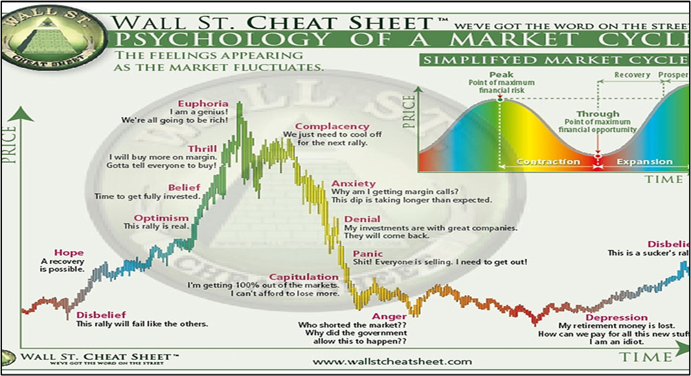

Financial markets operate on a complex tapestry of factors, yet emotions, particularly fear and greed, often emerge as dominant drivers of trader behavior. These emotions have the power to induce significant fluctuations in market dynamics, leading to phenomena such as asset bubbles during times of excessive optimism (greed) or sharp sell-offs when panic (fear) prevails. Understanding how these emotions shape decision-making processes is vital not only for individual investors but also for algorithmic traders seeking to optimize performance and reduce the risk of irrational outcomes.

In trading, fear often manifests during market downturns, prompting investors to sell their holdings to avoid further losses. This sometimes results in a self-fulfilling prophecy, where the collective fear among investors exacerbates market declines. Conversely, greed can drive prices to unsustainable levels as traders become overly optimistic, contributing to speculative bubbles that eventually burst. The pendulum between these extreme emotions can create volatile market environments, impacting not only individual portfolios but also broader economic stability.



Recognizing the influence of emotions is particularly critical for algorithmic trading, which relies on technology to execute trades based on pre-set criteria and quantitative analyses. While algorithms can potentially mitigate the sway of human emotion, they must be carefully designed to account for sudden market shifts driven by collective investor sentiment. By leveraging data-driven approaches, algorithmic systems attempt to execute trades with speed and precision, ideally free from the emotional bias that can cloud human judgment.

This article investigates into how fear and greed influence market dynamics and the pivotal role algorithmic trading can play in managing these emotional impacts. We aim to provide insights into achieving balanced decision-making processes in a market environment often dominated by emotional extremes.

## Table of Contents

## The Influence of Emotions on Financial Markets

Fear and greed significantly impact stock market performance through their effects on investor behavior and decision-making. In bullish markets, greed often drives investors to pursue rising stock prices aggressively, leading to overvaluation and the formation of asset bubbles. Such bubbles are characterized by a speculative frenzy, where the intrinsic value of assets is overshadowed by excessive optimism and speculation, potentially causing unsustainable price levels.

Conversely, in bearish markets, fear can result in abrupt and widespread sell-offs, as investors rush to liquidate positions to minimize perceived risks. This reaction is often exacerbated by a herd mentality, where individual traders follow the crowd’s actions rather than making independent decisions. This herd behavior can amplify market declines and contribute to market crashes as panic-induced selling pressures accumulate.

Market psychology, a crucial component of behavioral finance, provides insights into how these emotions lead to irrational decision-making among investors. Cognitive biases such as loss aversion, where individuals disproportionately weigh potential losses over equivalent gains, can intensify emotional reactions. Investors may also succumb to confirmation bias, selectively seeking information that supports their existing beliefs or predictions about the market.

To illustrate the process, consider the psychological cycle of a speculative bubble. Initially, a period of enthusiasm emerges, driven by positive market news or technological innovations. As prices rise, greed becomes dominant, attracting more participants and fueling further price increases. Eventually, skepticism sets in, but many continue to invest out of fear of missing out. When adverse news or economic changes occur, these inflated expectations collapse under the weight of fear, leading to panic selling and a market correction.

Understanding these emotional drivers enables market participants to identify warning signs of irrational exuberance or undue panic, equipping them to make more informed and rational decisions. While emotions are intrinsic to human decision-making, technology offers tools, such as [algorithmic trading](/wiki/algorithmic-trading), that aim to minimize emotional biases, though these must be carefully managed to avoid unintended disruptions.

## Behavioral Finance and Emotional Biases

Behavioral finance examines the psychological factors that influence investors' decision-making processes, recognizing that biases and emotions often lead to deviations from rational behavior. These deviations, driven by common emotional biases, can significantly affect trading outcomes by causing investors to make inconsistent or suboptimal decisions.

One prominent bias is herd mentality, where investors tend to follow the crowd, buying or selling assets based on collective behavior rather than independent analysis. This tendency often amplifies market trends, contributing to higher [volatility](/wiki/volatility-trading-strategies) and the formation of asset bubbles or sharp corrections. For instance, when many traders start buying an asset, others may follow suit, driving prices up irrespective of an asset's intrinsic value.

Loss aversion is another critical emotional bias, which posits that investors experience the pain of losses more intensely than the pleasure from equivalent gains. This bias can lead traders to hold onto losing positions longer than logically warranted, in the hope of recouping losses, thereby affecting overall market efficiency and personal financial health.

Overconfidence represents a psychological bias where investors overestimate their knowledge or predictive abilities, often leading to increased trading frequency and risk-taking. This can result in suboptimal trading performance, as overconfident traders may ignore market signals, disregard diversification benefits, or underestimate potential risks.

Understanding these biases is vital for traders aiming to enhance their decision-making abilities. By acknowledging the psychological pitfalls that may cloud judgment, traders can develop strategies to mitigate these effects. One approach involves implementing systematic decision-making frameworks that rely on quantitative analysis rather than subjective judgment. Additionally, incorporating checks such as stop-loss orders can manage risk and prevent excessive losses influenced by emotional biases.

Furthermore, traders can benefit from maintaining a trading journal to reflect on past decisions, recognize patterns influenced by emotional biases, and work towards improvement. This introspection helps cultivate a disciplined approach, reducing the likelihood of repeated errors.

In summary, by recognizing and addressing emotional biases, traders can align their actions more closely with rational, data-driven strategies, thereby improving their chances of success in financial markets.

## Algorithmic Trading as a Solution

Algorithmic trading offers a structured approach to mitigate the emotional influence on trading decisions by relying on predetermined rules and comprehensive quantitative analysis. The automation of trading strategies through algorithms allows for enhanced precision and speed, attributes unachievable by human traders. This approach is particularly effective in minimizing emotional responses such as panic selling or buying induced by market fluctuations.

By precisely defining entry and [exit](/wiki/exit-strategy) points, algorithms execute trades at speeds and frequencies that are beyond human capacity. For instance, a trading algorithm can analyze multiple markets simultaneously, executing trades in milliseconds—a task impossible for a human to accomplish manually. This rapid decision-making is advantageous because it prevents hesitation based on gut feelings or emotional reactions to market volatility.

To illustrate the functionality of algorithmic trading, consider the simple moving average (SMA) crossover strategy as an example. In this approach, a short-term moving average crosses above a long-term moving average, generating a buy signal. The reverse scenario generates a sell signal. Implementing this strategy in Python, one might use libraries such as pandas to calculate moving averages and NumPy to handle large data arrays efficiently:

```python
import pandas as pd
import numpy as np

# Load data
data = pd.read_csv('historical_stock_prices.csv')
short_window = 40
long_window = 100

# Calculate short- and long-term moving averages
data['short_mavg'] = data['Close'].rolling(window=short_window, min_periods=1).mean()
data['long_mavg'] = data['Close'].rolling(window=long_window, min_periods=1).mean()

# Generate signals
data['signal'] = 0
data['signal'][short_window:] = np.where(data['short_mavg'][short_window:] > data['long_mavg'][short_window:], 1, 0)
data['positions'] = data['signal'].diff()

# Print the signals
print(data[['Date', 'signal', 'positions']])
```

Although algorithmic trading minimizes emotional impulse, it necessitates stringent oversight to prevent undesired outcomes. Algorithms rely heavily on data inputs; thus, inaccuracies or anomalies in the data can lead to substantial financial losses. Moreover, market anomalies, like flash crashes, remain a potential risk if not accounted for during algorithm design.

In summary, while algorithmic trading provides a technological shield against emotion-driven decisions by adhering to predefined rules and taking action based on quantitative data, the approach demands meticulous monitoring and robust design effectiveness. Responsible implementation and continuous adjustment of these algorithms are essential to ensure they adapt to evolving market conditions and maintain their efficacy.

## The Role of Emotional Intelligence in Trading

Emotional intelligence (EI) is an essential attribute for traders seeking to navigate the often volatile and unpredictable nature of financial markets. A trader with high emotional intelligence possesses the capacity to recognize their emotions, understand the impact on their decision-making, and control these emotions to maintain discipline. This level of self-awareness enables traders to manage stress and resist the impulsive actions typically triggered by fear and greed, the two dominant market sentiments.

Mindfulness and stress management techniques play a pivotal role in helping traders maintain a balanced emotional state. Practices such as meditation, deep-breathing exercises, and structured reflection can aid in enhancing self-regulation and focus. By integrating these techniques into daily routines, traders can improve their ability to remain calm and rational during market fluctuations. This aspect is crucial, as emotional resilience can significantly reduce the likelihood of panic-driven decisions during periods of market stress.

Beyond individual traders, emotional intelligence is equally vital for those involved in the management and programming of trading algorithms. While algorithmic trading helps reduce the emotional biases inherent in human trading, the development and supervision of these algorithms still require the application of rational strategies. Professionals with high emotional intelligence are better suited to incorporate effective risk management rules and adapt to changing market conditions without being swayed by emotional biases.

The ability to assess and respond to emotional cues also facilitates improved communication and teamwork among trading professionals. In a collaborative environment, emotional intelligence fosters the sharing of insights and perspectives, contributing to more comprehensive and balanced decision-making processes.

In summary, enhancing emotional intelligence can lead to improved trading performance by fostering greater emotional control and instilling a disciplined approach to trading activities. By incorporating mindfulness and stress management techniques, traders and algorithm programmers can maintain emotional balance, optimize decision-making, and effectively manage risks.

## Case Studies and Examples

The Dot-com bubble, which occurred in the late 1990s and early 2000s, serves as a prominent historical example of how fear and greed can drive market bubbles and subsequent crashes. During this period, rampant speculation centered on internet-based companies led to excessive valuations and unsustainable growth, fueled largely by greed. Investors were driven by the allure of quick returns, often disregarding [fundamental analysis](/wiki/fundamental-analysis) and investing based on hype. This led to a significant overvaluation of technology stocks. When reality set in, fears of unsustainable business models and lack of profitability in many tech companies prompted a rapid market correction, resulting in substantial financial losses as the bubble burst.

Successful traders often attribute their resilience during these volatile periods to emotional discipline and adherence to sound trading principles. For instance, renowned investor Warren Buffet consistently emphasized investment based on intrinsic value rather than market trends or external pressures. Buffet famously remarked, "Be fearful when others are greedy and greedy when others are fearful," encapsulating his strategy of contrarian investing. This approach helped him navigate through volatile markets by focusing on long-term value rather than short-term gains.

Another case study worth examining is that of Paul Tudor Jones, a successful [hedge fund](/wiki/hedge-fund-trading-strategies) manager known for his cautious and disciplined trading strategies. During the 1987 stock market crash, Jones predicted the market downturn and positioned his trades accordingly. His ability to remain analytical and composed, while many others succumbed to panic, underscores the importance of maintaining emotional control in trading. By relying on rigorous analysis and anticipating market behavior, Jones protected his investments and even profited during a period of widespread financial turmoil.

These examples highlight the effectiveness of maintaining discipline and managing emotions in trading. Traders who succeed in volatile markets often implement strategies that mitigate emotional biases, such as predefined risk management practices and diversified portfolios. Rational decision-making, backed by empirical analysis and historical insights, helps traders weather financial storms and capitalize on opportunities arising from market fluctuations.

## Conclusion

Emotion-driven decisions in trading can lead to significant financial losses, emphasizing the critical importance of managing emotions effectively. When fear and greed dominate trading decisions, they often result in irrational behaviors that can destabilize markets. For example, panic selling during downturns or excessive speculation during upswings can lead to substantial volatility and asset mispricing. Therefore, recognizing and mitigating these emotional influences is crucial to protect against such adverse outcomes.

Algorithmic trading has emerged as a promising solution to counteract the emotional biases that traders frequently encounter. By relying on pre-defined rules and quantitative data, algorithmic systems can make objective decisions devoid of emotional interference. These systems execute trades at speeds and volumes beyond human capability, providing a buffer against reactionary trading induced by swift market movements. However, the effectiveness of algorithmic trading depends heavily on the robustness and accuracy of the underlying programming and data inputs. Erroneous data or poorly designed algorithms can lead to unintended outcomes, underscoring the need for vigilant oversight and continuous improvement of these systems.

As financial markets become increasingly complex, with rapid information flow and technological advancements, understanding and managing emotional influences will remain a cornerstone of successful trading. Building emotional intelligence—either personally through self-regulation techniques or operationally through well-constructed algorithms—will be essential. This dual approach will help traders and financial institutions navigate the ever-evolving landscape of financial markets with greater confidence and resilience. Consequently, incorporating strategies that address both the emotional and technical aspects of trading will be vital for achieving long-term success and stability in the markets.

## Frequently Asked Questions

Why are fear and greed so important to market psychology?

Fear and greed are central to market psychology because they are key emotional drivers that influence investor behavior. Fear typically leads to panic selling, while greed propels investors into buying frenzies. These emotions can cause market overreactions, leading to significant price fluctuations and volatility. Understanding these psychological influences helps explain why markets often deviate from rational expectations.

How do fear and greed affect markets?

Fear and greed can introduce volatility into financial markets. In bull markets, greed may lead investors to inflate asset prices beyond their intrinsic value, potentially creating bubbles. Conversely, fear in bear markets can result in widespread sell-offs, driving prices below their fundamental worth. This behavior can lead to increased market volatility and systemic risks, affecting financial stability and investor confidence.

How can traders take advantage of fear and greed in the market?

Traders can exploit fear and greed by adopting contrarian strategies. During periods of excessive greed, traders might sell or short overvalued assets, anticipating a market correction. When fear overshadows the market, they might buy undervalued stocks, expecting prices to rebound. Successful traders often maintain discipline and rely on analytical tools rather than emotional cues, allowing them to capitalize on these emotional market cycles.

How can one measure the level of fear or greed in the stock market?

The level of fear or greed in the stock market can be gauged through various indicators and tools. The CNN Fear & Greed Index, for example, provides a quantitative measure based on seven factors including volatility, [momentum](/wiki/momentum), and demand for safe havens. Additionally, market sentiment surveys, volatility indices like the VIX, and put/call ratios are commonly used to assess prevailing market emotions.

What strategies can improve emotional stability in trading?

Improving emotional stability in trading involves several strategies:

1. **Mindfulness and Stress Management:** Techniques such as meditation and breathing exercises can help traders remain calm and collected.

2. **Education and Preparation:** Understanding market mechanics and developing a solid trading plan can reduce emotional responses.

3. **Utilizing Technology:** Algorithmic trading systems can execute trades based on pre-defined criteria, minimizing emotional interference.

4. **Journaling:** Keeping a trading journal to reflect on past trades can help identify emotional triggers and improve decision-making.

5. **Regular Breaks:** Taking time away from trading screens can prevent emotional burnout and promote clearer thinking.

Implementing these strategies can enable traders to maintain discipline and make more rational, informed decisions.

## References & Further Reading

[1]: Shiller, R. J. (2000). ["Irrational Exuberance."](https://press.princeton.edu/books/paperback/9780691173122/irrational-exuberance) Princeton University Press.

[2]: Thaler, R. H. (2015). ["Misbehaving: The Making of Behavioral Economics."](https://psycnet.apa.org/record/2015-22902-000) W. W. Norton & Company.

[3]: Kahneman, D. (2011). ["Thinking, Fast and Slow."](https://link.springer.com/article/10.1007/s00362-013-0533-y) Farrar, Straus and Giroux.

[4]: Montier, J. (2007). ["Behavioural Investing: A Practitioner's Guide to Applying Behavioural Finance."](https://onlinelibrary.wiley.com/doi/book/10.1002/9781118673430) Wiley.

[5]: Lo, A. W. (2017). ["Adaptive Markets: Financial Evolution at the Speed of Thought."](https://www.jstor.org/stable/45200293) Princeton University Press.

[6]: Tetlock, P. C. (2007). "Giving Content to Investor Sentiment: The Role of Media in the Stock Market." *The Journal of Finance*, 62(3), 1139-1168.

[7]: Barberis, N., & Thaler, R. (2003). "A Survey of Behavioral Finance." *Handbook of the Economics of Finance*, 1, 1053-1128.