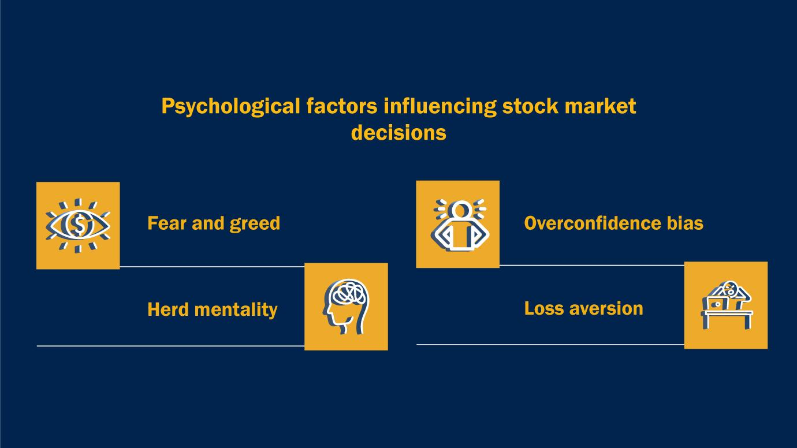

## Table of Contents

## What are emotions and how do they affect decision-making?

Emotions are feelings that come from inside us. They can be happy, sad, angry, or scared. Emotions happen because of things around us or thoughts in our heads. They help us know how we feel about things and people.

Emotions can change how we make choices. When we feel strong emotions, like being very happy or very angry, we might not think clearly. For example, if you are angry, you might make a quick decision without thinking about what could happen later. But emotions can also help us make good choices. If you feel happy around someone, you might choose to spend more time with them. So, emotions can make decision-making harder or easier, depending on how we handle them.

## How do emotions impact individual investors in financial markets?

Emotions can have a big impact on individual investors in financial markets. When people feel scared or worried, they might sell their investments quickly, even if it's not a good time to do so. This is called "panic selling." On the other hand, when people feel too confident or excited, they might buy more investments without thinking carefully, hoping to make a lot of money fast. This can lead to risky decisions that might not pay off.

Understanding and managing emotions is important for investors. If investors can stay calm and think clearly, they are more likely to make smart choices about when to buy or sell. Learning about the markets and having a plan can help investors control their emotions better. This way, they can avoid making decisions based on fear or greed and focus on their long-term goals.

## Can you explain the concept of 'herd behavior' in financial markets?

Herd behavior in financial markets happens when lots of people start doing the same thing at the same time. It's like when sheep all move together in a group. In the stock market, if many people see others buying a certain stock, they might start buying it too, even if they don't know much about it. They just follow the crowd, thinking it must be a good idea because everyone else is doing it.

This can cause big changes in the market. If everyone starts buying a stock, its price can go up quickly. But if something changes and everyone decides to sell at the same time, the price can drop fast. Herd behavior can lead to bubbles, where prices get too high, and then crashes, where prices fall a lot. It's important for investors to think for themselves and not just follow what everyone else is doing.

## What is the role of fear and greed in driving market trends?

Fear and greed are big feelings that can move the whole market. When people are scared, like when they hear bad news about the economy, they might sell their investments quickly. This can make prices go down a lot because everyone is trying to get out at the same time. It's like a big rush to the [exit](/wiki/exit-strategy) door. Fear can make people not think clearly and make choices they might regret later.

On the other hand, greed can make prices go up fast. When people see that some investments are making a lot of money, they want to get in on it too. They might buy more and more, hoping to get rich quick. This can make a bubble, where prices get too high because everyone is buying without thinking about if it's really a good idea. When the bubble pops, prices can fall a lot, and people can lose money. So, fear and greed can make the market go up and down a lot.

## How do emotional biases lead to common investment mistakes?

Emotional biases can lead to common investment mistakes because they make people act without thinking things through. One big mistake is called loss aversion, where people are so scared of losing money that they might sell their investments too soon, even if waiting a bit longer could be better. Another mistake is overconfidence, where someone might think they know everything about the market and make risky choices, hoping to make a lot of money fast. These biases can make people not see the big picture and focus too much on what's happening right now.

Another way emotional biases affect investing is through something called anchoring. This is when people hold onto the first piece of information they hear, like a stock's starting price, and use it to make all their decisions, even if it's not the best way to think about it. Also, there's the endowment effect, where people value what they already own more than they should, making them less likely to sell even if it's a good idea. These emotional biases can lead to holding onto bad investments too long or missing out on better opportunities, all because feelings get in the way of clear thinking.

## What psychological theories explain emotional influences on financial markets?

One important psychological theory that explains how emotions affect financial markets is called prospect theory. This theory says that people feel the pain of losing money more than the joy of gaining money. It means that investors might make quick decisions to avoid losses, even if those choices aren't the best in the long run. For example, if someone sees their investment going down, they might sell it right away to stop the loss, even if waiting could be better. This fear of loss can make the whole market move in big swings.

Another theory is behavioral finance, which looks at how people's feelings and thinking can lead to mistakes in the market. This theory talks about things like overconfidence, where people think they know more than they do and take big risks. It also mentions herd behavior, where people follow what everyone else is doing without thinking for themselves. These behaviors can create bubbles and crashes in the market. By understanding these theories, investors can try to control their emotions and make better choices.

## How can emotional intelligence improve financial decision-making?

Emotional intelligence can help people make better money choices by helping them understand and control their feelings. When people know their emotions, they can stop themselves from making quick decisions based on fear or greed. For example, if someone feels scared because their investment is going down, they might want to sell it right away. But if they use emotional intelligence, they can think about the big picture and maybe decide to wait and see what happens next. This way, they don't let their emotions push them into choices they might regret.

Emotional intelligence also helps people understand how others feel. In the stock market, knowing what other people might do can be useful. If everyone is excited about a certain stock and buying it, someone with high emotional intelligence might see that it's just a trend and not a good investment. They can then make choices based on facts, not just on what everyone else is doing. By being aware of their own and others' emotions, people can make smarter and calmer financial decisions.

## What tools and techniques can investors use to manage emotional responses?

Investors can use a few simple tools and techniques to manage their emotions when making money choices. One good tool is keeping a journal where they write down their feelings and thoughts about their investments. This can help them see patterns in how they react to the market and learn to control their emotions better. Another technique is setting clear rules for when to buy or sell investments. By having a plan and sticking to it, investors can avoid making quick decisions based on fear or greed. They can also use something called a stop-loss order, which automatically sells an investment if it drops to a certain price, helping them manage the fear of losing money.

Another helpful technique is mindfulness, which means being aware of your feelings in the moment and not letting them control you. By practicing mindfulness, investors can stay calm even when the market is going up and down a lot. Talking to a financial advisor can also help. A good advisor can give advice based on facts and not emotions, helping investors make better choices. Lastly, taking breaks from looking at the market all the time can reduce stress and help investors think more clearly about their decisions.

## How do market sentiment indicators reflect emotional states of investors?

Market sentiment indicators show what investors are feeling about the market. They help us understand if people are feeling happy and hopeful or worried and scared. Some common indicators are the Volatility Index (VIX), which goes up when people are scared and expect big changes in the market, and the Bull/Bear Ratio, which tells us if more people are feeling good (bullish) or bad (bearish) about the market. When these indicators show a lot of fear, it might mean that many investors are thinking about selling their investments to avoid losing money.

These indicators can also show when people are feeling too excited or greedy. For example, if the market is going up a lot and everyone is buying, the indicators might show high levels of excitement. This can sometimes lead to a bubble, where prices get too high because everyone wants to get in on the action. By watching these sentiment indicators, investors can get a sense of the overall mood of the market and maybe even use that information to make better choices about their own investments.

## What are the effects of mass media and social media on investor emotions?

Mass media and social media can really change how investors feel about the market. When the news talks a lot about a big drop in the stock market, it can make people feel scared. They might start to worry and think about selling their investments quickly, even if it's not a good time. On the other hand, if the news is full of stories about how the market is doing great, people might feel excited and want to buy more, hoping to make a lot of money. This can lead to everyone doing the same thing at the same time, which can make the market go up or down a lot.

Social media can make these feelings even stronger. On platforms like Twitter or Reddit, people can share their thoughts and feelings about the market really fast. If a lot of people are talking about a certain stock and saying it's going to go up, others might start to feel hopeful and want to buy it too. But if everyone is talking about how a stock is going to crash, it can spread fear and make people want to sell. So, what people see and hear on mass media and social media can push them to make quick choices based on their emotions, which can affect the whole market.

## How do professional traders and institutional investors handle emotional influences?

Professional traders and institutional investors use special ways to keep their feelings in check when they make money choices. They know that feeling scared or excited can make them do things too fast, so they try to stick to a plan. They set rules for when to buy or sell and follow them, no matter what the market is doing. They also use tools like stop-loss orders, which automatically sell an investment if it goes down to a certain price. This helps them avoid making quick decisions out of fear.

They also pay attention to what everyone else is feeling in the market. They use things called market sentiment indicators to see if people are scared or excited. By understanding these feelings, they can sometimes make better choices. For example, if everyone is feeling too excited and buying a lot, they might think it's a good time to sell, because they know that feeling can lead to a bubble. By keeping their own emotions under control and watching what others are feeling, professional traders and institutional investors can make smarter decisions and avoid big mistakes.

## What advanced research methods are used to study emotional impacts on financial markets?

Researchers use different ways to study how feelings affect the money markets. One way is by using something called behavioral experiments. In these experiments, people are given money to invest in a pretend market. Researchers watch how people react to changes in the market and see if feelings like fear or greed make them do certain things. They might also use brain scans, like fMRI, to see which parts of the brain light up when people are making money choices. This helps them understand how feelings work in our brains when we think about money.

Another way researchers learn about this is by looking at big data from the markets. They use computers to go through lots of information, like what people are saying on social media or how they are feeling based on market sentiment indicators. This helps them see patterns in how feelings can move the market. By putting all this information together, researchers can figure out how emotions lead to things like bubbles and crashes, and how investors can make better choices by understanding their feelings.

## References & Further Reading

[1]: Shiller, R. J. (2000). ["Irrational Exuberance."](https://press.princeton.edu/books/paperback/9780691173122/irrational-exuberance) Princeton University Press.

[2]: Thaler, R. H. (2015). ["Misbehaving: The Making of Behavioral Economics."](https://psycnet.apa.org/record/2015-22902-000) W. W. Norton & Company.

[3]: Kahneman, D. (2011). ["Thinking, Fast and Slow."](https://link.springer.com/article/10.1007/s00362-013-0533-y) Farrar, Straus and Giroux.

[4]: Montier, J. (2007). ["Behavioural Investing: A Practitioner's Guide to Applying Behavioural Finance."](https://onlinelibrary.wiley.com/doi/book/10.1002/9781118673430) Wiley.

[5]: Lo, A. W. (2017). ["Adaptive Markets: Financial Evolution at the Speed of Thought."](https://www.jstor.org/stable/45200293) Princeton University Press.

[6]: Tetlock, P. C. (2007). "Giving Content to Investor Sentiment: The Role of Media in the Stock Market." *The Journal of Finance*, 62(3), 1139-1168.

[7]: Barberis, N., & Thaler, R. (2003). "A Survey of Behavioral Finance." *Handbook of the Economics of Finance*, 1, 1053-1128.