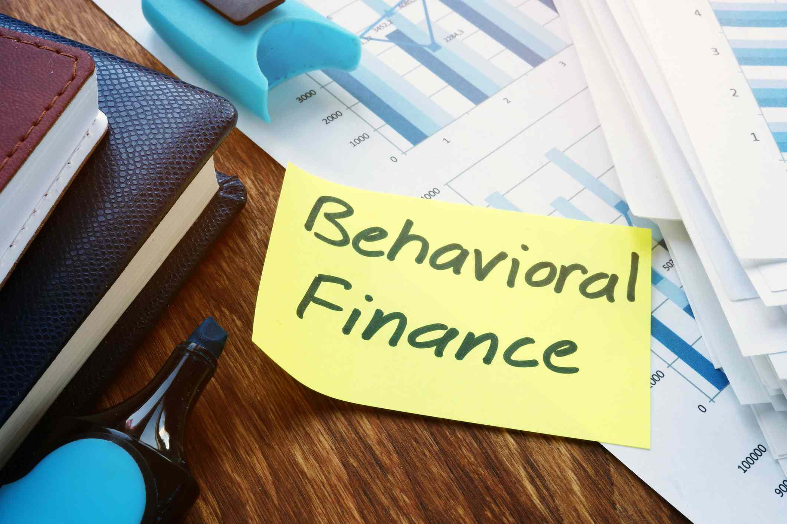

In trading, emotions such as fear, greed, and overconfidence often cloud judgment, leading to impulsive and irrational decisions. Emotional regulation is crucial in trading to maintain a neutral stance that allows for rational decision-making. Traders frequently encounter high-pressure situations that evoke emotional responses detrimental to logical reasoning and strategy adherence. Fear can cause investors to panic sell during market downturns, while greed might lead to over-leveraging positions in pursuit of higher gains. Overconfidence may result in excessive risk-taking, overlooking potential red flags.

Algorithmic trading, also known as algo trading, offers a viable solution to achieve emotional neutrality by automating trading processes. These algorithms execute trades based on pre-defined criteria, eliminating human emotions from decision-making. By doing so, algorithms foster a disciplined approach to trading, ensuring consistent adherence to strategy regardless of market volatility.



This article explores the concept of emotional neutrality, its significant role in algo trading, and how traders can leverage it for consistent success. It aims to provide insights into emotional regulation, neutral emotions, and the journey towards emotionless algorithmic trading. Understanding and implementing emotional neutrality can help traders mitigate the psychological pitfalls that often undermine long-term success in financial markets.

## Table of Contents

## Understanding Emotional Neutrality

Emotional neutrality in trading refers to the ability to make decisions that are not influenced by emotional biases such as fear, greed, or overconfidence. This concept is fundamental in financial markets, where decisions based on emotions can often lead to impulsive and irrational outcomes. To achieve emotional neutrality, investors need to adopt a rational approach, focusing solely on data and factual information.

One of the challenges investors face in maintaining emotional neutrality is the presence of inherent human biases. Behavioral economics extensively documents how cognitive biases can affect decision-making, even in contexts that are seemingly objective. For instance, biases such as loss aversion—where investors are more sensitive to losses than gains—or the confirmation bias—where individuals favor information that validates their preconceptions—can significantly skew investment choices.

Overcoming these biases is essential for enhancing trading performance. Investors can utilize various strategies to foster emotional neutrality. A data-driven approach, where decisions rely on quantitative analysis and empirical data, can help navigate the pitfalls of emotional biases. Additionally, adopting systematic trading strategies that eliminate subjective judgment can further promote neutrality. 

Trading decisions should be guided by models that prioritize statistical and probabilistic approaches. For example, using algorithms in trading ensures that decisions are made based on pre-defined parameters devoid of emotional interference. Algorithmic strategies can operate on mathematical models like mean reversion, where trades are executed based on the hypothesis that asset prices will return to their average levels over time.

In Python, such a strategy might involve calculating the historical average of asset prices and defining entry and [exit](/wiki/exit-strategy) signals:

```python
import numpy as np
import pandas as pd

# Example data: Daily closing prices
data = pd.DataFrame({'Date': pd.date_range(start='2023-01-01', periods=100, freq='D'),
                     'Close': np.random.rand(100).cumsum()})

# Calculate moving average
data['MovingAverage'] = data['Close'].rolling(window=20).mean()

# Define entry and exit signals
data['Signal'] = 0
data.loc[data['Close'] < data['MovingAverage'], 'Signal'] = 1  # Buy signal
data.loc[data['Close'] > data['MovingAverage'], 'Signal'] = -1  # Sell signal
```

The goal is to reduce human intervention and emotion, allowing the system to execute trades based purely on logical criteria. This approach aligns with the principles of behavioral economics by recognizing the influence of biases and intentionally mitigating their impacts through structured and systematic processes.

In conclusion, achieving emotional neutrality is critical for investors aiming for consistent success. By focusing on data and leveraging algorithmic solutions, traders can improve their decision-making processes and enhance their performance in the financial markets.

## The Role of Emotional Regulation in Trading

Emotional regulation in trading is a crucial skill that involves managing and modifying emotional responses to trading outcomes. This aspect of trading psychology enables traders to maintain composure and adhere faithfully to their predetermined strategies, even amidst volatile market conditions. Emotional regulation prevents impulsive decisions driven by fear or euphoria, which can lead to substantial losses or missed opportunities.

The importance of emotional regulation is underscored by its role in developing a disciplined trading mindset. Discipline in trading ensures that decisions are made logically and consistently, based on empirical data and solid strategies rather than emotions. Traders who excel in emotional regulation are capable of maintaining a balanced perspective, allowing them to navigate the unpredictable nature of financial markets more effectively.

There are several tools and techniques that traders can utilize to enhance their emotional regulation. Mindfulness practices, for instance, help traders stay present and focused, reducing stress and emotional responses to market movements. Journaling offers another beneficial practice by allowing traders to reflect on their emotional responses to trades, identify patterns, and learn from past experiences. Additionally, setting predefined rules for entry, exit, and risk management can prevent knee-jerk reactions and promote more rational decision-making in high-stress situations.

By incorporating these techniques into their daily routines, traders can significantly improve their ability to regulate emotions, leading to more consistent and rational trading outcomes. Emotional regulation is an ongoing process that requires commitment and practice, but it ultimately empowers traders to achieve long-term success in the financial markets.

## The Power of Algo Trading

Algorithmic trading, or algo trading, empowers traders by automating the trading process, significantly minimizing the influence of emotions like fear or greed on decision-making. This form of trading harnesses the capabilities of computers to execute trades at speeds and volumes impossible for human traders, leveraging speed and precision to maintain consistent strategy execution.

Algorithms follow pre-set rules that are based on quantitative analysis for entry and exit points. These rules can involve mathematical models, historical data analysis, and real-time market information to make objective decisions. For instance, an algorithm may use moving averages as indicators: if the short-term moving average crosses above the long-term moving average, it signals a buy; conversely, if the short-term moving average crosses below the long-term moving average, it may signal a sell.

```python
# Example of a simple moving average crossover strategy in Python
def moving_average_crossover_strategy(data, short_window, long_window):
    data['short_mavg'] = data['Close'].rolling(window=short_window, min_periods=1, center=False).mean()
    data['long_mavg'] = data['Close'].rolling(window=long_window, min_periods=1, center=False).mean()
    data['signal'] = 0
    data['signal'][short_window:] = np.where(data['short_mavg'][short_window:] > data['long_mavg'][short_window:], 1, 0)
    data['positions'] = data['signal'].diff()
    return data
```

By removing human emotions from the equation, algo trading reduces the likelihood of emotional responses—such as panic selling during a market dip or buying in euphoria during a surge—affecting trade decisions. This fostering of emotional neutrality results in more disciplined adherence to a trading strategy.

Moreover, algo trading systems can process vast amounts of market data across multiple securities more efficiently than humans, making it feasible to capitalize on market opportunities as they arise. An algorithm can instantaneously decide whether to buy or sell based on real-time data, ensuring that trades are executed at the most opportune moments to maximize returns or minimize losses.

Thus, [algorithmic trading](/wiki/algorithmic-trading) provides a pathway to achieving more consistent and rational outcomes by adhering strictly to a data-driven approach. Traders can rely on these systems to automate their strategies, allowing them to focus on developing and refining their models rather than the day-to-day emotional stresses of manual trading.

## Steps to Achieve Emotionless Trading with Algorithms

Developing an effective algorithmic trading strategy involves several key steps to ensure emotionless execution and consistent results. A robust trading strategy begins with the clear definition of entry, exit, and risk management rules. These rules should be derived from quantitative analysis and grounded in market data to eliminate emotional biases.

**1. Develop a Robust Trading Strategy**

A good trading strategy clearly specifies the conditions under which trades are initiated or closed. This includes:
- **Entry Rules**: Conditions based on indicators or patterns that signal the optimal time to enter a trade.
- **Exit Rules**: Criteria for closing a position to secure profits or prevent further losses.
- **Risk Management**: Parameters that define the maximum acceptable loss per trade and overall portfolio risk. Common approaches include setting stop-loss orders or using position-sizing techniques.

**2. Incorporate Backtesting**

Backtesting involves running your strategy against historical data to assess its effectiveness. This step is crucial for validating the potential profitability and robustness of your strategy. Python can be used for [backtesting](/wiki/backtesting) using libraries like `Backtrader` or `PyAlgoTrade`. Below is a simple example using `Backtrader`:

```python
import backtrader as bt

class MyStrategy(bt.Strategy):
    def __init__(self):
        self.sma = bt.indicators.SimpleMovingAverage(self.data.close, period=15)

    def next(self):
        if self.data.close[0] > self.sma[0]:
            self.buy()
        elif self.data.close[0] < self.sma[0]:
            self.sell()

cerebro = bt.Cerebro()
cerebro.addstrategy(MyStrategy)
data = bt.feeds.YahooFinanceData(dataname='AAPL', fromdate=datetime(2020, 1, 1),
                                 todate=datetime(2021, 1, 1))
cerebro.adddata(data)
cerebro.run()
```

**3. Use Technical Indicators Judiciously**

While technical indicators are valuable tools, it's essential to understand their limitations. Indicators like Moving Averages, Relative Strength Index (RSI), and Bollinger Bands can provide insights into market trends and [momentum](/wiki/momentum) but should not be relied upon in isolation. Multiple indicators can be combined to form a comprehensive view, but overcomplicating the strategy can lead to information overload and conflicting signals.

**4. Regularly Adapt Strategies to Evolving Market Conditions**

Markets are dynamic and influenced by various factors, including economic news, geopolitical events, and technological advancements. Regularly reviewing and adapting your algorithmic strategies to these changes is necessary to maintain their effectiveness. This might involve recalibrating parameters or introducing new indicators.

**5. Stay Informed with Continuous Learning**

Algorithmic trading requires staying informed about the latest technological and market developments. Continuous learning helps traders understand new tools, data sources, and analytical techniques. Engaging with trading communities, participating in online courses, and reading industry research can help traders remain competitive and enhance their trading algorithms.

By following these steps, traders can develop emotionless algorithmic strategies that leverage data-driven insights, reduce the influence of cognitive biases, and increase the likelihood of achieving consistent trading success.

## Practical Application: Emotionally Neutral Trading Strategy

Implementing an emotionally neutral trading strategy often involves adopting a contrarian approach, which seeks to capitalize on market overreactions. In this context, traders aim to exploit the discrepancies between a security's market price and its intrinsic value, particularly during periods of heightened pessimism. By systematically identifying undervalued securities, traders can potentially gain an edge over markets driven by emotional narratives.

**Objective Analysis of Market Trends**

To achieve an emotionally neutral stance, it is crucial to analyze market trends based on objective data rather than succumbing to prevailing emotional market narratives. Quantitative tools and data analytics play a significant role in this analysis. Traders typically use financial ratios, earnings reports, and other fundamental metrics to evaluate the intrinsic value of securities. Price-to-earnings (P/E) ratio, price-to-book (P/B) ratio, and discounted cash flow (DCF) models are some of the commonly used methods for this analysis.

**Systematic Identification of Undervalued Securities**

Once the intrinsic value is established, traders look for market overreactions where the security's price has deviated significantly from this value. Such overreactions are often provoked by short-term events or broader market pessimism. For instance, during a market downturn, emotionally-driven sell-offs may lead to attractive buying opportunities for securities that are fundamentally stable but temporarily undervalued.

A systematic approach might involve setting up a screening process that filters potential investments based on predefined criteria. Python can be used for this purpose, utilizing libraries like `pandas` for data manipulation and `numpy` for numerical analysis.

```python
import pandas as pd
import numpy as np

# Example dataset
data = {
    'ticker': ['AAPL', 'GOOG', 'MSFT', 'AMZN'],
    'price': [150, 2800, 300, 3500],
    'intrinsic_value': [200, 3200, 350, 3700]
}

df = pd.DataFrame(data)
# Calculate the price-to-intrinsic value ratio
df['price_intrinsic_ratio'] = df['price'] / df['intrinsic_value']

# Identify undervalued stocks based on a threshold
undervalued_stocks = df[df['price_intrinsic_ratio'] < 0.8]
```

**Grounding Strategies in Statistical Models**

To further ensure that trading strategies are free from emotional bias, grounding them in robust statistical models is essential. Tools like regression analysis and time-series forecasting are valuable in predicting future market movements based on historical data. For instance, employing the Capital Asset Pricing Model (CAPM) or the Arbitrage Pricing Theory (APT) can help assess the expected returns of securities, aligning investment decisions with statistical probabilities rather than emotional impulses.

**Wise Allocation of Risk Capital**

Risk management is a cornerstone of maintaining emotional neutrality in trading. It involves disciplined decision-making regarding the allocation of risk capital, taking into account individual risk tolerance levels and market conditions. Ensuring financial security means setting stop-loss orders, diversifying portfolios, and applying position sizing strategies to mitigate potential losses. By doing so, traders safeguard against the detrimental effects of emotional biases, allowing them to pursue opportunities with a clear, analytical mindset.

## Conclusion

Emotional neutrality is a vital aspect of successful trading, offering a strategic advantage in navigating financial markets. Algorithmic trading provides a systematic approach to mitigate emotional biases that commonly affect human traders, such as fear and greed. By automating trading strategies, traders can enhance decision-making processes, relying on predefined rules and data-driven insights rather than emotional impulses.

The pursuit of emotionless trading is not a finite achievement but a continuous journey that demands constant learning and adaptation. As algorithms and market conditions evolve, so too must a trader's strategies, ensuring they remain effective and relevant. This ongoing refinement contributes to developing a disciplined mindset, critical for maintaining composure and consistency in trading outcomes.

Embracing emotional neutrality equips traders to thrive amid the inevitable [volatility](/wiki/volatility-trading-strategies) of financial markets. Those who can effectively balance emotional regulation with algorithmic precision are better positioned to achieve long-term success, minimizing risks associated with emotional decision-making. As the trading landscape advances, mastering emotionless trading strategies will continue to offer a significant edge to those seeking sustainable growth and achievement in their trading endeavors.

## References & Further Reading

[1]: Bergstra, J., Bardenet, R., Bengio, Y., & Kégl, B. (2011). ["Algorithms for Hyper-Parameter Optimization."](https://proceedings.neurips.cc/paper/2011/file/86e8f7ab32cfd12577bc2619bc635690-Paper.pdf) Advances in Neural Information Processing Systems 24.

[2]: ["Advances in Financial Machine Learning"](https://www.amazon.com/Advances-Financial-Machine-Learning-Marcos/dp/1119482089) by Marcos Lopez de Prado

[3]: ["Evidence-Based Technical Analysis: Applying the Scientific Method and Statistical Inference to Trading Signals"](https://www.amazon.com/Evidence-Based-Technical-Analysis-Scientific-Statistical/dp/0470008741) by David Aronson

[4]: ["Machine Learning for Algorithmic Trading"](https://github.com/stefan-jansen/machine-learning-for-trading) by Stefan Jansen

[5]: ["Quantitative Trading: How to Build Your Own Algorithmic Trading Business"](https://www.amazon.com/Quantitative-Trading-Build-Algorithmic-Business/dp/1119800064) by Ernest P. Chan