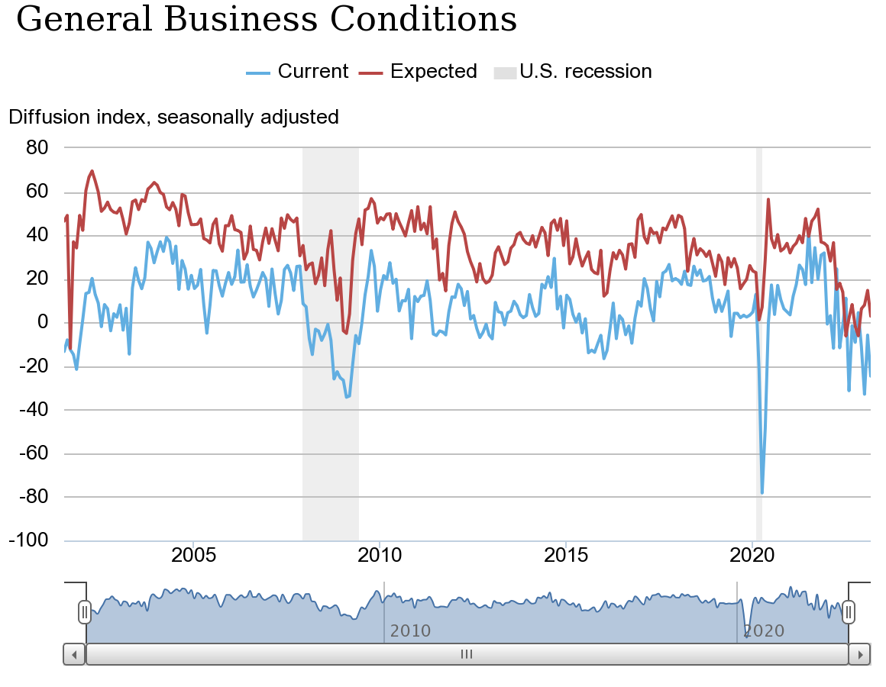

## Table of Contents

## What is the Empire State Manufacturing Index?

The Empire State Manufacturing Index is a monthly survey that shows how manufacturing businesses in New York State are doing. It is put out by the Federal Reserve Bank of New York. The survey asks manufacturing businesses about things like new orders, shipments, and how many people they are hiring. A number above zero means that manufacturing is growing, and a number below zero means it is shrinking.

This index is important because it gives us an early look at how the economy might be doing. Since manufacturing is a big part of the economy, changes in the index can tell us if the economy is getting better or worse. People who invest money, business leaders, and policymakers all use this index to help them make decisions.

## Who publishes the Empire State Manufacturing Index?

The Empire State Manufacturing Index is published by the Federal Reserve Bank of New York. They release it every month to show how manufacturing businesses in New York State are doing.

The index is important because it helps people understand the health of the economy. It tells us if manufacturing is growing or shrinking, which can affect many other parts of the economy. People who invest money, business leaders, and policymakers use this information to make decisions.

## How often is the Empire State Manufacturing Index released?

The Empire State Manufacturing Index comes out every month. It is put together by the Federal Reserve Bank of New York. They ask manufacturing businesses in New York about how they are doing, and then they share the results.

This index is important because it helps us see how the economy is doing. If the number is above zero, it means manufacturing is growing. If it is below zero, it means manufacturing is shrinking. People who invest money, business leaders, and policymakers look at this index to help them make decisions.

## What does the Empire State Manufacturing Index measure?

The Empire State Manufacturing Index measures how manufacturing businesses in New York State are doing. It looks at things like new orders, shipments, and how many people they are hiring. The Federal Reserve Bank of New York asks these businesses about their current situation and what they expect in the future. They then use this information to create a number that shows if manufacturing is growing or shrinking.

The index is important because it gives us an early look at how the economy might be doing. If the number is above zero, it means manufacturing is growing. If it is below zero, it means manufacturing is shrinking. This information is useful for people who invest money, business leaders, and policymakers. They use the index to help them make decisions about the economy.

## How is the Empire State Manufacturing Index calculated?

The Empire State Manufacturing Index is calculated by the Federal Reserve Bank of New York. They send out a survey to manufacturing businesses in New York State every month. The survey asks about things like new orders, shipments, how many people they are hiring, and what they expect in the future. The businesses answer these questions, and their responses are used to figure out the index.

To calculate the index, the Federal Reserve looks at the difference between the percentage of businesses that say things are getting better and the percentage that say things are getting worse. If more businesses say things are getting better, the index will be above zero, which means manufacturing is growing. If more businesses say things are getting worse, the index will be below zero, which means manufacturing is shrinking. This simple calculation helps everyone understand the health of the manufacturing sector in New York State.

## What is considered a 'good' or 'bad' value for the Empire State Manufacturing Index?

A 'good' value for the Empire State Manufacturing Index is any number above zero. This means that more manufacturing businesses in New York State think things are getting better than those who think things are getting worse. When the index is above zero, it shows that manufacturing is growing, which is a positive sign for the economy. People who invest money, business leaders, and policymakers see this as good news because it means the economy might be doing well.

A 'bad' value for the Empire State Manufacturing Index is any number below zero. This means that more manufacturing businesses think things are getting worse than those who think things are getting better. When the index is below zero, it shows that manufacturing is shrinking, which can be a warning sign for the economy. People who look at this index see it as bad news because it might mean the economy is not doing well.

## How does the Empire State Manufacturing Index impact the economy?

The Empire State Manufacturing Index can affect the economy because it shows how well manufacturing businesses in New York State are doing. Manufacturing is a big part of the economy, so if the index is above zero, it means manufacturing is growing. This can be good news because it might mean more jobs and more money being spent. People who invest money might feel more confident and spend more, which can help the economy grow.

On the other hand, if the Empire State Manufacturing Index is below zero, it means manufacturing is shrinking. This can be bad news because it might mean fewer jobs and less money being spent. When people see this, they might worry about the economy and spend less money. Business leaders and policymakers use this information to make decisions about how to help the economy. So, the index can give us early warnings about how the economy might be doing in the future.

## What are the key components of the Empire State Manufacturing Index?

The Empire State Manufacturing Index looks at several important things to figure out how manufacturing businesses in New York State are doing. The main things it checks are new orders, which means how many new requests for products the businesses are getting, shipments, which means how many products they are sending out, and how many people they are hiring. It also asks businesses about what they expect to happen in the future. By looking at these things, the index can tell if manufacturing is growing or shrinking.

The Federal Reserve Bank of New York uses these key pieces of information to make the index. They ask businesses if they think things are getting better or worse compared to the last month. If more businesses say things are getting better, the index will be above zero, which means manufacturing is growing. If more businesses say things are getting worse, the index will be below zero, which means manufacturing is shrinking. This helps everyone understand the health of the manufacturing sector and how it might affect the economy.

## How does the Empire State Manufacturing Index compare to other regional manufacturing surveys?

The Empire State Manufacturing Index is one of several regional manufacturing surveys in the United States. It focuses on manufacturing businesses in New York State and is put out by the Federal Reserve Bank of New York. Other similar surveys include the Philadelphia Fed Manufacturing Index, which looks at manufacturing in the Third Federal Reserve District, and the Richmond Fed Manufacturing Index, which covers manufacturing in the Fifth Federal Reserve District. Each of these surveys asks businesses about things like new orders, shipments, and how many people they are hiring, but they cover different areas of the country.

These regional surveys are important because they help us see how different parts of the country are doing. The Empire State Manufacturing Index might show growth in New York while the Philadelphia Fed Manufacturing Index might show a decline in Pennsylvania. By looking at all these surveys together, people who invest money, business leaders, and policymakers can get a better picture of how the whole country's manufacturing sector is doing. Even though they all measure similar things, the different regions can have different results, which helps everyone understand the economy better.

## What historical trends can be observed in the Empire State Manufacturing Index?

The Empire State Manufacturing Index has shown some interesting trends over the years. It often goes up and down with what is happening in the economy. For example, during times when the economy is doing well, like in the late 1990s and mid-2000s, the index was often above zero, showing that manufacturing in New York was growing. On the other hand, during tough economic times, like the 2008 financial crisis and the early months of the COVID-19 pandemic in 2020, the index dropped below zero, showing that manufacturing was shrinking.

Over the long term, the Empire State Manufacturing Index can show us how manufacturing in New York has changed. For instance, the index might show periods of steady growth or sudden drops, which can be linked to big events or changes in the economy. By looking at these trends, we can see how manufacturing has bounced back from tough times and how it has grown during good times. This helps us understand not just what is happening now, but also what might happen in the future based on what has happened before.

## How reliable is the Empire State Manufacturing Index as an economic indicator?

The Empire State Manufacturing Index is seen as a pretty good way to understand how the economy is doing. It comes out every month and is based on what manufacturing businesses in New York say about their situation. Because it is one of the first reports to come out each month, it can give us an early look at how the economy might be doing. People who invest money, business leaders, and policymakers pay attention to it because it can help them make decisions. When the index is above zero, it usually means the economy is doing well, and when it's below zero, it can mean the economy is struggling.

However, it's important to remember that the Empire State Manufacturing Index only looks at manufacturing in New York State. This means it might not show what is happening in other parts of the country or in other industries. So, while it is a useful tool, it's best to look at it along with other economic indicators to get a full picture of the economy. By comparing it with other regional surveys and national data, people can get a better idea of what is really going on and make more informed decisions.

## What are the limitations and criticisms of the Empire State Manufacturing Index?

The Empire State Manufacturing Index has some limitations. It only looks at manufacturing businesses in New York State, so it might not show what is happening in other parts of the country or in different industries. This means it might not give a full picture of the whole economy. Also, the index is based on what businesses say they are feeling, which can sometimes be different from what is really happening. For example, businesses might feel good about the future even if things are not going well right now, or they might feel bad even if things are okay.

Another criticism is that the index can be affected by short-term events or changes that might not last long. For example, if there is a big order one month, it might make the index go up, but that might not mean the economy is doing better overall. Some people also think the index can be too focused on the present and might not show what will happen in the future. Because of these things, it's important to use the Empire State Manufacturing Index along with other economic indicators to get a better idea of what is really going on with the economy.

## References & Further Reading

[1]: ["Empire State Manufacturing Survey,"](https://www.newyorkfed.org/survey/empire/empiresurvey_overview) conducted by the Federal Reserve Bank of New York.

[2]: Lopez de Prado, M. (2018). ["Advances in Financial Machine Learning."](https://www.amazon.com/Advances-Financial-Machine-Learning-Marcos/dp/1119482089) Wiley.

[3]: Aronson, D. R. (2007). ["Evidence-Based Technical Analysis: Applying the Scientific Method and Statistical Inference to Trading Signals."](https://onlinelibrary.wiley.com/doi/book/10.1002/9781118268315) Wiley.

[4]: Jansen, S. (2020). ["Machine Learning for Algorithmic Trading,"](https://github.com/stefan-jansen/machine-learning-for-trading) Packt Publishing.

[5]: Chan, E. P. (2009). ["Quantitative Trading: How to Build Your Own Algorithmic Trading Business."](https://github.com/ftvision/quant_trading_echan_book) Wiley.