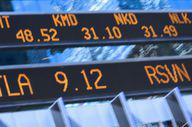

The Empire State Manufacturing Index, often regarded as a barometer of the manufacturing sector in New York, serves as a pivotal economic indicator. Published monthly by the Federal Reserve Bank of New York, this index provides timely insights into the state's manufacturing industry, reflecting the business sentiment and operational conditions faced by manufacturing executives. As a comprehensive gauge, it offers a window into various factors such as general business conditions, new orders, shipments, and employment. This makes it an invaluable tool for assessing the economic landscape.

The significance of the Empire State Manufacturing Index extends beyond its immediate geographic focus. Its readings are closely watched by policymakers, economists, and investors because they can foreshadow shifts in broader economic conditions across the United States. The manufacturing sector, a key component of GDP, supply chains, and employment, makes this index instrumental in anticipating economic trends.



In algorithmic trading strategies, such indices play a crucial role. Traders often harness these indices to enhance their algorithmic models by integrating macroeconomic indicators. For instance, unexpected changes or trends in the index can prompt adjustments in trading algorithms, influencing market positions. This dynamic underscores the importance of real-time data in trading, where swift interpretation and reaction to economic indicators can offer a competitive edge.

Economic indicators like the Empire State Manufacturing Index inform trading decisions by highlighting emerging opportunities or risks. Their utility in this context is underscored by their ability to provide quantifiable measures of economic health, which can be systematically analyzed and acted upon within trading algorithms. This integration not only helps traders in executing informed trades but also in developing strategies that are responsive to evolving economic conditions.

Understanding the Empire State Manufacturing Index thus sets the stage for exploring how economic data can influence trading and investment strategies. As we advance through this analysis, the implications for traders and investors become increasingly evident, highlighting the index's role in shaping informed financial decisions.

## Table of Contents

## Understanding the Empire State Manufacturing Index

The Empire State Manufacturing Index is a regional economic indicator that provides insights into the health of the manufacturing sector within New York State. Conducted by the Federal Reserve Bank of New York, this index is based on a survey distributed to approximately 200 manufacturing executives in the state. These executives are asked to assess various aspects of their business conditions, which are then synthesized into the index to reflect changes in economic activity.

The survey encompasses a range of elements that are essential for understanding general business conditions as well as specific indicators. Survey respondents provide information on diverse facets such as new orders, shipments, and employment, along with prices paid and received, and inventories. These components together represent the manufacturing sector's current operational environment, including output, demand, and cost structures.

Consisting of a quantitative numerical index, the survey's overarching goal is to assess whether the manufacturing business conditions are improving or declining. A positive index value indicates improving conditions, while a negative value suggests a contraction. By including both current and forward-looking elements, the survey not only captures existing economic conditions but also anticipates future adjustments by incorporating expectations for a six-month outlook.

Manufacturing is a pivotal sector in New York’s economy, contributing significantly to the state's gross domestic product and employment. The sector encompasses diverse industries, from electronics to food production, playing a critical role in sustaining economic vitality across urban and rural areas alike. As such, the health of this sector can have widespread implications for ancillary industries, logistics, and overall economic health, making the Empire State Manufacturing Index a valuable barometer for policy-makers, investors, and business leaders.

Through the aggregation and analysis of data from the survey, the Empire State Manufacturing Index provides an effective snapshot of the current economic conditions within the state's manufacturing sector. This snapshot can be invaluable for economists and traders who monitor economic trends to detect signals for economic expansions or contractions, which can, in turn, influence broader market expectations and investment decisions. In this way, the index serves as a crucial tool for timely and data-informed decision-making in economic planning and investment strategy development.

## The Mechanics of the Index

The Empire State Manufacturing Survey, conducted by the Federal Reserve Bank of New York, is a critical tool for assessing manufacturing activity in the state of New York. This survey targets a selection of manufacturing executives within the state, who are asked to provide insights on various aspects of their operations. These executives are chosen based on their ability to reflect a wide range of industries and sizes, ensuring a comprehensive overview of the manufacturing sector.

Data collection for the Empire State Manufacturing Survey occurs monthly. Respondents are questioned about current business conditions and are asked to compare them with the previous month. Additionally, they provide forecasts for conditions six months ahead. This dual focus on current and future states enables the index to serve as both a snapshot and a predictive tool of economic activity in New York's manufacturing landscape.

The survey queries executives on several key indicators, including new orders, shipments, and employment levels. These components play a significant role in influencing the index:

1. **New Orders**: This reflects incoming orders and provides insight into future production demands.
2. **Shipments**: This element tracks the volume of goods shipped, indicating current sales performance.
3. **Employment**: This measures changes in employment levels, offering clues about labor demand and production capacity.

The Empire State Manufacturing Index is calculated by aggregating responses to the survey. The method involves the diffusion index formula, where the percentage of respondents reporting an increase is subtracted from the percentage of respondents reporting a decrease. This results in a net reading that can range from -100 to 100. Positive readings suggest an expansion of manufacturing activity, while negative readings indicate contraction. The index is expressed in a single numeral, making it easy to interpret changes in economic conditions over time.

Overall, the Empire State Manufacturing Index provides a valuable monthly measure of manufacturing activity with insights garnered directly from industry executives. Its consistent methodology and wide-ranging scope make it a reliable indicator of economic health in New York’s manufacturing sector.

## Economic Indicators and Their Role in Algo Trading

Economic indicators are critical tools in financial markets, providing insights into the health and direction of an economy. These indicators, ranging from employment [statistics](/wiki/bayesian-statistics) to manufacturing output, help traders assess market conditions and make informed decisions. They are particularly valuable in [algorithmic trading](/wiki/algorithmic-trading), where decisions are executed with speed and precision.

Traders implement economic indicators in their algorithmic trading strategies by integrating them into models that can predict market movements. The use of economic data allows for the development of complex algorithms that can react to changing economic conditions. For example, an algorithm might be designed to buy or sell assets based on changes in GDP growth rates, inflation, or manufacturing indices like the Empire State Manufacturing Index. 

The integration of economic data with technical and quantitative analysis offers significant advantages. Technical analysis focuses on price movement and patterns, while quantitative analysis involves mathematical computations to identify trading opportunities. Combining these with economic indicators provides a more comprehensive market picture, enhancing the precision of trading decisions. This holistic approach allows traders to evaluate not only past price movements but also current economic dynamics that might influence those movements.

Real-time data processing is paramount in algorithmic trading. The ability to capture and analyze economic indicators quickly can make the difference between profit and loss. Algorithms are typically programmed to access datasets as soon as they are released, enabling traders to exploit these insights immediately. The faster the data is processed, the more responsive the trading strategy can be. For instance, when the Federal Reserve releases monthly employment reports, an algorithm may adjust its parameters in real-time based on employment numbers and market expectations.

Several trading strategies leverage economic indicators. One example is the "news-based" trading strategy, which uses announcements of economic indicators to make trades. Here, algorithms are configured to detect deviations in expected versus actual economic releases and automatically execute trades. Another strategy could be a "mean-reversion" model, where traders assume that asset prices might deviate from their historical average due to temporary economic shocks but eventually revert to the mean.

In conclusion, economic indicators are vital components in the toolkit of algorithmic traders. Their integration with technical and quantitative analyses allows for more nuanced trading strategies that can adapt to shifting economic landscapes. The emphasis on real-time processing of these indicators further underscores their importance in executing timely and profitable trades. As digital infrastructures continue to advance, the potential for more sophisticated implementations of economic insights in algorithmic trading grows, promising greater efficiency and profitability.

## Benefits and Limitations of the Empire State Manufacturing Index

The Empire State Manufacturing Index (ESMI) serves as a valuable tool for business and economic forecasting by providing timely insights into the manufacturing sector of New York State. As a high-frequency indicator, it offers several benefits and faces certain limitations that stakeholders need to consider.

**Benefits of the Empire State Manufacturing Index**

Firstly, the ESMI is effective in capturing business sentiment and manufacturing trends. By surveying manufacturers about a variety of business conditions such as new orders, shipments, and employment, the index provides a comprehensive snapshot of the sector’s current state. This helps businesses, investors, and policy-makers gauge the health of the manufacturing economy and make informed decisions. Its monthly frequency ensures that participants receive fresh data on the economic environment, facilitating better strategic planning and forecasting.

Secondly, the index is valuable for its ability to act as a leading indicator, often signaling changes in economic conditions before they are reflected in broader economic data. In particular, when the index experiences significant shifts, it could foreshadow future trends in regional and national economic activities. This predictive capability makes it an essential component of macroeconomic analyses and forecasting models.

**Limitations of the Empire State Manufacturing Index**

However, the index is not without its limitations. One primary challenge lies in its regional focus—being centered only on New York, it may not fully reflect national manufacturing conditions. Additionally, its reliance on survey responses introduces potential biases related to subjective opinions and non-uniform criteria used by respondents to assess business conditions. This could affect the reliability of the data, especially if there is a low response rate or a lack of diversity in the sample.

Moreover, in comparison to other indices like the Philadelphia Fed Manufacturing Survey or the national Purchasing Managers’ Index (PMI), the ESMI may not have the breadth necessary for making generalized conclusions about the U.S. economy’s manufacturing sector. National indices typically have larger sample sizes and incorporate data from multiple regions, offering a more balanced perspective.

**Historical Performance and Economic Correlations**

Historically, the ESMI has demonstrated a correlation with significant economic shifts. For instance, during periods of economic expansion or contraction, the index has shown corresponding increases or decreases, thus highlighting its sensitivity to broader economic cycles. The index’s capacity to react to such macroeconomic changes underlines its utility, although stakeholders should remain cautious about over-relying on it due to its inherent limitations.

In summary, the Empire State Manufacturing Index is a crucial economic tool that, despite certain limitations, provides valuable insights into business sentiment and economic activity. It serves as a leading indicator that can aid in forecasting economic trends, making it indispensable for those involved in economic planning and trading strategy development.

## Case Study: The Index's Influence on Trading Decisions

The Empire State Manufacturing Index (ESMI) serves as a pivotal tool for traders, informing investment decisions by reflecting current manufacturing conditions and future expectations within the New York region. This case study showcases how traders leverage the ESMI to guide trading strategies and set market positions.

### Historical Data Analysis

Historically, the ESMI has demonstrated a significant influence on market movements. The index, released monthly, provides a timely snapshot of the manufacturing sector, influencing traders’ perceptions of economic health. For example, a sudden increase in the index values might indicate heightened manufacturing activity, leading to a positive outlook on the economy. This, in turn, could trigger an increase in stock prices for manufacturing companies or sectors dependent on manufacturing output.

Conversely, a drop in the index can signal economic slowing, prompting traders to reassess their positions. For instance, during the Great Recession, drastic declines in the index preceded downturns in manufacturing stocks, prompting traders to activate stop-loss orders or reassess their market exposure.

### Trading Triggers and Positions

Traders often set specific thresholds within their algorithmic strategies to react to changes in the ESMI. A threshold might be a specific index value increase or decrease that triggers a buy or sell decision. For instance, a moving average trading strategy might be employed where traders go long on manufacturing stocks if the ESMI shows a sustained increase above a pre-determined moving average level and short if the ESMI falls below another threshold.

In Python, a simple example of setting these conditions could be:

```python
# Sample trading strategy based on ESMI
def trading_decision(esmi_value, moving_average):
    if esmi_value > moving_average + threshold:
        return "Buy"
    elif esmi_value < moving_average - threshold:
        return "Sell"
    else:
        return "Hold"

# Example usage
esmi_value = 30
moving_average = 28
threshold = 2

decision = trading_decision(esmi_value, moving_average)
print(f"Trading Decision: {decision}")
```

### Feedback from Industry Experts

Industry experts acknowledge the ESMI as an effective early indicator of economic shifts, providing valuable foresight into manufacturing trends. Traders emphasize the index's utility in confirming broader economic patterns indicated by national indices like the ISM Manufacturing Index. Experts have noted that combining the ESMI with other data sources enhances predictive accuracy, reinforcing its standing as a reliable component within a diversified trading approach.

### Future Developments in Trading Strategies

Going forward, the integration of ESMI into trading strategies is anticipated to evolve, particularly with advancements in [machine learning](/wiki/machine-learning) and [artificial intelligence](/wiki/ai-artificial-intelligence). Traders are increasingly utilizing these technologies to refine their algorithms, allowing for more sophisticated models that can handle the nuances of index fluctuations. Predictive analytics and real-time data processing are expected to play larger roles, potentially offering even more precise trading signals.

Moreover, as data accessibility improves, traders might incorporate sentiment analysis from social media and news reports to contextualize ESMI readings further. For instance, machine learning models could analyze Twitter sentiment around manufacturing topics to adjust trading models that utilize the ESMI.

In summary, the Empire State Manufacturing Index is a powerful tool in a trader's arsenal, offering tangible insights into the economic landscape and providing a basis for informed investment decision-making. Its evolving use in conjunction with cutting-edge technology underscores its continued relevance in financial markets.

## Conclusion

The Empire State Manufacturing Index serves as a significant economic indicator by providing a timely and detailed snapshot of New York's manufacturing sector. Its value lies in its ability to reflect current business conditions and forecast future economic trends, offering valuable insights that help shape corporate strategies and inform investment decisions. Businesses can leverage this data to predict market shifts, adjust inventory levels, and make informed decisions about expansion or contraction. 

For traders, the index is an indispensable tool in developing algorithmic trading strategies. Its real-time data on manufacturing trends can be integrated with technical analysis and quantitative models to create robust trading algorithms. These algorithms can process the index data swiftly, thereby facilitating rapid response to economic changes and optimizing trading positions for better returns. As digital advancements continue to evolve, the role of economic indicators like the Empire State Manufacturing Index in trading strategies is set to grow even more significant. The incorporation of machine learning and artificial intelligence into trading algorithms opens up new possibilities for analyzing vast datasets and uncovering trade patterns that were previously undetectable.

Therefore, further exploration and understanding of how economic indicators can be integrated into trading practices is crucial for those looking to remain competitive in the financial markets. As the landscape of trade strategies evolves alongside technological progress, harnessing economic insights through sophisticated algorithms not only enhances decision-making but also offers a strategic advantage. Readers are encouraged to expand their knowledge and explore the dynamic interface between economic data and trading algorithms, ensuring they are well-prepared for future advancements in the trading sector.

## References & Further Reading

[1]: ["Empire State Manufacturing Survey,"](https://www.newyorkfed.org/survey/empire/empiresurvey_overview) conducted by the Federal Reserve Bank of New York.

[2]: Lopez de Prado, M. (2018). ["Advances in Financial Machine Learning."](https://www.amazon.com/Advances-Financial-Machine-Learning-Marcos/dp/1119482089) Wiley.

[3]: Aronson, D. R. (2007). ["Evidence-Based Technical Analysis: Applying the Scientific Method and Statistical Inference to Trading Signals."](https://onlinelibrary.wiley.com/doi/book/10.1002/9781118268315) Wiley.

[4]: Jansen, S. (2020). ["Machine Learning for Algorithmic Trading,"](https://github.com/stefan-jansen/machine-learning-for-trading) Packt Publishing.

[5]: Chan, E. P. (2009). ["Quantitative Trading: How to Build Your Own Algorithmic Trading Business."](https://github.com/ftvision/quant_trading_echan_book) Wiley.