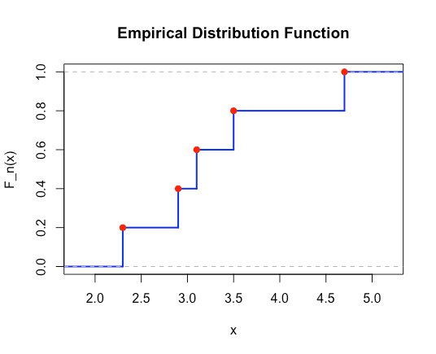

## Table of Contents

## What is the Empirical Cumulative Distribution Function (ECDF)?

The Empirical Cumulative Distribution Function (ECDF) is a way to show how the data in a sample is spread out. It's like a step-by-step graph that tells you the proportion of data points that are less than or equal to a certain value. Imagine you have a bunch of numbers. The ECDF will show you, for any number you pick, what fraction of your data is smaller than or equal to that number. It's a useful tool because it helps you understand the distribution of your data without making assumptions about its shape.

To calculate the ECDF, you start by sorting your data from smallest to largest. Then, for each data point, you count how many values are less than or equal to it and divide that number by the total number of data points. This gives you the proportion of data up to that point. The ECDF can be represented mathematically as $$F_n(x) = \frac{1}{n} \sum_{i=1}^{n} I_{\{X_i \leq x\}}$$, where $$n$$ is the number of data points, $$X_i$$ are the data points, and $$I_{\{X_i \leq x\}}$$ is an indicator function that equals 1 if $$X_i \leq x$$ and 0 otherwise. In practice, you can easily plot the ECDF using software like Python, where you might use a code block like ```python
import numpy as np
import matplotlib.pyplot as plt

data = np.array([1, 3, 5, 7, 9])
ecdf = np.arange(1, len(data) + 1) / len(data)
plt.step(np.sort(data), ecdf)
plt.show()
``` to visualize your data's distribution.

## How is the ECDF different from the theoretical Cumulative Distribution Function (CDF)?

The Empirical Cumulative Distribution Function (ECDF) and the theoretical Cumulative Distribution Function (CDF) are both used to describe how data or random variables are spread out, but they are different in how they are made and what they represent. The ECDF is based on real data that you have collected. It shows you what fraction of your data is less than or equal to any given value. For example, if you have test scores from a class, the ECDF can tell you what percentage of students scored below a certain score. The ECDF is calculated as $$F_n(x) = \frac{1}{n} \sum_{i=1}^{n} I_{\{X_i \leq x\}}$$, where $$n$$ is the number of data points, and $$I_{\{X_i \leq x\}}$$ is 1 if the data point is less than or equal to $$x$$ and 0 otherwise.

On the other hand, the theoretical CDF is a mathematical function that describes the probability that a random variable will take a value less than or equal to a certain number. It is not based on actual data but on a model or a theory about how the data should be distributed. For example, if you assume that test scores follow a normal distribution, you can use the CDF of the normal distribution to predict the probability of scores being below a certain value. The CDF is usually represented as $$F(x) = P(X \leq x)$$, where $$X$$ is the random variable and $$P$$ is the probability. While the ECDF gives you a snapshot of your actual data, the theoretical CDF gives you a prediction based on a model.

To illustrate the difference, consider the following Python code to plot both the ECDF and the theoretical CDF for a normal distribution:

```python
import numpy as np
import matplotlib.pyplot as plt
from scipy.stats import norm

# Generate some random data
np.random.seed(0)
data = np.random.normal(0, 1, 1000)

# Calculate ECDF
sorted_data = np.sort(data)
ecdf = np.arange(1, len(sorted_data) + 1) / len(sorted_data)

# Calculate theoretical CDF for normal distribution
x = np.linspace(-4, 4, 100)
cdf = norm.cdf(x, loc=0, scale=1)

# Plot ECDF and theoretical CDF
plt.figure(figsize=(10, 6))
plt.step(sorted_data, ecdf, label='ECDF')
plt.plot(x, cdf, label='Theoretical CDF (Normal)')
plt.legend()
plt.xlabel('Value')
plt.ylabel('Cumulative Probability')
plt.title('ECDF vs Theoretical CDF')
plt.show()
```

This code will show you the ECDF of your data alongside the theoretical CDF of a normal distribution, highlighting the differences between the two.

## What are the steps to construct an ECDF from a dataset?

To construct an Empirical Cumulative Distribution Function (ECDF) from a dataset, you first need to sort your data from the smallest to the largest value. This step is important because the ECDF shows the proportion of data points that are less than or equal to any given value. Once your data is sorted, you can start calculating the ECDF. For each data point in the sorted list, you count how many values are less than or equal to it. Then, you divide this count by the total number of data points in your dataset. This gives you the proportion of data up to that point, which is the value of the ECDF at that data point. Mathematically, the ECDF can be expressed as $$F_n(x) = \frac{1}{n} \sum_{i=1}^{n} I_{\{X_i \leq x\}}$$, where $$n$$ is the number of data points, $$X_i$$ are the data points, and $$I_{\{X_i \leq x\}}$$ is an indicator function that equals 1 if $$X_i \leq x$$ and 0 otherwise.

After calculating the ECDF values, you can plot them to visualize the distribution of your data. To do this, you plot the sorted data points on the x-axis and their corresponding ECDF values on the y-axis. The plot will look like a step function, where each step represents a data point. This visual representation helps you understand how your data is spread out. For example, if you want to use Python to plot the ECDF, you can use the following code:

```python
import numpy as np
import matplotlib.pyplot as plt

# Example dataset
data = np.array([2, 4, 6, 8, 10])

# Sort the data
sorted_data = np.sort(data)

# Calculate ECDF
ecdf = np.arange(1, len(sorted_data) + 1) / len(sorted_data)

# Plot ECDF
plt.step(sorted_data, ecdf)
plt.xlabel('Value')
plt.ylabel('ECDF')
plt.title('Empirical Cumulative Distribution Function')
plt.show()
```

This code will create a step plot of the ECDF, showing you the cumulative distribution of your data in a clear and understandable way.

## How can ECDF be visualized, and what tools are commonly used for this purpose?

The ECDF can be visualized as a step function on a graph. Imagine a staircase where each step represents a data point from your dataset. The x-axis shows the values of your data, sorted from smallest to largest, and the y-axis shows the proportion of data points that are less than or equal to each value. As you move along the x-axis, the y-value jumps up at each data point, showing you how much of your data is below that point. This step-by-step increase helps you see the spread of your data clearly.

Common tools for visualizing the ECDF include programming languages like Python and R, which have libraries specifically designed for this purpose. In Python, you can use libraries like NumPy for data manipulation and Matplotlib for plotting. Here's a simple example of how to plot an ECDF in Python:

```python
import numpy as np
import matplotlib.pyplot as plt

# Example dataset
data = np.array([2, 4, 6, 8, 10])

# Sort the data
sorted_data = np.sort(data)

# Calculate ECDF
ecdf = np.arange(1, len(sorted_data) + 1) / len(sorted_data)

# Plot ECDF
plt.step(sorted_data, ecdf)
plt.xlabel('Value')
plt.ylabel('ECDF')
plt.title('Empirical Cumulative Distribution Function')
plt.show()
```

In R, you can use base graphics or the ggplot2 package to create similar plots. These tools make it easy to turn your data into a visual representation that helps you understand its distribution without needing to make assumptions about its shape.

## What are the advantages of using ECDF in data analysis?

Using the Empirical Cumulative Distribution Function (ECDF) in data analysis has several advantages. One key benefit is that the ECDF is non-parametric, meaning it doesn't assume any specific distribution for your data. This makes it very flexible and useful for understanding the actual distribution of your data without making any guesses about its shape. For example, if you have test scores from a class, the ECDF can show you exactly what percentage of students scored below any given score, without assuming the scores follow a normal distribution or any other specific pattern.

Another advantage of the ECDF is that it's easy to calculate and visualize. You just need to sort your data and then plot the proportion of data points that are less than or equal to each value. This simplicity makes it a great tool for quickly getting a sense of your data's distribution. For instance, in Python, you can easily plot an ECDF with a few lines of code:

```python
import numpy as np
import matplotlib.pyplot as plt

data = np.array([1, 3, 5, 7, 9])
sorted_data = np.sort(data)
ecdf = np.arange(1, len(sorted_data) + 1) / len(sorted_data)
plt.step(sorted_data, ecdf)
plt.show()
```

This code will give you a clear visual representation of how your data is spread out, helping you make informed decisions based on the actual data you have.

## Can you explain how ECDF is used in statistical hypothesis testing?

The Empirical Cumulative Distribution Function (ECDF) is a handy tool in statistical hypothesis testing because it lets you compare the distribution of your data to what you expect under a certain hypothesis. For example, if you want to check if a set of test scores follows a normal distribution, you can plot the ECDF of your data and compare it to the theoretical Cumulative Distribution Function (CDF) of a normal distribution. If the two curves look very different, it might suggest that your data doesn't follow a normal distribution, and you might need to reject your hypothesis.

In practice, you can use the ECDF to perform tests like the Kolmogorov-Smirnov test, which measures the biggest difference between the ECDF of your data and the theoretical CDF you're comparing it to. If this difference is bigger than a certain threshold, you can conclude that your data doesn't fit the theoretical distribution you're testing against. For example, if you're testing whether exam scores are normally distributed, you can use Python to plot both the ECDF of your scores and the CDF of a normal distribution, then use the Kolmogorov-Smirnov test to see if the difference is significant:

```python
import numpy as np
import matplotlib.pyplot as plt
from scipy import stats

# Example dataset
data = np.random.normal(0, 1, 1000)  # Normally distributed data

# Calculate ECDF
sorted_data = np.sort(data)
ecdf = np.arange(1, len(sorted_data) + 1) / len(sorted_data)

# Calculate theoretical CDF for normal distribution
x = np.linspace(-4, 4, 100)
cdf = stats.norm.cdf(x, loc=0, scale=1)

# Plot ECDF and theoretical CDF
plt.figure(figsize=(10, 6))
plt.step(sorted_data, ecdf, label='ECDF')
plt.plot(x, cdf, label='Theoretical CDF (Normal)')
plt.legend()
plt.xlabel('Value')
plt.ylabel('Cumulative Probability')
plt.title('ECDF vs Theoretical CDF')

# Perform Kolmogorov-Smirnov test
ks_statistic, p_value = stats.kstest(data, 'norm')
print(f"KS Statistic: {ks_statistic}, p-value: {p_value}")

plt.show()
```

This code will help you visualize the comparison and also give you a statistical measure to decide if your data fits the normal distribution or not.

## How does ECDF help in understanding the distribution of a dataset?

The Empirical Cumulative Distribution Function (ECDF) is a useful tool that helps you understand how your data is spread out. It shows you, for any value you pick, what fraction of your data is less than or equal to that value. Imagine you have a set of numbers, like test scores. The ECDF can tell you what percentage of students scored below a certain score. This is helpful because it gives you a clear picture of your data without assuming it follows any specific pattern. You don't need to guess if your data is normally distributed or follows another type of distribution; the ECDF just shows you what the data looks like as it is.

To calculate the ECDF, you start by sorting your data from the smallest to the largest number. Then, for each number in the sorted list, you count how many values are less than or equal to it and divide that count by the total number of data points. This gives you the proportion of data up to that point. Mathematically, the ECDF can be written as $$F_n(x) = \frac{1}{n} \sum_{i=1}^{n} I_{\{X_i \leq x\}}$$, where $$n$$ is the number of data points, $$X_i$$ are the data points, and $$I_{\{X_i \leq x\}}$$ is an indicator function that equals 1 if $$X_i \leq x$$ and 0 otherwise. Once you have these values, you can plot them to see the distribution of your data. For example, in Python, you can use the following code to plot the ECDF:

```python
import numpy as np
import matplotlib.pyplot as plt

# Example dataset
data = np.array([2, 4, 6, 8, 10])

# Sort the data
sorted_data = np.sort(data)

# Calculate ECDF
ecdf = np.arange(1, len(sorted_data) + 1) / len(sorted_data)

# Plot ECDF
plt.step(sorted_data, ecdf)
plt.xlabel('Value')
plt.ylabel('ECDF')
plt.title('Empirical Cumulative Distribution Function')
plt.show()
```

This plot will show you a step-like graph where each step represents a data point, helping you see how your data is distributed in a straightforward way.

## What are some common applications of ECDF in machine learning?

The Empirical Cumulative Distribution Function (ECDF) is used in [machine learning](/wiki/machine-learning) to help understand and compare the distribution of data. For example, when you're working on a classification problem, you might want to see if the features in your data follow a certain pattern or if they are different between classes. By plotting the ECDF for each feature, you can visually inspect how the data is spread out. This can help you decide if you need to transform the data or if there are any outliers that might affect your model's performance. For instance, if you're working with Python, you can easily plot an ECDF like this:

```python
import numpy as np
import matplotlib.pyplot as plt

# Example dataset
data = np.array([2, 4, 6, 8, 10])

# Sort the data
sorted_data = np.sort(data)

# Calculate ECDF
ecdf = np.arange(1, len(sorted_data) + 1) / len(sorted_data)

# Plot ECDF
plt.step(sorted_data, ecdf)
plt.xlabel('Value')
plt.ylabel('ECDF')
plt.title('Empirical Cumulative Distribution Function')
plt.show()
```

Another common application of ECDF in machine learning is in evaluating the performance of models. When you're doing tasks like regression or anomaly detection, you might use the ECDF to look at the distribution of your model's errors or residuals. If the ECDF of the residuals looks like it follows a normal distribution, it could mean your model is doing a good job. But if the ECDF shows a very different pattern, it might suggest that your model needs improvement. This can be especially useful when you're comparing different models to see which one fits your data better. By using ECDF, you can get a clear, visual understanding of how well your model is performing without making any assumptions about the data's distribution.

## How can ECDF be used to compare different datasets?

The Empirical Cumulative Distribution Function (ECDF) is a great way to compare different datasets because it shows you how the data is spread out without assuming any specific shape. Imagine you have two sets of test scores from different classes. By plotting the ECDF for each class, you can see at a glance if one class tends to score higher or lower than the other. The ECDF will show you, for any score you pick, what percentage of students in each class scored below that score. If the ECDFs look very different, it might mean the classes have different levels of performance or different distributions of scores.

To plot the ECDFs and compare them, you can use a programming language like Python. Here's how you might do it:

```python
import numpy as np
import matplotlib.pyplot as plt

# Example datasets
class1_scores = np.array([60, 70, 80, 90, 100])
class2_scores = np.array([50, 60, 70, 80, 90])

# Sort the data
sorted_class1 = np.sort(class1_scores)
sorted_class2 = np.sort(class2_scores)

# Calculate ECDFs
ecdf_class1 = np.arange(1, len(sorted_class1) + 1) / len(sorted_class1)
ecdf_class2 = np.arange(1, len(sorted_class2) + 1) / len(sorted_class2)

# Plot ECDFs
plt.step(sorted_class1, ecdf_class1, label='Class 1')
plt.step(sorted_class2, ecdf_class2, label='Class 2')
plt.xlabel('Score')
plt.ylabel('ECDF')
plt.title('Comparing Test Scores of Two Classes')
plt.legend()
plt.show()
```

This code will create a plot where you can see the ECDFs of both classes side by side. If the lines on the plot are close together, it means the distributions of scores are similar. But if the lines are far apart, it shows that the distributions are different, helping you understand how the two classes compare in terms of their test scores.

## What are the limitations or potential drawbacks of using ECDF?

One limitation of using the Empirical Cumulative Distribution Function (ECDF) is that it can be sensitive to small changes in the dataset. If you add or remove just a few data points, the ECDF can look very different. This sensitivity can make it hard to compare datasets that are similar but not exactly the same. For example, if you're comparing test scores from two classes and one class has a few more students, the ECDFs might look different even if the overall performance is similar.

Another potential drawback is that the ECDF doesn't give you any information about the underlying distribution of the data. It just shows you what the data looks like without telling you if it follows a normal distribution, a uniform distribution, or something else. If you need to know the type of distribution for further analysis or modeling, you'll need to use other methods alongside the ECDF. For instance, if you want to see if your data fits a normal distribution, you might plot the ECDF and compare it to the theoretical Cumulative Distribution Function (CDF) of a normal distribution using a code like this:

```python
import numpy as np
import matplotlib.pyplot as plt
from scipy.stats import norm

# Example dataset
data = np.array([1, 3, 5, 7, 9])

# Sort the data
sorted_data = np.sort(data)

# Calculate ECDF
ecdf = np.arange(1, len(sorted_data) + 1) / len(sorted_data)

# Calculate theoretical CDF for normal distribution
x = np.linspace(-4, 10, 100)
cdf = norm.cdf(x, loc=np.mean(data), scale=np.std(data))

# Plot ECDF and theoretical CDF
plt.step(sorted_data, ecdf, label='ECDF')
plt.plot(x, cdf, label='Theoretical CDF (Normal)')
plt.legend()
plt.xlabel('Value')
plt.ylabel('Cumulative Probability')
plt.title('ECDF vs Theoretical CDF')
plt.show()
```

This comparison can help you decide if your data fits a normal distribution, but the ECDF alone won't tell you that.

## How does ECDF relate to other statistical concepts like quantiles and percentiles?

The Empirical Cumulative Distribution Function (ECDF) is closely related to quantiles and percentiles because it helps you find them easily. Quantiles and percentiles are just specific points on the ECDF. For example, the median is the 50th percentile, which is the value where the ECDF reaches 0.5. If you want to find the 75th percentile, you look for the value where the ECDF equals 0.75. So, the ECDF gives you a way to see all these points at once on a graph. Imagine you have test scores from a class. The ECDF will show you the percentage of students who scored below any given score, and you can use that to find out what score corresponds to the 25th percentile or any other percentile you're interested in.

To illustrate how you can find quantiles and percentiles using the ECDF in Python, you can use a simple code block like this:

```python
import numpy as np
import matplotlib.pyplot as plt

# Example dataset
data = np.array([1, 3, 5, 7, 9])

# Sort the data
sorted_data = np.sort(data)

# Calculate ECDF
ecdf = np.arange(1, len(sorted_data) + 1) / len(sorted_data)

# Plot ECDF
plt.step(sorted_data, ecdf)
plt.xlabel('Value')
plt.ylabel('ECDF')
plt.title('Empirical Cumulative Distribution Function')

# Find the 75th percentile
percentile_75 = np.interp(0.75, ecdf, sorted_data)
plt.plot(percentile_75, 0.75, 'ro', label='75th Percentile')
plt.legend()

plt.show()

print(f"The 75th percentile is: {percentile_75}")
```

This code will plot the ECDF and show you where the 75th percentile falls on the graph. By looking at the ECDF, you can find any percentile you want, making it a handy tool for understanding your data's distribution and finding important summary [statistics](/wiki/bayesian-statistics) like quantiles and percentiles.

## Can you discuss advanced techniques or modifications of ECDF used in specialized fields of machine learning?

In specialized fields of machine learning, advanced techniques and modifications of the Empirical Cumulative Distribution Function (ECDF) are used to better understand and model complex data distributions. One such technique is the use of the ECDF in survival analysis, which is common in fields like medicine and reliability engineering. Here, the ECDF can be modified to account for censored data, where the exact time of an event (like a patient's death or a machine's failure) is not known. This modified ECDF, known as the Kaplan-Meier estimator, helps estimate the survival function, which is essentially the complement of the ECDF. The Kaplan-Meier estimator can be represented as $$ \hat{S}(t) = \prod_{t_i \leq t} \left(1 - \frac{d_i}{n_i}\right) $$, where $$d_i$$ is the number of events at time $$t_i$$ and $$n_i$$ is the number of individuals at risk at time $$t_i$$. This approach allows researchers to make predictions about survival rates even when some data is incomplete.

Another advanced use of the ECDF is in the field of anomaly detection, where it helps identify unusual patterns in data. In this context, the ECDF can be modified to create a more sensitive measure of how far a data point is from the expected distribution. One technique is to use the ECDF to construct a cumulative distribution function for the distances between data points, which can then be used to identify outliers. For example, in Python, you can use the ECDF to detect anomalies by calculating the distances between data points and then plotting the ECDF of these distances to see if any points fall significantly outside the expected range:

```python
import numpy as np
import matplotlib.pyplot as plt
from sklearn.neighbors import DistanceMetric

# Example dataset
data = np.array([[1, 2], [2, 3], [3, 4], [10, 10]])

# Calculate pairwise distances
dist_metric = DistanceMetric.get_metric('euclidean')
distances = dist_metric.pairwise(data)

# Calculate ECDF of distances
sorted_distances = np.sort(distances.flatten())
ecdf = np.arange(1, len(sorted_distances) + 1) / len(sorted_distances)

# Plot ECDF
plt.step(sorted_distances, ecdf)
plt.xlabel('Distance')
plt.ylabel('ECDF')
plt.title('ECDF of Pairwise Distances')
plt.show()
```

This method can help in identifying data points that are unusually far from others, indicating potential anomalies. By using these advanced techniques, the ECDF becomes a powerful tool for specialized applications in machine learning, allowing for deeper insights and more accurate models.