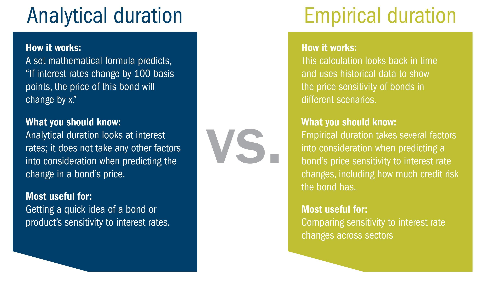

## Table of Contents

## What is empirical duration?

Empirical duration is a way to measure how long something lasts based on real data and observations, rather than using theories or guesses. It's often used in finance to figure out how sensitive a bond's price is to changes in interest rates. Instead of using a formula, empirical duration looks at how the bond's price has actually changed in the past when interest rates went up or down. This can give investors a more accurate idea of what might happen to their bond's value in the future.

In practice, to calculate empirical duration, you would look at historical data on a bond's price and the interest rates over a certain period. By comparing these two sets of data, you can see the pattern of how the bond's price reacts to interest rate changes. This method can be useful because it takes into account real-world factors that might not be captured by theoretical models. For example, it can show how a bond might behave differently during times of economic stress compared to stable periods.

## How does empirical duration differ from theoretical duration?

Empirical duration and theoretical duration are two ways to measure how a bond's price might change when interest rates go up or down. Theoretical duration uses a formula to predict this change. It looks at things like the bond's coupon rate, its time until it matures, and the current interest rate. This method is based on math and doesn't take into account what has actually happened in the past.

On the other hand, empirical duration looks at real data from the past. It checks how the bond's price has actually moved when interest rates changed before. This method can give a more accurate picture because it considers real-world events and market conditions that might affect the bond's price. For example, it can show how a bond might react differently during a financial crisis compared to normal times.

In summary, while theoretical duration gives a general idea based on a formula, empirical duration provides a more specific and potentially more reliable prediction by using actual historical data. This makes empirical duration useful for investors who want to understand how their bonds might behave in different economic situations.

## What are the key components of empirical duration?

Empirical duration is all about looking at real data to see how a bond's price has changed when interest rates went up or down in the past. The main thing you need is historical data on the bond's price and the interest rates over time. By comparing these two, you can figure out the pattern of how the bond reacts to changes in interest rates. This helps you see how sensitive the bond is to these changes, which is really important for investors.

Another key part of empirical duration is considering the time frame you're looking at. You need to decide how far back to go when you're looking at the data. This can affect your results because different time periods might show different patterns. Also, it's important to think about any big events or changes in the market that happened during the time you're studying. These events can change how the bond behaves, so they need to be part of your analysis to get a full picture.

## How is empirical duration calculated?

To calculate empirical duration, you need to look at past data on a bond's price and the interest rates over a certain period. You compare these two sets of data to see how the bond's price has changed when interest rates went up or down. This helps you figure out the pattern of how sensitive the bond is to changes in interest rates. For example, if interest rates went up by 1% and the bond's price dropped by 2%, you can use this information to calculate the bond's empirical duration.

When calculating empirical duration, it's important to choose the right time frame to look at. Different time periods might show different patterns, so you need to think about how far back to go. Also, consider any big events or changes in the market during the time you're studying. These events can affect how the bond behaves, so they need to be part of your analysis to get a full picture. By looking at all this information, you can get a good idea of how the bond might react to future changes in interest rates.

## What data sources are used to determine empirical duration?

To figure out empirical duration, you need to look at past data on a bond's price and the interest rates. This data can come from financial databases like Bloomberg or Reuters, which keep track of bond prices and interest rates over time. You can also use data from central banks, like the Federal Reserve in the U.S., which publish [interest rate](/wiki/interest-rate-trading-strategies) information. Sometimes, you might even use data from investment firms or financial news websites that report on bond prices and interest rates.

When you're gathering this data, it's important to make sure it's accurate and covers the right time period. You might need data from several years to see how the bond has reacted to different interest rate changes. Also, you should check if there were any big events or changes in the market during the time you're looking at, because these can affect how the bond behaves. By using all this information, you can get a good idea of the bond's empirical duration and how it might react to future changes in interest rates.

## Can you explain the role of historical data in empirical duration?

Historical data is super important for figuring out empirical duration. It's all about looking at what has happened before with a bond's price and the interest rates. When you see how the bond's price changed when interest rates went up or down in the past, you can start to see a pattern. This pattern helps you understand how sensitive the bond is to changes in interest rates. So, by using this past information, you can make a better guess about how the bond might act in the future.

The time period you choose for your historical data can make a big difference. If you look at data from just a short time, you might miss out on important patterns that show up over longer periods. Also, big events like financial crises can change how the bond behaves, so you need to think about those too. By looking at a good amount of historical data and considering any big events, you can get a more accurate picture of the bond's empirical duration. This helps investors make smarter choices about their bonds.

## What are the common applications of empirical duration in finance?

Empirical duration is often used by investors and financial analysts to understand how a bond's price might change when interest rates go up or down. Instead of using a formula, they look at what has actually happened in the past. This helps them see how sensitive a bond is to interest rate changes. For example, if a bond's price dropped a lot when interest rates went up before, investors might think it will do the same thing in the future. This information is really helpful for making decisions about buying or selling bonds.

Another common use of empirical duration is in managing a bond portfolio. Portfolio managers use it to figure out how the whole group of bonds they own might react to changes in interest rates. By looking at the empirical duration of each bond, they can see if their portfolio is too sensitive to interest rate changes or not sensitive enough. This helps them adjust their investments to match their goals and reduce risk. So, empirical duration is a key tool for making smart choices in the world of finance.

## How does empirical duration help in managing interest rate risk?

Empirical duration helps manage interest rate risk by showing how a bond's price has changed when interest rates went up or down in the past. This gives investors a real-world view of how sensitive their bonds are to interest rate changes. Instead of guessing with a formula, they can see what actually happened before. This helps them understand if their bonds might lose value if interest rates go up, or gain value if rates go down. By knowing this, investors can make better choices about which bonds to buy or sell to protect their money.

In managing a bond portfolio, empirical duration is also very useful. Portfolio managers look at the empirical duration of all the bonds they own to see how the whole group might react to interest rate changes. If the portfolio is too sensitive to interest rates, they might decide to sell some bonds and buy others that are less sensitive. This way, they can balance the risk and keep their investments safer. By using empirical duration, they can make smart adjustments to their portfolio to handle interest rate risk better.

## What are the limitations of using empirical duration?

Using empirical duration to understand how a bond's price might change with interest rates has some limits. One big problem is that it depends a lot on past data. If the future is very different from the past, the empirical duration might not be a good guide. For example, if the economy goes through a big change that wasn't seen before, the bond might react differently than it did in the past. Also, empirical duration can be tricky to figure out because you need a lot of good data. If the data is not complete or if there are mistakes, your calculations might be off.

Another limitation is that empirical duration can be affected by big events or changes in the market. These events can make the bond's price move in ways that are hard to predict just by looking at past data. For example, during a financial crisis, bonds might behave differently than they do in normal times. So, while empirical duration can give you a good idea of what might happen, it's not perfect. It's best to use it along with other tools and information to make the best decisions about your investments.

## How can empirical duration be integrated into portfolio management?

Empirical duration helps portfolio managers understand how their bonds might change in value when interest rates go up or down. By looking at past data, they can see how sensitive each bond is to these changes. This helps them decide if their whole group of bonds is too risky or not risky enough when it comes to interest rates. If the portfolio is too sensitive, they might sell some bonds and buy others that are less affected by interest rates. This way, they can balance the risk and make their investments safer.

Using empirical duration in portfolio management also means thinking about the bigger picture. It's important to consider how the economy might change in the future and how that could affect the bonds. Big events like financial crises can make bonds behave differently than they did in the past. So, while empirical duration gives a good idea based on history, it's not perfect. Portfolio managers should use it along with other tools and information to make the best choices about their investments.

## What advanced statistical methods are used to refine empirical duration estimates?

To make empirical duration estimates more accurate, advanced statistical methods like regression analysis are often used. Regression analysis helps to find the relationship between a bond's price and interest rates over time. By looking at a lot of past data, it can show how much the bond's price changes when interest rates go up or down. This method can also take into account other things that might affect the bond's price, like economic conditions or big events in the market. By considering all these factors, regression analysis can give a more detailed picture of how sensitive the bond is to interest rates.

Another method used is time series analysis, which looks at how the bond's price changes over time. This method can help spot patterns and trends that might not be obvious just by looking at the data. For example, it can show if the bond's price reacts differently during certain times of the year or during economic ups and downs. Time series analysis can also help predict how the bond might behave in the future based on past patterns. By using these advanced statistical methods, investors can get a better understanding of empirical duration and make smarter choices about their bond investments.

## How does empirical duration adapt to different market conditions and economic cycles?

Empirical duration helps investors understand how a bond's price might change when interest rates go up or down. It uses past data to see how sensitive the bond is to these changes. But, because it looks at history, empirical duration can be affected by different market conditions and economic cycles. For example, during good economic times, interest rates might be stable, and the bond's price might not change much. But if the economy goes into a recession, interest rates could drop a lot, and the bond's price might go up more than usual. So, empirical duration needs to take these different conditions into account to be useful.

To adapt to different market conditions and economic cycles, investors can look at empirical duration over different time periods. They might study how the bond behaved during past economic booms and busts. This can give them a better idea of how the bond might react in the future. Also, by using advanced statistical methods like regression analysis, they can see how other factors, like big events or changes in the economy, might affect the bond's price. This way, empirical duration can be a more reliable tool for managing investments, even when the market or the economy changes a lot.

## What is Empirical Duration?

Empirical Duration is a quantitative measure that evaluates the time span an asset or trend is likely to maintain a specific phase or pattern, based on historical data. This measure contrasts with theoretical models by offering insights rooted in real market behavior. Primarily recognized in the context of fixed-income securities like bonds, where it helps assess the sensitivity to interest rate changes, empirical duration is also applicable to equities and other financial instruments. 

For instance, in bond analysis, duration estimates a bond's price change in response to a 1% change in interest rates. This real-world approach becomes instrumental when applied to volatile assets such as stocks, where historical performance data help estimate the trajectory and stability of price trends. 

The process of estimating empirical duration typically involves regression analysis, which correlates historical price data with market variables to predict how trends are likely to evolve. By deploying regression models, traders can ascertain the longevity of a price trend, thus gauging the potential reliability and risk associated with an investment. A simple linear regression model can be defined as:

$$
Y_t = \beta_0 + \beta_1 X_t + \epsilon_t
$$

where $Y_t$ represents the asset's price at time $t$, $X_t$ is a market indicator (such as interest rate), $\beta_0$ and $\beta_1$ are constants to be estimated, and $\epsilon_t$ is the error term.

Empirical duration offers traders a method to quantify and predict market dynamics by emphasizing historical market behavior rather than relying solely on theoretical projections. This approach provides valuable insights into the [volatility](/wiki/volatility-trading-strategies) and reliability of investments, thereby enabling more informed decision-making in financial markets.

## What is the Methodology for Measuring Empirical Duration?

Effective empirical duration measurement is a multi-step process that necessitates accurate and comprehensive historical data collection. The methodology relies heavily on statistical techniques and data processing to estimate the time over which an asset or trend is expected to persist.

### Regression Analysis

Regression analysis serves as a foundational method in measuring empirical duration. This statistical approach correlates historical prices with market yields to determine duration. It quantitatively models the relationship between a dependent variable, such as asset returns, and one or more independent variables, such as time or market conditions. The linear regression model can be represented as:

$$

y = \beta_0 + \beta_1 x_1 + \beta_2 x_2 + \ldots + \beta_n x_n + \epsilon 
$$

where $y$ is the dependent variable, $\beta_0$ is the intercept, $\beta_1, \beta_2, \ldots, \beta_n$ are the coefficients representing the influence of each independent variable $x_1, x_2, \ldots, x_n$, and $\epsilon$ is the error term. By analyzing historical data, traders can estimate the expected duration of a trend by assessing the statistical significance and magnitude of these coefficients.

### Data Preprocessing

The accuracy of empirical duration measurement hinges on precise data preprocessing. This step involves cleaning and organizing data to remove outliers and anomalies that could distort analysis. Techniques such as interpolation or smoothing may be used to handle missing data points, ensuring the dataset is complete and reliable. Data normalization is also essential to ensure that all variables contribute proportionally to the results.

### Visualization Tools

Visualization tools play a vital role in identifying patterns and cycles within time series data. Tools such as line charts and bar graphs provide a visual representation of data trends over time. These visualizations allow traders to intuitively recognize cycles and anomalies, which might not be immediately apparent through numerical analysis alone. Implementing visualization can be done using libraries like Matplotlib or Seaborn in Python:

```python
import matplotlib.pyplot as plt
import seaborn as sns

# Example of generating a line chart
data = [...]  # historical data
plt.figure(figsize=(10, 6))
sns.lineplot(x="Date", y="Price", data=data)
plt.title("Historical Price Trend")
plt.xlabel("Time")
plt.ylabel("Price")
plt.show()
```

### Statistical Software and Automation

To ensure consistency and accuracy in empirical duration calculation, analysts often utilize statistical software. Platforms such as R, Python, and MATLAB provide built-in libraries and functions that facilitate complex calculations and automate repetitive tasks. For instance, Python's statsmodels library offers capabilities for regression analysis and time series forecasting:

```python
import statsmodels.api as sm

# Example of performing linear regression
X = data[['Independent_Variable']]
y = data['Dependent_Variable']
X = sm.add_constant(X)  # Adds a constant term to the predictor

model = sm.OLS(y, X).fit()  # Ordinary Least Squares regression
print(model.summary())
```

By automating these procedures, traders can maintain consistency across analyses and better predict the duration of market trends. Such automation not only enhances efficiency but also reduces the likelihood of human error, providing a more robust analytical framework. 

Effective empirical duration measurement is a confluence of thorough data processing, sophisticated statistical methodology, and practical visualization, which collectively enable traders to harness historical insights for future market prediction.

## References & Further Reading

[1]: Bergstra, J., Bardenet, R., Bengio, Y., & Kégl, B. (2011). ["Algorithms for Hyper-Parameter Optimization."](https://dl.acm.org/doi/10.5555/2986459.2986743) Advances in Neural Information Processing Systems 24.

[2]: ["Advances in Financial Machine Learning"](https://www.amazon.com/Advances-Financial-Machine-Learning-Marcos/dp/1119482089) by Marcos Lopez de Prado

[3]: ["Evidence-Based Technical Analysis: Applying the Scientific Method and Statistical Inference to Trading Signals"](https://www.amazon.com/Evidence-Based-Technical-Analysis-Scientific-Statistical/dp/0470008741) by David Aronson

[4]: ["Machine Learning for Algorithmic Trading"](https://github.com/stefan-jansen/machine-learning-for-trading) by Stefan Jansen

[5]: ["Quantitative Trading: How to Build Your Own Algorithmic Trading Business"](https://www.amazon.com/Quantitative-Trading-Build-Algorithmic-Business/dp/1119800064) by Ernest P. Chan