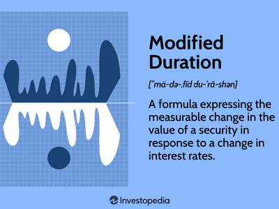

In the rapidly evolving landscape of financial trading, understanding the duration of market trends is crucial for developing robust trading strategies. One concept that has gained significant attention in this context is empirical duration. This measure focuses on the time an asset or trend maintains a specific phase or pattern, derived from historical data analysis. Unlike theoretical models that often rely on assumptions and hypotheses, empirical duration provides a grounded perspective by examining actual market behaviors, offering traders a more realistic approach to anticipate market movements.

The role of data analysis in quantifying market trend durations cannot be overstated. By leveraging historical trading data, traders have the potential to gain insights into the longevity and volatility of trends. Such knowledge enables the adjustment of trading strategies, optimizing them for better alignment with anticipated future price movements. Methodologies to measure empirical duration are rooted in statistical analyses that refine predictive capabilities, offering a robust tool for decision-making in trading.



Empirical duration carries significance not only for its methodological foundations but also for its broader implications in financial markets. It contributes to a deeper understanding of market dynamics, moving beyond traditional metrics such as beta or standard deviation. By integrating historical data analysis, traders can discern the inherent patterns within the market, thus gaining an edge in predicting potential shifts.

Further exploration of empirical duration unveils challenges and opportunities for traders, whether novice or seasoned. One of the primary challenges lies in accurately capturing and analyzing historical data, as this data must be both comprehensive and reliable to offer meaningful insights. However, the potential opportunities are substantial; for instance, empirical duration analysis can improve strategic timing decisions for entry and exit points in trading.

In conclusion, empirical duration serves as a critical tool that enhances traditional market analysis methods. Its application in algorithmic trading offers a pragmatic approach to understanding market dynamics, thereby equipping traders with the insights needed to stay competitive in the fast-paced world of financial markets.

## Table of Contents

## What is Empirical Duration?

Empirical Duration is a quantitative measure that evaluates the time span an asset or trend is likely to maintain a specific phase or pattern, based on historical data. This measure contrasts with theoretical models by offering insights rooted in real market behavior. Primarily recognized in the context of fixed-income securities like bonds, where it helps assess the sensitivity to interest rate changes, empirical duration is also applicable to equities and other financial instruments. 

For instance, in bond analysis, duration estimates a bond's price change in response to a 1% change in interest rates. This real-world approach becomes instrumental when applied to volatile assets such as stocks, where historical performance data help estimate the trajectory and stability of price trends. 

The process of estimating empirical duration typically involves regression analysis, which correlates historical price data with market variables to predict how trends are likely to evolve. By deploying regression models, traders can ascertain the longevity of a price trend, thus gauging the potential reliability and risk associated with an investment. A simple linear regression model can be defined as:

$$
Y_t = \beta_0 + \beta_1 X_t + \epsilon_t
$$

where $Y_t$ represents the asset's price at time $t$, $X_t$ is a market indicator (such as interest rate), $\beta_0$ and $\beta_1$ are constants to be estimated, and $\epsilon_t$ is the error term.

Empirical duration offers traders a method to quantify and predict market dynamics by emphasizing historical market behavior rather than relying solely on theoretical projections. This approach provides valuable insights into the [volatility](/wiki/volatility-trading-strategies) and reliability of investments, thereby enabling more informed decision-making in financial markets.

## Significance in Algorithmic Trading

Algorithmic trading plays a critical role in modern financial markets, relying heavily on the precise integration of data analytics and predictive modeling to enhance trade execution and profitability. Within this context, empirical duration emerges as a valuable metric, enabling algorithms to adjust trading parameters such as entry and [exit](/wiki/exit-strategy) points in anticipation of the longevity of market trends. This foresight allows for more synchronized trading strategies that are closely aligned with market movements, thereby optimizing trading outcomes.

The adoption of empirical duration in [algorithmic trading](/wiki/algorithmic-trading) enhances the robustness and adaptability of trading algorithms by providing an additional layer of historical analysis. This metric evaluates the duration of market trends based on historical data, facilitating a data-driven approach to decision-making. By understanding the likely duration of investment phases, algorithms can be fine-tuned to capitalize on trend continuations or reversals, improving overall returns.

Incorporating empirical duration within algorithmic models also minimizes risk. By anticipating market trend durations more accurately, traders can avoid premature or delayed exits, thus reducing exposure to adverse market fluctuations. Additionally, empirical duration aids in identifying periods of increased volatility, enabling algorithms to adjust their risk management strategies accordingly.

For instance, if an algorithm identifies a historical trend duration of 30 days for a specific asset, based on empirical data analysis, it can be programmed to automatically adjust trading parameters to reflect this insight. This data-driven approach can be implemented using statistical software or programming languages like Python, employing libraries such as pandas for data manipulation and scikit-learn for predictive modeling.

```python
import pandas as pd
from sklearn.linear_model import LinearRegression
import numpy as np

# Sample historical price data for an asset
data = {'Date': pd.date_range(start='2023-01-01', periods=100, freq='D'),
        'Price': np.random.normal(loc=100, scale=1, size=100)}
df = pd.DataFrame(data)

# Calculate moving average to identify trend duration
df['Moving_Average'] = df['Price'].rolling(window=30).mean()

# Use regression analysis to predict trend duration
X = np.array(range(len(df))).reshape(-1, 1)
y = df['Moving_Average'].fillna(method='bfill')

model = LinearRegression()
model.fit(X, y)

# Predict trend duration
trend_duration_prediction = model.predict(X)
df['Trend_Duration_Prediction'] = trend_duration_prediction

print(df.head())
```

This code snippet provides a simplistic illustration of how traders can employ historical data and linear regression to estimate the trend duration for an asset, thereby supporting algorithmic trading decisions.

In conclusion, empirical duration serves as a pivotal tool in enhancing the efficacy of algorithmic trading by enabling more accurate predictions of market trends, reducing risk, and improving investment results through better-aligned trading strategies.

## Methodology for Measuring Empirical Duration

Effective empirical duration measurement is a multi-step process that necessitates accurate and comprehensive historical data collection. The methodology relies heavily on statistical techniques and data processing to estimate the time over which an asset or trend is expected to persist.

### Regression Analysis

Regression analysis serves as a foundational method in measuring empirical duration. This statistical approach correlates historical prices with market yields to determine duration. It quantitatively models the relationship between a dependent variable, such as asset returns, and one or more independent variables, such as time or market conditions. The linear regression model can be represented as:

$$

y = \beta_0 + \beta_1 x_1 + \beta_2 x_2 + \ldots + \beta_n x_n + \epsilon 
$$

where $y$ is the dependent variable, $\beta_0$ is the intercept, $\beta_1, \beta_2, \ldots, \beta_n$ are the coefficients representing the influence of each independent variable $x_1, x_2, \ldots, x_n$, and $\epsilon$ is the error term. By analyzing historical data, traders can estimate the expected duration of a trend by assessing the statistical significance and magnitude of these coefficients.

### Data Preprocessing

The accuracy of empirical duration measurement hinges on precise data preprocessing. This step involves cleaning and organizing data to remove outliers and anomalies that could distort analysis. Techniques such as interpolation or smoothing may be used to handle missing data points, ensuring the dataset is complete and reliable. Data normalization is also essential to ensure that all variables contribute proportionally to the results.

### Visualization Tools

Visualization tools play a vital role in identifying patterns and cycles within time series data. Tools such as line charts and bar graphs provide a visual representation of data trends over time. These visualizations allow traders to intuitively recognize cycles and anomalies, which might not be immediately apparent through numerical analysis alone. Implementing visualization can be done using libraries like Matplotlib or Seaborn in Python:

```python
import matplotlib.pyplot as plt
import seaborn as sns

# Example of generating a line chart
data = [...]  # historical data
plt.figure(figsize=(10, 6))
sns.lineplot(x="Date", y="Price", data=data)
plt.title("Historical Price Trend")
plt.xlabel("Time")
plt.ylabel("Price")
plt.show()
```

### Statistical Software and Automation

To ensure consistency and accuracy in empirical duration calculation, analysts often utilize statistical software. Platforms such as R, Python, and MATLAB provide built-in libraries and functions that facilitate complex calculations and automate repetitive tasks. For instance, Python's statsmodels library offers capabilities for regression analysis and time series forecasting:

```python
import statsmodels.api as sm

# Example of performing linear regression
X = data[['Independent_Variable']]
y = data['Dependent_Variable']
X = sm.add_constant(X)  # Adds a constant term to the predictor

model = sm.OLS(y, X).fit()  # Ordinary Least Squares regression
print(model.summary())
```

By automating these procedures, traders can maintain consistency across analyses and better predict the duration of market trends. Such automation not only enhances efficiency but also reduces the likelihood of human error, providing a more robust analytical framework. 

Effective empirical duration measurement is a confluence of thorough data processing, sophisticated statistical methodology, and practical visualization, which collectively enable traders to harness historical insights for future market prediction.

## Factors Influencing Empirical Duration

Empirical duration, a pivotal concept in financial analysis, is subject to various influencing factors that can significantly alter its measurement and implications. Understanding these factors is essential for traders seeking to optimize their strategies and performance.

Market volatility is one of the primary influences on empirical duration. Volatility reflects the rate at which the price of an asset increases or decreases, influencing the length of trends. High volatility tends to shorten the duration of price trends, creating a dynamic environment where trends are less predictable. Conversely, low volatility can extend trend durations, making them easier to anticipate. Traders must account for this by adjusting their empirical duration calculations accordingly, often employing advanced statistical models to accommodate for changes in volatility.

Economic indicators such as inflation rates, GDP growth, and employment figures also play a vital role. These indicators provide insights into the broader economic environment, influencing asset prices and, consequently, the empirical duration of trends. For instance, positive employment reports may extend the duration of bullish trends due to increased consumer confidence and spending power, while inflation concerns might foreshorten bullish trends due to anticipated cost pressures and [interest rate](/wiki/interest-rate-trading-strategies) hikes.

Geopolitical events can have abrupt and significant impacts on the duration of market trends. Events such as elections, policy changes, or international conflicts can introduce uncertainty or optimism into the markets, affecting investor perception and behavior. For example, uncertainty surrounding trade negotiations could truncate existing trends, whereas the resolution of geopolitical tensions might lengthen them by fostering investor confidence.

Investor sentiment and behavioral biases are subjective factors that can alter the length of trends. Sentiment analysis, often derived from social media and news outlets, helps gauge the market mood, which in turn influences buying or selling behavior. Behavioral biases, such as herding or loss aversion, can cause deviations from expected trend durations. Understanding these psychological components allows traders to better predict shifts in market dynamics.

Company-specific developments, including earnings reports, management changes, and product innovations, can significantly affect the duration of price trends for individual stocks. A positive earnings surprise may extend a bullish trend, while an unexpected product recall might precipitate a quicker downturn. Hence, keeping abreast of corporate news is crucial for accurately assessing empirical duration.

By continuously monitoring these factors, traders can gain insights into potential shifts in trend durations. This real-time analysis enables more agile and informed decision-making, thereby optimizing trading strategies. For example, incorporating real-time data feeds and sentiment analysis tools can help modern traders adjust their positions swiftly, reflecting changes in trend durations more effectively. Understanding and accounting for the factors impacting empirical duration supports the development of robust and adaptive investment strategies, enabling traders to navigate changing market conditions with greater precision and confidence.

## Case Studies: Empirical Duration in Action

Examining real-world examples of empirical duration in action can provide a deeper understanding of its practical application. One notable instance is its use in predicting stock performance within high-growth tech firms. These companies often experience rapid and volatile price movements, making them ideal candidates for empirical duration analysis.

In the tech sector, stock prices are frequently influenced by factors such as technological advancements, market competition, and consumer demand shifts. By analyzing the historical performance and trend durations of these stocks, traders can develop a nuanced understanding of potential future movements. This enables more informed entry and exit strategies, potentially leading to enhanced returns.

Empirical duration also plays a crucial role in correlating trend durations with price volatility. In highly volatile markets, the ability to anticipate the length of price trends can be invaluable. For instance, if empirical data indicates that a particular stock has a history of maintaining upward [momentum](/wiki/momentum) for a specific duration, traders can adjust their strategies to capitalize on this pattern. This often involves setting automated trading parameters that align with the expected price movement, thereby maximizing profitability.

In diverse market scenarios, the impact of empirical duration is evident. For example, during periods of economic uncertainty, stocks may exhibit shorter trend durations due to sudden market shifts. By recognizing these patterns through empirical duration analysis, traders can adapt quickly to changing conditions, reducing potential losses.

Another example can be seen in sectors such as pharmaceuticals, where company-specific developments, such as the approval of a new drug, can drastically alter stock trends. Here, empirical duration can forecast the duration of price increments or declines, allowing traders to strategically position themselves based on anticipated market reactions.

These case studies highlight the versatile application of empirical duration across various sectors. By leveraging historical data to predict trend durations, traders can refine their strategies to better navigate the complexities of financial markets. This analytical approach enhances the ability to make calculated decisions, ultimately improving trading outcomes.

## Conclusion: Strategic Implications

Empirical duration is a critical analytical tool that enhances understanding and interpretation of market dynamics far beyond what traditional financial metrics offer. By integrating empirical duration into trading strategies, traders can gain a competitive edge, allowing for more precise predictions of market movements. This competitive advantage stems from the ability to analyze historical market behaviors and apply those insights to predict future trends with greater accuracy.

A deep comprehension of both the methodology involved in empirical duration calculations and its broader market implications contributes to making more informed trading and investment decisions. Traders who employ empirical duration are better positioned to adapt to market changes, optimizing their strategies in accordance with anticipated trend durations. This adaptability is vital in the fast-paced world of trading where rapid decision-making can yield substantial returns.

The future of empirical duration measurement looks promising, driven by advancements in data analytics and computational power. As new analytical tools and software emerge, the capacity to enhance the precision of empirical duration calculations will grow, enabling traders to fine-tune their strategies to an even greater degree. Techniques such as [machine learning](/wiki/machine-learning) and [artificial intelligence](/wiki/ai-artificial-intelligence) will likely play a crucial role in refining these analyses, opening up new possibilities for risk management and opportunity identification.

Traders are encouraged to incorporate empirical duration into their analytical toolkits as a means of developing robust, adaptive trading strategies. This integration will not only improve their ability to navigate complex market environments but also solidify their strategic adaptability, ultimately leading to improved investment outcomes. By continuously updating and refining their understanding of empirical duration, traders can maintain their relevance and effectiveness in the ever-evolving landscape of financial trading.

## References & Further Reading

[1]: Bergstra, J., Bardenet, R., Bengio, Y., & Kégl, B. (2011). ["Algorithms for Hyper-Parameter Optimization."](https://dl.acm.org/doi/10.5555/2986459.2986743) Advances in Neural Information Processing Systems 24.

[2]: ["Advances in Financial Machine Learning"](https://www.amazon.com/Advances-Financial-Machine-Learning-Marcos/dp/1119482089) by Marcos Lopez de Prado

[3]: ["Evidence-Based Technical Analysis: Applying the Scientific Method and Statistical Inference to Trading Signals"](https://www.amazon.com/Evidence-Based-Technical-Analysis-Scientific-Statistical/dp/0470008741) by David Aronson

[4]: ["Machine Learning for Algorithmic Trading"](https://github.com/stefan-jansen/machine-learning-for-trading) by Stefan Jansen

[5]: ["Quantitative Trading: How to Build Your Own Algorithmic Trading Business"](https://www.amazon.com/Quantitative-Trading-Build-Algorithmic-Business/dp/1119800064) by Ernest P. Chan