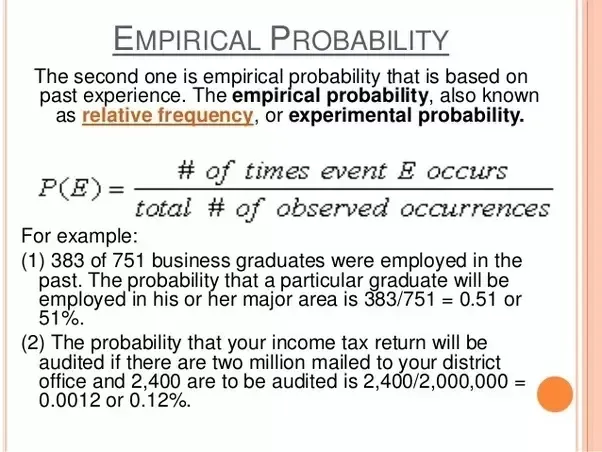

## Table of Contents

## What is empirical probability?

Empirical probability is a way to figure out the chances of something happening by looking at what has happened before. Imagine you're flipping a coin and want to know the chances of getting heads. Instead of just thinking about it, you flip the coin many times and count how often you get heads. The more times you flip the coin, the better your guess about the chances of getting heads will be. This method uses real data from past events to predict future outcomes.

This type of probability is useful because it's based on actual observations, not just theory. For example, if you want to know the likelihood of rain tomorrow, you could look at how often it has rained on similar days in the past. By collecting this data, you can make a more accurate prediction. However, empirical probability can sometimes be less reliable if you don't have enough data, or if the conditions change. Still, it's a practical tool for making decisions based on what we've seen happen before.

## How does empirical probability differ from theoretical probability?

Empirical probability and theoretical probability are two ways to figure out the chances of something happening, but they use different methods. Theoretical probability is based on what should happen if everything is perfect and follows the rules. For example, if you flip a fair coin, the theoretical probability of getting heads is 50% because there are two sides, and each side has an equal chance. It's all about math and what you expect to happen without actually doing the experiment.

On the other hand, empirical probability is based on what actually happens when you do the experiment. If you flip a coin 100 times and get heads 60 times, the empirical probability of getting heads is 60%. This method relies on real data from past events, so it can change as you collect more information. It's useful because it shows what's happening in the real world, but it might not be as accurate if you don't have enough data or if conditions change.

Both types of probability have their place. Theoretical probability is great for situations where you can predict outcomes based on known rules, like in games of chance. Empirical probability is better when you need to understand real-world patterns and make predictions based on what has happened before, like weather forecasting or market trends.

## What are some common examples of empirical probability in everyday life?

One common example of empirical probability in everyday life is weather forecasting. When meteorologists predict the chance of rain, they look at past weather data for similar conditions. If it rained 70% of the time on days with the same temperature and humidity in the past, they might say there's a 70% chance of rain today. This helps people plan their day better, like deciding whether to carry an umbrella or not.

Another example is in sports, like basketball. Coaches and players use empirical probability to understand how likely a player is to make a shot. If a player has made 80 out of 100 free throws in practice, they have an 80% chance of making the next one. This information helps the team decide who should take the shot in crucial moments of the game.

Empirical probability also comes into play with product quality control in factories. If a factory checks 1,000 items and finds that 5 of them are defective, they might say there's a 0.5% chance that any single item is defective. This helps the factory know if their production process is working well or if they need to make changes to reduce defects.

## How is empirical probability calculated?

Empirical probability is calculated by doing an experiment or looking at past data. For example, if you want to know the chance of rolling a six on a dice, you could roll the dice many times and count how often you get a six. If you roll the dice 100 times and get a six 15 times, the empirical probability of rolling a six is 15 out of 100, or 15%.

The formula for empirical probability is simple. You take the number of times the event you're interested in happened and divide it by the total number of times you tried the experiment. So, if you flipped a coin 50 times and it landed on heads 25 times, the empirical probability of getting heads is 25 divided by 50, which equals 0.5 or 50%. This method works well when you have a lot of data, but it can be less accurate with fewer tries.

## What are the key components needed to determine empirical probability?

To determine empirical probability, you need two main things: the number of times the event you're interested in happens, and the total number of times you try the experiment. For example, if you're flipping a coin and want to know the chance of getting heads, you count how many times you get heads and divide that by the total number of flips. This gives you the empirical probability, which is a way to estimate the chance of something happening based on what you've seen before.

The more times you do the experiment, the better your estimate of the probability will be. If you only flip the coin a few times, your result might not be very accurate. But if you flip it hundreds or thousands of times, your estimate will be much closer to the real chance of getting heads. So, having a lot of data is important for making a good guess about the probability of an event.

## Can you explain the concept of relative frequency in relation to empirical probability?

Relative frequency is a key part of figuring out empirical probability. It's just a fancy way of saying how often something happens compared to the total number of tries. Imagine you're flipping a coin and you want to know how likely it is to get heads. If you flip the coin 100 times and it lands on heads 50 times, the relative frequency of getting heads is 50 out of 100, or 50%. This number tells you what happened in your experiment, and it's the same as the empirical probability of getting heads.

Empirical probability uses relative frequency to make guesses about the future. If you keep flipping the coin and the relative frequency stays around 50%, you can say the empirical probability of getting heads is about 50%. This is helpful because it's based on real data, not just theory. The more times you do the experiment, the more reliable your guess about the probability becomes. So, relative frequency is the backbone of empirical probability, helping you understand what's likely to happen next based on what's happened before.

## What are the limitations of using empirical probability?

One big problem with empirical probability is that it needs a lot of data to be accurate. If you don't have enough information, your guess about the chances of something happening might be way off. For example, if you only flip a coin ten times and get heads nine times, you might think the chance of getting heads is 90%. But if you flip it a thousand times, you'd probably find the real chance is closer to 50%. So, the more data you have, the better your guess will be, but sometimes you just don't have enough data to make a good prediction.

Another issue is that things can change over time, making past data less useful. If you're trying to predict the weather based on what happened last year, it might not work if the climate has changed. Or if you're looking at how often a basketball player makes a shot, their skills might improve or they might get tired, changing the probability. So, empirical probability works best when the conditions stay the same, but in real life, things often change, which can make your predictions less accurate.

## How can empirical probability be used to make predictions?

Empirical probability is a way to predict what might happen by looking at what has happened before. Imagine you want to know if it will rain tomorrow. You can look at past weather data for days that were similar to today and see how often it rained on those days. If it rained 70% of the time on similar days in the past, you might guess there's a 70% chance of rain tomorrow. This helps you make a better guess about the future by using real data from the past.

This method is useful in many areas of life. For example, if you're a basketball coach, you might want to know the chances of a player making a free throw. By looking at how often they made free throws in the past, you can predict how likely they are to make the next one. This helps you decide who should take the shot in a game. The more data you have, the better your predictions will be, but you need to remember that things can change, so your predictions might not always be perfect.

## What role does sample size play in the accuracy of empirical probability?

Sample size is really important when you're figuring out empirical probability. It's like the more times you try something, the better you can guess what will happen next. If you flip a coin just a few times, you might think it's more likely to land on heads or tails than it really is. But if you flip it a lot, like a thousand times, your guess about the chances of getting heads or tails will be much closer to the truth. So, having a big sample size helps make your predictions more accurate.

But even with a big sample size, things can still go wrong. If the conditions change, like if the coin is not fair or if the weather changes, your old data might not be useful anymore. That's why it's good to keep collecting new data and updating your predictions. Still, a big sample size is your best friend when you want to make a good guess about what might happen next based on what happened before.

## How can empirical probability be applied in statistical analysis?

Empirical probability is a big help in statistical analysis because it uses real data to figure out how likely something is to happen. When you're trying to understand patterns or make predictions, you can look at what has happened before. For example, if you want to know the chance of a factory making a defective product, you can check how many defective items were made out of all the items produced in the past. This gives you a good idea of what might happen next, and it's all based on actual numbers, not just guesses.

But empirical probability isn't perfect. It works best when you have a lot of data to look at, because the more information you have, the better your predictions will be. If you only have a few pieces of data, your guess might be off. Also, things can change over time, so the data you collected before might not be useful anymore. That's why it's important to keep collecting new data and updating your predictions to make sure they stay accurate.

## What are some advanced techniques for improving the accuracy of empirical probability estimates?

One way to make empirical probability estimates more accurate is by using a technique called bootstrapping. This means you take your data and pretend to collect it again and again, but in different ways. It's like shuffling a deck of cards and dealing them out many times to see what happens. By doing this, you can get a better idea of how reliable your original data is and how much it might change if you collected it again. This helps you understand the uncertainty in your estimates and can make your predictions more trustworthy.

Another advanced technique is called Bayesian updating. This method lets you update your guesses about the chances of something happening as you get new information. Imagine you start with a guess about how likely it is to rain today based on past data. If you then see dark clouds in the sky, you can update your guess to make it more accurate. Bayesian updating is great because it helps you use all the information you have, old and new, to make the best predictions possible. Both bootstrapping and Bayesian updating can help you make better decisions by improving how you use empirical probability.

## How does empirical probability relate to the law of large numbers?

Empirical probability and the law of large numbers go hand in hand. The law of large numbers says that if you do an experiment many, many times, the results will get closer and closer to what you expect to happen. For example, if you flip a coin a lot of times, you'll find that the number of heads and tails will be about the same, close to 50% each. This is because the more times you flip the coin, the more the randomness evens out.

Empirical probability uses this idea to make predictions. When you calculate empirical probability, you're looking at what actually happened in your experiments. The more data you have, the better your guess about the chances of something happening will be. So, the law of large numbers helps make empirical probability more accurate because it tells us that with enough tries, our results will be close to the true probability.

## What is Understanding Empirical Probability?

Empirical probability, also referred to as experimental probability, is a statistical measure derived from actual data collection rather than theoretical models. This method calculates the likelihood of an event based on the number of successful outcomes observed during actual trials, relative to the total number of trials conducted. The formula for empirical probability is simple:

$$
P(E) = \frac{\text{Number of times event E occurs}}{\text{Total number of trials}}
$$

This form of probability is indispensable for traders who utilize historical market data to predict future behavior. In contrast to theoretical probability, which assumes perfect conditions and draws from predefined models, empirical probability offers insights grounded in the fluctuating and imperfect nature of real market environments. 

One clear distinction between empirical and theoretical probability lies in their origin: empirical probability stems from observed occurrences, while theoretical probability is derived from logical reasoning and mathematical models under ideal conditions. This difference is significant in trading, where markets are influenced by myriad unpredictable factors, making empirical data a vital resource for assessing probabilities.

In the context of [algorithmic trading](/wiki/algorithmic-trading), the application of empirical probability can be illustrated through scenarios like predicting stock price movements based on past performance. Consider a trading algorithm that determines the probability of a stock price increasing based on historical closing prices. By analyzing previous instances where the stock closed higher, and dividing that by the number of trading days examined, traders can calculate the empirical probability of the price increase.

For example, if a trader conducts an analysis over 200 trading days and finds that the stock price closed higher on 120 of those days, the empirical probability of the stock price increasing on any given day would be:

$$
P(\text{Increase}) = \frac{120}{200} = 0.6
$$

This information is critical for making informed trading decisions, as it provides a data-driven basis for evaluating potential investments.

To implement empirical probability calculations in algorithmic trading systems, programming languages like Python offer libraries such as NumPy and pandas, which facilitate data manipulation and statistical analysis. Below is a simple Python snippet to compute empirical probability for a given set of stock closing prices:

```python
import pandas as pd

# Assuming `df` is a DataFrame with a 'close' column for closing prices
def empirical_probability(df):
    total_days = len(df)
    days_price_increase = (df['close'].diff() > 0).sum()
    probability_increase = days_price_increase / total_days
    return probability_increase

# Example usage
closing_prices = [100, 102, 101, 104, 107]  # Sample data
df = pd.DataFrame(closing_prices, columns=['close'])
print("Empirical Probability of Price Increase:", empirical_probability(df))
```

In algorithmic trading, empirical probability assists in refining strategies by providing evidence-based probabilities that align closely with market realities. By relying on real-world data rather than assumptions, traders can adapt to dynamic conditions, test hypotheses, and make decisions that are statistically supported. As such, empirical probability forms a cornerstone for robust and reliable algorithmic trading systems.

## What is Statistical Analysis for Trading Strategies?

Statistical analysis plays a crucial role in trading, providing traders with the tools necessary to identify trends, patterns, and anomalies in the data that financial markets generate. Descriptive [statistics](/wiki/bayesian-statistics) allow traders to summarize and understand historical market data. Key measures such as mean, median, variance, and standard deviation offer insights into the central tendency and [dispersion](/wiki/dispersion-trading) of price movements, helping traders develop a baseline understanding of market behavior.

Time-series analysis is another vital technique for analyzing sequential data points, often employed to forecast future prices based on historical patterns. Traders frequently use methods like moving averages and autoregressive models to smooth out price data and detect underlying trends or cyclic patterns. A simple moving average (SMA) calculation involves averaging the closing prices over a specified number of periods, such as:

$$
\text{SMA}_n = \frac{P_1 + P_2 + \cdots + P_n}{n}
$$

where $P_1, P_2, \ldots, P_n$ represent the closing prices over $n$ periods.

Volatility measures further contribute to understanding the extent of price changes. Widely used volatility indicators include the standard deviation of price changes and the Average True Range (ATR). These measures help traders assess the risk associated with specific assets, supporting the formulation of strategies that align risk tolerance with potential returns.

Regression analysis is used to investigate relationships between variables, enabling traders to model dependencies and predict future market movements. Linear regression, for example, attempts to model the relationship between dependent and independent variables by fitting a linear equation:

$$
y = \beta_0 + \beta_1 x + \epsilon
$$

where $y$ is the dependent variable (e.g., asset price), $x$ is the independent variable, $\beta_0$ and $\beta_1$ are coefficients, and $\epsilon$ is the error term.

Statistical [backtesting](/wiki/backtesting) evaluates the performance of trading strategies against historical data. This process helps ensure strategies are robust and profitable under past market conditions. Traders simulate trades using historical data to calculate potential profits or losses, employing metrics such as the Sharpe ratio to assess performance relative to risk.

The effectiveness of statistical analysis heavily depends on the quality and quantity of the data analyzed. A larger sample size improves the reliability of statistical estimates, while high-quality data minimizes noise and inaccuracies, leading to more dependable insights. Traders must ensure they access comprehensive and clean data sets to extract valid conclusions and enhance their strategies.

By leveraging statistical analysis, traders can systematically approach market decisions, increasing the likelihood of attaining favorable outcomes through informed strategy development.

## How can trading performance be improved with probability models?

Probability models are instrumental in enhancing trading performance by providing a structured approach to forecasting price movements and assessing risk. These models help traders optimize their strategies by quantifying uncertainties and predicting potential future scenarios based on historical and current market data.

### Role of the Black-Scholes Model

The Black-Scholes model, introduced by Fischer Black, Myron Scholes, and Robert Merton, is a cornerstone in options pricing. This model estimates the price of European-style options and has significantly influenced trading strategy optimization. The Black-Scholes formula considers the stock price, strike price, time to expiration, risk-free rate, and volatility. Its primary utility lies in its capacity to provide a theoretical estimate of option prices, enabling traders to identify mispriced options in the market.

The formula is expressed as:

$$
C = S_0N(d_1) - Xe^{-rt}N(d_2)
$$

where:
- $C$ is the call option price
- $S_0$ is the current stock price
- $X$ is the strike price
- $t$ is the time to expiration
- $r$ is the risk-free interest rate
- $N$ is the cumulative distribution function of the standard normal distribution
- $d_1 = \frac{\ln(S_0/X) + (r + \sigma^2/2)t}{\sigma\sqrt{t}}$
- $d_2 = d_1 - \sigma\sqrt{t}$

Traders utilize this model to assess the theoretical value of options, thus guiding their decisions regarding buying or selling options based on perceived under or overvaluation.

### GARCH Models for Assessing Volatility

The Generalized Autoregressive Conditional Heteroskedasticity (GARCH) model is another critical tool used by traders, particularly for modeling and forecasting the volatility of financial returns. In algorithmic trading, understanding volatility is essential for risk management and strategic planning. GARCH models help traders predict future volatility based on past price fluctuations and implemented shocks. 

The GARCH model provides insights into the time-varying volatility and aids in creating adaptive trading strategies that can adjust to different market conditions. The typical form of a GARCH(1,1) model is:

$$
\sigma_t^2 = \alpha_0 + \alpha_1 \epsilon^2_{t-1} + \beta_1 \sigma^2_{t-1}
$$

where:
- $\sigma_t^2$ is the forecasted variance for the current period
- $\epsilon_{t-1}$ is the past error term (return shock)
- $\sigma^2_{t-1}$ is the past forecasted variance
- $\alpha_0$, $\alpha_1$, and $\beta_1$ are parameters to be estimated

### Visualization with Probability Cones

Probability cones are a visualization tool used to depict the expected range of an asset's price at future points in time. These cones provide traders with a probabilistic forecast of potential price movements, allowing them to make informed decisions regarding entry and [exit](/wiki/exit-strategy) points in the market. The cones represent different confidence intervals (e.g., 68%, 95%) derived from historical volatility metrics.

### Managing Portfolio Risk with Probability Distributions

Probability distributions, such as the normal distribution or the Student's t-distribution, are pivotal in managing portfolio risk. By assessing the likelihood of various returns, traders and portfolio managers can establish risk metrics such as Value at Risk (VaR) and Conditional Value at Risk (CVaR). These metrics provide a quantifiable measure of potential losses in specific confidence intervals, allowing for more effective risk management strategies.

### Real-World Applications

In practice, probability models guide a wide array of trading decisions. For instance, investment banks and hedge funds leverage these models to evaluate derivative products, manage portfolio risk, and optimize trade execution algorithms. The Black-Scholes model is frequently applied in the pricing of financial derivatives, while GARCH is widely used in predicting asset volatilities across global markets.

By employing these probability models, traders can better navigate volatile markets, enhance their analytical capabilities, and refine their trading strategies to achieve superior returns.

## References & Further Reading

[1]: ["Advances in Financial Machine Learning"](https://www.amazon.com/Advances-Financial-Machine-Learning-Marcos/dp/1119482089) by Marcos Lopez de Prado

[2]: ["Evidence-Based Technical Analysis: Applying the Scientific Method and Statistical Inference to Trading Signals"](https://www.amazon.com/Evidence-Based-Technical-Analysis-Scientific-Statistical/dp/0470008741) by David Aronson

[3]: ["Machine Learning for Algorithmic Trading"](https://github.com/PacktPublishing/Machine-Learning-for-Algorithmic-Trading-Second-Edition) by Stefan Jansen

[4]: ["Quantitative Trading: How to Build Your Own Algorithmic Trading Business"](https://www.amazon.com/Quantitative-Trading-Build-Algorithmic-Business/dp/1119800064) by Ernest P. Chan

[5]: Black, F., & Scholes, M. (1973). ["The Pricing of Options and Corporate Liabilities."](https://www.jstor.org/stable/1831029) Journal of Political Economy, 81(3), 637-654.

[6]: Engle, R. F. (1982). ["Autoregressive Conditional Heteroscedasticity with Estimates of the Variance of United Kingdom Inflation."](https://www.semanticscholar.org/paper/Autoregressive-conditional-heteroscedasticity-with-Engle/2ee6cb87fc81ecd78d161c4a92c9dfce00c8961c) Econometrica, 50(4), 987-1007.