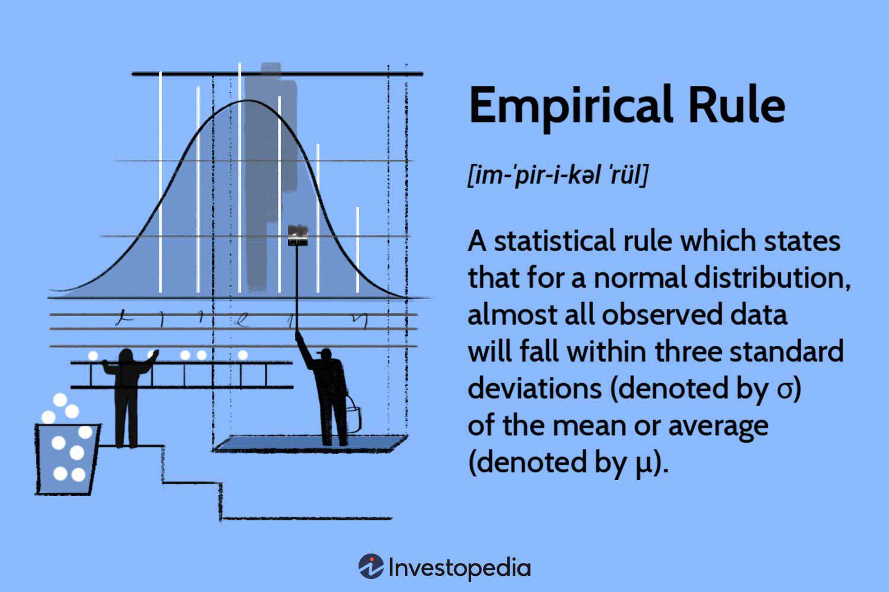

In the fast-paced world of trading, the ability to analyze data and predict market movements is paramount. Traders rely heavily on statistical analysis and probability theory to guide their decisions, forming the backbone of algorithmic trading. Algorithmic trading involves the use of complex mathematical models and systems that process large quantities of market data to make trading decisions, often executed at speeds far beyond human capabilities. By utilizing these statistical methods, traders can base their strategies on empirical data rather than intuition or speculative forecasts, thus minimizing risks and enhancing performance.

This article focuses on the key concepts of statistical analysis and probability theory as they apply to algorithmic trading, emphasizing their practical applications. Statistical analysis allows traders to examine data patterns, trends, and anomalies, providing vital insights into market behavior. By employing these analytical techniques, traders can develop models that identify opportunities and predict future price movements. An understanding of probability theory is equally essential, as it offers a framework for quantifying uncertainty in trading. Traders can use probability to evaluate the potential risks and rewards of their strategies, ensuring a balance between profit and exposure to unfavorable market conditions.



Additionally, empirical probability plays a crucial role in enhancing trading strategies. Derived from historical market data, empirical probability helps traders assess the likelihood of various market outcomes. Unlike theoretical probability, which is grounded in abstract mathematical principles, empirical probability relies on tangible evidence from past market performances. This reliance on real-world data allows for more accurate predictions and informed decision-making.

Finally, probability models and simulations are instrumental in improving trading performance. Techniques such as Monte Carlo simulations, which use repeated random sampling to estimate the behavior of financial markets, provide traders with invaluable scenarios for assessing risk and strategy effectiveness. These models facilitate a deeper understanding of market dynamics, enabling traders to refine their strategies and maximize returns.

In conclusion, drawing insights from statistical analysis and probability theory can significantly enhance trading strategies. By leveraging empirical data and sophisticated models, traders are better positioned to navigate the uncertainties of financial markets, ultimately contributing to more consistent and profitable trading outcomes.

## Table of Contents

## Understanding Empirical Probability

Empirical probability, also referred to as experimental probability, is a statistical measure derived from actual data collection rather than theoretical models. This method calculates the likelihood of an event based on the number of successful outcomes observed during actual trials, relative to the total number of trials conducted. The formula for empirical probability is simple:

$$
P(E) = \frac{\text{Number of times event E occurs}}{\text{Total number of trials}}
$$

This form of probability is indispensable for traders who utilize historical market data to predict future behavior. In contrast to theoretical probability, which assumes perfect conditions and draws from predefined models, empirical probability offers insights grounded in the fluctuating and imperfect nature of real market environments. 

One clear distinction between empirical and theoretical probability lies in their origin: empirical probability stems from observed occurrences, while theoretical probability is derived from logical reasoning and mathematical models under ideal conditions. This difference is significant in trading, where markets are influenced by myriad unpredictable factors, making empirical data a vital resource for assessing probabilities.

In the context of [algorithmic trading](/wiki/algorithmic-trading), the application of empirical probability can be illustrated through scenarios like predicting stock price movements based on past performance. Consider a trading algorithm that determines the probability of a stock price increasing based on historical closing prices. By analyzing previous instances where the stock closed higher, and dividing that by the number of trading days examined, traders can calculate the empirical probability of the price increase.

For example, if a trader conducts an analysis over 200 trading days and finds that the stock price closed higher on 120 of those days, the empirical probability of the stock price increasing on any given day would be:

$$
P(\text{Increase}) = \frac{120}{200} = 0.6
$$

This information is critical for making informed trading decisions, as it provides a data-driven basis for evaluating potential investments.

To implement empirical probability calculations in algorithmic trading systems, programming languages like Python offer libraries such as NumPy and pandas, which facilitate data manipulation and statistical analysis. Below is a simple Python snippet to compute empirical probability for a given set of stock closing prices:

```python
import pandas as pd

# Assuming `df` is a DataFrame with a 'close' column for closing prices
def empirical_probability(df):
    total_days = len(df)
    days_price_increase = (df['close'].diff() > 0).sum()
    probability_increase = days_price_increase / total_days
    return probability_increase

# Example usage
closing_prices = [100, 102, 101, 104, 107]  # Sample data
df = pd.DataFrame(closing_prices, columns=['close'])
print("Empirical Probability of Price Increase:", empirical_probability(df))
```

In algorithmic trading, empirical probability assists in refining strategies by providing evidence-based probabilities that align closely with market realities. By relying on real-world data rather than assumptions, traders can adapt to dynamic conditions, test hypotheses, and make decisions that are statistically supported. As such, empirical probability forms a cornerstone for robust and reliable algorithmic trading systems.

## Probability Theory in Algorithmic Trading

Probability theory provides a robust framework for handling the inherent uncertainty present in trading environments. In the context of algorithmic trading, probability concepts are pivotal in evaluating risk and estimating the potential rewards associated with varying trading decisions. This capability hinges on a few core probabilistic concepts such as conditional probability, joint probability, and the application of probability distributions.

Conditional probability is critical in trading as it considers the probability of an event given that another event has occurred. For instance, determining the likelihood of a stock reaching a certain price level upon the release of favorable quarterly results can guide trading decisions. This is mathematically denoted as $P(A|B) = \frac{P(A \cap B)}{P(B)}$, where $P(A|B)$ is the probability of event $A$ occurring given that $B$ has occurred.

Joint probability, on the other hand, deals with the likelihood of two events happening simultaneously. In trading, understanding how two assets might be correlated can help in diversifying the portfolio or predicting market movements.

Probabilistic models, such as Bayesian models, are beneficial in decision-making under uncertainty. Bayesian models update the probability estimate for a hypothesis as additional evidence is incorporated, making them useful for traders who must continuously revise predictions based on new data.

Techniques like Monte Carlo simulations are extensively applied to evaluate complex systems in trading strategies. Monte Carlo simulations rely on repeated random sampling to obtain numerical results, providing traders with a mechanism to model the behavior of financial markets. This technique is versatile, often used to assess portfolio risk, option pricing, or the evaluation of different strategy outcomes under various scenarios.

To illustrate, consider the following Python code snippet using Monte Carlo simulations to estimate the expected return of a stock portfolio:

```python
import numpy as np

# Parameters
np.random.seed(42)  # For reproducible results
num_simulations = 10000
num_days = 252
mu = 0.0005  # Expected daily return
sigma = 0.02  # Daily volatility

# Simulate returns
simulations = np.random.normal(mu, sigma, (num_days, num_simulations))
portfolio_value = np.cumprod(1 + simulations, axis=0)

# Calculate expected return and risk
expected_return = np.mean(portfolio_value[-1] - 1)
portfolio_risk = np.std(portfolio_value[-1] - 1)

print(f"Expected Portfolio Return: {expected_return:.2%}")
print(f"Portfolio Risk (Standard Deviation): {portfolio_risk:.2%}")
```

This simulation calculates the expected return and risk of a portfolio over a year, driven by assumptions on daily returns and [volatility](/wiki/volatility-trading-strategies). Such methods empower traders to visualize the range of potential outcomes, thereby refining their decision-making processes and enhancing strategy formulation based on probabilistic insights.

In summary, the application of probability theory in algorithmic trading is foundational, as it not only helps quantify uncertainties but also substantially informs and improves the efficiency of trading strategies. By understanding and utilizing these probabilistic tools and techniques, traders can effectively navigate the uncertainties of financial markets.

## Statistical Analysis for Trading Strategies

Statistical analysis plays a crucial role in trading, providing traders with the tools necessary to identify trends, patterns, and anomalies in the data that financial markets generate. Descriptive [statistics](/wiki/bayesian-statistics) allow traders to summarize and understand historical market data. Key measures such as mean, median, variance, and standard deviation offer insights into the central tendency and [dispersion](/wiki/dispersion-trading) of price movements, helping traders develop a baseline understanding of market behavior.

Time-series analysis is another vital technique for analyzing sequential data points, often employed to forecast future prices based on historical patterns. Traders frequently use methods like moving averages and autoregressive models to smooth out price data and detect underlying trends or cyclic patterns. A simple moving average (SMA) calculation involves averaging the closing prices over a specified number of periods, such as:

$$
\text{SMA}_n = \frac{P_1 + P_2 + \cdots + P_n}{n}
$$

where $P_1, P_2, \ldots, P_n$ represent the closing prices over $n$ periods.

Volatility measures further contribute to understanding the extent of price changes. Widely used volatility indicators include the standard deviation of price changes and the Average True Range (ATR). These measures help traders assess the risk associated with specific assets, supporting the formulation of strategies that align risk tolerance with potential returns.

Regression analysis is used to investigate relationships between variables, enabling traders to model dependencies and predict future market movements. Linear regression, for example, attempts to model the relationship between dependent and independent variables by fitting a linear equation:

$$
y = \beta_0 + \beta_1 x + \epsilon
$$

where $y$ is the dependent variable (e.g., asset price), $x$ is the independent variable, $\beta_0$ and $\beta_1$ are coefficients, and $\epsilon$ is the error term.

Statistical [backtesting](/wiki/backtesting) evaluates the performance of trading strategies against historical data. This process helps ensure strategies are robust and profitable under past market conditions. Traders simulate trades using historical data to calculate potential profits or losses, employing metrics such as the Sharpe ratio to assess performance relative to risk.

The effectiveness of statistical analysis heavily depends on the quality and quantity of the data analyzed. A larger sample size improves the reliability of statistical estimates, while high-quality data minimizes noise and inaccuracies, leading to more dependable insights. Traders must ensure they access comprehensive and clean data sets to extract valid conclusions and enhance their strategies.

By leveraging statistical analysis, traders can systematically approach market decisions, increasing the likelihood of attaining favorable outcomes through informed strategy development.

## The Role of Empirical Research in Algo Trading

Empirical research in algorithmic trading plays a vital role in refining and validating trading strategies by utilizing actual market data. Traders employ empirical methods to adapt to the dynamic nature of financial markets, ensuring their strategies remain effective amidst changing market conditions. This approach allows traders to base their strategies on observed behavior rather than theoretical assumptions, leading to more accurate and reliable decision-making processes.

One of the principal advantages of using real-world data in trading is the enhancement of model accuracy and system robustness. Empirical data allows traders to understand the true distribution of returns, volatility patterns, and correlations between various assets. This data-driven approach improves the precision of probabilistic models, which can better capture the intricacies of market dynamics. By continuously updating their models with fresh empirical data, traders can adjust their strategies to match current market sentiments and trends, potentially leading to higher success rates.

Case studies in algorithmic trading often demonstrate how empirical research supports more reliable trading decisions. For instance, a trader may develop a model based on historical price data to predict future market movements. By backtesting this model against past market conditions, the trader can identify patterns and anomalies that occurred in specific situations. This real-world validation process enhances the model's credibility and usefulness in live trading environments. Backtesting also offers insights into the model’s performance under different scenarios, contributing to the development of robust trading systems that can withstand market volatility.

Despite its advantages, employing empirical research in finance is not without challenges and limitations. One significant hurdle is the risk of overfitting, where a model becomes too tailored to historical data, performing well on past data but poorly on new, unseen data. Traders must strike a balance between model complexity and generalizability to ensure sustained performance in live markets. Additionally, data quality and availability can pose significant challenges, as low-quality or incomplete data may lead to erroneous conclusions and unreliable models. Traders must be diligent in their data selection and processing procedures, ensuring the data's accuracy and relevance to their trading objectives.

Overall, while empirical research offers substantial benefits in improving trading strategies and risk management, traders must remain vigilant of its challenges. Through meticulous data analysis and model validation, empirical research serves as a foundational pillar in the ongoing development of effective algorithmic trading strategies.

## Improving Trading Performance with Probability Models

Probability models are instrumental in enhancing trading performance by providing a structured approach to forecasting price movements and assessing risk. These models help traders optimize their strategies by quantifying uncertainties and predicting potential future scenarios based on historical and current market data.

### Role of the Black-Scholes Model

The Black-Scholes model, introduced by Fischer Black, Myron Scholes, and Robert Merton, is a cornerstone in options pricing. This model estimates the price of European-style options and has significantly influenced trading strategy optimization. The Black-Scholes formula considers the stock price, strike price, time to expiration, risk-free rate, and volatility. Its primary utility lies in its capacity to provide a theoretical estimate of option prices, enabling traders to identify mispriced options in the market.

The formula is expressed as:

$$
C = S_0N(d_1) - Xe^{-rt}N(d_2)
$$

where:
- $C$ is the call option price
- $S_0$ is the current stock price
- $X$ is the strike price
- $t$ is the time to expiration
- $r$ is the risk-free interest rate
- $N$ is the cumulative distribution function of the standard normal distribution
- $d_1 = \frac{\ln(S_0/X) + (r + \sigma^2/2)t}{\sigma\sqrt{t}}$
- $d_2 = d_1 - \sigma\sqrt{t}$

Traders utilize this model to assess the theoretical value of options, thus guiding their decisions regarding buying or selling options based on perceived under or overvaluation.

### GARCH Models for Assessing Volatility

The Generalized Autoregressive Conditional Heteroskedasticity (GARCH) model is another critical tool used by traders, particularly for modeling and forecasting the volatility of financial returns. In algorithmic trading, understanding volatility is essential for risk management and strategic planning. GARCH models help traders predict future volatility based on past price fluctuations and implemented shocks. 

The GARCH model provides insights into the time-varying volatility and aids in creating adaptive trading strategies that can adjust to different market conditions. The typical form of a GARCH(1,1) model is:

$$
\sigma_t^2 = \alpha_0 + \alpha_1 \epsilon^2_{t-1} + \beta_1 \sigma^2_{t-1}
$$

where:
- $\sigma_t^2$ is the forecasted variance for the current period
- $\epsilon_{t-1}$ is the past error term (return shock)
- $\sigma^2_{t-1}$ is the past forecasted variance
- $\alpha_0$, $\alpha_1$, and $\beta_1$ are parameters to be estimated

### Visualization with Probability Cones

Probability cones are a visualization tool used to depict the expected range of an asset's price at future points in time. These cones provide traders with a probabilistic forecast of potential price movements, allowing them to make informed decisions regarding entry and [exit](/wiki/exit-strategy) points in the market. The cones represent different confidence intervals (e.g., 68%, 95%) derived from historical volatility metrics.

### Managing Portfolio Risk with Probability Distributions

Probability distributions, such as the normal distribution or the Student's t-distribution, are pivotal in managing portfolio risk. By assessing the likelihood of various returns, traders and portfolio managers can establish risk metrics such as Value at Risk (VaR) and Conditional Value at Risk (CVaR). These metrics provide a quantifiable measure of potential losses in specific confidence intervals, allowing for more effective risk management strategies.

### Real-World Applications

In practice, probability models guide a wide array of trading decisions. For instance, investment banks and hedge funds leverage these models to evaluate derivative products, manage portfolio risk, and optimize trade execution algorithms. The Black-Scholes model is frequently applied in the pricing of financial derivatives, while GARCH is widely used in predicting asset volatilities across global markets.

By employing these probability models, traders can better navigate volatile markets, enhance their analytical capabilities, and refine their trading strategies to achieve superior returns.

## Conclusion and Future Directions

Drawing insights from statistical analysis and probability theory can significantly enhance trading strategies in the ever-evolving financial markets. By leveraging empirical data and sophisticated models, traders are better equipped to make informed decisions amidst market uncertainties. Advanced quantitative methods allow traders to quantify risk, predict asset price movements, and optimize portfolio allocations. The precision of these approaches relies heavily on the quality and depth of the data analyzed, reinforcing the importance of comprehensive historical datasets.

Technological advancements, including [artificial intelligence](/wiki/ai-artificial-intelligence) (AI) and [machine learning](/wiki/machine-learning) (ML), are set to further revolutionize algorithmic trading. These technologies offer the capability to analyze vast amounts of data at unprecedented speeds, uncover hidden patterns, and continuously adapt models to real-time market changes. Machine learning algorithms, such as random forests and neural networks, can be employed to detect subtle correlations and nonlinear relationships within market data, enhancing the predictive power of trading models. For example, a Python-based implementation leveraging libraries like `pandas` for data manipulation and `scikit-learn` for model building can facilitate these analyses:

```python
import pandas as pd
from sklearn.ensemble import RandomForestRegressor

# Suppose df is a DataFrame containing historical market data with features and target price
X = df.drop('target_price', axis=1)
y = df['target_price']

model = RandomForestRegressor(n_estimators=100)
model.fit(X, y)

# Predict future prices
predicted_prices = model.predict(X_new)
```

Future directions in algorithmic trading include increasing the precision of models through enhanced computational capabilities and more sophisticated algorithms. Real-time data analysis is critical, allowing traders to respond promptly to market shifts. Integrating big data analytics and cloud computing can facilitate efficient handling of streaming data. As access to diverse and high-frequency data improves, models can incorporate broader market and macroeconomic indicators, further enriching predictions.

Expert insights suggest that the landscape of algorithmic trading will continue to evolve with technological innovations and regulatory changes. The focus will likely shift towards ethical AI use, interpretability of machine learning models, and robust cybersecurity strategies to protect trading systems from emerging threats. Continuous learning and adaptation will remain vital as market dynamics evolve, ensuring that algorithmic trading retains its edge in delivering consistent and reliable performance. These advancements hold the promise of not just marginal improvements but potentially groundbreaking shifts in how trading strategies are conceived and executed.

## References & Further Reading

[1]: ["Advances in Financial Machine Learning"](https://www.amazon.com/Advances-Financial-Machine-Learning-Marcos/dp/1119482089) by Marcos Lopez de Prado

[2]: ["Evidence-Based Technical Analysis: Applying the Scientific Method and Statistical Inference to Trading Signals"](https://www.amazon.com/Evidence-Based-Technical-Analysis-Scientific-Statistical/dp/0470008741) by David Aronson

[3]: ["Machine Learning for Algorithmic Trading"](https://github.com/PacktPublishing/Machine-Learning-for-Algorithmic-Trading-Second-Edition) by Stefan Jansen

[4]: ["Quantitative Trading: How to Build Your Own Algorithmic Trading Business"](https://www.amazon.com/Quantitative-Trading-Build-Algorithmic-Business/dp/1119800064) by Ernest P. Chan

[5]: Black, F., & Scholes, M. (1973). ["The Pricing of Options and Corporate Liabilities."](https://www.jstor.org/stable/1831029) Journal of Political Economy, 81(3), 637-654.

[6]: Engle, R. F. (1982). ["Autoregressive Conditional Heteroscedasticity with Estimates of the Variance of United Kingdom Inflation."](https://www.semanticscholar.org/paper/Autoregressive-conditional-heteroscedasticity-with-Engle/2ee6cb87fc81ecd78d161c4a92c9dfce00c8961c) Econometrica, 50(4), 987-1007.