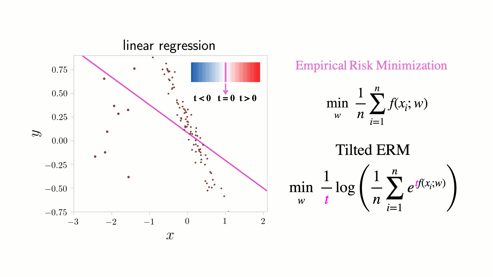

## Table of Contents

## What is Empirical Risk Minimization (ERM) in the context of machine learning?

Empirical Risk Minimization (ERM) is a principle used in machine learning to find the best model for a given dataset. The idea is to minimize the average loss, or "risk," that a model experiences on the training data. This loss is calculated using a loss function, which measures how far off the model's predictions are from the actual outcomes. By minimizing this empirical risk, the model is tuned to perform as well as possible on the data it has seen.

In practice, ERM involves choosing a model from a set of possible models that has the lowest empirical risk. This is often done by adjusting the model's parameters to minimize the loss function over the training data. For example, if we are using a linear regression model, the goal would be to find the coefficients that minimize the mean squared error between the predicted and actual values. While ERM focuses on the training data, the ultimate goal is to create a model that generalizes well to new, unseen data.

## How does ERM differ from other risk minimization approaches?

Empirical Risk Minimization (ERM) focuses on minimizing the average loss, or "risk," on the training data. It's like trying to make the model perform as well as possible on the examples it has seen. ERM does this by adjusting the model's parameters to reduce the loss calculated by a loss function. For example, if you're using a model to predict house prices, ERM would tweak the model's settings to make the predicted prices as close as possible to the actual prices in the training data.

Other risk minimization approaches might take different strategies. For instance, Structural Risk Minimization (SRM) not only looks at the empirical risk but also considers the complexity of the model. SRM tries to balance the model's performance on the training data with its ability to generalize to new data, aiming to prevent overfitting. This means SRM might choose a simpler model even if it has a slightly higher empirical risk, because it believes the simpler model will work better on unseen data.

Another approach is Bayesian Risk Minimization, which incorporates uncertainty into the model's predictions. Instead of just minimizing a single loss function, Bayesian methods use probability distributions to represent uncertainty in the model's parameters and predictions. This can lead to more robust models that are better at handling new data, even if they might not have the lowest empirical risk on the training set. So while ERM is straightforward and focuses on the training data, other methods like SRM and Bayesian approaches consider additional factors to improve overall performance.

## What is the mathematical formulation of ERM?

The mathematical formulation of Empirical Risk Minimization (ERM) involves finding the model parameters that minimize the average loss on the training data. If we have a set of training examples $$ \{(x_1, y_1), (x_2, y_2), ..., (x_n, y_n)\} $$, where $$ x_i $$ are the input features and $$ y_i $$ are the corresponding true outputs, the goal is to find a function $$ f $$ (the model) with parameters $$ \theta $$ that minimizes the empirical risk. The empirical risk is calculated as the average loss over the training set, using a loss function $$ L(f(x_i; \theta), y_i) $$. Mathematically, ERM can be expressed as:

$$ \hat{\theta} = \arg\min_{\theta} \frac{1}{n} \sum_{i=1}^n L(f(x_i; \theta), y_i) $$

This formula shows that we are looking for the parameters $$ \hat{\theta} $$ that give the smallest average loss across all the training examples. The choice of the loss function $$ L $$ depends on the specific problem and type of model being used. For example, in regression tasks, a common choice for the loss function is the mean squared error, while in classification tasks, the cross-entropy loss is often used. By minimizing this empirical risk, ERM aims to make the model perform as well as possible on the data it has seen, with the hope that it will also perform well on new, unseen data.

## Can you explain the concept of 'risk' in ERM?

In Empirical Risk Minimization (ERM), 'risk' refers to the average loss that a model experiences on the training data. Imagine you're trying to guess the price of houses. If your guesses are usually far off from the actual prices, your risk is high. The goal of ERM is to adjust the model's settings so that this average loss, or risk, becomes as small as possible. This is done by using a loss function, which is like a scorecard that tells you how wrong your guesses are. By minimizing this score, you make your model better at predicting the right answers for the data it has seen.

Mathematically, the risk in ERM is expressed as the average of the loss function over all the training examples. If you have a set of training data with inputs $$ x_i $$ and true outputs $$ y_i $$, the risk is calculated using a formula that looks like this: $$ \frac{1}{n} \sum_{i=1}^n L(f(x_i; \theta), y_i) $$. Here, $$ L $$ is the loss function, $$ f(x_i; \theta) $$ is the model's prediction for input $$ x_i $$ using parameters $$ \theta $$, and $$ n $$ is the number of training examples. The goal is to find the best set of parameters $$ \theta $$ that make this average loss as small as possible. By doing this, ERM helps the model perform well on the data it has seen, hoping it will also do well on new data.

## What role does the loss function play in ERM?

In Empirical Risk Minimization (ERM), the loss function is like a scorecard that tells you how well your model is doing. It measures the difference between what your model predicts and the actual outcomes. By using the loss function, ERM tries to make this difference as small as possible across all the training data. If you think of your model as trying to guess the right answers, the loss function tells you how far off those guesses are. The goal is to adjust the model's settings so that this average score, or "risk," becomes as low as possible.

Mathematically, the loss function is used in the formula for ERM. If you have a set of training data with inputs $$ x_i $$ and true outputs $$ y_i $$, the average loss, or risk, is calculated as $$ \frac{1}{n} \sum_{i=1}^n L(f(x_i; \theta), y_i) $$. Here, $$ L $$ is the loss function, $$ f(x_i; \theta) $$ is what your model predicts for input $$ x_i $$ using parameters $$ \theta $$, and $$ n $$ is the number of training examples. By finding the best set of parameters $$ \theta $$ that make this average loss as small as possible, ERM helps the model perform well on the data it has seen, hoping it will also do well on new data.

## How is the empirical risk calculated in practice?

In practice, the empirical risk is calculated by taking the average of the loss function across all the examples in the training data. Imagine you're trying to guess the prices of houses. Each guess you make has a certain amount of error, which is measured by the loss function. If you add up all these errors and divide by the total number of houses, you get the average error, or the empirical risk. This average tells you how well your model is doing overall on the data it has seen.

To do this calculation, you need a set of training examples with inputs $$ x_i $$ and true outputs $$ y_i $$. You also need a model that makes predictions based on these inputs, and a loss function that measures how far off these predictions are from the true outputs. The formula for the empirical risk is $$ \frac{1}{n} \sum_{i=1}^n L(f(x_i; \theta), y_i) $$, where $$ n $$ is the number of training examples, $$ L $$ is the loss function, and $$ f(x_i; \theta) $$ is the model's prediction for input $$ x_i $$ using parameters $$ \theta $$. By adjusting these parameters to minimize this average loss, you're using Empirical Risk Minimization to make your model as accurate as possible on the training data.

## What are common challenges faced when applying ERM?

One big challenge when using Empirical Risk Minimization (ERM) is overfitting. This happens when your model gets too good at guessing the answers for the data it has seen, but then it does poorly on new data. Imagine training a model to guess house prices in one neighborhood. If it learns too much about that specific neighborhood, it might not guess well for houses in a different area. To avoid overfitting, people often use techniques like cross-validation or regularization, which help the model learn in a way that works better for new data too.

Another challenge is choosing the right loss function. The loss function is like a scorecard that tells you how wrong your guesses are. If you pick a bad one, your model might not learn the right things. For example, if you're trying to guess if it will rain or not, using a scorecard that cares more about how far off your guess is (like mean squared error) might not be as good as one that cares about getting the yes or no answer right (like cross-entropy loss). Picking the right loss function depends a lot on what you're trying to do with your model.

A third challenge is dealing with noisy or incomplete data. Real-world data often has mistakes or missing pieces, which can mess up your model's learning. If your training data has a lot of errors, your model might learn the wrong patterns. To handle this, you might need to clean up your data first or use methods that can deal with missing information, like imputation techniques. This helps make sure your model learns from good, reliable data.

## How can overfitting be addressed within the ERM framework?

Overfitting is a big problem in Empirical Risk Minimization (ERM) because it makes your model too good at guessing the answers for the data it has seen, but then it does poorly on new data. To fix this, you can use a technique called cross-validation. This means you split your data into different parts, train your model on some of the parts, and then test it on the other parts. By doing this, you can see how well your model works on data it hasn't seen before. If it's doing well on the test parts, you know it's not just memorizing the training data.

Another way to tackle overfitting is by using regularization. Regularization adds a little penalty to the model's parameters to stop them from getting too big. This helps keep the model simple and makes it less likely to overfit. For example, in linear regression, you might use a formula like $$ \hat{\theta} = \arg\min_{\theta} \left( \frac{1}{n} \sum_{i=1}^n (y_i - f(x_i; \theta))^2 + \lambda \sum_{j=1}^p \theta_j^2 \right) $$. Here, the first part is the usual ERM part, and the second part is the regularization term. The $$ \lambda $$ controls how much you want to penalize big parameters. By balancing these two parts, you can make your model work better on new data.

## What are some popular algorithms that use ERM?

Many popular [machine learning](/wiki/machine-learning) algorithms use Empirical Risk Minimization (ERM) to find the best model for a given dataset. One example is linear regression, which tries to find the best line that fits the data by minimizing the mean squared error. In linear regression, ERM is used to adjust the line's slope and intercept so that the average squared difference between the predicted and actual values is as small as possible. The formula for this is $$ \hat{\theta} = \arg\min_{\theta} \frac{1}{n} \sum_{i=1}^n (y_i - f(x_i; \theta))^2 $$, where $$ \theta $$ are the parameters of the line, and the goal is to make the average error as small as possible.

Another common algorithm that uses ERM is logistic regression, which is used for classification problems. Logistic regression tries to find the best way to separate different classes by minimizing the log loss, also known as cross-entropy loss. The goal here is to make the model's predictions as close as possible to the true class labels. The formula for logistic regression using ERM is $$ \hat{\theta} = \arg\min_{\theta} \frac{1}{n} \sum_{i=1}^n \left( -y_i \log(f(x_i; \theta)) - (1 - y_i) \log(1 - f(x_i; \theta)) \right) $$, where $$ f(x_i; \theta) $$ is the model's prediction for input $$ x_i $$, and the aim is to minimize the average log loss over the training data.

Support Vector Machines (SVMs) also use ERM to find the best way to separate classes. SVMs try to find the widest possible margin between different classes by minimizing the hinge loss. The formula for SVMs using ERM is $$ \hat{\theta} = \arg\min_{\theta} \frac{1}{n} \sum_{i=1}^n \max(0, 1 - y_i f(x_i; \theta)) + \lambda \|\theta\|^2 $$, where the first part is the hinge loss and the second part is a regularization term to prevent overfitting. By minimizing this, SVMs can find a good balance between fitting the data well and keeping the model simple.

## How does the choice of loss function affect the performance of ERM?

The choice of loss function in Empirical Risk Minimization (ERM) is crucial because it directly affects how the model learns from the training data. The loss function acts like a scorecard that tells the model how wrong its predictions are. If you pick a loss function that doesn't match well with your problem, your model might learn the wrong things. For example, if you're trying to guess if it will rain or not, using a loss function like mean squared error might not work as well as one like cross-entropy loss, which is better for yes or no answers. The right loss function helps the model focus on what's important for the task at hand.

Different loss functions can lead to different model behaviors. For instance, in linear regression, using the mean squared error $$ \frac{1}{n} \sum_{i=1}^n (y_i - f(x_i; \theta))^2 $$ encourages the model to make predictions that are close to the actual values. On the other hand, in logistic regression for classification, using the cross-entropy loss $$ \frac{1}{n} \sum_{i=1}^n \left( -y_i \log(f(x_i; \theta)) - (1 - y_i) \log(1 - f(x_i; \theta)) \right) $$ pushes the model to predict probabilities that are as close as possible to the true class labels. Choosing the right loss function ensures that the model's performance is optimized for the specific problem you're trying to solve, leading to better results on both the training data and new, unseen data.

## Can ERM be applied to both classification and regression problems? How?

Yes, Empirical Risk Minimization (ERM) can be used for both classification and regression problems. In regression, ERM works by finding the best model that minimizes the average difference between the model's predictions and the actual values. For example, in linear regression, ERM uses the mean squared error as the loss function. The goal is to find the parameters that make the formula $$ \hat{\theta} = \arg\min_{\theta} \frac{1}{n} \sum_{i=1}^n (y_i - f(x_i; \theta))^2 $$ as small as possible. This means the model tries to guess numbers that are as close as possible to the real numbers in the training data.

In classification, ERM also tries to minimize the average loss, but the loss function is different. For instance, in logistic regression, ERM uses the cross-entropy loss to find the best model. The goal here is to make the model's predictions as close as possible to the true class labels. The formula for this is $$ \hat{\theta} = \arg\min_{\theta} \frac{1}{n} \sum_{i=1}^n \left( -y_i \log(f(x_i; \theta)) - (1 - y_i) \log(1 - f(x_i; \theta)) \right) $$. By minimizing this loss, the model learns to predict the right category for new data. So, whether you're guessing numbers or categories, ERM helps by finding the best way to minimize the average mistake on the training data.

## What are the theoretical guarantees provided by ERM under certain conditions?

Empirical Risk Minimization (ERM) comes with some theoretical guarantees that help us trust it more. One key guarantee is the Law of Large Numbers, which says that if you have a lot of training examples, the average loss on your training data (the empirical risk) will be close to the true risk, which is the average loss you'd get if you could use all possible data. This means that if you minimize the empirical risk, you're also likely to be minimizing the true risk, making your model good at guessing not just on the training data, but also on new data. The formula for this is $$ \lim_{n \to \infty} \frac{1}{n} \sum_{i=1}^n L(f(x_i; \theta), y_i) = E[L(f(X; \theta), Y)] $$, where $$ E[L(f(X; \theta), Y)] $$ is the expected loss or true risk.

Another important guarantee comes from the concept of uniform convergence. This means that if your set of possible models (called the hypothesis space) is not too big or too complicated, then the empirical risk will be close to the true risk for all models in that set. This is really helpful because it tells us that if we pick the model with the lowest empirical risk, we can be pretty sure it's also close to the best model for new data. This idea is often used with something called the VC dimension, which measures how complex your set of models is. If the VC dimension is small enough, uniform convergence is guaranteed, making ERM a reliable way to find good models.

## References & Further Reading

[1]: Vapnik, V. N. (1998). ["Statistical Learning Theory."](https://link.springer.com/book/10.1007/978-1-4757-3264-1) Wiley-Interscience.

[2]: Bishop, C. M. (2006). ["Pattern Recognition and Machine Learning."](https://www.cs.uoi.gr/~arly/courses/ml/tmp/Bishop_book.pdf) Springer.

[3]: Murphy, K. P. (2012). ["Machine Learning: A Probabilistic Perspective."](https://www.cs.ubc.ca/~murphyk/MLbook/pml-toc-1may12.pdf) MIT Press.

[4]: Shalev-Shwartz, S., & Ben-David, S. (2014). ["Understanding Machine Learning: From Theory to Algorithms."](https://www.cs.huji.ac.il/~shais/UnderstandingMachineLearning/understanding-machine-learning-theory-algorithms.pdf) Cambridge University Press.

[5]: Hastie, T., Tibshirani, R., & Friedman, J. (2009). ["The Elements of Statistical Learning: Data Mining, Inference, and Prediction."](https://link.springer.com/book/10.1007/978-0-387-84858-7) Springer.

[6]: Mohri, M., Rostamizadeh, A., & Talwalkar, A. (2018). ["Foundations of Machine Learning, Second Edition."](https://cs.nyu.edu/~mohri/mlbook/) MIT Press.

[7]: Zhang, T. (2004). ["Statistical Behavior and Consistency of Classification Methods Based on Convex Risk Minimization."](https://projecteuclid.org/journals/annals-of-statistics/volume-32/issue-1/Statistical-behavior-and-consistency-of-classification-methods-based-on-convex/10.1214/aos/1079120130.full) The Annals of Statistics, 32(1), 56-85.