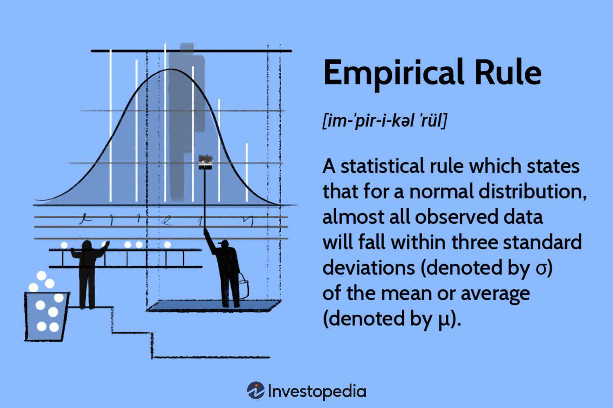

The empirical rule, also known as the 68-95-99.7 rule, is a cornerstone in statistical analysis, particularly applicable to fields such as finance and trading. This rule provides a quick way to understand how data is distributed around the mean in a normal distribution. Specifically, it states that approximately 68% of the data falls within one standard deviation of the mean, about 95% within two standard deviations, and nearly 99.7% within three standard deviations. This characteristic makes it an essential tool for traders, enabling them to quantify risk and volatility in financial markets efficiently.

Utilizing this rule, traders can develop strategies that account for typical market behaviors and potential extremes. The empirical rule is intricately linked with the concept of standard deviation, which is a measure of how dispersed or spread out data points are from the average. In trading, understanding the spread of returns can inform decisions on risk management and expected profitability.



Algorithmic trading, where automated systems are used to execute trades, heavily relies on statistical principles like the empirical rule. Algorithms that incorporate these statistical insights can better predict price movements and evaluate the associated risks, thus aiding traders in setting stop-loss limits and determining trading volumes. Real-world trading scenarios benefit from these insights, as they allow traders to compute volatility using historical data and assess future market behavior with improved precision.

Overall, gaining a solid understanding of the empirical rule and its relationship to standard deviation is crucial for those involved in trading. It not only helps quantify and mitigate risk but also supports the creation of robust trading algorithms designed to navigate the complexities of financial markets effectively.

## Table of Contents

## Understanding the Empirical Rule

The empirical rule is a foundational concept in statistics, specifically pertaining to normal, or Gaussian, distributions. It provides a simple way to understand how data points in a dataset are expected to be distributed around the mean. According to the empirical rule, approximately 68% of data points fall within one standard deviation (σ) from the mean (μ), around 95% fall within two standard deviations, and nearly 99.7% fall within three standard deviations. 

Mathematically, if $X$ is a normally distributed random variable with mean $\mu$ and standard deviation $\sigma$, then the intervals $[\mu - \sigma, \mu + \sigma]$, $[\mu - 2\sigma, \mu + 2\sigma]$, and $[\mu - 3\sigma, \mu + 3\sigma]$ will contain approximately 68%, 95%, and 99.7% of the data, respectively. This regularity provides a clear framework for assessing the variability or dispersion in a data set.

For traders, the empirical rule is particularly useful as it aids in estimating market [volatility](/wiki/volatility-trading-strategies) and evaluating the likelihood of price deviations from the mean. Market prices and financial returns often exhibit characteristics of a normal distribution, making the empirical rule applicable in assessing expected ranges for asset prices or market indices. This can help traders set appropriate ranges for risk management strategies such as stop-loss orders and understand potential price movement under standard market conditions. It serves as a guiding tool for investors to anticipate unusual events, prepare for potential risks, and make more informed financial decisions.

## Standard Deviation: A Key Component

Standard deviation is a statistical measure that quantifies the [dispersion](/wiki/dispersion-trading) or spread of a set of data points relative to its mean. In financial markets, it serves as a crucial indicator of volatility, allowing traders and analysts to assess the risk associated with investments or trading strategies. A higher standard deviation indicates a wider spread in returns, suggesting greater volatility and, therefore, higher risk. Conversely, a lower standard deviation denotes that returns are more concentrated around the mean, indicating stability and lower risk.

The calculation of standard deviation involves a few steps. First, determine the mean of the data set. Next, calculate the variance by taking the average of the squared differences from the mean. Finally, the standard deviation is the positive square root of the variance. The formula for standard deviation ($\sigma$) is expressed mathematically as:

$$
\sigma = \sqrt{\frac{\sum (X_i - \mu)^2}{N}}
$$

Where:
- $\sigma$ is the standard deviation.
- $X_i$ represents each data point.
- $\mu$ is the mean of the data set.
- $N$ is the number of data points.

In Python, the calculation of standard deviation can be efficiently executed using libraries like NumPy, which provide built-in functions to streamline this process. Below is an example of how to calculate standard deviation using NumPy:

```python
import numpy as np

# Example data set
data = [10, 12, 23, 23, 16, 23, 21, 16]

# Calculate standard deviation
standard_deviation = np.std(data, ddof=0) # Population standard deviation

print("Standard Deviation:", standard_deviation)
```

In practice, traders utilize standard deviation to evaluate the risk and volatility of asset prices, often as a precursor to developing trading strategies. Understanding the level of volatility helps in determining appropriate risk management techniques and setting stop-loss limits, thereby optimizing trading performance and safeguarding investments.

## Applications in Algorithmic Trading

In [algorithmic trading](/wiki/algorithmic-trading), the empirical rule and standard deviation are crucial tools for designing algorithms that aim to predict price movements and manage risk effectively. The empirical rule, which describes the distribution of data within a normal distribution, enables traders to anticipate the spread of asset prices around the mean. By harnessing standard deviation, traders can assess and configure trading strategies based on volatility measures, which are pivotal in understanding the potential fluctuations in asset prices.

Standard deviation acts as a volatility indicator, allowing traders to gauge the risk associated with an asset or trading strategy. By measuring how much asset prices deviate from their average, traders can determine the volatility level and adjust their strategies accordingly. The formula to calculate standard deviation for a dataset of prices is:

$$

\sigma = \sqrt{\frac{1}{N}\sum_{i=1}^N (x_i - \bar{x})^2} 
$$

where $\sigma$ is the standard deviation, $N$ is the number of data points, $x_i$ is each data point, and $\bar{x}$ is the mean of the data points.

Algorithmic traders often use standard deviation to configure parameters like stop-loss limits and trading [volume](/wiki/volume-trading-strategy). For instance, a higher standard deviation indicates greater volatility, suggesting the need for wider stop-loss limits to accommodate larger price swings and potentially adjusting trading volumes to mitigate risk exposure.

In Python, calculating standard deviation can be achieved with libraries such as NumPy, which simplifies handling large datasets commonly used in algorithmic trading. Here is an example of how to compute standard deviation for a series of stock prices:

```python
import numpy as np

# Example of a price dataset
prices = [101, 103, 102, 105, 110, 115, 114, 113, 112]

# Calculating standard deviation
standard_deviation = np.std(prices)

print(f"The standard deviation of the stock prices is: {standard_deviation}")
```

Risk management is another area where the empirical rule and standard deviation play a vital role. By analyzing the typical range within which prices are expected to vary, traders can establish risk management strategies that are adaptive to market conditions. This approach is essential for defining stop-loss orders that protect against unfavorable market moves without prematurely halting profitable trades.

Overall, integrating the empirical rule and standard deviation into algorithmic trading frameworks enhances the ability to forecast price trends, optimize trading strategies, and effectively manage risk, hence improving trading performance and decision-making precision.

## Real-World Implementation

The empirical rule and standard deviation are integral to analyzing market behavior and making informed trading decisions. In practice, these concepts are often used by traders to assess the volatility of assets using historical price data. Python, a popular programming language among traders, provides various libraries like NumPy and pandas to facilitate these calculations efficiently.

To calculate volatility, traders typically begin by collecting historical price data of a security, such as closing prices. Once the data is gathered, the returns can be calculated to observe price fluctuations. Daily returns can be determined by the formula: 

$$
\text{Return}_t = \frac{\text{Price}_t - \text{Price}_{t-1}}{\text{Price}_{t-1}}
$$

where $\text{Price}_t$ is the price of the asset at time $t$, and $\text{Price}_{t-1}$ is the price of the asset at the previous time.

After calculating returns, the standard deviation of these returns serves as an indicator of the asset's volatility. Volatility represents the degree of variation of trading prices over time, providing an estimate of potential price fluctuation. The standard deviation ($\sigma$) is calculated using:

$$
\sigma = \sqrt{\frac{1}{N-1} \sum_{i=1}^{N} (R_i - \bar{R})^2}
$$

where $R_i$ is the return at time $i$, $\bar{R}$ is the mean return, and $N$ is the number of returns.

Here is a simple Python example using pandas and NumPy to calculate the volatility of a stock based on its historical data:

```python
import pandas as pd
import numpy as np

# Assume 'data' is a DataFrame containing historical 'Close' prices.
# For example: data = pd.read_csv('historical_data.csv')

# Calculate daily returns
data['Return'] = data['Close'].pct_change()

# Calculate standard deviation of daily returns
volatility = data['Return'].std()

# Annualize the standard deviation if needed (for example, 252 trading days in a year)
annualized_volatility = volatility * np.sqrt(252)

print(f"Annualized Volatility: {annualized_volatility}")
```

This method of estimating volatility helps traders understand the likelihood of price movements and prepare accordingly. For instance, a high standard deviation indicates greater price dispersion and unpredictability, which may require different trading strategies or risk assessments. Conversely, low volatility signifies relatively stable prices, which might be attractive for different types of investments.

Despite the efficacy of these tools, traders should remain aware that the empirical rule assumes normal distribution, which may not always correspond to actual market conditions. Nevertheless, by leveraging Python's computational capabilities, traders can effectively utilize historical price data to calculate volatility and apply the empirical rule, allowing for more robust and informed trading strategies.

## Limitations and Challenges

Despite its widespread utility, the empirical rule does not always accurately represent real-world market behavior due to its foundational assumption of a normal distribution. Financial markets often experience conditions that defy normal distribution, such as fat tails or skewness, which leads to potential inaccuracies in predictions derived from this rule.

#### Outliers and Non-Normal Distributions

Outliers are extreme data points that lie far away from other observations and can significantly skew analyses when applying the empirical rule. In financial markets, events like sudden economic shifts or geopolitical tensions can lead to such outliers. These data points can cause the standard deviation to either under- or overestimate the actual market volatility.

Non-normal distributions, such as those with heavier tails or asymmetry, are also common. In such cases, the distribution of returns includes more extreme variations than a normal distribution would predict, leading to potential underestimation of risk when using the empirical rule. For example, the presence of skewness might indicate a market bias either upward or downward, which is not captured when assuming a normal distribution.

#### Complementary Techniques

Traders often need to employ additional statistical methods to address these limitations. Techniques such as robust [statistics](/wiki/bayesian-statistics), which focus on reducing the influence of outliers, or using distributions that better fit the observed data, like the t-distribution for heavy-tailed data, can be more appropriate.

Furthermore, employing tools like Value at Risk (VaR) and Conditional Value at Risk (CVaR) can provide insights into the worst-case scenarios not covered by the empirical rule. Similarly, [machine learning](/wiki/machine-learning) models, which do not rely on strict distributional assumptions, can offer improved predictions by learning from complex market patterns.

In Python, traders can analyze data for normality and detect outliers using libraries such as SciPy and Statsmodels. Here is a simple code snippet to visually check for normal distribution and identify outliers using a histogram and a box plot:

```python
import numpy as np
import matplotlib.pyplot as plt
import scipy.stats as stats

data = np.random.normal(loc=0, scale=1, size=1000)
outliers = np.random.normal(loc=10, scale=1, size=10)
full_data = np.concatenate((data, outliers))

# Plot histogram
plt.hist(full_data, bins=30, alpha=0.5, color='b', edgecolor='black')
plt.title('Histogram with Outliers')
plt.show()

# Q-Q plot to check normality
stats.probplot(full_data, dist="norm", plot=plt)
plt.title('Q-Q Plot')
plt.show()

# Box plot to visualize outliers
plt.boxplot(full_data, vert=False)
plt.title('Box Plot with Outliers')
plt.show()
```

By integrating these additional methods, traders can enhance their risk assessment capabilities and adapt more effectively to the nuances of financial markets.

## Conclusion

The empirical rule and standard deviation serve as indispensable components in a trader's toolkit, offering critical insights into market volatility and investment risk. By applying these statistical concepts, traders can better interpret price movements and fluctuations, thus enhancing their algorithmic trading strategies. 

Standard deviation quantifies the amount of variation or dispersion in a set of values, while the empirical rule provides a statistical benchmark for what to expect in terms of data spread under a normal distribution. Together, they empower traders to make informed decisions by assessing the likelihood of certain price movements or deviations from the mean. For example, knowing that approximately 95% of data falls within two standard deviations allows traders to gauge the probability of extreme price shifts more accurately.

Understanding these tools enables traders to manage risk more effectively by setting appropriate stop-loss limits and position sizes based on expected market conditions. By incorporating these statistical measures into their models, algorithmic traders can adapt their strategies to achieve better outcomes. 

As financial markets can exhibit non-normal distributions and outliers, it is crucial for traders to refine their grasp of these statistical methods continuously. By furthering their understanding and complementing these tools with additional techniques, traders can better navigate the complexities of financial markets and improve their ability to respond to unexpected market events.

## References & Further Reading

[1]: ["Understanding Wall Street's Volatility"](https://www.outlookwealth.com/blog/understanding-the-volatility-index-vix/) by Greg Ip

[2]: ["Statistics for Business and Economics"](https://www.pearson.com/en-us/subject-catalog/p/statistics-for-business-and-economics/P200000006288/9780137335428) by Paul Newbold, William L. Carlson, and Betty Thorne

[3]: DeGroot, M.H., & Schervish, M.J. (2012). ["Probability and Statistics."](https://raw.githubusercontent.com/saonam/bookshelf/master/Math/Probability%20and%20Statistics-Morris%20H.Degroot%2C%204th%20Edition.pdf) Pearson.

[4]: ["Elements of Statistical Learning: Data Mining, Inference, and Prediction"](https://link.springer.com/book/10.1007/978-0-387-84858-7) by Trevor Hastie, Robert Tibshirani, and Jerome Friedman

[5]: Hull, J. (2018). ["Options, Futures, and Other Derivatives."](https://books.google.com/books/about/Options_Futures_and_Other_Derivatives.html?id=vpIYvgAACAAJ) Pearson.