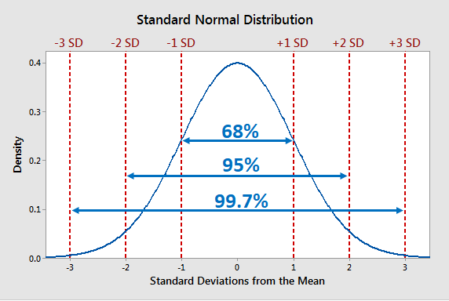

## Table of Contents

## What is the Empirical Rule?

The Empirical Rule, also known as the 68-95-99.7 Rule, is a handy way to understand how data is spread out in a normal distribution. Imagine you have a bunch of data that looks like a bell-shaped curve. The Empirical Rule tells you that about 68% of the data will fall within one standard deviation of the mean. This means if you draw a line one standard deviation above and below the mean, most of the data, about 68%, will be inside those lines.

But it doesn't stop there. If you go two standard deviations away from the mean, you'll find that about 95% of the data is inside those wider lines. And if you go three standard deviations out, almost all of the data, about 99.7%, will be captured. This rule helps you quickly get a sense of where most of your data points are without having to do a lot of complicated math. It's like a quick guide to understanding the spread of your data in a normal distribution.

## Who developed the Empirical Rule?

The Empirical Rule was not developed by a single person but rather emerged from the work of several mathematicians and statisticians over time. One key figure in the development of this rule was Carl Friedrich Gauss, a German mathematician who worked on the normal distribution in the late 18th and early 19th centuries. Gauss's work on the "normal curve" laid the groundwork for understanding how data is distributed around a mean.

As the field of [statistics](/wiki/bayesian-statistics) grew, other mathematicians and statisticians built upon Gauss's work. The Empirical Rule itself, which quantifies the percentages of data within certain standard deviations, became a standard tool in statistics. It's called "empirical" because it's based on observation and experience rather than theory alone. Over time, this rule has become a fundamental concept taught in statistics courses around the world, helping people understand and work with data more effectively.

## What are the key assumptions of the Empirical Rule?

The Empirical Rule works best when you assume your data follows a normal distribution. This means your data looks like a bell-shaped curve when you draw it on a graph. The curve is highest in the middle and gets lower as you move away from the center. For the Empirical Rule to be accurate, your data needs to be spread out evenly on both sides of the middle point, which we call the mean.

Another important assumption is that your data is continuous. This means it can take any value within a range, not just specific steps or categories. The rule also assumes that the data is not too spread out or bunched up in one place. If your data follows these assumptions, the Empirical Rule can tell you that about 68% of your data will be within one standard deviation of the mean, 95% within two standard deviations, and 99.7% within three standard deviations.

## How does the Empirical Rule relate to the normal distribution?

The Empirical Rule is all about the normal distribution, which is like a special bell-shaped curve. When you have data that fits this curve, the Empirical Rule helps you understand where most of your data points are. It says that if your data is normally distributed, about 68% of it will be within one standard deviation of the mean. This means if you draw a line one step above and below the middle point, most of your data will be inside those lines.

The rule goes further to say that about 95% of your data will be within two standard deviations from the mean. That's two steps away on both sides. And if you go three steps away, you'll find almost all of your data, about 99.7%, inside those lines. So, the Empirical Rule is like a quick guide to understanding how your data is spread out when it follows a normal distribution. It's a handy tool that helps you see where most of your data points are without having to do a lot of complicated math.

## What is the formula for the Empirical Rule?

The Empirical Rule doesn't have a specific formula like a math problem. Instead, it's more like a set of guidelines that help you understand where your data is spread out if it follows a normal distribution. Imagine your data looks like a bell-shaped curve. The rule tells you that about 68% of your data will be within one standard deviation of the mean. This means if you draw a line one step above and below the middle point, most of your data will be inside those lines.

The rule goes further to say that about 95% of your data will be within two standard deviations from the mean. That's two steps away on both sides. And if you go three steps away, you'll find almost all of your data, about 99.7%, inside those lines. So, the Empirical Rule is like a quick guide to understanding how your data is spread out when it follows a normal distribution. It's a handy tool that helps you see where most of your data points are without having to do a lot of complicated math.

## How do you calculate the intervals using the Empirical Rule?

To calculate the intervals using the Empirical Rule, you start with the mean of your data. The mean is the middle point of your bell-shaped curve. Next, you find the standard deviation, which tells you how spread out your data is. Once you have these two numbers, you can figure out the intervals. For the first interval, you add and subtract one standard deviation from the mean. This gives you the range where about 68% of your data will fall.

For the second interval, you do the same thing but with two standard deviations. You add and subtract two standard deviations from the mean. This gives you a wider range where about 95% of your data will be. Finally, for the third interval, you add and subtract three standard deviations from the mean. This gives you the widest range where about 99.7% of your data will fall. By doing these simple calculations, you can quickly see where most of your data points are located when your data follows a normal distribution.

## What percentage of data falls within one, two, and three standard deviations according to the Empirical Rule?

The Empirical Rule helps you understand where your data is spread out if it follows a normal distribution. It tells you that about 68% of your data will be within one standard deviation of the mean. This means if you draw a line one step above and below the middle point, most of your data will be inside those lines.

The rule goes further to say that about 95% of your data will be within two standard deviations from the mean. That's two steps away on both sides. And if you go three steps away, you'll find almost all of your data, about 99.7%, inside those lines. So, the Empirical Rule is like a quick guide to understanding how your data is spread out when it follows a normal distribution.

## Can the Empirical Rule be applied to any data set?

The Empirical Rule is a helpful tool, but it only works well with data that follows a normal distribution. This means your data has to look like a bell-shaped curve when you draw it on a graph. The curve should be highest in the middle and get lower as you move away from the center. If your data is spread out evenly on both sides of the middle point, which we call the mean, then the Empirical Rule can tell you that about 68% of your data will be within one standard deviation of the mean, 95% within two standard deviations, and 99.7% within three standard deviations.

If your data does not follow a normal distribution, the Empirical Rule might not give you accurate results. For example, if your data is very skewed or has multiple peaks, the rule won't work as well. So, before using the Empirical Rule, it's a good idea to check if your data looks like a bell-shaped curve. If it does, you can use the rule to quickly understand where most of your data points are without doing a lot of complicated math.

## What are the limitations of the Empirical Rule?

The Empirical Rule is a great tool for understanding data that follows a normal distribution, but it has some limitations. It only works well if your data looks like a bell-shaped curve. If your data is not spread out evenly on both sides of the middle point, or if it has more than one peak, the rule won't give you accurate results. For example, if your data is very skewed, meaning it's bunched up on one side, the percentages given by the Empirical Rule won't match your data.

Another limitation is that the Empirical Rule assumes your data is continuous, meaning it can take any value within a range. If your data is made up of specific categories or steps, the rule might not be as useful. Also, the rule is just a guideline, not a hard rule. It gives you a quick way to understand where most of your data points are, but it's not perfect. If you need very precise numbers, you might need to use other statistical methods.

## How can the Empirical Rule be used in real-world scenarios?

The Empirical Rule is useful in real-world scenarios where data follows a normal distribution. For example, in quality control at a factory, managers might use the Empirical Rule to check if the sizes of products are within acceptable limits. If they know the average size of a product and its standard deviation, they can use the rule to figure out that about 68% of the products will be within one standard deviation of the average size. This helps them quickly see if most products are meeting the quality standards without having to measure every single one.

Another real-world use is in education, where teachers might use the Empirical Rule to understand how students perform on tests. If test scores are normally distributed, the teacher can predict that about 68% of the students will score within one standard deviation of the average score. This helps the teacher see if the test was fair and if most students understood the material. By using the Empirical Rule, the teacher can quickly get a sense of the overall performance of the class without looking at every individual score.

## What are some examples of data sets where the Empirical Rule applies well?

The Empirical Rule works well with data sets like the heights of adult humans. If you measure the heights of a large group of people, you'll find that they tend to follow a normal distribution, looking like a bell-shaped curve. This means that most people will be around the average height, with fewer people being much taller or much shorter. Using the Empirical Rule, you can say that about 68% of people will be within one standard deviation of the average height, 95% within two standard deviations, and 99.7% within three standard deviations. This helps doctors and researchers quickly understand the range of heights in a population without having to measure everyone.

Another good example is IQ scores. IQ tests are designed so that the scores follow a normal distribution. The average IQ score is set at 100, and the standard deviation is usually around 15 points. With the Empirical Rule, you can predict that about 68% of people will have IQ scores between 85 and 115, 95% will have scores between 70 and 130, and 99.7% will have scores between 55 and 145. This helps psychologists and educators understand the spread of intelligence in a group without testing everyone individually.

## How does the Empirical Rule compare to other statistical rules like Chebyshev's Inequality?

The Empirical Rule and Chebyshev's Inequality are both tools used in statistics to understand how data is spread out, but they work a bit differently. The Empirical Rule is very specific and only applies to data that follows a normal distribution, which looks like a bell-shaped curve. It tells you that about 68% of your data will be within one standard deviation of the mean, 95% within two standard deviations, and 99.7% within three standard deviations. This rule is great for quickly understanding where most of your data points are if you know your data is normally distributed.

On the other hand, Chebyshev's Inequality is more general and can be used with any type of data, not just data that follows a normal distribution. It tells you that at least a certain percentage of your data will be within a certain number of standard deviations from the mean, no matter what shape your data takes. For example, Chebyshev's Inequality says that at least 75% of your data will be within two standard deviations of the mean, and at least 89% will be within three standard deviations. While it's not as precise as the Empirical Rule for normally distributed data, it's more flexible and can be used in a wider range of situations.

## What is Standard Deviation and why is it a key component?

Standard deviation is a statistical measure that quantifies the [dispersion](/wiki/dispersion-trading) or spread of a set of data points relative to its mean. In financial markets, it serves as a crucial indicator of [volatility](/wiki/volatility-trading-strategies), allowing traders and analysts to assess the risk associated with investments or trading strategies. A higher standard deviation indicates a wider spread in returns, suggesting greater volatility and, therefore, higher risk. Conversely, a lower standard deviation denotes that returns are more concentrated around the mean, indicating stability and lower risk.

The calculation of standard deviation involves a few steps. First, determine the mean of the data set. Next, calculate the variance by taking the average of the squared differences from the mean. Finally, the standard deviation is the positive square root of the variance. The formula for standard deviation ($\sigma$) is expressed mathematically as:

$$
\sigma = \sqrt{\frac{\sum (X_i - \mu)^2}{N}}
$$

Where:
- $\sigma$ is the standard deviation.
- $X_i$ represents each data point.
- $\mu$ is the mean of the data set.
- $N$ is the number of data points.

In Python, the calculation of standard deviation can be efficiently executed using libraries like NumPy, which provide built-in functions to streamline this process. Below is an example of how to calculate standard deviation using NumPy:

```python
import numpy as np

# Example data set
data = [10, 12, 23, 23, 16, 23, 21, 16]

# Calculate standard deviation
standard_deviation = np.std(data, ddof=0) # Population standard deviation

print("Standard Deviation:", standard_deviation)
```

In practice, traders utilize standard deviation to evaluate the risk and volatility of asset prices, often as a precursor to developing trading strategies. Understanding the level of volatility helps in determining appropriate risk management techniques and setting stop-loss limits, thereby optimizing trading performance and safeguarding investments.

## What are the applications in algorithmic trading?

In [algorithmic trading](/wiki/algorithmic-trading), the empirical rule and standard deviation are crucial tools for designing algorithms that aim to predict price movements and manage risk effectively. The empirical rule, which describes the distribution of data within a normal distribution, enables traders to anticipate the spread of asset prices around the mean. By harnessing standard deviation, traders can assess and configure trading strategies based on volatility measures, which are pivotal in understanding the potential fluctuations in asset prices.

Standard deviation acts as a volatility indicator, allowing traders to gauge the risk associated with an asset or trading strategy. By measuring how much asset prices deviate from their average, traders can determine the volatility level and adjust their strategies accordingly. The formula to calculate standard deviation for a dataset of prices is:

$$

\sigma = \sqrt{\frac{1}{N}\sum_{i=1}^N (x_i - \bar{x})^2} 
$$

where $\sigma$ is the standard deviation, $N$ is the number of data points, $x_i$ is each data point, and $\bar{x}$ is the mean of the data points.

Algorithmic traders often use standard deviation to configure parameters like stop-loss limits and trading [volume](/wiki/volume-trading-strategy). For instance, a higher standard deviation indicates greater volatility, suggesting the need for wider stop-loss limits to accommodate larger price swings and potentially adjusting trading volumes to mitigate risk exposure.

In Python, calculating standard deviation can be achieved with libraries such as NumPy, which simplifies handling large datasets commonly used in algorithmic trading. Here is an example of how to compute standard deviation for a series of stock prices:

```python
import numpy as np

# Example of a price dataset
prices = [101, 103, 102, 105, 110, 115, 114, 113, 112]

# Calculating standard deviation
standard_deviation = np.std(prices)

print(f"The standard deviation of the stock prices is: {standard_deviation}")
```

Risk management is another area where the empirical rule and standard deviation play a vital role. By analyzing the typical range within which prices are expected to vary, traders can establish risk management strategies that are adaptive to market conditions. This approach is essential for defining stop-loss orders that protect against unfavorable market moves without prematurely halting profitable trades.

Overall, integrating the empirical rule and standard deviation into algorithmic trading frameworks enhances the ability to forecast price trends, optimize trading strategies, and effectively manage risk, hence improving trading performance and decision-making precision.

## How is Real-World Implementation carried out?

The empirical rule and standard deviation are integral to analyzing market behavior and making informed trading decisions. In practice, these concepts are often used by traders to assess the volatility of assets using historical price data. Python, a popular programming language among traders, provides various libraries like NumPy and pandas to facilitate these calculations efficiently.

To calculate volatility, traders typically begin by collecting historical price data of a security, such as closing prices. Once the data is gathered, the returns can be calculated to observe price fluctuations. Daily returns can be determined by the formula: 

$$
\text{Return}_t = \frac{\text{Price}_t - \text{Price}_{t-1}}{\text{Price}_{t-1}}
$$

where $\text{Price}_t$ is the price of the asset at time $t$, and $\text{Price}_{t-1}$ is the price of the asset at the previous time.

After calculating returns, the standard deviation of these returns serves as an indicator of the asset's volatility. Volatility represents the degree of variation of trading prices over time, providing an estimate of potential price fluctuation. The standard deviation ($\sigma$) is calculated using:

$$
\sigma = \sqrt{\frac{1}{N-1} \sum_{i=1}^{N} (R_i - \bar{R})^2}
$$

where $R_i$ is the return at time $i$, $\bar{R}$ is the mean return, and $N$ is the number of returns.

Here is a simple Python example using pandas and NumPy to calculate the volatility of a stock based on its historical data:

```python
import pandas as pd
import numpy as np

# Assume 'data' is a DataFrame containing historical 'Close' prices.
# For example: data = pd.read_csv('historical_data.csv')

# Calculate daily returns
data['Return'] = data['Close'].pct_change()

# Calculate standard deviation of daily returns
volatility = data['Return'].std()

# Annualize the standard deviation if needed (for example, 252 trading days in a year)
annualized_volatility = volatility * np.sqrt(252)

print(f"Annualized Volatility: {annualized_volatility}")
```

This method of estimating volatility helps traders understand the likelihood of price movements and prepare accordingly. For instance, a high standard deviation indicates greater price dispersion and unpredictability, which may require different trading strategies or risk assessments. Conversely, low volatility signifies relatively stable prices, which might be attractive for different types of investments.

Despite the efficacy of these tools, traders should remain aware that the empirical rule assumes normal distribution, which may not always correspond to actual market conditions. Nevertheless, by leveraging Python's computational capabilities, traders can effectively utilize historical price data to calculate volatility and apply the empirical rule, allowing for more robust and informed trading strategies.

## References & Further Reading

[1]: ["Understanding Wall Street's Volatility"](https://www.outlookwealth.com/blog/understanding-the-volatility-index-vix/) by Greg Ip

[2]: ["Statistics for Business and Economics"](https://www.pearson.com/en-us/subject-catalog/p/statistics-for-business-and-economics/P200000006288/9780137335428) by Paul Newbold, William L. Carlson, and Betty Thorne

[3]: DeGroot, M.H., & Schervish, M.J. (2012). ["Probability and Statistics."](https://raw.githubusercontent.com/saonam/bookshelf/master/Math/Probability%20and%20Statistics-Morris%20H.Degroot%2C%204th%20Edition.pdf) Pearson.

[4]: ["Elements of Statistical Learning: Data Mining, Inference, and Prediction"](https://link.springer.com/book/10.1007/978-0-387-84858-7) by Trevor Hastie, Robert Tibshirani, and Jerome Friedman

[5]: Hull, J. (2018). ["Options, Futures, and Other Derivatives."](https://books.google.com/books/about/Options_Futures_and_Other_Derivatives.html?id=vpIYvgAACAAJ) Pearson.