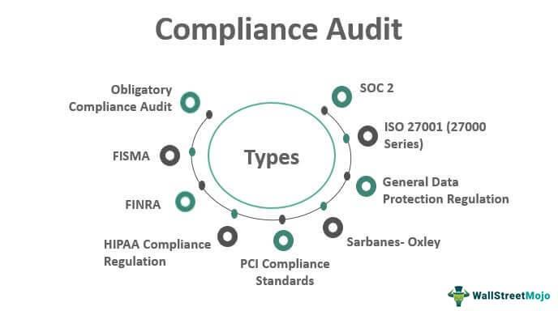

Understanding employee compliance in retirement plans is crucial for both employers and employees. Retirement plans, such as 401(k) and other pension schemes, offer significant tax advantages and are vital components of financial security for employees. For employers, these plans are essential in attracting and retaining talent. However, ensuring the compliance of these plans with the Internal Revenue Service (IRS) regulations is both a legal obligation and a strategic necessity.

The Employee Plans Compliance Resolution System (EPCRS) serves as an essential tool for managing this compliance. Developed by the IRS, the EPCRS provides a structured framework allowing plan sponsors to correct errors found in retirement plans. By offering programs like the Self-Correction Program (SCP), Voluntary Correction Program (VCP), and Audit Closing Agreement Program (Audit CAP), EPCRS enables organizations to rectify discrepancies and maintain the integrity of the plans while minimizing potential penalties.



Effectively correcting plan errors is not mereifiable for legal compliance—it's also a critical means to safeguard the interests of all stakeholders, including employers, employees, and beneficiaries. Errors, if left unaddressed, could lead to severe financial consequences, such as plan disqualification, which can result in a loss of tax benefits and trigger penalties.

In addition to understanding how EPCRS functions, recent legislative developments, such as the SECURE 2.0 bill, have introduced notable changes to retirement plan regulations. These updates are designed to enhance and expand the existing EPCRS framework, providing additional avenues and timeframes for correction, thereby promoting more agile and responsive compliance practices.

Moreover, with today’s rapidly evolving investment markets, technological advances such as algorithmic trading (algo trading) have become influential. Algo trading can optimize investment strategies within retirement plans, offering heightened efficiency and precision in trade executions. This technological integration can enhance the overall performance and compliance of retirement plans, ensuring that plan sponsors not only meet regulatory requirements but also maximize the financial benefits for their participants.

In this article, we will explore how EPCRS functions, discuss updates like SECURE 2.0, and assess the role of algo trading in modern investment contexts. This comprehensive examination will highlight the importance of maintaining robust and compliant retirement plans in an ever-changing regulatory and technological landscape.

## Table of Contents

## What is EPCRS?

The Employee Plans Compliance Resolution System (EPCRS) is a regulatory mechanism established by the Internal Revenue Service (IRS) to assist sponsors of retirement plans in correcting operational and administrative errors. These errors, if unaddressed, could potentially jeopardize the tax-favored status of the retirement plans. The EPCRS provides a structured and systematic approach to resolving discrepancies, thereby safeguarding both the employees' retirement savings and the sponsors' interests.

EPCRS encompasses three primary correction methods, each designed to cater to different levels of infractions and compliance needs:

1. **Self-Correction Program (SCP):**  
   The SCP empowers plan sponsors to rectify certain types of plan errors internally without obtaining prior approval from the IRS or incurring a fee. This method is applicable when the errors are of a nature that can be corrected within a specified period. SCP is advantageous in situations where the plan sponsor identifies minor, non-egregious errors, promoting timely correction and less bureaucratic oversight.

2. **Voluntary Correction Program (VCP):**  
   Under VCP, plan sponsors voluntarily disclose errors to the IRS and apply for supervised correction. This program involves submitting an application detailing the error and proposed correction strategy, along with a fee based on the plan's asset size. The VCP is suitable for more significant errors or those not correctable under the SCP. Upon approval, plan sponsors receive assurance from the IRS that the identified errors will not disqualify the plan.

3. **Audit Closing Agreement Program (Audit CAP):**  
   The Audit CAP is applicable when the IRS identifies errors during an audit. This program enables plan sponsors to negotiate a settlement to bring the plan into compliance while minimizing penalties. The process includes negotiating a Closing Agreement with the IRS, which usually involves correcting the error and paying a negotiated sanction.

Each EPCRS method differs in terms of the procedural requirements, degree of IRS involvement, and associated costs. Sponsors must weigh their options based on factors such as the nature of the error, timing, and available resources. By providing these correction avenues, EPCRS facilitates a flexible yet comprehensive framework for maintaining retirement plan compliance. 

For more detailed guidance on each method, IRS guidelines and official documentation should be consulted to ensure accuracy in application and adherence to regulatory changes.

## The Importance of Compliance in Retirement Plans

Compliance ensures that retirement plans maintain their status as beneficial and tax-advantaged financial tools. It is essential because non-compliance can result in the disqualification of the plan, leading to severe financial consequences for both employers and employees. A disqualified plan might lose its favorable tax status, meaning contributions could be taxed as income to employees, and sponsors could face penalties and interest on unpaid taxes. 

The Employee Plans Compliance Resolution System (EPCRS) is an invaluable tool for employers, offering them a structured approach to correct errors proactively. It allows plan sponsors to address discrepancies before they lead to significant repercussions. This system includes three primary programs: the Self-Correction Program (SCP), the Voluntary Correction Program (VCP), and the Audit Closing Agreement Program (Audit CAP). Each method provides unique avenues for correction, varying in complexity, IRS involvement, and costs, but all designed to facilitate compliance without drastic repercussions.

By encouraging employers to maintain accurate and compliant plans, EPCRS helps safeguard the interests of all stakeholders involved. It empowers employers to rectify operational failures, plan document defects, and other issues that could otherwise jeopardize the plan’s integrity. Consequently, this system not only aids in maintaining the tax-advantaged status of the plans but also reinforces the trust and confidence employees have in their employer-sponsored retirement benefits.

Overall, compliance ensures the operational and financial stability of retirement plans, protecting the tax incentives that are integral to both employers’ and employees’ financial strategies. Thus, adherence to compliance guidelines, like those provided through EPCRS, is essential for the continued success and reliability of retirement plans.

## SECURE 2.0 Bill: Impact on EPCRS

The SECURE 2.0 bill significantly impacts the Employee Plans Compliance Resolution System (EPCRS), primarily by expanding its capabilities and enhancing the ways in which retirement plan sponsors can address and correct plan errors. One of the critical changes brought about by SECURE 2.0 is the extension of correction time frames. By allowing more extended periods to identify and rectify mistakes, plan sponsors can reduce the risk of plan disqualification and ensure that retirement plans remain compliant with the Internal Revenue Service (IRS) regulations.

Moreover, the SECURE 2.0 bill introduces additional safe harbors, which offer protection for accidental errors made in good faith. These provisions give plan sponsors more security in correcting mistakes without facing excessive penalties. Safe harbors are predetermined legal protections against non-compliance penalties, now expanded under SECURE 2.0, making it easier for employers to address errors without risking severe repercussions.

In addition to extending the correction time frames and establishing more safe harbors, the SECURE 2.0 bill encourages the utilization of the Self-Correction Program (SCP) by broadening the scope of what errors can be self-corrected. This less formal approach to corrections reduces the need for direct IRS involvement, making the process faster and less costly. The bill also introduces measures to lower excise taxes associated with undiscovered errors corrected voluntarily. Consequently, these changes collectively foster an environment that supports timely, efficient, and cost-effective rectification of retirement plan errors, ultimately protecting the interests of both the employers and the participants in these plans.

Through these enhancements, the SECURE 2.0 bill positions the EPCRS as a more robust and flexible system, enabling better compliance and sustaining the integrity of retirement plans across the nation. By easing the correction process and mitigating potential financial burdens, SECURE 2.0 strives to make compliance less daunting for plan sponsors while ensuring that employee retirement benefits are adequately secured and maintained.

## Understanding Algo Trading

Algorithmic trading, often referred to as algo trading, involves the use of computer algorithms to execute trades at speeds and frequencies that are impossible for human traders. These algorithms follow defined instructions—termed as trading strategies—to make decisions to buy or sell stocks, bonds, or other financial instruments.

The core advantage of algo trading is its ability to process a substantial amount of market data in real-time, executing trades with higher accuracy and within milliseconds. By minimizing human intervention, algo trading reduces the potential for human error and emotion-driven decisions, making trading more efficient and consistent.

In the broader trading markets, [algorithmic trading](/wiki/algorithmic-trading) accounts for a significant portion of total trade [volume](/wiki/volume-trading-strategy). It allows traders and institutions to capitalize on small price discrepancies across different exchanges, a practice known as [arbitrage](/wiki/arbitrage). Additionally, algo trading supports [market making](/wiki/market-making), helping to maintain [liquidity](/wiki/liquidity-risk-premium).

Python, due to its versatile libraries and frameworks, plays an important role in developing and executing trading algorithms. Libraries such as NumPy for numerical operations, pandas for data manipulation, and TA-Lib for technical analysis are often used. Below is a simplified example of a moving average crossover strategy using Python, which is a common approach in algorithmic trading:

```python
import numpy as np
import pandas as pd
import talib

# Generate random price data
np.random.seed(42)
data = np.random.randn(1000) + 50  # Simulated stock prices

# Convert to pandas DataFrame
prices = pd.DataFrame(data, columns=['Price'])

# Calculate moving averages
prices['SMA50'] = talib.SMA(prices['Price'], timeperiod=50)
prices['SMA200'] = talib.SMA(prices['Price'], timeperiod=200)

# Define buy/sell signals
prices['Signal'] = np.where(prices['SMA50'] > prices['SMA200'], 1, 0)

# Generate trading signals
prices['Position'] = prices['Signal'].diff()

# Extract buy/sell points
buy_signals = prices[prices['Position'] == 1]
sell_signals = prices[prices['Position'] == -1]

# Display buy/sell signals
print("Buy Signals:\n", buy_signals)
print("Sell Signals:\n", sell_signals)
```

In the context of retirement plans, algorithmic trading plays a strategic role in optimizing investment portfolios. By automating the trading process, financial institutions can efficiently manage the diversification and rebalancing of assets, aiming to maximize returns and minimize risks over time.

This efficiency in execution allows retirement funds to maintain desired asset allocations and take advantage of market movements without the delays associated with manual trading. Moreover, algo trading supports long-term investment strategies by systematically evaluating market conditions and historical data to predict asset performance, thus enhancing overall plan performance.

## EPCRS and Technology: A Synergistic Relationship

Advanced technologies, particularly automation and data analytics, are transforming the way retirement plan errors are identified and corrected within the EPCRS framework. The integration of technology in compliance processes offers a more streamlined and efficient approach to maintaining retirement plan integrity. Automated systems leverage algorithms to continuously monitor and analyze retirement plan data, quickly identifying discrepancies that could indicate compliance issues.

These automated systems utilize predefined criteria to flag potential errors, allowing for faster intervention and resolution. For example, [machine learning](/wiki/machine-learning) algorithms can be trained to recognize patterns that typically precede compliance violations. By analyzing historical data, these algorithms can predict future compliance risks, thereby enabling proactive measures to prevent errors before they occur.

Python, a widely used programming language in data analytics, can be employed to create scripts that automate the monitoring process. Below is a simple example of how Python can be used to identify discrepancies in financial data:

```python
import pandas as pd

# Load retirement plan data into a pandas DataFrame
data = pd.read_csv('retirement_plan_data.csv')

# Define a function to identify discrepancies
def identify_discrepancies(data):
    # Assumed columns for contributions and expected limits
    discrepancies = data[data['contributions'] > data['expected_limit']]
    return discrepancies

# Apply the function to identify issues
discrepancies_found = identify_discrepancies(data)

# Output the discrepancies
print(discrepancies_found)
```

In this snippet, retirement plan data is loaded into a DataFrame, and a function is used to detect contributions that exceed predefined limits, which could signify a compliance error.

Moreover, advanced analytics enable plan administrators to conduct comprehensive audits more effectively. By employing these technologies, organizations can minimize manual intervention, reduce human errors, and ensure a more timely correction of plan discrepancies. This technological synergy not only improves compliance accuracy but also aligns with regulatory standards, ultimately safeguarding the interests of stakeholders involved in retirement plans. By harnessing these tools, organizations can enhance their compliance efforts while simultaneously optimizing the performance of retirement plans.

## The Relationship between Compliance and Investment Performance

Compliance plays a crucial role in determining the efficacy and success of retirement plans. Ensuring that retirement plans adhere to regulatory frameworks is essential not only to avoid financial penalties but also to maintain the trust of employees and other stakeholders involved. Non-compliance can lead to significant financial setbacks for both employers and employees, thereby affecting participation rates and the financial health of the plan.

Errors and mismanagement within retirement plans can trigger penalties from regulatory bodies, such as the IRS. Penalties often result in unexpected financial burdens, which can reduce the overall assets available in a retirement plan. This reduction can decrease the potential returns generated from these investments, ultimately impacting the retirement benefits employees receive. Furthermore, frequent compliance issues can erode the trust of employees, making them hesitant to participate in the offered retirement plans.

Algorithmic trading, or algo trading, can play an influential role in enhancing investment performance while maintaining compliance. Through the use of sophisticated computer algorithms, trades can be executed with greater speed and accuracy than manual trading. This capability allows retirement plans to react swiftly to market changes and optimize their investment strategies. With algo trading, retirement plans can also ensure adherence to investment guidelines and compliance requirements by systematically implementing predetermined strategies. 

For example, consider a scenario where a retirement plan uses an algorithm to maintain a fixed proportion of investments in various asset classes, such as stocks and bonds. By continuously monitoring the portfolio and executing trades as market values fluctuate, the algorithm helps uphold the plan's compliance with its investment policy. 

```python
def rebalance_portfolio(stock_percentage, bond_percentage, total_portfolio_value):
    target_stock_value = total_portfolio_value * stock_percentage
    target_bond_value = total_portfolio_value * bond_percentage

    current_stock_value = ... # Current portfolio value of stocks
    current_bond_value = ... # Current portfolio value of bonds

    stock_trade_value = target_stock_value - current_stock_value
    bond_trade_value = target_bond_value - current_bond_value

    return stock_trade_value, bond_trade_value
```

This sample Python function aims to calculate the trade values required to rebalance a portfolio in compliance with predefined investment ratios. Employing such automated systems in investment plans ensures that any deviation from the pre-established guidelines is quickly and effectively corrected, further protecting the interests of the plan participants.

In conclusion, upholding compliance not only safeguards the integrity of retirement plans but also optimizes their investment performance. By integrating algorithmic trading within the compliance framework, plan sponsors can benefit from optimized returns while ensuring that they adhere to pertinent regulatory and investment guidelines. This harmonious relationship between compliance and investment performance is indispensable for the long-term success and sustainability of retirement plans.

## Conclusion

Ensuring compliance through the Employee Plans Compliance Resolution System (EPCRS) is essential for maintaining and optimizing retirement plans' sustainability. EPCRS plays a pivotal role in helping both employers and employees adhere to IRS regulations, thus safeguarding tax-advantaged benefits and preventing plan disqualification. The SECURE 2.0 bill introduces crucial enhancements that simplify the process for plan sponsors to maintain compliance. It grants extended correction timeframes and additional safe harbors for accidental errors, thereby encouraging timely and efficient error rectification.

Furthermore, the integration of technology, especially algorithmic trading, offers significant advantages in retirement plan management. Algorithmic trading enhances the efficiency and accuracy of fund management, providing speed and precision that can lead to optimized investment strategies and improved performance of retirement plans. By leveraging algorithmic tools, plan sponsors can effectively manage investments, ensuring that compliance does not impede financial performance.

In light of the rapidly evolving regulatory landscape, it is increasingly important for plan sponsors to stay abreast of legal developments and use available tools to their advantage. Embracing technological advancements and adhering to updated compliance frameworks like those introduced by the SECURE 2.0 bill are essential steps in sustainably managing retirement plans. By doing so, plan sponsors can ensure robust plan performance, maintain stakeholder trust, and ultimately, secure the financial future of participants.

## References & Further Reading

[1]: IRS. (2023). ["Employee Plans Compliance Resolution System (EPCRS)."](https://www.irs.gov/retirement-plans/epcrs-overview) Internal Revenue Service.

[2]: The U.S. Congress. (2023). ["Setting Every Community Up for Retirement Enhancement (SECURE) 2.0 Act of 2022."](https://www.tsp.gov/plan-news/2023-01-06-President-signs-SECURE-2_0-Act/) Congress.gov.

[3]: Lopez de Prado, M. (2018). ["Advances in Financial Machine Learning."](https://www.amazon.com/Advances-Financial-Machine-Learning-Marcos/dp/1119482089) Wiley.

[4]: Jansen, S. (2020). ["Machine Learning for Algorithmic Trading: Predictive models to extract signals from market and alternative data."](https://github.com/stefan-jansen/machine-learning-for-trading) Packt.

[5]: Aronson, D. R. (2007). ["Evidence-Based Technical Analysis: Applying the Scientific Method and Statistical Inference to Trading Signals."](https://www.amazon.com/Evidence-Based-Technical-Analysis-Scientific-Statistical/dp/0470008741) John Wiley & Sons.