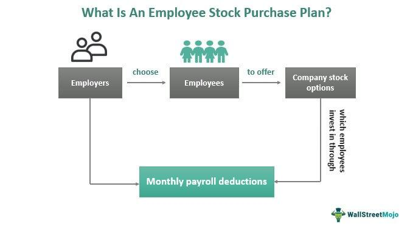

## Table of Contents

## What is an Employee Share Purchase Plan (ESPP)?

An Employee Share Purchase Plan (ESPP) is a program that lets employees of a company buy shares of the company's stock, often at a discount. This means employees can get the stock for less than what it's worth on the open market. Companies set up ESPPs to help employees feel more connected to the company's success and to give them a chance to grow their wealth.

In an ESPP, employees usually contribute money from their paychecks over a set period, like six months or a year. At the end of this period, the company uses the money to buy shares for the employees. The discount can be anywhere from 5% to 15%, which can make a big difference in the long run. It's a way for employees to invest in their company and potentially earn more money if the stock price goes up.

## How does an ESPP work?

An ESPP lets employees buy their company's stock at a discount. Employees sign up for the plan and choose how much money they want to put in from each paycheck. This money goes into an account, and at the end of a set period, like six months or a year, the company uses it to buy stock for the employees. The price they pay is less than what the stock costs on the open market, usually with a discount of 5% to 15%.

Once the stock is bought, employees can choose to keep it or sell it. If they keep it, they might make more money if the stock price goes up. If they sell it right away, they still get the benefit of the discount. It's a way for employees to feel more connected to their company and to have a chance to grow their money. But, they should remember that the stock price can go down too, so it's important to think carefully before joining an ESPP.

## What are the benefits of participating in an ESPP?

Participating in an ESPP can help employees save money and feel more connected to their company. When employees buy stock at a discount, they pay less than what it's worth on the market. This means they can make a profit even if the stock price doesn't go up much. It's like getting a bonus from the company, but instead of cash, it's in the form of stock. This can be a great way to save money over time, especially if the company does well and the stock price goes up.

Another benefit is that ESPPs can make employees feel more invested in their company's success. When employees own part of the company, they might work harder and feel more loyal. This can lead to a better work environment and help the company grow. Plus, having stock can give employees a sense of pride and accomplishment, knowing they are part of something bigger. Overall, an ESPP can be a win-win for both the employees and the company.

## Who is eligible to participate in an ESPP?

Employees who work for a company that offers an ESPP can usually join the plan. Most companies let all their full-time employees participate, but some might have rules about how long you need to work there before you can join. Part-time employees might also be able to join, but this depends on the company's rules. Usually, you need to be at least 18 years old and meet other simple requirements set by the company.

Sometimes, there are limits on how much stock you can buy through an ESPP. The company might say you can only put in a certain amount of money each year, or that you can only buy a certain number of shares. It's important to read the plan's rules carefully to know if you can join and how much you can invest. If you're not sure, you can always ask someone in the human resources department for help.

## What is the difference between a qualified and a non-qualified ESPP?

A qualified ESPP follows special rules set by the government, which can give employees tax benefits. In a qualified ESPP, employees can buy stock at a discount, and if they hold onto the stock for a certain amount of time, they might pay less in taxes when they sell it. The rules say that employees can't own more than 5% of the company, and the discount can't be more than 15%. These plans are often seen as more employee-friendly because of the tax advantages.

A non-qualified ESPP doesn't have to follow those special rules, so it can be more flexible. The company can offer bigger discounts or let employees buy more stock. But, there's a catch: the tax benefits aren't as good. When employees sell the stock, they might have to pay more in taxes right away. Companies might choose a non-qualified ESPP if they want more control over the plan or if they think the flexibility is more important than the tax benefits.

## How are shares purchased under an ESPP typically funded?

Shares under an ESPP are usually funded by taking money directly from an employee's paycheck. When an employee signs up for the plan, they choose how much money they want to contribute from each paycheck. This amount is then taken out automatically, kind of like a savings plan. The money goes into an account and stays there until the end of the offering period, which could be six months or a year, depending on the company's rules.

At the end of the offering period, the company uses the money that's been collected to buy shares of stock for the employee. The price the employee pays for these shares is less than what the stock is worth on the open market, thanks to the discount offered by the ESPP. This way, employees can slowly build up their investment in the company without having to come up with a big chunk of money all at once.

## What are the tax implications of participating in an ESPP?

When you participate in an ESPP, the tax rules can be a bit tricky. It depends on whether you're in a qualified or non-qualified ESPP. In a qualified ESPP, you get a tax break if you hold onto the stock for at least two years from when the offering period started and one year from when you bought the stock. If you do this, when you sell the stock, the profit you make is taxed as long-term capital gains, which is usually less than regular income tax. But if you sell the stock before meeting these holding periods, part of your profit might be taxed as regular income, and the rest as capital gains.

In a non-qualified ESPP, the tax rules are simpler but less favorable. When you buy the stock, the discount you get is considered part of your income and is taxed right away. When you sell the stock later, any profit you make is taxed as capital gains. The length of time you hold the stock before selling it determines whether it's taxed as short-term or long-term capital gains. Short-term capital gains are taxed at your regular income tax rate, while long-term capital gains have a lower tax rate. It's a good idea to talk to a tax advisor to understand how an ESPP might affect your taxes.

## How can employees sell shares acquired through an ESPP?

Employees can sell shares they got through an ESPP in a few different ways. They can use a brokerage account, which is like a special bank account for buying and selling stocks. If the company has a program set up, employees might be able to sell their shares right through the company's system. It's easy and quick. Another way is to use a stock trading app or website, where employees can sell their shares whenever they want.

When employees decide to sell their shares, they need to think about the timing. If they sell right away, they get the benefit of the discount they got when they bought the shares. But if they wait and the stock price goes up, they might make even more money. They should also think about taxes. If they're in a qualified ESPP and they sell the shares before holding them for the required time, they might have to pay more in taxes. It's a good idea to talk to someone who knows about taxes to make the best choice.

## What should employees consider before selling ESPP shares?

Before selling ESPP shares, employees should think about a few important things. First, they need to consider the timing of the sale. If they sell the shares right away, they'll benefit from the discount they got when they bought the shares. But if they wait and the stock price goes up, they might make even more money. They also need to think about their financial goals and whether they need the money now or if they can wait for a potentially higher return.

Another thing to consider is the tax implications. If the ESPP is qualified and the employee sells the shares before holding them for the required time (two years from the start of the offering period and one year from the purchase date), they might have to pay more in taxes. In a non-qualified ESPP, the discount is taxed as income right away, and any profit from selling the shares is taxed as capital gains. It's a good idea to talk to a tax advisor to understand how selling the shares will affect their taxes.

Lastly, employees should think about their overall investment strategy. Selling ESPP shares might be part of a bigger plan to diversify their investments. Holding too much stock in one company can be risky, so they might want to sell some shares to invest in other things. It's important to balance the potential for higher returns with the need to spread out risk.

## How do ESPPs compare to other employee stock options like ESOPs and RSUs?

ESPPs, ESOPs, and RSUs are all ways for employees to get stock in their company, but they work a bit differently. An ESPP lets employees buy stock at a discount using money taken from their paychecks over time. They can decide when to buy the stock and how much to invest, up to the limits set by the company. ESOPs, or Employee Stock Ownership Plans, are a bit different because the company gives employees stock as part of their retirement plan. Employees don't buy the stock themselves; instead, the company puts stock into an account for them, and they get it when they leave the company or retire. RSUs, or Restricted Stock Units, are another way for companies to give employees stock. With RSUs, employees get the stock for free after working at the company for a certain amount of time, but they have to wait until the stock "vests" before they can do anything with it.

When comparing these options, it's important to think about how they fit with your financial goals and how they're taxed. ESPPs can be a good way to save money and invest in your company over time, but you need to be ready to buy the stock yourself. The tax benefits can be good if you hold onto the stock for a while. ESOPs are more like a retirement plan, so they're good if you want to build wealth for the future without having to do anything now. The tax rules for ESOPs can be a bit complicated, but they're often favorable. RSUs are great because you get the stock for free, but you have to wait for it to vest, and when you get it, you might have to pay taxes on its value right away. Each option has its pros and cons, so it's important to understand them and see which one works best for you.

## What are the potential risks associated with ESPPs?

One big risk with ESPPs is that the stock price can go down. If you buy stock through an ESPP and the price drops, you might lose money. Even though you get the stock at a discount, if the price falls a lot, the discount might not be enough to make up for the loss. It's important to think about how much risk you're okay with before joining an ESPP.

Another risk is that you might end up with too much of your money in one company's stock. If you work at the company and also own a lot of its stock, it can be risky. If the company does badly, you could lose your job and see your stock value drop at the same time. It's a good idea to spread your investments around to lower this risk.

## How can companies design an effective ESPP to maximize employee participation and satisfaction?

Companies can design an effective ESPP by making it easy for employees to join and understand. They should keep the rules simple and clear, so everyone knows how it works. Offering a good discount on the stock, like 15%, can make the plan more attractive. It's also important to let employees choose how much money they want to put in from their paychecks, so they feel in control. Companies should explain the tax benefits of holding onto the stock for a while, which can make the plan even more appealing.

Another way to boost participation is by educating employees about the ESPP. Companies can hold workshops or send out information to help employees understand how the plan works and how it can help them save money. They should also make it easy for employees to sell their shares if they need to, maybe through a company program or a simple online system. By listening to what employees want and making changes to the plan based on their feedback, companies can keep employees happy and more likely to join the ESPP.

## References & Further Reading

[1]: Benartzi, S., Thaler, R. H. (2001). ["Naive Diversification Strategies in Defined Contribution Savings Plans."](https://www.jstor.org/stable/2677899) American Economic Review, 91(1), 79-98.

[2]: Bakan, A., & Macready, J. (2003). ["Algorithmic Trading."](https://papers.ssrn.com/sol3/papers.cfm?abstract_id=1517433) Quantitative Finance.

[3]: Hull, J. C. (2018). ["Risk Management and Financial Institutions."](https://books.google.com/books/about/Risk_Management_and_Financial_Institutio.html?id=1J1QDwAAQBAJ) John Wiley & Sons.

[4]: Poterba, J. M., & Weisbenner, S. J. (2001). ["The effect of stock options on the mix of compensation: Evidence from executive stock options."](https://www.jstor.org/stable/222472) Journal of Financial Economics, 61(2), 145-177.

[5]: ["Electronic and Algorithmic Trading Technology: The Complete Guide"](https://www.sciencedirect.com/book/9780123724915/electronic-and-algorithmic-trading-technology) by Kendall Kim