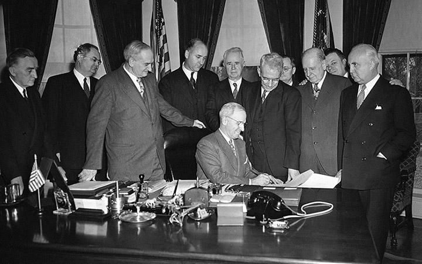

## Table of Contents

## What is the Employment Act of 1946?

The Employment Act of 1946 is a law passed by the United States government to help create jobs and keep the economy stable. Before this law, the government did not have a big role in making sure people had jobs. The Act changed that by saying the government should help with employment and make plans to keep the economy healthy.

The Act created the Council of Economic Advisers, which is a group of experts who give advice to the President about the economy. It also made the Joint Economic Committee, which is a group of people from the Senate and the House of Representatives who work together to study the economy and suggest laws. These groups help the government understand and manage economic problems better.

## What were the main goals of the Employment Act of 1946?

The main goal of the Employment Act of 1946 was to make sure that everyone who wanted a job could have one. Before this law, the government did not do much to help people find work. The Act said that the government should take action to create jobs and keep unemployment low. This was important because after World War II, many soldiers came back home and needed jobs.

Another goal was to keep the economy stable. The Act wanted to prevent big economic problems like the Great Depression from happening again. It did this by making the government more involved in watching and planning for the economy. The law created groups like the Council of Economic Advisers and the Joint Economic Committee to help the President and Congress understand the economy better and make good plans.

## Who were the key figures involved in the creation of the Employment Act of 1946?

The Employment Act of 1946 was influenced by many important people. One key figure was President Harry S. Truman. He supported the idea of the government helping with jobs and the economy. Truman signed the Act into law on February 20, 1946. Another important person was Senator Robert A. Taft. He was a big leader in the Senate and helped shape the final version of the Act. Taft wanted to make sure the law was balanced and did not give the government too much power.

Economists also played a big role in creating the Employment Act. One of them was Alvin Hansen, who was a famous economist at the time. Hansen believed that the government should spend money to create jobs and keep the economy strong. His ideas helped shape the Act. Another key economist was Leon Keyserling, who worked in the government and helped write parts of the Act. Keyserling thought that the government should have plans to make sure everyone could have a job if they wanted one. Together, these people helped make the Employment Act of 1946 a reality.

## What historical events led to the passage of the Employment Act of 1946?

The Employment Act of 1946 came about because of big changes after World War II. When the war ended, lots of soldiers came back home and needed jobs. Before the war, the government did not help much with jobs, but now it had to do something. People were worried about another depression like the one in the 1930s, so they wanted the government to take action to keep the economy strong and make sure everyone could work.

Also, during the war, the government had learned how to manage the economy better. It had spent a lot of money to help win the war, and this showed that the government could make a difference. After the war, many people and leaders thought the government should keep helping with the economy. This idea, along with the need to help returning soldiers find jobs, led to the Employment Act of 1946. The Act was a way for the government to promise to keep working on jobs and the economy to avoid big problems in the future.

## How did the Employment Act of 1946 impact the U.S. economy?

The Employment Act of 1946 had a big impact on the U.S. economy by making the government more involved in creating jobs and keeping the economy stable. Before the Act, the government did not do much to help people find work. But after the Act, the government started to make plans and take actions to make sure more people could have jobs. This was important because after World War II, many soldiers came back home and needed work. By helping to create jobs, the Act helped the economy grow and stay strong.

The Act also helped the government understand the economy better. It created groups like the Council of Economic Advisers and the Joint Economic Committee. These groups gave advice to the President and Congress about the economy. They helped the government see problems coming and make plans to fix them. This made the economy more stable and helped prevent big problems like the Great Depression from happening again. Overall, the Employment Act of 1946 made the government a bigger part of keeping the economy healthy and helping people find jobs.

## What were the immediate effects of the Employment Act of 1946 on employment policies?

Right after the Employment Act of 1946 was passed, the government started to think more about jobs and the economy. The Act made the government promise to help people find work and keep the economy strong. It created new groups like the Council of Economic Advisers and the Joint Economic Committee. These groups helped the President and Congress understand the economy better and make plans to create jobs. This was a big change because before the Act, the government did not do much to help with jobs.

The immediate effect on employment policies was that the government started to pay more attention to unemployment. They began to make plans to help people find work, especially for the soldiers coming back from World War II. The Act made the government more involved in the economy, which helped more people get jobs. It also made the government watch the economy more closely to prevent big problems like another depression.

## How did the Employment Act of 1946 influence subsequent legislation?

The Employment Act of 1946 changed how the government thought about jobs and the economy. It made the government promise to help people find work and keep the economy strong. This idea led to more laws that focused on helping people get jobs and making the economy better. For example, the Full Employment and Balanced Growth Act of 1978, also called the Humphrey-Hawkins Act, was influenced by the 1946 Act. This later law set goals for unemployment and inflation, showing that the government was still working on the ideas from the Employment Act.

The Employment Act also helped create a system where the government watches the economy closely. This system led to laws like the Economic Recovery Tax Act of 1981, which tried to help the economy grow by cutting taxes. The idea of the government helping with jobs and the economy became more common after the 1946 Act. This influenced many other laws that came later, all trying to make sure more people could work and the economy could stay strong.

## What were the criticisms and controversies surrounding the Employment Act of 1946?

Some people did not like the Employment Act of 1946 because they thought it gave the government too much power over the economy. They worried that the government would spend too much money trying to create jobs and might make the economy worse instead of better. These critics believed that the economy should be left alone to fix itself, without the government getting involved. They also thought that the new groups like the Council of Economic Advisers and the Joint Economic Committee might not really help and could just make things more complicated.

Another big criticism was about how the Act promised to help everyone find a job. Some people thought this promise was too big and that the government could not really make sure everyone had a job. They worried that the government might try to do too much and fail, which could make people lose trust in the government. There were also debates about what the Act should focus on. Some wanted it to be more about helping the economy grow, while others wanted it to be more about making sure everyone had a job. These different ideas led to a lot of discussions and changes before the Act was finally passed.

## How did the Employment Act of 1946 change the role of the federal government in economic planning?

The Employment Act of 1946 made a big change in how the federal government thought about the economy. Before this law, the government did not do much to help people find jobs or keep the economy strong. But after the Act, the government promised to help with jobs and make plans to keep the economy healthy. This was important because after World War II, many soldiers came back home and needed work. The Act made the government more involved in the economy, which helped more people get jobs and made the economy grow.

The Act also created new groups like the Council of Economic Advisers and the Joint Economic Committee. These groups helped the President and Congress understand the economy better and make good plans. They watched the economy closely to see problems coming and fix them before they got too big. This made the economy more stable and helped prevent big problems like another depression. Overall, the Employment Act of 1946 made the federal government a bigger part of planning for the economy and helping people find work.

## What were the long-term economic outcomes attributed to the Employment Act of 1946?

The Employment Act of 1946 helped make the U.S. economy stronger over time. The Act made the government promise to help people find jobs and keep the economy healthy. This promise led to more people getting jobs, which helped the economy grow. The government also started to watch the economy more closely and make plans to fix problems before they got too big. This helped keep the economy stable and prevented big problems like another depression. Overall, the Act made the economy stronger and more stable over the years.

The Act also led to more laws that focused on helping people get jobs and making the economy better. For example, later laws like the Full Employment and Balanced Growth Act of 1978 set goals for unemployment and inflation. These laws showed that the government was still working on the ideas from the Employment Act. The Act changed how the government thought about the economy and made it more involved in helping people find work. This change helped more people over the years and made the economy better for everyone.

## How has the interpretation of the Employment Act of 1946 evolved over time?

When the Employment Act of 1946 first came out, people saw it as a promise from the government to help everyone find a job and keep the economy strong. It was a big change because before this law, the government did not do much to help with jobs. The Act made the government start watching the economy closely and making plans to create jobs, especially for the soldiers coming back from World War II. People thought this law would help prevent big economic problems like the Great Depression from happening again.

Over time, the way people understood the Employment Act changed. Later laws, like the Full Employment and Balanced Growth Act of 1978, built on the ideas from the 1946 Act. These new laws set more specific goals for unemployment and inflation, showing that the government was still working on the same ideas but in new ways. Some people started to think that the promise to help everyone find a job was too big and hard to keep. But the Act still made the government more involved in the economy, and this change helped the economy grow and stay stable over the years.

## What are some expert analyses on the effectiveness and relevance of the Employment Act of 1946 today?

Experts have different views on how well the Employment Act of 1946 works today. Some say it was very important because it made the government start helping with jobs and watching the economy closely. They think this helped the economy grow and stay strong over the years. These experts believe the Act is still relevant because it changed how the government thinks about the economy and made it more involved in helping people find work. They say the ideas from the Act are still used in new laws that focus on jobs and the economy.

Other experts think the Employment Act is not as important today. They say the promise to help everyone find a job was too big and hard to keep. They also think that the economy has changed a lot since 1946, so the Act might not fit as well now. These experts believe that while the Act was a good start, the government needs new ways to help with jobs and the economy today. They say the Act was important in the past, but it might not be as useful now.

## What economic theories are influencing the act?

The Employment Act of 1946 drew significant influence from Keynesian economic theory, a paradigm that gained prominence during the Great Depression and fundamentally reshaped how policymakers viewed economic stability. The core tenet of Keynesian economics is the emphasis on aggregate demand as the primary driving force for economic activity and employment levels. According to this theory, fluctuations in aggregate demand can lead to short-term economic instabilities, such as unemployment and inflation, which are detrimental to economic health.

Keynes proposed that during periods of low economic activity or recession, individuals and businesses tend to save rather than spend, resulting in decreased aggregate demand. This reduced demand can lead to increased unemployment as businesses cut back on production and workforce to align with the lower consumption levels. To counteract this, Keynesian economics advocates for active government intervention to stabilize the economy. Such intervention typically involves fiscal policies, such as increasing government spending and cutting taxes, to stimulate economic activity. By injecting capital into the economy, the government can boost aggregate demand, which in turn should increase production and employment.

Mathematically, this relationship can be modeled by the equation for aggregate demand (AD), which is typically represented as:

$$
AD = C + I + G + (X - M)
$$

where $C$ is consumer spending, $I$ is investment by businesses, $G$ represents government spending, and $(X - M)$ is the net export (exports minus imports). Keynesian policy suggests that increasing $G$ can offset declines in $C$ and $I$ during economic downturns.

Furthermore, the Employment Act of 1946 also empowered the federal government to employ monetary policies to manage the economy. This is aligned with Keynesian thought, which supports adjusting interest rates and controlling the money supply to influence economic activity positively. By lowering interest rates, central banks can encourage borrowing and investment, further stimulating demand.

Keynesian economics highlighted the necessity of maintaining control over inflation, promoting the idea that moderate inflation is acceptable if it reduces unemployment and stimulates growth. The Employment Act incorporated these principles, creating a policy framework aimed at full employment, economic growth, and price stability. Consequently, Keynesian theory provided a robust foundation for the Act's approach to federal economic policy, establishing systematic interventions as a means to mitigate economic depressions. This proactive stance marked a departure from previous laissez-faire policies, emphasizing the need for a balanced approach to the economic cycles.

## References & Further Reading

[1]: Council of Economic Advisers. ("The Annual Report of the Council of Economic Advisers."](https://www.whitehouse.gov/cea/economic-report-of-the-president/) The White House.

[2]: Samuelson, P. A., & Nordhaus, W. D. (2009). ["Economics."](https://archive.org/details/economics0000samu) McGraw-Hill Education.

[3]: Haberler, G. (1950). ["Some Problems in the Pure Theory of International Trade."](https://www.semanticscholar.org/paper/Some-Problems-in-the-Pure-Theory-of-International-Haberler/936ea3cd25328b2499bc7bad8aa8c5386c984ec0) The Economic Journal, Volume 60, Issue 238.  

[4]: Keynes, J. M. (1936). ["The General Theory of Employment, Interest, and Money."](http://keynes-general-theory.com/generaltheory.pdf) Palgrave Macmillan.

[5]: ["The Employment Act of 1946."](https://en.wikipedia.org/wiki/Employment_Act_of_1946) Government Publishing Office.

[6]: Trueman, H. S. (1947). ["Economic Report of the President Transmitted to the Congress."](https://www.presidency.ucsb.edu/documents/presidential-documents-archive-guidebook/the-economic-report-the-president-from-truman) United States Government Printing Office.

[7]: Blinder, A. S., & Yellen, J. L. (2001). ["The Fabulous Decade: Macroeconomic Lessons from the 1990s."](https://archive.org/details/fabulousdecadema0000blin) The Century Foundation Press.