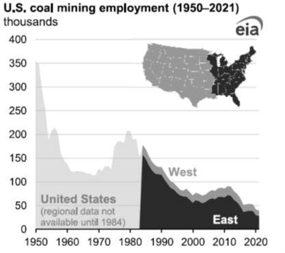

## Table of Contents

## What is the coal industry?

The coal industry involves mining coal from the earth and using it to make energy. Coal is a black rock that can be burned to create heat. This heat can then be used to make electricity in power plants. People have been using coal for a long time because it is a good source of energy and can be found in many places around the world.

However, the coal industry also has problems. When coal is burned, it releases smoke and gases that can pollute the air and harm the environment. This pollution can make the air dirty and cause health problems for people. Because of these issues, many countries are trying to use less coal and find cleaner ways to make energy.

## How many people are employed in the coal industry worldwide?

The coal industry employs millions of people around the world. It's hard to know the exact number because it changes from year to year and depends on many things like how much coal people are using and where they are mining it. But, it's safe to say that many people work in coal mines, power plants, and other jobs related to coal.

In countries like China and India, where a lot of coal is used, many people work in the coal industry. In other places like the United States and Australia, the number of people working in coal has been going down as they use less coal and more clean energy. Even though the number of jobs in coal is shrinking in some places, it's still a big part of the world's energy and many people depend on it for their jobs.

## What are the different job roles in the coal industry?

In the coal industry, there are many different jobs that people do. Some people work underground in coal mines. They are called miners and their job is to dig out the coal from the earth. There are also people who work on the surface of the mine, like machine operators who use big machines to move the coal around. Engineers and geologists also work in coal mines to make sure the mining is done safely and efficiently. They plan where to dig and how to keep the mine safe.

Other jobs in the coal industry are not in the mines but are still very important. For example, truck drivers transport the coal from the mines to power plants or ports. At the power plants, workers like plant operators and technicians turn the coal into electricity. There are also people who work in offices, like managers who plan and run the business side of the coal industry. They make sure everything runs smoothly and that the coal gets to where it needs to go.

Lastly, there are jobs that focus on the environment and safety. Safety inspectors make sure that the mines and power plants are following the rules to keep workers safe. Environmental scientists work to reduce the harm that coal mining and burning can do to the environment. They help find ways to clean up the pollution and make the coal industry less harmful to the planet.

## What qualifications are needed to work in the coal industry?

To work in the coal industry, the qualifications you need can be different depending on the job. For jobs like mining or operating machines, you usually need a high school diploma or equivalent. You might also need to go through training programs that teach you how to do the job safely and well. Some jobs, like being a truck driver, need a special license to drive big trucks. For these jobs, being in good physical shape and able to follow safety rules is very important.

For more technical jobs, like engineers or geologists, you need more education. You usually need a college degree in engineering, geology, or a related field. These jobs involve planning and making sure the mining is done safely and efficiently. For office jobs like managers, you might need a degree in business or a related field, and experience in running a business. 

For jobs that focus on safety and the environment, like safety inspectors or environmental scientists, you need specific training or education. Safety inspectors need to know the rules and laws about safety in mines and power plants. Environmental scientists need a degree in environmental science or a related field to help reduce the harm from coal mining and burning.

## How has employment in the coal industry changed over the last decade?

Over the last decade, employment in the coal industry has gone down in many countries. This is because more people are using other kinds of energy like wind, solar, and natural gas. These are cleaner and sometimes cheaper than coal. In countries like the United States and parts of Europe, the number of people working in coal mines and power plants has dropped a lot. This is because governments and companies are trying to use less coal to help the environment.

In some other countries, like China and India, the change has been different. These countries still use a lot of coal, so the number of people working in the coal industry has not dropped as much. But even in these places, there is a slow move towards using less coal. This means that over time, the number of jobs in the coal industry might go down there too. Overall, the trend around the world is that fewer people are working in the coal industry than ten years ago.

## What are the working conditions like in coal mines?

Working in coal mines can be tough and dangerous. Miners often work underground in dark, cramped spaces. They have to wear special gear to protect themselves from dust and falling rocks. The air can be hot and hard to breathe. There are also risks of accidents like cave-ins or gas explosions. Miners need to be very careful and follow safety rules to stay safe.

The hours can be long, and the work is hard on the body. Miners might have to lift heavy things and use big machines. The job can be tiring and sometimes they have to work shifts that start early in the morning or late at night. Even though the pay can be good, the hard work and danger make it a challenging job. 

To make things better, there are laws and rules to protect miners. Companies have to follow these rules to keep the mines safe. There are also safety inspectors who check the mines to make sure everything is okay. But even with all these efforts, working in a coal mine is still a tough job.

## What safety measures are implemented in the coal industry?

In the coal industry, many safety measures are put in place to protect workers. Miners wear protective gear like hard hats, safety glasses, and special masks to keep dust out of their lungs. They also use tools and machines that are made to be safe. For example, there are systems to detect dangerous gases and alarms to warn miners if something is wrong. Mines have strong supports to stop the roof from falling in, and there are rules about how to dig safely.

Safety training is very important too. Miners go through training to learn how to do their jobs without getting hurt. They practice what to do in emergencies, like if there is a fire or a cave-in. Safety inspectors visit the mines regularly to check that everything is being done right. They make sure the rules are followed and that the mine is safe for everyone working there.

## How does automation affect employment in the coal industry?

Automation in the coal industry means using machines to do jobs that people used to do. This can change the number of jobs available. Machines can do things like digging coal or moving it around faster and without getting tired. Because of this, companies might need fewer people to do the same amount of work. This can lead to fewer jobs for miners and other workers in the coal industry.

Even though automation can reduce the number of jobs, it can also make the work safer. Machines can do dangerous jobs that might hurt people. This means fewer accidents and injuries for workers. But, it also means that the people who are left working need to learn how to use and fix these new machines. So, while automation can cut down on some jobs, it can also create new kinds of jobs that need different skills.

## What are the environmental impacts of the coal industry on employment?

The coal industry can affect jobs because of its impact on the environment. When coal is mined and burned, it can pollute the air and water. This pollution can make people sick and harm the places where they live. Because of this, governments and people are trying to use less coal and more clean energy like wind and solar. When people use less coal, the coal industry needs fewer workers. This means fewer jobs for people in coal mines and power plants.

But, the move to clean energy can also create new jobs. People are needed to build and run wind farms, solar panels, and other clean energy projects. These new jobs can help people who used to work in the coal industry find work in other areas. So, while the coal industry might lose jobs because of environmental concerns, other parts of the energy industry can grow and provide new opportunities for workers.

## How do government policies influence employment in the coal industry?

Government policies can have a big impact on jobs in the coal industry. When governments make rules to reduce pollution and use less coal, it can mean fewer jobs in coal mines and power plants. For example, if a government sets strict limits on how much coal can be burned, coal companies might need to close some mines or power plants. This leads to fewer people being needed to work in the coal industry. Also, if the government gives money or other help to clean energy projects like wind or solar, it can make coal less popular and lead to even fewer coal jobs.

On the other hand, some government policies can help keep coal jobs. If a government wants to protect the coal industry, it might give money or other support to coal companies. This can help keep mines and power plants open, which means more jobs for coal workers. But, even with this help, the overall trend is often towards using less coal. So, while government policies can slow down the loss of coal jobs, they can't always stop it completely.

## What are the future job prospects in the coal industry?

The future job prospects in the coal industry look like they will keep going down. More and more countries are trying to use less coal because it's bad for the environment. They are using cleaner energy like wind, solar, and natural gas instead. This means fewer people will be needed to work in coal mines and power plants. Even if some governments try to help the coal industry with money or other support, the trend is still towards using less coal. So, people looking for jobs in the coal industry might find fewer opportunities in the future.

But, the move to clean energy can also create new jobs. People who used to work in coal can learn new skills and find work in other parts of the energy industry. For example, they can help build and run wind farms or solar panels. Governments and companies are trying to help coal workers find these new jobs by offering training programs. So, while the coal industry itself might not have as many jobs in the future, there can still be good job prospects in the energy sector if workers are willing to learn and change.

## How do economic factors globally impact employment in the coal industry?

Economic factors around the world can change how many people work in the coal industry. When the world economy is doing well, countries might use more energy, including coal. This can mean more jobs in coal mines and power plants because they need more people to dig up and burn the coal. But, if the economy is not doing well, countries might use less energy. This can lead to fewer jobs in the coal industry because there is less need for coal.

Another big economic [factor](/wiki/factor-investing) is the price of coal. If coal is cheap, it can be a good choice for making energy, and this can mean more jobs in the coal industry. But, if coal becomes more expensive, countries might choose other kinds of energy that are cheaper. This can lead to fewer jobs in coal mines and power plants. Also, if other energy sources like natural gas or renewables become cheaper, countries might switch to these, which can also reduce the number of coal jobs.

## References & Further Reading

[1]: U.S. Bureau of Labor Statistics. (2021). ["Employment in the Coal Mining Industry."](https://www.bls.gov/oes/current/naics4_212100.htm)

[2]: U.S. Environmental Protection Agency. ["Clean Air Act."](https://www.epa.gov/clean-air-act-overview/clean-air-act-text)

[3]: West Virginia State Department of Labor. (2020). ["Coal Mining Employment Statistics."](https://minesafety.wv.gov/historical-statistical-data/)

[4]: International Energy Agency. (2022). ["World Energy Outlook 2022."](https://www.iea.org/reports/world-energy-outlook-2022)

[5]: U.S. Department of Energy. (2021). ["Wind and Solar Energy Policies."](https://www.energy.gov/policy/articles/us-department-energy-office-policy-putting-clean-energy-front-and-center-2021-year)