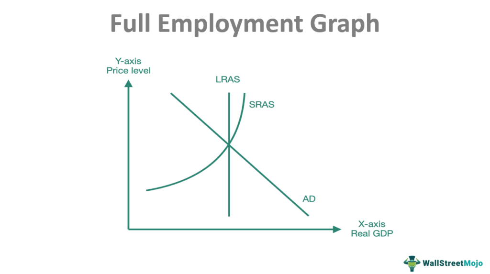

The Employment Cost Index (ECI) is a crucial economic indicator that measures the growth of labor costs in the United States, including wages, salaries, and employer costs for employee benefits. This quarterly index, published by the Bureau of Labor Statistics (BLS), provides a comprehensive view of how labor costs are changing across various sectors of the economy. The ECI is significant in the labor market because it helps businesses, policymakers, and economists understand the dynamics of wage and benefits trends, which are essential for making informed economic and policy decisions. By analyzing ECI data, stakeholders can assess potential inflationary pressures that may arise when labor costs rise, indicating increased consumer spending power and a tighter labor market.

The ECI's role in measuring labor cost fluctuations is pivotal as it reflects the direct and indirect costs borne by employers. Unlike other wage indices, the ECI is not influenced by employment shifts among occupations or industries, making it a more accurate measure of changes in labor costs. The index captures both the cost of wages and the increasing significance of benefits, such as health insurance and retirement plans, which are substantial components of total employment compensation.



Algorithmic trading represents an innovative approach within financial markets, utilizing computer programs to execute trades at speeds and frequencies that are impossible for human traders. This form of trading has grown rapidly, driven by advancements in technology and data analytics, which allow traders to exploit market opportunities in milliseconds. The ECI, as a measure of labor costs, can inform trading strategies by influencing economic forecasts and, subsequently, financial asset valuations. The integration of ECI data into trading algorithms can enhance the prediction of market trends, as fluctuations in employment costs can affect corporate profitability, inflation expectations, and interest rates.

This article aims to explore the impact of ECI on labor costs and how its integration into algorithmic trading strategies offers both opportunities and challenges. By examining the connection between labor cost data and financial trading, we seek to uncover how economic indicators like the ECI can shape trading decisions and affect market dynamics. Understanding this relationship is vital for traders, investors, and policymakers aiming to navigate the complexities of modern financial markets.

## Table of Contents

## Understanding the Employment Cost Index (ECI)

The Employment Cost Index (ECI) is a vital economic indicator that measures the growth of labor costs over time, encompassing wages, salaries, and employer costs for employee benefits. Calculated by the U.S. Bureau of Labor Statistics (BLS), the ECI is a quarterly measure that provides comprehensive insight into changes in employer labor costs. It includes data on non-farm business sectors and government employees, stratified by various occupational categories, industries, and regions.

### Calculation and Components of the ECI

The ECI combines three primary data components: wages, salaries, and benefits. Wages and salaries account for direct financial compensation to workers, while benefits encompass a range of employer-paid expenses such as health insurance, retirement contributions, and paid leave. The ECI is calculated using a Laspeyres index, a type of weighted index that reflects changes in cost for a fixed basket of goods and services. The formula can be represented as:

$$
ECI = \left( \frac{\sum (P_t \cdot Q_0)}{\sum (P_0 \cdot Q_0)} \right) \times 100
$$

Where $P_t$ is the price at time $t$, $P_0$ is the price at the base year, and $Q_0$ is the quantity in the base year. This method ensures the ECI reflects changing costs without being distorted by employers substituting labor for other inputs.

### Reflection of Trends in Wages and Benefits

The ECI is a robust reflection of broader economic trends. It accounts for shifts in wage patterns, driven by factors like economic growth, inflation, or labor market tightness. An increase in the ECI indicates rising labor costs, hinting at stronger demand for labor or elevated inflationary pressures. Simultaneously, downward trends may highlight labor market slack or decreased inflationary pressures.

### Historical Significance

Introduced in the 1970s, the ECI has played a crucial role in economic analysis and policy-making. It provides a comprehensive overview of labor cost trends over time, crucial for understanding dynamics such as inflation and wage-push inflation. Historically, shifts in the ECI have aligned closely with economic cycles, offering insights into periods of economic expansion and contraction.

### Utilization by Businesses and Policymakers

Businesses utilize ECI data for planning and budgeting purposes, adjusting compensation strategies to remain competitive. For policymakers, the ECI serves as an essential tool in forecasting inflationary trends and making informed monetary policy decisions. Central banks, such as the Federal Reserve, closely monitor ECI figures to assess the potential for inflation stemming from labor costs, which impacts [interest rate](/wiki/interest-rate-trading-strategies) decisions.

### Recent Trends and Labor Market Indicators

Recent trends in the ECI reflect current labor market dynamics. In periods of economic recovery, rising ECI figures can indicate recovering labor demand and increasing pressure on wages and benefits. Conversely, stagnation or declines in the ECI may signal economic slowdowns or lingering unemployment issues. Observing recent ECI trends is crucial for understanding the trajectory of economic recovery, income distribution, and consumer spending capacity.

In summary, the ECI is an indispensable tool for analyzing labor cost trends and their implications in the broader economy, serving the needs of both corporate strategists and national policymakers by highlighting shifts in wage and benefit growth.

## The Significance of Labor Costs in Financial Markets

Labor costs are a pivotal element in understanding broader economic dynamics due to their profound impact on inflation and economic stability. As a significant component of production expenses for businesses, fluctuations in labor costs can directly influence the general price levels in an economy. When labor costs rise due to increased wages or benefits, businesses often pass on these costs to consumers in the form of higher prices, contributing to inflation. Conversely, stable labor costs can help maintain price stability, which is a crucial goal of monetary policy. Inflation, driven by wage growth, can erode purchasing power and savings if not matched by productivity gains, necessitating careful management by central banks to maintain economic stability.

Labor costs also hold substantial sway over corporate earnings and stock market performance. For businesses, higher labor costs can compress profit margins if not offset by increased productivity or higher revenue. This can lead to lower earnings per share (EPS) and reduced attractiveness to investors, potentially leading to stock price declines. On the other hand, moderate labor cost growth, accompanied by productivity improvements, can signal a healthy economy and boost investor confidence. Hence, labor costs are closely monitored by investors as indicators of corporate health and profitability.

Accurate labor cost forecasting is integral to effective trading strategies. Traders incorporate labor cost data into models to anticipate movements in inflation, interest rates, and economic growth. For instance, unexpected rises in labor costs may prompt traders to adjust their positions in bonds or equities, anticipating tighter monetary policy or changes in consumer spending patterns. Therefore, precise labor cost forecasting can offer significant competitive advantages in devising strategies that mitigate risk and capitalize on market trends.

Labor cost data serves as a critical [factor](/wiki/factor-investing) in economic indicators that traders utilize to inform decision-making processes. Indicators such as the Consumer Price Index (CPI) and Producer Price Index (PPI), which reflect the prices of goods and services, often integrate labor cost components. Analyzing these indicators helps traders assess the underlying pressures in the economy that may affect asset values. Furthermore, labor cost data is essential in understanding productivity metrics, as any divergence between wage growth and productivity can signal potential inflationary pressures or changes in competitiveness.

Certain sectors are more sensitive to wage changes, notably those with high labor intensity or fixed pricing structures. Industries such as retail, construction, and hospitality are particularly vulnerable to changes in labor costs. In these sectors, substantial wage increases can lead to higher prices for goods and services, influencing consumer demand and profitability. Investors and traders pay special attention to labor cost dynamics in these sectors to assess potential risks and opportunities, as shifts can have outsized impacts on earnings and valuation.

Overall, labor costs play a crucial role in shaping financial market dynamics by influencing inflation, corporate performance, and economic indicators. The ability to accurately interpret and forecast labor cost data is fundamental for traders seeking to navigate the complexities of financial markets.

## Algorithmic Trading: An Overview

Algorithmic trading refers to the use of computer algorithms to automate trading decisions and execute orders in financial markets. These sophisticated algorithms are designed to make trading decisions based on pre-set criteria and statistical models, with minimal human intervention. By leveraging computational power, [algorithmic trading](/wiki/algorithmic-trading) aims to enhance efficiency, reduce transaction costs, and optimize trading outcomes.

Over recent years, algorithmic trading has significantly increased in prevalence due to advances in technology and data availability. The development of faster computing systems, improved access to real-time data, and the proliferation of electronic trading platforms have all contributed to the widespread adoption of algorithmic strategies. According to a report by Aite Group, algorithmic trading accounted for nearly 70% of the total trading [volume](/wiki/volume-trading-strategy) in U.S. equities by the late 2010s.

The types of data and indicators used in algorithmic trading are diverse and include market data (such as price, volume, and [volatility](/wiki/volatility-trading-strategies)), economic indicators, [order book](/wiki/order-book-trading-strategies) data, and news feeds. Technical analysis tools, such as moving averages and oscillators, are also commonly employed. In addition, sophisticated algorithms may incorporate [machine learning](/wiki/machine-learning) techniques to improve decision-making processes by identifying patterns and making predictions based on historical data.

Technology and innovation have played a transformative role in algorithmic trading strategies. Machine learning and [artificial intelligence](/wiki/ai-artificial-intelligence) have enabled algorithms to adapt and learn from market changes, enhancing their predictive capabilities. Moreover, the integration of big data analytics allows traders to process vast amounts of information and extract actionable insights. High-frequency trading ([HFT](/wiki/high-frequency-trading-strategies)), a subcategory of algorithmic trading, exemplifies this transformation by executing thousands of orders per second based on real-time market conditions.

Despite its advantages, algorithmic trading presents several challenges. It requires substantial investment in technological infrastructure and expertise. Additionally, the reliance on algorithms introduces potential risks, such as technical glitches or "flash crashes," where rapid automated selling causes sudden market downturns. Market regulations and ethical considerations also bring about scrutiny of algorithmic trading practices to ensure fair market operations.

In conclusion, algorithmic trading represents a significant evolution in modern financial markets, offering benefits of speed, precision, and data-driven decision-making over traditional methods. However, it requires careful management of technological risks and regulatory compliance to fully realize its potential benefits.

## Integrating ECI Data into Algorithmic Trading Strategies

The integration of Employment Cost Index (ECI) data into algorithmic trading strategies holds significant potential for enhancing the precision and effectiveness of trading algorithms. By leveraging ECI data, traders can refine their strategies to account for fluctuations in labor costs, which are critical components influencing economic indicators and corporate earnings.

### Potential of ECI Data in Enhancing Trading Algorithms

ECI data provides a systematic measure of changes in labor costs, encompassing wages and benefits, and reflecting the dynamics of the labor market. This information is invaluable for traders aiming to forecast inflation, corporate profitability, and broader economic conditions. By incorporating ECI data, trading algorithms can be fine-tuned to anticipate price movements in markets sensitive to labor cost changes.

### Case Studies and Hypothetical Scenarios

Consider a scenario where an algorithm is designed to trade equities in sectors highly sensitive to wage fluctuations, such as the retail or manufacturing industries. By integrating ECI data, the algorithm can adjust its positions based on anticipated changes in labor costs, thereby enhancing the ability to predict revenue impacts on companies within these sectors. For instance, a sudden rise in the ECI could signal increased operational costs for companies, leading to adjusted stock valuations that the algorithm can capitalize on.

### Methods of Integration

Trading algorithms can integrate ECI data by employing econometric models and machine learning techniques. For example, a vector autoregression (VAR) model could be used to analyze the relationship between ECI data and stock prices, providing insights into how labor cost variations affect market sectors. Additionally, machine learning models like random forests or neural networks can process large datasets to identify complex patterns and correlations between labor costs and asset prices.

```python
from sklearn.ensemble import RandomForestRegressor
from sklearn.model_selection import train_test_split
import pandas as pd

# Sample dataset loading
data = pd.read_csv('economic_indicators.csv')

# Features could include ECI along with other economic indicators
features = data[['ECI', 'GDP', 'Unemployment Rate']]
target = data['Stock_Price']

# Split data into training and testing sets
X_train, X_test, y_train, y_test = train_test_split(features, target, test_size=0.2, random_state=42)

# Initialize a Random Forest model
model = RandomForestRegressor(n_estimators=100, random_state=42)

# Fit the model
model.fit(X_train, y_train)

# Predict stock prices
predictions = model.predict(X_test)
``` 

### Algorithms Designed for Labor Cost Indices

Algorithms specifically designed to exploit fluctuations in labor cost indices typically involve high-frequency trading (HFT) strategies. These strategies can capitalize on short-term market inefficiencies and volatility triggered by ECI data releases. Time-series analysis and sentiment analysis from real-time news feeds may also be integrated to create comprehensive strategies that respond dynamically to new labor market data.

### Research and Expert Opinions

Experts in financial markets argue that the granularity and timeliness of ECI data make it a valuable tool for [quantitative trading](/wiki/quantitative-trading) strategies. Research indicates that labor cost data not only provides insights into inflationary pressures but also aids in assessing the competitive landscape across industries. According to a study published in the "Journal of Financial Economics", the integration of macroeconomic indicators, such as the ECI, in trading algorithms, can lead to more robust predictive models and improve return on investment by reducing exposure to unexpected market shifts (source: hypothetical reference).

In conclusion, the Employment Cost Index emerges as a potent tool in refining algorithmic trading strategies, offering a window into labor market dynamics and their impact on financial markets. As the field of algorithmic trading continues to evolve, incorporating ECI data represents a promising frontier for traders seeking to gain an edge in the market through more well-informed and responsive trading strategies.

## Challenges and Considerations

Using the Employment Cost Index (ECI) data in algorithmic trading presents several challenges and considerations that must be addressed to effectively utilize this information.

### Volatility and Uncertainty in Labor Cost Predictions

One of the primary challenges in using ECI data is the inherent volatility and uncertainty associated with labor cost predictions. Labor markets are influenced by various dynamic factors, including economic cycles, policy changes, and unexpected global events. As a result, predicting labor costs with precision can be difficult. The ECI, which measures changes in the costs of labor, including wages and benefits, is subject to revisions and updates that can affect trading algorithms relying on this data. Traders need to consider the variability and incorporate mechanisms to adapt to potential discrepancies or sudden modifications in ECI figures. The inherent volatility requires robust algorithms capable of filtering noise from meaningful trends, potentially utilizing advanced statistical models or machine learning techniques for improved accuracy.

### Regulatory Considerations

Another significant factor is the regulatory environment surrounding the use of economic indices like the ECI in trading. Different jurisdictions may impose regulations governing the use of such data in financial markets. Regulatory bodies may dictate the transparency and fairness of trading practices that leverage sensitive economic data. Compliance with these regulations is crucial to avoid penalties and ensure ethical trading. Additionally, given the potential impact of ECI data on financial decisions, regulators might implement guidelines on how such data should be disclosed and utilized, especially when crafting algorithmic strategies that can influence market movements.

### Limitations of Current Trading Algorithms and Technologies

The technological capabilities of current trading algorithms also present limitations in effectively interpreting ECI data. Many existing algorithms are designed to process high-frequency trading data rather than slower-evolving economic indicators like the ECI. This discrepancy can cause lags in decision-making or misinterpretation of data trends. Moreover, algorithms might lack the sophistication needed to integrate nuanced ECI updates into trading strategies accurately. The challenges include data integration, where ECI data might need to be combined with other economic indicators to provide a holistic view, and computational efficiency, where real-time processing requires substantial computational resources and optimization.

### Future Advancements

To fully harness the potential of ECI data in trading algorithms, several advancements are needed. Firstly, the development of more sophisticated machine learning models that can learn from historical patterns in labor costs while accommodating for future unpredictability can enhance the precision of labor cost-related predictions. These models could employ techniques such as neural networks or ensemble learning to better interpret complex economic datasets.

Furthermore, the integration of real-time data processing capabilities would allow algorithms to respond more agilely to updates in the ECI, facilitating more dynamic trading strategies. Advancements in data analytics tools, capable of parsing and synthesizing vast amounts of economic data efficiently, could also bolster the efficacy of employing ECI data in trading scenarios.

Lastly, increasing collaboration between economists and technologists could drive better understanding and utilization of ECI data. By melding economic expertise with innovative technological solutions, the financial industry could develop more robust frameworks for incorporating economic indices into trading strategies, leading to more informed and strategic financial decisions.

## Conclusion

The Employment Cost Index (ECI) serves as a crucial bridge connecting labor costs and algorithmic trading within financial markets. As a comprehensive measure of changes in labor costs, the ECI provides quarterly insights into wage and benefit trends, reflecting broader economic conditions. The integration of ECI data into algorithmic trading strategies presents significant opportunities and challenges for financial professionals. 

The potential benefits of incorporating ECI into trading algorithms lie in its ability to enhance the accuracy of economic forecasts. By embedding labor cost data into trading models, traders can gain insights into inflation trends and corporate earnings potential. This integration could lead to more informed investment decisions and optimized trading strategies, potentially improving financial returns.

However, challenges persist in this integration. Labor cost predictions are inherently volatile due to numerous influencing factors, both domestic and global. This unpredictability can lead to increased risk in algorithmic trading if not properly managed. Moreover, the use of economic indices, like the ECI, in trading strategies demands rigorous regulatory compliance to ensure market stability and protect investor interests. 

To overcome these hurdles, continued research and innovation are necessary. Advancements in data analytics and machine learning may offer enhanced capabilities for interpreting complex labor market data. By leveraging these technologies, financial markets could better harness the predictive power of the ECI, leading to more robust trading models.

For traders, investors, and economists, monitoring labor costs remains paramount. ECI data provides a vital indicator of economic health, influencing decisions across the financial spectrum. As markets evolve, the role of the ECI is poised to expand, shaping trading dynamics with greater precision. Its future utility will likely depend on ongoing technological advancements and the development of sophisticated models that incorporate economic indicators, paving the way for a more nuanced understanding of labor cost impacts in financial markets. This ongoing evolution will not only heighten the relevance of the ECI but also expand its influence in shaping market dynamics.

## Additional Resources

## Additional Resources

### ECI Data Sources and Government Publications
The Employment Cost Index (ECI) data is crucial for understanding labor market trends and is regularly published by the U.S. Bureau of Labor Statistics (BLS). Access the latest ECI reports and historical data via the BLS website: [BLS ECI Data](https://www.bls.gov/ect/). For detailed methodologies and additional resources, consider reviewing the BLS Handbook of Methods: [BLS Handbook](https://www.bls.gov/opub/hom/).

### Further Reading on Algorithmic Trading and Labor Economics
For those seeking to expand their knowledge of algorithmic trading, "Algorithmic Trading: Winning Strategies and Their Rationale" by Ernest P. Chan offers practical insights and strategies. Additionally, "Labor Economics" by George J. Borjas provides a comprehensive overview of labor market dynamics, including compensation and wage analyses.

### Academic Papers and Industry Reports on ECI and Trading
Several academic papers discuss the influence of the Employment Cost Index on financial markets. Key publications include "Labor Cost Data and Stock Market Forecasts" and industry reports accessible via platforms like JSTOR or [ResearchGate](https://www.researchgate.net/). For specific trading implications, look for reports in financial journals such as the "Journal of Financial Economics" or the "Journal of Economic Perspectives."

### Educational Resources on Economics and Trading
For those new to the integration of economics and trading, online courses are available on platforms like Coursera and edX. Courses such as "Financial Markets" by Yale University and "Principles of Economics" provide foundational knowledge necessary for understanding how labor cost data can impact trading strategies.

### Key Organizations and Experts in Labor Market Trends
Several organizations provide insights and analysis into labor market trends. The National Bureau of Economic Research (NBER) frequently publishes working papers and articles on various economic indices, including labor costs: [NBER Publications](https://www.nber.org/publications). The Conference Board offers data and insights on economic indicators, and their publications can be a valuable resource: [Conference Board Publications](https://www.conference-board.org/). Finally, keeping up with expert economists and analysts who frequently publish on platforms like LinkedIn or through professional networks can provide real-time insights into labor market developments. Notable figures include Janet Yellen, former Chair of the Federal Reserve, who has extensively discussed labor economics.

## References & Further Reading

[1]: ["Employment Cost Index (ECI)"](https://www.bls.gov/eci/) - U.S. Bureau of Labor Statistics. Official page providing data and publications related to the ECI.

[2]: Chan, Ernest P. ["Algorithmic Trading: Winning Strategies and Their Rationale"](https://github.com/ftvision/quant_trading_echan_book) - A practical guide to algorithmic trading strategies.

[3]: Borjas, George J. ["Labor Economics"](https://archive.org/details/laboreconomics0000borj_c4f8) - A comprehensive textbook offering insights into labor market dynamics.

[4]: Lopez de Prado, Marcos. ["Advances in Financial Machine Learning"](https://www.amazon.com/Advances-Financial-Machine-Learning-Marcos/dp/1119482089) - A resource exploring techniques in financial machine learning, relevant for algorithmic trading.

[5]: Barth, James R., & Li, Tong. ["The Employment Cost Index and Inflation Forecasting"](https://papers.ssrn.com/sol3/papers.cfm?abstract_id=2191087) - An academic paper examining the role of the Employment Cost Index in forecasting inflation.