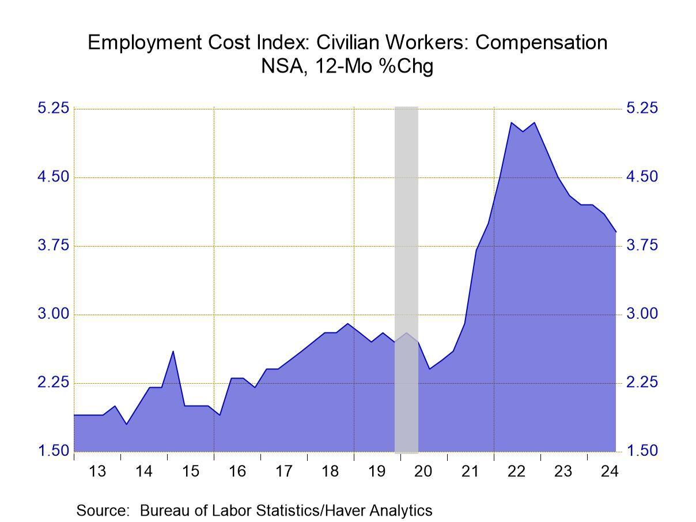

## Table of Contents

## What is the Employment Cost Index (ECI)?

The Employment Cost Index (ECI) is a report that measures how much it costs for companies to employ workers. It looks at things like wages, salaries, and benefits that employers give to their employees. The ECI is important because it helps us understand how the cost of labor is changing over time. It is released every three months by the U.S. Bureau of Labor Statistics.

The ECI is different from other measures because it focuses on the cost of labor for the employer, not just what employees take home. It also tries to show changes in the cost of labor without being affected by changes in the types of jobs people have. This makes the ECI a useful tool for economists and policymakers to see trends in labor costs across different industries and regions.

## Who publishes the Employment Cost Index?

The Employment Cost Index is published by the U.S. Bureau of Labor Statistics. This is a part of the U.S. Department of Labor. They are in charge of collecting and sharing information about the American workforce.

The ECI comes out every three months. It helps people understand how much it costs for businesses to pay their workers. This includes wages, salaries, and benefits. The Bureau of Labor Statistics makes sure the information is accurate and useful for everyone who needs it.

## How often is the Employment Cost Index released?

The Employment Cost Index, or ECI, is released every three months. This means it comes out four times a year. It helps people understand how the cost of hiring workers is changing.

The U.S. Bureau of Labor Statistics is the group that puts out the ECI. They collect data on wages, salaries, and benefits that companies pay their employees. This information is important for businesses, economists, and policymakers to see trends in labor costs.

## What types of compensation does the ECI measure?

The Employment Cost Index, or ECI, measures different types of compensation that employers give to their workers. It looks at wages, which is the money employees earn for their work. It also includes salaries, which are similar to wages but usually paid on a yearly basis instead of hourly.

Besides wages and salaries, the ECI also measures the cost of benefits that employers provide. These benefits can include things like health insurance, retirement plans, and paid time off. By looking at both wages/salaries and benefits, the ECI gives a complete picture of what it costs companies to employ people.

The ECI is important because it helps us see how the total cost of hiring workers is changing over time. It includes all kinds of jobs and industries, so it gives a broad view of labor costs across the whole country. This information is useful for businesses planning their budgets and for economists studying the economy.

## How is the ECI calculated?

The Employment Cost Index, or ECI, is calculated by looking at changes in the cost of labor for companies. The U.S. Bureau of Labor Statistics collects data from a sample of jobs across different industries and regions. They track how much employers are paying in wages, salaries, and benefits over time. To make the ECI accurate, they use a method called "fixed employment weights." This means they keep the types of jobs they look at the same, so changes in the ECI show real changes in labor costs, not just shifts in the kinds of jobs people have.

The ECI is updated every three months. When calculating the ECI, the Bureau of Labor Statistics looks at both private industry and government jobs. They also separate the data into different categories, like wages and salaries versus benefits, and by industry. This helps give a detailed picture of how labor costs are changing. The ECI is important because it helps businesses, economists, and policymakers understand trends in labor costs and make informed decisions.

## Why is the ECI important for understanding labor costs?

The Employment Cost Index, or ECI, is important because it helps us see how much it costs companies to hire workers. It looks at wages, salaries, and benefits, giving a full picture of labor costs. By tracking these costs over time, the ECI shows us if it's getting more or less expensive for businesses to employ people. This information is useful for companies when they are planning their budgets. They can see if they need to adjust what they pay their workers or change their benefits.

The ECI is also helpful for economists and policymakers. It gives them a clear view of labor costs across different industries and regions. This helps them understand how the economy is doing and make decisions about things like interest rates or laws that affect workers. Because the ECI uses fixed employment weights, it shows real changes in labor costs, not just changes in the types of jobs people have. This makes the ECI a reliable tool for understanding trends in the labor market.

## How does the ECI differ from other wage and salary measures?

The Employment Cost Index, or ECI, is different from other wage and salary measures because it looks at the total cost of labor for employers, not just what workers take home. Other measures might focus only on wages and salaries, but the ECI includes benefits like health insurance and retirement plans. This gives a fuller picture of what it costs companies to hire people.

Another big difference is that the ECI uses something called "fixed employment weights." This means it keeps the types of jobs it looks at the same over time. So, changes in the ECI show real changes in labor costs, not just changes in the kinds of jobs people have. Other wage measures might change with the job market, which can make it hard to see the true trends in labor costs. The ECI's method helps it give a more stable and accurate view of how much it costs to employ workers.

## What are the main components of the ECI?

The Employment Cost Index, or ECI, has two main parts: wages and salaries, and benefits. Wages and salaries are the money that workers earn for their work. This can be hourly wages or yearly salaries. Benefits are things like health insurance, retirement plans, and paid time off that employers give to their employees. Both parts are important because they show the full cost of hiring workers.

The ECI is different because it looks at the total cost for employers, not just what workers take home. It also uses something called "fixed employment weights." This means the ECI keeps the types of jobs it looks at the same, so it shows real changes in labor costs. Other measures might change with the job market, but the ECI gives a clear picture of how much it costs to employ people.

## How can the ECI be used to forecast inflation?

The Employment Cost Index, or ECI, can be used to forecast inflation because it shows how much it costs for companies to pay their workers. When the ECI goes up, it means that companies are spending more on wages, salaries, and benefits. This can lead to higher prices for goods and services because businesses might raise prices to cover their higher labor costs. By watching the ECI, economists can see if labor costs are going up and predict if inflation might follow.

The ECI is especially useful for forecasting inflation because it uses fixed employment weights. This means it looks at the same types of jobs over time, so changes in the ECI show real changes in labor costs. Other measures might change with the job market, but the ECI gives a clear and stable picture. When the ECI shows that labor costs are rising steadily, it can be a sign that inflation might increase in the future. This information helps businesses, policymakers, and economists plan for what might happen with prices.

## What are the limitations of the ECI as an economic indicator?

The Employment Cost Index, or ECI, is a useful tool for understanding labor costs, but it has some limitations. One big limitation is that it only comes out every three months. This means it might not show changes in labor costs that happen quickly. If something big happens in the economy, the ECI might not show it right away because it takes time to collect and report the data.

Another limitation is that the ECI might not catch all the changes in the job market. It uses fixed employment weights, which means it looks at the same types of jobs over time. But the job market can change a lot, with new types of jobs appearing and old ones disappearing. If the ECI doesn't include these new jobs, it might not give a complete picture of labor costs. Also, the ECI looks at the cost for employers, not what workers take home after taxes and other deductions, so it might not show the full story for employees.

## How do policymakers use the ECI in decision-making?

Policymakers use the Employment Cost Index, or ECI, to help them make decisions about the economy. They look at the ECI to see if the cost of hiring workers is going up or down. This helps them understand if businesses might need to raise prices to cover higher labor costs, which can lead to inflation. If the ECI shows that labor costs are rising a lot, policymakers might decide to raise interest rates to slow down the economy and keep prices from going up too fast.

The ECI also helps policymakers see trends in different industries and regions. They can use this information to make laws or policies that help workers and businesses. For example, if the ECI shows that health benefits are getting more expensive, policymakers might work on making health care more affordable. By using the ECI, policymakers can make better choices about how to manage the economy and support both workers and companies.

## What advanced statistical methods are used to analyze ECI data?

To analyze the Employment Cost Index, or ECI, data, economists use advanced statistical methods like regression analysis. This method helps them see how different things, like industry type or region, affect labor costs. They can use regression to find out if changes in the ECI are because of wages going up, benefits getting more expensive, or other reasons. This helps them understand the data better and make more accurate predictions about future labor costs.

Another method they use is time series analysis. This looks at how the ECI changes over time. By studying past data, economists can spot patterns and trends. They can see if labor costs are going up slowly or quickly, and if there are any big changes that happen regularly. Time series analysis helps them forecast what might happen with labor costs in the future, which is important for planning and making decisions.

Economists also use something called index number theory to work with the ECI. This method helps them compare labor costs over time and across different groups. They can see how much labor costs have changed from one period to another, and how costs in one industry compare to another. Index number theory makes sure the ECI gives a clear and accurate picture of labor costs, which is important for understanding the economy.

## What is the Employment Cost Index (ECI) and how is it understood?

The Employment Cost Index (ECI) is a vital economic indicator that measures the growth of labor costs over time, encompassing wages, salaries, and employer costs for employee benefits. Calculated by the U.S. Bureau of Labor Statistics (BLS), the ECI is a quarterly measure that provides comprehensive insight into changes in employer labor costs. It includes data on non-farm business sectors and government employees, stratified by various occupational categories, industries, and regions.

### Calculation and Components of the ECI

The ECI combines three primary data components: wages, salaries, and benefits. Wages and salaries account for direct financial compensation to workers, while benefits encompass a range of employer-paid expenses such as health insurance, retirement contributions, and paid leave. The ECI is calculated using a Laspeyres index, a type of weighted index that reflects changes in cost for a fixed basket of goods and services. The formula can be represented as:

$$
ECI = \left( \frac{\sum (P_t \cdot Q_0)}{\sum (P_0 \cdot Q_0)} \right) \times 100
$$

Where $P_t$ is the price at time $t$, $P_0$ is the price at the base year, and $Q_0$ is the quantity in the base year. This method ensures the ECI reflects changing costs without being distorted by employers substituting labor for other inputs.

### Reflection of Trends in Wages and Benefits

The ECI is a robust reflection of broader economic trends. It accounts for shifts in wage patterns, driven by factors like economic growth, inflation, or labor market tightness. An increase in the ECI indicates rising labor costs, hinting at stronger demand for labor or elevated inflationary pressures. Simultaneously, downward trends may highlight labor market slack or decreased inflationary pressures.

### Historical Significance

Introduced in the 1970s, the ECI has played a crucial role in economic analysis and policy-making. It provides a comprehensive overview of labor cost trends over time, crucial for understanding dynamics such as inflation and wage-push inflation. Historically, shifts in the ECI have aligned closely with economic cycles, offering insights into periods of economic expansion and contraction.

### Utilization by Businesses and Policymakers

Businesses utilize ECI data for planning and budgeting purposes, adjusting compensation strategies to remain competitive. For policymakers, the ECI serves as an essential tool in forecasting inflationary trends and making informed monetary policy decisions. Central banks, such as the Federal Reserve, closely monitor ECI figures to assess the potential for inflation stemming from labor costs, which impacts [interest rate](/wiki/interest-rate-trading-strategies) decisions.

### Recent Trends and Labor Market Indicators

Recent trends in the ECI reflect current labor market dynamics. In periods of economic recovery, rising ECI figures can indicate recovering labor demand and increasing pressure on wages and benefits. Conversely, stagnation or declines in the ECI may signal economic slowdowns or lingering unemployment issues. Observing recent ECI trends is crucial for understanding the trajectory of economic recovery, income distribution, and consumer spending capacity.

In summary, the ECI is an indispensable tool for analyzing labor cost trends and their implications in the broader economy, serving the needs of both corporate strategists and national policymakers by highlighting shifts in wage and benefit growth.

## References & Further Reading

[1]: ["Employment Cost Index (ECI)"](https://www.bls.gov/eci/) - U.S. Bureau of Labor Statistics. Official page providing data and publications related to the ECI.

[2]: Chan, Ernest P. ["Algorithmic Trading: Winning Strategies and Their Rationale"](https://github.com/ftvision/quant_trading_echan_book) - A practical guide to algorithmic trading strategies.

[3]: Borjas, George J. ["Labor Economics"](https://archive.org/details/laboreconomics0000borj_c4f8) - A comprehensive textbook offering insights into labor market dynamics.

[4]: Lopez de Prado, Marcos. ["Advances in Financial Machine Learning"](https://www.amazon.com/Advances-Financial-Machine-Learning-Marcos/dp/1119482089) - A resource exploring techniques in financial machine learning, relevant for algorithmic trading.

[5]: Barth, James R., & Li, Tong. ["The Employment Cost Index and Inflation Forecasting"](https://papers.ssrn.com/sol3/papers.cfm?abstract_id=2191087) - An academic paper examining the role of the Employment Cost Index in forecasting inflation.