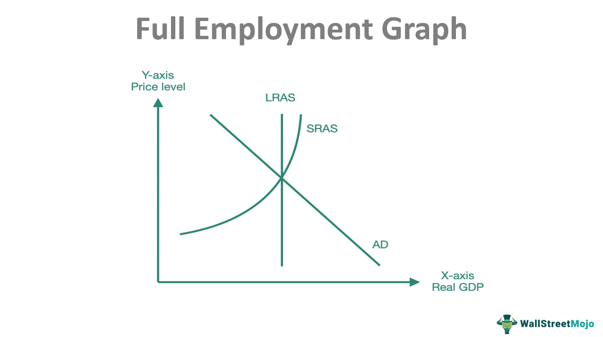

The intersection of economics and technology significantly influences modern job markets, fostering dynamic shifts in employment across various sectors. This interaction primarily stems from advancements in technology that have reshaped traditional economic roles, introducing new fields and methodologies. Among these technological innovations is algorithmic trading, a process that utilizes computer algorithms to execute trading decisions at speeds and frequencies beyond human capability. As a transformative force in financial markets, algorithmic trading offers substantial economic implications, such as increased market efficiency and liquidity.

Algorithmic trading encompasses the use of complex mathematical models and formulas to decide on the timing, price, and quantity of trade orders. By processing vast data sets and executing trades at optimal moments, algorithmic trading reduces transaction costs and improves accuracy in price forecasting. This paradigm shift not only impacts how financial markets operate but also broadens the scope of skills and professions required within these markets.



The potential for employment growth in sectors influenced by economic technology is considerable. As businesses increasingly rely on data-driven decision-making, demand for professionals skilled in financial analytics, data science, and computational economics continues to rise. The integration of algorithmic trading within economic applications has led to the creation of specialized roles and has fostered growth in sectors where technological fluency is paramount.

The purpose of this article is to explore the impact of algorithmic trading on economic applications and job market trends. Understanding these dynamics is crucial for professionals and aspirants in the field who wish to navigate and excel within these evolving landscapes. As technology continues to redefine economic paradigms, staying informed and adaptable will be essential for leveraging opportunities and mitigating challenges that arise from these advancements.

## Table of Contents

## Understanding Economic Applications in Job Markets

Economic applications in modern job markets encompass a broad range of activities where economic theory, principles, and models are applied to real-world scenarios to enhance decision-making, efficiency, and strategic planning. These applications are pivotal in understanding how resources are allocated, how businesses operate, how markets function, and how policy decisions affect economic outcomes. The integration of technology into these domains has both transformed traditional economic roles and fostered the creation of new fields, reshaping the employment landscape significantly.

Technological advancements have revolutionized traditional economic roles by automating routine tasks, facilitating data-driven decision making, and enhancing the precision of economic forecasts. For instance, economic analysts now leverage machine learning algorithms to derive insights from complex datasets, enabling more accurate demand forecasting and risk assessment. The rise of big data and analytics has further propelled this transformation, allowing for more granular and real-time economic analysis. Consequently, roles that once relied heavily on qualitative analysis now demand proficiency in quantitative methods and data science skills.

Emerging fields such as financial analytics and data science are prime examples of how technology has influenced economics. Financial analytics harnesses sophisticated algorithms to assess financial markets, predict future trends, and optimize investment strategies. Data science, with its foundation in statistical analysis, computer science, and domain-specific knowledge, is increasingly used across various economic sectors to enhance decision-making processes. These fields not only require a solid understanding of economic theories but also necessitate advanced technical skills, including programming, statistical analysis, and [machine learning](/wiki/machine-learning).

Businesses are increasingly integrating economic applications to streamline operations, reduce costs, and enhance competitiveness. For example, companies employ economic modeling to optimize pricing strategies, inventory management, and supply chain logistics. Retail giants use predictive analytics to forecast consumer demand and adjust production schedules accordingly, thereby minimizing waste and improving efficiency. In the financial sector, institutions leverage [algorithmic trading](/wiki/algorithmic-trading) to execute orders at speeds and efficiencies far beyond human capabilities, thereby improving market [liquidity](/wiki/liquidity-risk-premium) and reducing transaction costs.

Overall, the intersection of economics and technology is reshaping modern job markets, creating both opportunities and challenges. Professionals entering this field must be equipped with not only a robust understanding of economic principles but also the technical skills needed to harness technology effectively. As this synergy continues to evolve, staying informed about technological advancements and their economic implications will be crucial for both individuals and businesses striving to remain competitive in a rapidly changing landscape.

## The Rise of Algorithmic Trading

Algorithmic trading, often referred to as algo trading, has fundamentally transformed financial markets by automating trading processes through sophisticated algorithms. The origins of algorithmic trading can be traced back to the late 1970s and early 1980s, when programmed trading began to gain traction. However, it was the advancement in computer technology and the proliferation of electronic markets in the 1990s and 2000s that significantly accelerated its adoption. Algorithmic trading leverages mathematical models and complex algorithms to make high-speed trading decisions, which are then executed without human intervention.

The basic premise of algorithmic trading involves the use of predefined instructions encompassing variables such as timing, price, and [volume](/wiki/volume-trading-strategy) to execute orders. For instance, a simple algorithm could be designed to buy stocks of a particular company when their moving average surpasses a predefined threshold. The economic advantages of algorithmic trading are numerous. Firstly, it eliminates human error and emotional biases from the trading process, allowing for more consistent and rational decision-making. Moreover, algorithms execute trades at speeds and efficiency levels unattainable by humans, thus capturing fleeting market opportunities and optimizing returns.

Technological advancements have been pivotal in propelling the growth of algorithmic trading. Machine learning and [artificial intelligence](/wiki/ai-artificial-intelligence) have been increasingly integrated into trading systems, improving the adaptability and learning capabilities of trading algorithms. These technologies enable systems to analyze vast datasets and historical patterns, enhancing their predictive accuracy. Additionally, improvements in data transmission technology and the development of high-frequency trading platforms have revolutionized how trades are conducted, allowing transactions to occur within microseconds.

The benefits of algorithmic trading extend to market efficiency and liquidity. By increasing the volume and speed of trades, algo trading contributes to tighter bid-ask spreads, thereby reducing transaction costs. Furthermore, it enhances market liquidity, as the presence of algorithms often ensures that there is always a counterparty available for trade execution. This efficiency facilitates smoother and more stable market operations, ultimately benefiting both institutional and retail investors.

In conclusion, algorithmic trading's evolution is closely tied to technological progress, offering considerable economic advantages and contributing significantly to market dynamics. Its role in ensuring greater market efficiency and liquidity underscores its importance in modern financial systems. As technology continues to advance, the scope and impact of algorithmic trading are likely to expand, posing both opportunities and challenges for market participants.

## Employment Growth in Economic Sectors

The intersection of economic applications and technological advancements has significantly reshaped job markets, creating new opportunities and roles driven by the integration of these fields. As algorithmic trading becomes more prevalent, the demand for specific skills and expertise in economics and technology is increasing, prompting shifts in employment patterns across various sectors.

**Job Market Trends and Technological Advancements:**

The integration of technology into economic applications has led to increased efficiency and precision in operations, influencing job market trends globally. Financial institutions, for instance, are transitioning from traditional trading methods to more sophisticated algorithmic trading strategies. This shift requires a workforce that is proficient in both finance and technology, creating a demand for professionals skilled in data analysis, programming, and financial modeling.

**Skills in Demand:**

The rise of algorithmic trading has highlighted the necessity for a unique set of skills. Proficiency in programming languages, particularly Python and C++, is highly sought after, as these languages are commonly used to develop trading algorithms. Additionally, expertise in quantitative analysis and machine learning is essential for creating and optimizing models that can predict market movements. Understanding financial markets and possessing the ability to interpret complex data sets are also crucial.

```python
# Example of a simple moving average trading algorithm in Python
def moving_average(prices, window):
    return [sum(prices[i:i+window])/window for i in range(len(prices) - window + 1)]

# Example use
prices = [10, 12, 14, 13, 15, 16, 18]
window = 3
print(moving_average(prices, window))
```

**Job Roles Influenced by Technological Integration:**

Several job roles have emerged directly from the synergy between economics and technology. Quantitative analysts or 'quants' are pivotal in developing complex models for financial predictions. Algorithmic trading developers design and implement trading software, while data scientists analyze large datasets to extract actionable insights that can drive trading decisions. Furthermore, risk managers utilize advanced analytics to identify and mitigate potential trading risks.

**Industry Case Studies:**

The financial services industry serves as a primary example of employment growth driven by technological advancements. Firms are increasingly investing in talent acquisition and development to strengthen their algorithmic trading capabilities. Similarly, the fintech sector is rapidly expanding, offering numerous job opportunities in areas such as blockchain development and mobile payment solutions. These industries not only provide new roles but also contribute to the overall growth in employment by fostering innovation and enabling businesses to reach larger markets more efficiently.

As economic applications continue to evolve alongside technological advancements, they will remain pivotal in shaping job markets, demanding new skill sets, and creating novel employment pathways. This evolving landscape highlights the necessity for continuous adaptation by professionals, ensuring that they remain equipped to meet the challenges and opportunities presented by these dynamic changes.

## Algorithmic Trading and Economic Applications: A Synergy

Algorithmic trading is reshaping the fabric of economic models by integrating technologies that enhance decision-making processes, speed, and efficiency. By leveraging computer algorithms, these models can analyze vast datasets to identify trading opportunities and execute orders at speeds unimaginable in human-operated systems. The result is a dynamic interaction where both algorithmic trading and economic applications evolve synergistically.

The synergy between economic applications and advancements in trading technologies manifests through several channels. One prominent avenue is the increased capacity for analyzing financial data. Businesses now harness algorithmic trading not only for executing transactions but also for crafting advanced predictive models. These models improve market predictions, inform investment strategies, and assist in risk management. For instance, machine learning algorithms can identify patterns in historical price data that inform trading decisions.

Several businesses have successfully leveraged this synergy to maintain a competitive edge. Hedge funds like Renaissance Technologies utilize sophisticated algorithms for [quantitative trading](/wiki/quantitative-trading), resulting in consistently high returns on investments. Similarly, banking institutions use algorithmic trading to manage client portfolios with greater precision, optimizing both returns and risk levels. These strategies highlight how companies exploit the interface between technological advancements and economic applications to conduct more efficient and profitable operations.

Nonetheless, the adoption of algorithmic trading introduces challenges for the workforce. One significant issue is the requirement for new skill sets. As algorithmic trading systems become more ubiquitous, professionals are increasingly expected to have proficiency in programming languages, statistical analysis, and data science. This shift necessitates continuous learning and adaptation. Workers in traditional trading roles may find themselves needing to upskill or reskill to maintain their relevance in an ever-evolving job market.

Additionally, the rapid pace of technological advancement can lead to a skills gap. Educational institutions and professional training programs are critical in bridging this gap by providing curricula that emphasize data-driven decision-making and computational techniques. Without such measures, businesses may face a shortage of qualified individuals to develop and maintain these complex systems.

In conclusion, algorithmic trading fosters the evolution of economic models by integrating advanced technologies and economic theory. Through synergy, businesses gain a competitive advantage, although this progress introduces challenges that require a workforce equipped with the necessary skills to thrive in a tech-driven trading environment. Ensuring a smooth transition hinges on continuous education and adaptability.

## Future Outlook: Economic Implications and Job Market Potential

Algorithmic trading is anticipated to continue reshaping economic landscapes by enhancing market efficiency and liquidity, thereby influencing a myriad of economic and financial sectors. As technology advances, the precision and speed of algorithmic trading systems will likely further optimize financial transactions, reducing costs and minimizing human error. This optimization may lead to more sophisticated financial products and services, impacting investment strategies and economic forecasting.

The future job market will likely see a shift towards roles that emphasize technological acumen and data-driven decision-making. Potential job roles might include quantitative analysts, data scientists specializing in financial markets, and algorithm developers. These positions will require a blend of skills in computer science, mathematics, and economics. The design and maintenance of sophisticated trading algorithms will necessitate an in-depth understanding of financial markets as well as expertise in machine learning and predictive analytics. Professionals adept in Python, R, or C++ with a focus on financial applications will be increasingly sought after.

Adaptability and continual learning are crucial as the pace of technological change accelerates. Professionals in this evolving field must continually update their skills to harness new tools and methodologies. Online courses, certifications, and participation in tech-focused seminars and workshops can offer valuable knowledge and networking opportunities.

Long-term economic implications of a greater reliance on algorithmic trading are manifold. Economies might experience shifts in trading volumes across various markets, potentially altering the flow of capital globally. This could affect national economies differently, with those more integrated into the digital financial ecosystem benefiting more instantaneously. Additionally, the dominance of algorithm-driven strategies might exacerbate market [volatility](/wiki/volatility-trading-strategies) during periods of economic uncertainty, presenting both risks and opportunities to investors.

In conclusion, as algorithmic trading becomes more entrenched in economic practices, the interplay of technology and traditional financial methodologies will redefine financial landscapes. For professionals, staying informed and agile in adopting emerging technologies will be key to capitalizing on the growth and innovations within this sector.

## Conclusion

In summary, the intersection of economics and technology, particularly through innovations such as algorithmic trading, is reshaping modern job markets. These advancements have introduced a paradigm shift from traditional economic roles to novel applications like financial analytics and data science, driving increased efficiency in business operations. Algorithmic trading, with its roots in technological progression, offers considerable benefits in enhancing market efficiency and liquidity. This, in turn, has led to a demand for specialized skills that align with these technological integrations.

Staying informed about these technological impacts is crucial for professionals and aspirants in economics and related sectors. As the landscape continues to evolve, so too does the importance of developing competencies pertinent to algorithmic trading and economic applications. Encouraging young professionals to hone these skills will equip them with the tools necessary to thrive in this dynamic environment.

Looking to the future, the potential for innovation and growth within sectors influenced by economic applications and algorithmic trading is immense. This progress promises to contribute significantly to the development of new economic models and business strategies, offering competitive advantages to those who successfully integrate these advancements. Successfully navigating the challenges of adapting to technological changes will be key for professionals aiming to capitalize on the opportunities presented by this ongoing evolution.

## References & Further Reading

[1]: Bergstra, J., Bardenet, R., Bengio, Y., & Kégl, B. (2011). ["Algorithms for Hyper-Parameter Optimization."](https://papers.nips.cc/paper/4443-algorithms-for-hyper-parameter-optimization) Advances in Neural Information Processing Systems 24.

[2]: ["Advances in Financial Machine Learning"](https://www.amazon.com/Advances-Financial-Machine-Learning-Marcos/dp/1119482089) by Marcos Lopez de Prado

[3]: ["Evidence-Based Technical Analysis: Applying the Scientific Method and Statistical Inference to Trading Signals"](https://www.semanticscholar.org/paper/Evidence-Based-Technical-Analysis%3A-Applying-the-and-Aronson/3b33df8737f1772e9e14d66a08c9696f140a2ee1) by David Aronson

[4]: ["Machine Learning for Algorithmic Trading"](https://github.com/PacktPublishing/Machine-Learning-for-Algorithmic-Trading-Second-Edition) by Stefan Jansen

[5]: ["Quantitative Trading: How to Build Your Own Algorithmic Trading Business"](https://books.google.com/books/about/Quantitative_Trading.html?id=j70yEAAAQBAJ) by Ernest P. Chan