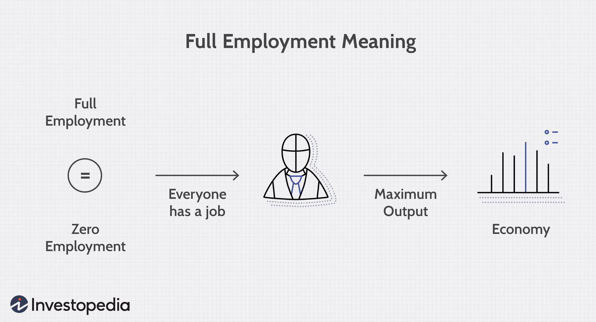

The recruitment landscape is undergoing a significant transformation, particularly within specialized sectors such as algorithmic trading. The advancements in automation and sophisticated technology have redefined the way job seekers connect with potential employers. In algorithmic trading, this evolution is particularly pronounced due to the complex nature of the field that blends financial acumen with technological expertise.

Algorithmic trading, or algo trading, has revolutionized financial markets by enabling faster and more efficient trading processes through the use of complex algorithms and high-speed data analysis. Consequently, the recruitment strategies in this domain are being continuously reshaped to meet the unique demands of the industry. Employers now seek candidates who not only possess traditional financial knowledge but also demonstrate proficiency in programming and data analysis skills.



As job seekers navigate this rapidly evolving field, an understanding of current trends, tools, and strategies becomes indispensable. Modern recruitment strategies have adapted to leverage technological advancements, utilizing digital platforms to streamline the hiring process. This has also made it essential for job seekers to stay updated on the latest industry trends and to adapt their skills accordingly to stand out in a competitive job market.

The integration of technology in recruitment processes has introduced tools that enhance the visibility and reach of job seekers, enabling them to effectively market their skills. Networking within the algorithmic trading community and active engagement in professional development are also crucial for career advancement. By aligning their skills with the evolving demands of the algo trading sector, job seekers can position themselves for success in this dynamic and challenging field.

## Table of Contents

## Understanding Algo Trading

Algorithmic trading, commonly known as algo trading, integrates advanced computational algorithms to execute trading strategies at speeds and efficiencies unachievable by human traders. It involves the automation of trading decisions, utilizing mathematical models and statistical analyses to determine the timing, price, and quantity of orders. This method has brought a transformative change to the financial markets by enhancing [liquidity](/wiki/liquidity-risk-premium), reducing transaction costs, and enabling high-frequency trades.

An algorithm, in this context, is a set of rules or procedures performed in a specific order to solve a problem—in this case, a trading problem. For example, a basic algorithm might be written as a series of steps, such as: 

```python
if stock_price(t) < moving_average(stock_price, n) and RSI(stock_price) < threshold:
    place_buy_order(stock, quantity)
```

In this code snippet:
- `stock_price(t)` refers to the current price of a stock at time `t`.
- `moving_average(stock_price, n)` calculates the moving average over `n` periods.
- `RSI(stock_price)` computes the Relative Strength Index, a momentum indicator that measures the magnitude of recent price changes.
- The algorithm places a buy order if the stock price is below its moving average and the RSI is below a certain threshold.

The shift toward algo trading necessitates a distinct skill set where financial expertise intersects with proficiency in programming and software development. Traditionally, trading required a deep understanding of financial markets, economic indicators, and analytical methods. However, the rise of [algorithmic trading](/wiki/algorithmic-trading) has added layers of complexity, demanding knowledge in programming languages such as Python, C++, and R, as well as an understanding of data structures, [backtesting](/wiki/backtesting), and [machine learning](/wiki/machine-learning) concepts.

Algorithmic trading algorithms are developed following comprehensive analysis and backtesting, where simulated historical trading is performed to assess the feasibility and efficiency of trading strategies. This process requires not only software development skills but also a robust understanding of statistical methods and market behaviors.

Understanding the fundamentals of algorithmic trading is crucial for those who wish to enter the job market in this field. It's imperative to grasp how algorithms are conceived, implemented, and executed in a live trading environment. Furthermore, knowledge of market microstructure, trading protocols, and risk management principles are vital components.

The integration of technology and financial acumen in algo trading not only optimizes decision-making but also democratizes access to market opportunities, making it essential for prospective professionals to master both technical skills and financial theories before embarking on a career in this innovative sector.

## Job Market Trends in Algo Trading

The algo trading job market is experiencing significant growth due to technological progress and the increasing digitization of financial trading platforms. This evolution has created a demand for a unique combination of skills and knowledge, which is essential for navigating this niche yet highly competitive landscape.

Candidates in the algo trading sector are expected to possess a robust understanding of programming languages including Python, C++, and R. These languages are critical for developing algorithms that can execute trades with precision and efficiency. For instance, Python is favored for its simplicity and extensive libraries like NumPy and pandas, which facilitate complex data analysis tasks. Here is a simple example of how Python can be employed to calculate moving averages, a common technique in algo trading:

```python
import pandas as pd

# Example dataset
data = {'prices': [101, 105, 107, 109, 102, 98, 110]}
df = pd.DataFrame(data)

# Calculate moving average
df['moving_average'] = df['prices'].rolling(window=3).mean()
print(df)
```

Besides technical programming skills, there is a growing expectation for candidates to have sound financial knowledge, enabling them to understand and model financial instruments and markets effectively. This intersection of finance and technology creates a distinctive demand for professionals who can bridge these domains, devising algorithms that not only perform efficiently but also operate within the complex dynamics of financial markets.

An emerging trend in the algo trading job market is the increasing prevalence of remote work and flexible working conditions. As technology facilitates remote connectivity and collaboration, firms are more open to offering flexible work arrangements, which can attract a broader talent pool and provide employees with a better work-life balance. This shift in working dynamics is partly driven by advancements in communication tools and a changing workforce that values flexibility and autonomy.

Understanding these job market trends can empower job seekers to align their skills and experiences with employer expectations effectively. By acquiring proficiency in relevant programming languages and maintaining a solid foundation in financial concepts, candidates can position themselves competitively. Additionally, adapting to the flexibility offered by remote work can enhance their appeal to prospective employers who are embracing these modern work environments.

By staying attuned to these trends and continuously upskilling, prospective algo trading professionals can improve their employability and readiness for success in this evolving field.

## Effective Job Search Strategies

In the competitive field of algorithmic trading, effective job search strategies are crucial for securing a position. Utilizing platforms like LinkedIn, Indeed, and ZipRecruiter is essential for finding relevant opportunities. These platforms allow for targeted job searches by filtering roles based on specific skills, experience levels, and locations. LinkedIn, in particular, provides significant advantages through its networking capabilities, enabling connections with industry professionals and recruiters who specialize in algo trading. Creating job alerts on these platforms ensures that candidates are notified promptly of new job postings that match their criteria.

Networking plays a pivotal role in the algorithmic trading community. Engaging with industry peers, joining relevant LinkedIn groups, and participating in discussions can enhance visibility. Attending industry conferences and seminars offers opportunities for direct interaction with key players in the sector. These events are valuable for learning about the latest trends and forging relationships that may lead to job opportunities. Conferences like the World Quantum Trading Summit or TradeTech provide platforms to meet thought leaders and potential employers.

Optimizing your resume and LinkedIn profile is critical to attracting potential employers in the algorithmic trading sector. Resumes should clearly highlight technical skills, such as proficiency in programming languages like Python, C++, and R, as well as experience with financial modeling or quantitative analysis. Quantifiable achievements, such as improvements in trading strategy performance or reductions in execution time, should be emphasized. For LinkedIn, ensure your profile is up-to-date with a professional photo, a concise headline encapsulating your expertise, and a detailed summary that showcases your unique value proposition. Endorsing skills and seeking recommendations from colleagues can further strengthen your profile's credibility.

Leveraging certification programs and online courses can significantly enhance a candidate's appeal. Programs focusing on data science, quantitative finance, or specific trading systems provide tangible evidence of expertise and commitment to the field. Online learning platforms such as Coursera, edX, and Udacity offer courses that cover relevant topics, including machine learning and financial markets, allowing candidates to build niche skills and stay current with industry advancements. Certifications from recognized institutions serve as a testament to a candidate's proficiency and dedication.

By strategically utilizing these job search methods, candidates can effectively position themselves for success within the algorithmic trading job market.

## The Role of Recruitment Agencies

Recruitment agencies specializing in technology and finance play an integral role in the job search process, especially within the specialized field of algorithmic trading. These agencies act as invaluable partners for both job seekers and employers. Their deep understanding of industry dynamics enables them to match candidates with roles that not only align with their skill sets but also their career aspirations.

Recruitment agencies often maintain extensive networks of contacts within the algorithmic trading sector. This gives them access to a wide range of job opportunities, some of which may not be publicly advertised. By understanding employer needs, these agencies can provide candidates with insights into company cultures, expectations, and the specific skills that are currently in demand. This guidance can significantly enhance a candidate's ability to make a strong impression during job applications and interviews.

Notable recruitment firms focusing on algorithmic trading often offer tailored services that go beyond simple job placement. These services can include resume optimization, interview preparation, and career coaching, helping candidates to present themselves as compelling prospects. Agencies such as Selby Jennings, Oxford Knight, and GQR Global Markets are renowned for their expertise in connecting tech-savvy professionals with cutting-edge opportunities in algorithmic trading.

In partnering with such agencies, job seekers gain a competitive edge through personalized support and the ability to tap into exclusive job listings. The collaboration between recruitment agencies and candidates leads to more strategic career moves and a stronger presence in a highly competitive job market.

## Challenges and How to Overcome Them

The algo trading job market is highly competitive, requiring individuals not only to possess a unique blend of skills but also to continuously differentiate themselves. One of the primary challenges faced by job seekers in this field is the rapid pace of innovation and the constant evolution of technology. This necessitates persistent skill development. Candidates must demonstrate proficiency in programming languages such as Python, C++, and R, combined with a robust understanding of financial markets. A strong foundation in data analysis and machine learning is also often required, as these technologies are integral to modern algorithmic trading strategies.

To enhance skill development, individuals can leverage a plethora of online resources and certification programs. Websites like Coursera, edX, and Udacity offer specialized courses in data science, machine learning, and financial analytics. These platforms often provide hands-on projects that allow learners to apply theoretical knowledge in practical scenarios. Furthermore, gaining industry-recognized certifications—such as the CFA (Chartered Financial Analyst) or FRM (Financial Risk Manager)—can significantly bolster a candidate’s portfolio and offer a competitive edge.

Professional branding is another critical element for job seekers aiming to stand out in these demanding positions. Building a compelling LinkedIn profile that highlights key skills, projects, and achievements in algorithmic trading is essential. It's important to include quantifiable outcomes from past roles, such as “developed an algorithm that increased portfolio returns by 15% using Python and machine learning techniques.” This demonstrates the tangible impact of your work and capabilities.

Networking also plays a crucial role in overcoming the challenges associated with securing an algorithmic trading position. Engaging with the algo trading community through forums, meetups, and conferences can provide invaluable insights and opportunities. Being active on platforms like GitHub and Kaggle can not only enhance skills through collaboration but also showcase technical abilities to potential employers. Participating in industry-specific events allows job seekers to form connections with professionals and thought leaders, which can lead to potential job referrals or mentorship opportunities.

Staying current with industry news and continuing education is paramount to maintain relevance in the dynamic field of algorithmic trading. Subscribing to financial and technology journals, attending webinars, and engaging with content from institutions such as the World Economic Forum or the Financial Times can keep individuals informed about the latest trends and technological advancements. This knowledge not only aids in professional development but can also be harnessed during job interviews to demonstrate an up-to-date understanding of the market landscape.

Lastly, developing a personal project or research paper can serve as a significant differentiator. Creating a unique trading algorithm or a series of analyses on market trends and publishing the findings can display initiative and expertise to potential employers. These projects can be shared on professional networks and may attract attention from recruiters and industry professionals.

By investing time in skill development, maintaining an updated professional presence, actively networking, and continually educating themselves, job seekers can effectively navigate the challenges of the algo trading job market and position themselves for success.

## Conclusion

The combination of recruitment, employment, job search, and algo trading provides a multifaceted landscape that, although complex, offers significant rewards for those who navigate it effectively. As the industry continues to evolve due to technological advancements and the digitization of trading, job seekers with a well-rounded approach stand to benefit greatly. Understanding market trends and tailoring job search strategies accordingly are essential steps for aspiring algo traders.

To thrive, candidates should remain proactive: keeping up with technological trends, honing relevant skills, and maintaining a strong presence within the trading community can uncover numerous career opportunities. This involves actively participating in industry events, networking with professionals, and continuously updating one's knowledge and skill set through courses or certifications. Engaging with the community not only opens doors to new positions but also provides insights into emerging tools and practices that may be advantageous in one's career.

Ultimately, success in the algorithmic trading job market requires a strategic and informed approach. By combining technical prowess with market awareness and community engagement, job seekers can effectively leverage the evolving landscape to secure desirable positions in this dynamic field.

## References & Further Reading

[1]: Bergstra, J., Bardenet, R., Bengio, Y., & Kégl, B. (2011). ["Algorithms for Hyper-Parameter Optimization."](https://dl.acm.org/doi/10.5555/2986459.2986743) Advances in Neural Information Processing Systems 24.

[2]: ["Advances in Financial Machine Learning"](https://play.google.com/store/books/details/Advances_in_Financial_Machine_Learning?id=v0RKDwAAQBAJ&hl=en-US) by Marcos Lopez de Prado

[3]: ["Evidence-Based Technical Analysis: Applying the Scientific Method and Statistical Inference to Trading Signals"](https://www.amazon.com/Evidence-Based-Technical-Analysis-Scientific-Statistical/dp/0470008741) by David Aronson

[4]: ["Machine Learning for Algorithmic Trading"](https://github.com/stefan-jansen/machine-learning-for-trading) by Stefan Jansen

[5]: ["Quantitative Trading: How to Build Your Own Algorithmic Trading Business"](https://www.amazon.com/Quantitative-Trading-Build-Algorithmic-Business/dp/1119800064) by Ernest P. Chan