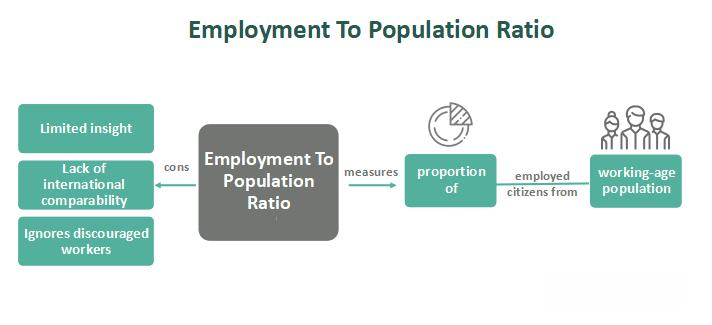

In today's interconnected world, understanding the complex relationships between various economic indicators is crucial. As economies become increasingly globalized, the dynamics of financial markets are influenced by a myriad of factors, including labor statistics, population ratio employment, and algorithmic trading. These components not only shape economic policies but also significantly impact market behaviors and outcomes.

Labor statistics provide a window into the economic health of a nation, capturing employment trends and workforce participation. Key metrics such as the employment-to-population ratio and labor force participation rate offer insights that help policymakers and economists evaluate the effectiveness of their strategies. By understanding shifts in these metrics, stakeholders can assess economic vitality and potential areas of improvement.



Algorithmic trading, characterized by the use of complex algorithms and quantitative methods, leverages economic indicators to make informed trading decisions. The integration of real-time labor market data within these algorithms allows traders to anticipate and react to market movements driven by changes in employment statistics. This data-driven approach to trading highlights the importance of comprehensive labor insights in enhancing decision-making accuracy.

This article explores how the interplay between labor statistics, population ratio employment, and algorithmic trading influences global financial markets. We will investigate how data-driven trading strategies benefit from labor market insights, ultimately enhancing both economic policy formation and trading strategies. Join us as we unravel these concepts and their far-reaching implications for modern economic analysis.

## Table of Contents

## Understanding Labor Statistics

Labor statistics are critical in assessing the economic health of a nation by providing invaluable insights into employment trends. These statistics encompass a broad spectrum of data, with key metrics such as the employment-to-population ratio and the labor force participation rate playing pivotal roles.

The employment-to-population ratio is a fundamental metric used to gauge the proportion of a country's working-age population that is employed. Mathematically, it is expressed as:

$$
\text{Employment-to-Population Ratio} = \left( \frac{\text{Employed Population}}{\text{Working-Age Population}} \right) \times 100
$$

This ratio is particularly important because, unlike the traditional unemployment rate, it includes individuals who are not actively seeking employment. This inclusion provides a more comprehensive and nuanced view of the labor market, as it accounts for those who may be discouraged from seeking work or are otherwise not participating in the labor market but are still of working age.

On the other hand, the labor force participation rate measures the percentage of the working-age population that is either employed or actively seeking employment. It provides key insights into the engagement level of the population within the labor market.

Both these metrics offer valuable information that helps policymakers and economists assess the effectiveness of economic policies. Analyzing these [statistics](/wiki/bayesian-statistics) can lead to a deeper understanding of labor market trends, such as shifts in employment, changes in economic conditions, and the impact of policy interventions. Such insights are crucial for designing policies aimed at promoting job creation and social welfare, ultimately contributing to the overall economic stability and growth of a nation.

Understanding labor statistics is not only vital for economic policy design but also plays a significant role in the financial sector, where detailed knowledge of employment trends can inform market analysis and trading strategies.

## Employment-to-Population Ratio: A Closer Look

The employment-to-population ratio stands as a critical macroeconomic metric that offers a broad view of job market trends by evaluating the percentage of the working-age population that is employed. It differs from other labor indicators by providing a more stable representation of employment over both short and long terms since it remains relatively unaffected by seasonal employment variations that might distort the unemployment rate.

One of the notable characteristic features of this ratio is its exclusion of short-term labor fluctuations. It maintains consistency through seasonal employment changes, such as retail hiring during holiday periods or agricultural employment surges during harvest times. By doing so, it offers a more dependable indication of underlying employment trends.

Despite its advantages, the employment-to-population ratio has certain limitations. It does not include data on institutionalized populations, such as those in correctional facilities, healthcare institutions, or demographic groups like military personnel. These exclusions mean the ratio might not fully capture the entire scope of the working-age population.

Moreover, although the employment-to-population ratio reflects the level of workforce engagement, it does not differentiate between individuals engaged in part-time versus full-time employment. This absence of distinction can sometimes lead to a misleading picture of economic health, as increases in part-time work might not equate to overall economic improvement. For instance, a rise in part-time employment could inflate the ratio without corresponding improvements in full-time job market stability, wages, or economic productivity.

Understanding these nuances is essential for accurate economic analysis and policy formulation. When interpreting the employment-to-population ratio, economists and policymakers should consider these factors to derive meaningful conclusions about economic health and trends. The metric is often used in conjunction with other labor statistics to achieve a comprehensive assessment of the job market.

## Algorithmic Trading and Employment Metrics

Algorithmic trading involves the use of sophisticated algorithms and quantitative models to facilitate the decision-making process in financial markets. This form of trading utilizes large datasets to execute orders at speeds and frequencies that surpass human capabilities. Employment metrics, especially labor statistics like employment-to-population ratios, serve as valuable data points in these trading models. These ratios are crucial in providing insights into the economic environment which, in turn, may indicate potential market shifts.

Real-time data integration is fundamental for traders seeking to predict market movements influenced by labor market dynamics. By analyzing employment data, algorithmic traders can identify patterns that suggest economic expansions or contractions. For instance, an increase in the employment-to-population ratio often correlates with economic growth, potentially leading to bullish market behavior. Conversely, a decline might signal a slowdown, prompting defensive trading strategies. 

Algorithmic trading systems are designed to incorporate dynamic datasets, enabling them to adjust their strategies in response to fluctuations in labor statistics. Python, with its extensive libraries such as NumPy and pandas, is commonly used in the development of these systems due to its ability to handle large volumes of data efficiently. An example of a simple Python function to simulate how employment data could adjust trading signals is shown below:

```python
import numpy as np
import pandas as pd

def adjust_trading_signals(employment_data, threshold):
    """Adjusts trading signals based on employment-to-population ratio threshold."""
    signals = []
    for ratio in employment_data:
        if ratio > threshold:
            signals.append('buy')
        else:
            signals.append('sell')
    return signals

# Simulated employment-to-population ratio data
employment_data = pd.Series([0.59, 0.61, 0.58, 0.63, 0.60])
threshold = 0.60

# Get trading signals
trade_signals = adjust_trading_signals(employment_data, threshold)
print(trade_signals)
```

This simple model uses employment-to-population ratio thresholds to generate buy or sell signals, demonstrating the type of logic that could be part of a more complex [algorithmic trading](/wiki/algorithmic-trading) strategy.

By aligning trading methodologies with labor statistics, traders improve the precision of their market predictions. This integration enables them to make informed decisions that reflect current economic realities, optimizing both performance and risk management. Aligning algorithmic strategies with comprehensive labor market data allows traders to navigate the complexities of global financial markets with greater efficacy.

## Comparative Analysis: Ratio vs. Unemployment Rate

While both the employment-to-population ratio and the unemployment rate evaluate labor markets, they serve distinct purposes and provide different insights into economic conditions. Understanding these differences is crucial for developing effective economic policies and trading strategies.

The unemployment rate is a widely used metric that captures the percentage of the labor force that is actively seeking employment but is currently unemployed. This measure does not include individuals who are not actively looking for work, such as discouraged workers, who have given up on finding a job, or those who are voluntarily not participating in the labor force, such as students or retirees. As a result, the unemployment rate may sometimes underrepresent economic inactivity, creating a narrow focus on those actively job-seeking.

Conversely, the employment-to-population ratio offers a broader perspective by measuring the proportion of a country's working-age population that is employed. It accounts for the total number of employed individuals regardless of their active job-seeking status, thereby providing a more comprehensive overview of employment levels across all working-age individuals. This ratio is especially useful for capturing trends in workforce engagement without being affected by the fluctuations inherent to the unemployment measure.

Analyzing both metrics together provides a more nuanced understanding of labor market dynamics. For instance, a low unemployment rate paired with a declining employment-to-population ratio might indicate that while fewer people are actively seeking jobs, the overall level of employment is not expanding, which could suggest increasing economic inactivity or retirement rates. On the other hand, rising trends in both metrics suggest robust job market conditions where more people are both employed and actively seeking further employment opportunities.

Such a comprehensive understanding of labor market conditions aids in developing balanced economic policies. Policymakers can use this dual metric approach to better address issues such as job creation, workforce participation, and social welfare programs. Similarly, traders and investors can integrate these insights into algorithmic trading strategies to identify potential market opportunities and risks associated with shifts in employment dynamics.

By contrasting the employment-to-population ratio with the unemployment rate, stakeholders can gain a fuller picture of economic conditions and make more informed decisions that align with real-world labor market trends.

## Implications for Economic Policy and Trading Strategies

Labor statistics are integral to the formulation of economic policies and trading strategies, serving as foundational tools for assessing a nation's economic landscape. Policymakers rely on these statistics to gauge the state of employment and make informed decisions regarding job creation and social welfare interventions. Accurate interpretation of this data is crucial as it enables the development of targeted policies that address employment disparities and promote economic equity.

For instance, when labor statistics indicate a high employment-to-population ratio, it suggests that a substantial portion of the working-age population is gainfully employed. Policymakers might interpret this as a sign of economic strength, potentially leading to initiatives aimed at sustaining employment levels, such as investing in skills training or incentivizing industries to expand. Conversely, a low ratio could prompt measures to stimulate job growth and support job seekers.

Traders, particularly those engaged in algorithmic trading, can benefit significantly by integrating labor statistics into their models. This data can reveal potential market opportunities by highlighting economic shifts that might affect asset prices. For example, an unexpected increase in employment may lead to a rise in consumer spending, which could positively influence retail stocks. Traders can utilize this information to adapt their strategies in real-time, adjusting their portfolios to maximize returns or mitigate risks.

Algorithmic trading models can incorporate employment data by adjusting parameters in response to labor trends. Here’s a simple conceptual Python code snippet showing how employment data might be integrated into a trading algorithm:

```python
def adjust_trading_strategy(employment_data, current_strategy):
    # Example: Modify trading strategy based on employment data
    employment_to_population_ratio = employment_data['employment_to_population_ratio']

    if employment_to_population_ratio > 0.6:
        # Increase investment in consumer goods
        current_strategy['consumer_goods'] *= 1.1
    else:
        # Shift focus to defensive stocks
        current_strategy['consumer_goods'] *= 0.9

    return current_strategy

# Example employment data
employment_data = {'employment_to_population_ratio': 0.62}

# Initial trading strategy
current_strategy = {'consumer_goods': 100}

# Adjust strategy based on labor data
adjusted_strategy = adjust_trading_strategy(employment_data, current_strategy)
```

By employing a data-driven approach, both economic policies and trading strategies can be better aligned with real-world conditions. Policymakers gain the ability to craft policies that are responsive to labor market dynamics, while traders enhance their decision-making processes to reflect economic realities. Ultimately, the integration of labor statistics into these spheres ensures that actions taken are not only reactive but also strategically forward-looking, promoting economic stability and growth.

## Conclusion

Labor statistics and the employment-to-population ratio serve as pivotal indicators for assessing economic well-being. These metrics offer valuable insights into employment trends, which are indispensable for both policymakers and financial traders. By effectively understanding and utilizing these indicators, stakeholders can significantly enhance their decision-making processes.

For policymakers, labor statistics provide a broader view of the economic landscape, enabling the development of targeted measures that address employment disparities and support job creation. These data-driven insights help formulate balanced economic policies and social welfare programs, ensuring that they are grounded in actual labor market conditions.

Algorithmic trading stands to gain substantial benefits by incorporating comprehensive labor market data. The integration of real-time employment statistics into trading models enhances the accuracy of market forecasts. Algorithmic systems utilize this data to refine their strategies, allowing them to anticipate market movements that are influenced by labor and economic trends. Such integration not only improves investment performance but also bolsters risk management practices.

Ultimately, synthesizing labor statistics effectively informs both economic strategies and market approaches. By aligning decision-making with real-world economic conditions, stakeholders across various sectors can navigate the complexities of financial markets and economies more adeptly. This integration of data acts as a catalyst for informed decision-making, leading to optimized outcomes in both policy development and trading strategy execution.

## References & Further Reading

[1]: Bureau of Labor Statistics. ["Labor Force Statistics from the Current Population Survey."](https://www.bls.gov/cps/cps_over.htm)

[2]: Fama, E. F., & French, K. R. (1993). ["Common Risk Factors in the Returns on Stocks and Bonds."](https://people.hec.edu/rosu/wp-content/uploads/sites/43/2023/09/Fama-French-Common-risk-factors-1993.pdf) Journal of Financial Economics, 33(1), 3-56.

[3]: Jegadeesh, N., & Titman, S. (1993). ["Returns to Buying Winners and Selling Losers: Implications for Stock Market Efficiency."](https://www.jstor.org/stable/2328882) The Journal of Finance, 48(1), 65-91.

[4]: Katz, J. O., & McCormick, D. L. (2000). ["The Encyclopedia of Trading Strategies."](https://archive.org/details/encyclopediaoftr0000katz) McGraw-Hill.

[5]: Ro, S. (2013). ["Here's Why the Employment-Population Ratio is the Best Labor Market Indicator."](https://csurams.com/sports/womens-soccer/roster/coaches/jen-fisher/176) Business Insider.