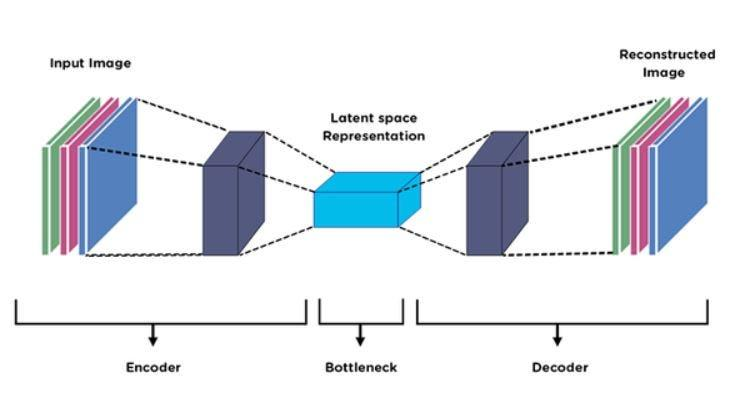

## Table of Contents

## What is an encoder in machine learning?

An encoder in machine learning is a component of a neural network that transforms input data into a different format or representation. This transformation is often used to compress the data into a lower-dimensional space, which can help in tasks like data compression, feature extraction, and preparing data for further processing in tasks such as classification or generation. For example, in an autoencoder, the encoder takes in the input data and outputs a compressed version of it, often called the latent representation.

Encoders are crucial in many applications, including natural language processing where they convert sequences of words or tokens into numerical vectors that can be processed by other parts of the model. A common example is the use of encoders in transformer models, where they help in understanding the context and relationships between words in a sentence. By converting the input into a more manageable form, encoders make it easier for the rest of the model to perform its task efficiently and effectively.

## How does an encoder differ from a decoder?

An encoder and a decoder are two parts of a system that work together but do different jobs. An encoder takes in the original data, like words or images, and changes it into a special code or format. This new format is usually smaller and easier for a computer to work with. For example, in a machine learning model, the encoder might turn a picture into a set of numbers that represent the most important parts of the picture.

On the other hand, a decoder takes this special code and turns it back into something we can understand, like the original picture or text. The decoder tries to make the output as close as possible to what the encoder started with. In an autoencoder, the encoder compresses the data, and the decoder tries to reconstruct it. Together, they help the computer learn how to represent and understand data better.

## What are the main types of encoders used in machine learning?

In [machine learning](/wiki/machine-learning), there are several types of encoders, each designed for specific tasks. One common type is the convolutional encoder, often used in image processing. It uses convolutional layers to extract important features from images, turning them into a smaller set of numbers that can be used for tasks like image classification or generation. Another type is the recurrent encoder, which is useful for handling sequences like text or time series data. Recurrent encoders, such as Long Short-Term Memory (LSTM) or Gated Recurrent Unit (GRU) networks, process data step-by-step, remembering past information to understand the context.

Another important type of encoder is the transformer encoder, which is widely used in natural language processing. Transformer encoders use self-attention mechanisms to understand the relationships between different parts of the input, like words in a sentence. This allows them to create a rich representation of the data, which is very helpful for tasks like language translation or text generation. Each type of encoder has its strengths and is chosen based on the kind of data and the specific task at hand.

## Can you explain how an autoencoder works?

An autoencoder is a type of [neural network](/wiki/neural-network) that learns how to efficiently compress and encode data, then decode it to reproduce the original input as closely as possible. It has two main parts: the encoder and the decoder. The encoder takes in the input data, like an image or a piece of text, and turns it into a smaller set of numbers called the latent representation. This process is like squeezing a lot of information into a smaller space. The decoder then takes this smaller set of numbers and tries to turn it back into the original data. The goal is for the output to be as close as possible to the input, so the autoencoder learns to capture the most important features of the data.

To train an autoencoder, you feed it lots of examples of the data you want it to learn about. The autoencoder compares its output to the original input and calculates how different they are using a loss function. It then uses this information to adjust its internal parameters, making the output more and more like the input over time. This process is called backpropagation. By doing this, the autoencoder gets better at compressing and reconstructing data, which can be useful for tasks like denoising images, where you want to remove noise from a picture, or for finding patterns in data that are hard to see otherwise.

## What are the typical applications of encoders in machine learning?

Encoders are used in many areas of machine learning. One common use is in natural language processing, where they help turn words or sentences into numbers that computers can understand. For example, in machine translation, an encoder takes a sentence in one language and turns it into a set of numbers. These numbers can then be used by another part of the model to create a sentence in a different language. Encoders are also used in recommendation systems, where they turn user data into numbers that help predict what a person might like next.

Another important use of encoders is in image processing. Here, encoders help turn pictures into smaller sets of numbers that capture the most important parts of the image. This can be useful for tasks like image classification, where a computer needs to recognize what is in a picture, or for image compression, where the goal is to make the picture take up less space. By turning the image into a smaller set of numbers, the encoder makes it easier for the computer to work with the data and perform these tasks more efficiently.

## How do convolutional encoders function in neural networks?

Convolutional encoders are a type of encoder used in neural networks, especially for working with images. They use something called convolutional layers to look at small parts of an image at a time. These layers slide over the image and pick out important features like edges or shapes. By doing this, the convolutional encoder turns the image into a smaller set of numbers that still capture what's important about the picture. This smaller set of numbers is called the latent representation.

Once the convolutional encoder has turned the image into this smaller set of numbers, it can be used for different tasks. For example, if you want to classify what's in the picture, the numbers can be fed into another part of the neural network that makes the final decision. Or, if you're using an autoencoder, these numbers go to a decoder that tries to turn them back into the original image. The key thing about convolutional encoders is that they're really good at keeping the important parts of the image while making it smaller and easier to work with.

## What is the role of an encoder in sequence-to-sequence models?

In sequence-to-sequence models, the encoder plays a crucial role by taking in the input sequence, like a sentence in one language, and turning it into a special set of numbers. This set of numbers is called the latent representation or context vector. The encoder looks at each part of the input sequence, one by one, and uses what it learns to create this smaller set of numbers. This process helps the model understand the whole input sequence and capture its important parts.

Once the encoder has created the latent representation, it passes this information to the decoder. The decoder then uses this set of numbers to create the output sequence, like a sentence in another language. By doing this, the encoder helps the model translate or generate new sequences based on the input it received. This makes sequence-to-sequence models very useful for tasks like machine translation, where understanding the input fully is key to producing a good output.

## How can one evaluate the performance of an encoder?

To evaluate the performance of an encoder, you can look at how well it turns the input data into a useful set of numbers. One way to do this is by using a task like classification or reconstruction. For example, if you're using an encoder in an autoencoder, you can see how close the output of the decoder is to the original input. If the encoder does a good job, the decoder should be able to turn the numbers back into something very similar to what you started with. You can measure this with a loss function, like mean squared error (MSE), which tells you how different the output is from the input. A lower MSE means the encoder is doing a better job at capturing the important parts of the data.

Another way to evaluate an encoder is by looking at how it helps with other tasks. For example, if you're using an encoder in a machine translation model, you can see how well the model translates sentences from one language to another. If the encoder is good, the translations should be accurate and make sense. You can use metrics like BLEU score to measure this. The BLEU score compares the translated sentences to reference translations and gives a number that shows how good the translation is. A higher BLEU score means the encoder is doing a better job at understanding and representing the input data, which helps the rest of the model perform better.

## What are some common challenges faced when training encoders?

One common challenge when training encoders is dealing with overfitting. Overfitting happens when the encoder learns too much about the training data and doesn't do well with new data. This can make the encoder less useful because it can't handle different kinds of inputs well. To avoid overfitting, you can use techniques like regularization, which helps the encoder focus on the most important parts of the data, or use more data for training so the encoder sees a wider variety of examples.

Another challenge is choosing the right size for the latent representation. If the latent representation is too small, the encoder might not be able to capture all the important information from the input. But if it's too big, it might not help with tasks like compression or might make the model harder to train. Finding the right balance can take a lot of experimenting with different sizes and seeing how they affect the encoder's performance. This process can be time-consuming but is important for making sure the encoder works well.

## How do variational autoencoders differ from standard autoencoders?

Variational autoencoders (VAEs) and standard autoencoders both work to turn data into a smaller set of numbers and then back into the original data. But they do this in different ways. A standard autoencoder just tries to make the output as close as possible to the input. It doesn't care about how the numbers in the middle, called the latent representation, are spread out. A variational autoencoder, on the other hand, makes sure the latent representation follows a certain pattern, like a normal distribution. This helps the VAE not just to copy the input but also to create new data that looks like the original data.

The key difference is how VAEs use probability. In a VAE, the encoder doesn't just give one set of numbers for the latent representation. Instead, it gives two sets: one for the average (mean) and one for how spread out the numbers are (variance). The VAE then uses these to pick a set of numbers from a normal distribution. This is done using a trick called the reparameterization trick, which helps the VAE learn better. By making the latent representation follow a normal distribution, VAEs can generate new data that looks like the training data, which is useful for tasks like creating new images or text.

## What advanced techniques can be used to improve encoder performance?

One way to improve encoder performance is by using attention mechanisms. Attention helps the encoder focus on the most important parts of the input data. For example, in natural language processing, attention can help the encoder understand which words in a sentence are the most important for understanding its meaning. This makes the encoder better at turning the input into a useful set of numbers. A popular type of attention is called self-attention, which is used in transformer models. Self-attention lets the encoder look at all parts of the input at the same time and figure out how they relate to each other. This can make the encoder much better at capturing the important parts of the data.

Another technique to improve encoder performance is using regularization methods. Regularization helps stop the encoder from overfitting, which happens when it learns too much about the training data and doesn't work well with new data. One common regularization method is dropout, where some parts of the encoder are randomly turned off during training. This makes the encoder more flexible and better at handling different kinds of inputs. Another method is to add a penalty to the loss function, like L1 or L2 regularization, which encourages the encoder to keep its parameters small. This can help the encoder focus on the most important features of the data and make it more effective at turning the input into a useful set of numbers.

## Can you discuss the impact of encoder architecture on model efficiency and accuracy?

The architecture of an encoder can have a big impact on how efficient and accurate a model is. If the encoder is simple, with fewer layers and parameters, it can be faster to train and use less computer power. This is good for tasks where you need quick results or when you don't have a lot of computing resources. But a simple encoder might not be able to capture all the important parts of the data, which can make the model less accurate. On the other hand, a more complex encoder, with more layers and parameters, can capture more details and be more accurate. But it can also take longer to train and need more computer power, which might not be good for all situations.

Choosing the right encoder architecture is all about finding a balance between speed and accuracy. For example, in natural language processing, using a transformer encoder can help the model understand the relationships between words better, making it more accurate. But transformers can be slow and need a lot of computer power. If you use a simpler encoder like a recurrent neural network (RNN), it might be faster but not as good at understanding long sentences. So, you need to think about what's more important for your task: getting quick results or getting the most accurate results possible. By experimenting with different encoder architectures, you can find the best one for your specific needs.