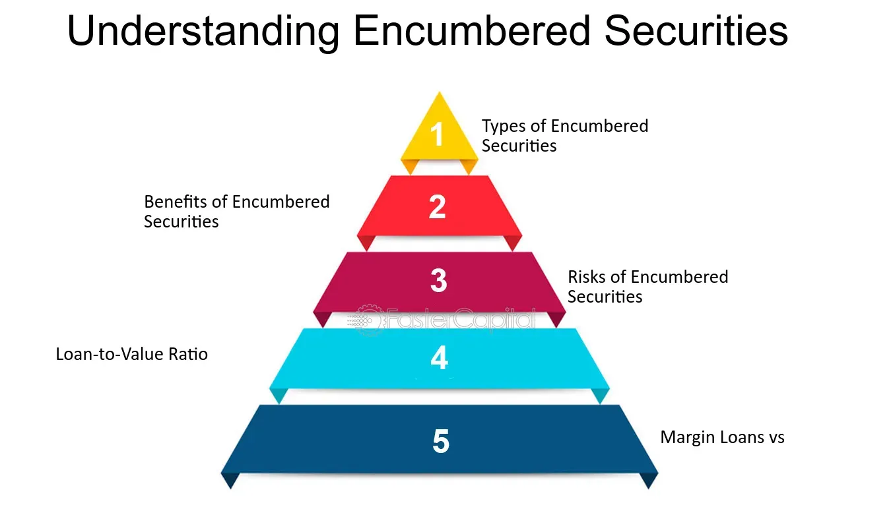

## Table of Contents

## What are encumbered securities?

Encumbered securities are assets that have been used as collateral for a loan or other financial obligation. When someone uses their securities, like stocks or bonds, to borrow money, those securities become encumbered. This means they are tied up and cannot be sold or used for other purposes until the loan is paid back. The lender holds onto these securities as a form of security, ensuring that if the borrower fails to repay the loan, the lender can sell the securities to recover their money.

This practice is common in financial markets because it allows people and companies to borrow money more easily by using their existing assets. However, it also comes with risks. If the value of the encumbered securities drops significantly, the borrower might need to provide additional collateral or face the possibility of the lender selling the securities to cover the loan. This can lead to a situation where the borrower loses their assets, even if they were planning to repay the loan.

## How do encumbered securities differ from unencumbered securities?

Encumbered securities are assets that someone has used to borrow money. They are like a promise to the lender that if the borrower can't pay back the loan, the lender can sell these securities to get their money back. Because they are tied up as collateral, the owner can't sell them or use them for something else until the loan is paid off.

On the other hand, unencumbered securities are free and clear. The owner can do whatever they want with them, like sell them, use them to get another loan, or keep them as part of their investment portfolio. They don't have any restrictions because they haven't been used as collateral for a loan.

The main difference is that encumbered securities are tied up and can't be freely used, while unencumbered securities give the owner more flexibility and control over their assets.

## What are the common types of encumbrances on securities?

Encumbrances on securities are like promises or restrictions that come with them. The most common type is when someone uses their stocks or bonds as collateral for a loan. This means the lender can take the securities if the loan isn't paid back. Another common encumbrance is a lien, which is a legal claim on the securities by someone who is owed money. If the debt isn't paid, the person with the lien can sell the securities to get their money.

There are also other types of encumbrances, like pledges, where someone agrees to use their securities as security for a loan without transferring ownership. This is similar to using them as collateral but might have different legal implications. Lastly, there can be restrictions from agreements like shareholder agreements, which might limit how the securities can be sold or transferred. These encumbrances all mean that the owner of the securities can't use them freely until the conditions of the encumbrance are met.

## What is the purpose of using encumbered securities?

The main purpose of using encumbered securities is to get a loan more easily. When someone wants to borrow money, banks and other lenders might ask for something valuable as a promise that the loan will be paid back. By using securities like stocks or bonds as collateral, the borrower can show the lender that they have assets to back up the loan. This makes lenders feel safer about giving out the money because they know they can sell the securities if the borrower doesn't pay back the loan.

Using encumbered securities also helps people and companies manage their money better. Instead of selling their securities to get cash, they can keep their investments and still get the money they need. This can be useful for short-term needs or emergencies. However, it's important to remember that if the value of the securities goes down, the borrower might need to provide more collateral or face the risk of losing their securities if they can't repay the loan.

## How are encumbered securities used in financial markets?

In financial markets, encumbered securities are used by people and companies to borrow money more easily. When someone wants a loan, they can offer their stocks or bonds as a promise to the lender. This makes the lender feel safer because they can sell the securities if the loan isn't paid back. This practice is common because it helps borrowers keep their investments while still getting the money they need. It's like using a valuable item as a guarantee that you'll repay the loan.

However, using encumbered securities also comes with risks. If the value of the securities goes down, the borrower might need to give more collateral or face losing their securities if they can't repay the loan. This can happen quickly in financial markets where prices can change a lot. So, while encumbered securities help with borrowing, they also need careful management to avoid big problems.

## What are the risks associated with holding encumbered securities?

Holding encumbered securities comes with risks. One big risk is that if the value of the securities goes down, the borrower might need to give more collateral to the lender. This is because the lender wants to make sure they can still get their money back if the loan isn't repaid. If the borrower can't provide more collateral, the lender might sell the securities to cover the loan, which means the borrower loses their assets even if they planned to pay back the loan.

Another risk is that the borrower can't use the encumbered securities freely. They can't sell them or use them for other purposes until the loan is paid off. This can be a problem if the borrower needs to use those securities for something else or if they want to take advantage of a good opportunity in the market. So, while encumbered securities can help get a loan, they also tie up the borrower's assets and limit their flexibility.

## How can an investor identify if a security is encumbered?

An investor can find out if a security is encumbered by checking the company's financial statements and reports. These documents often list any assets that are being used as collateral for loans. Also, looking at the company's agreements with lenders or shareholders can show if there are any restrictions or liens on the securities. Sometimes, this information might be in the footnotes of financial statements or in special sections about risks and liabilities.

Another way is to ask the company directly or check with regulatory bodies like the Securities and Exchange Commission (SEC) in the U.S. These organizations require companies to report any encumbrances on their securities. Investors can search these public records to see if the securities they are interested in are tied up as collateral. By doing this research, investors can make better decisions about whether to buy or hold onto a security.

## What legal considerations should be taken into account with encumbered securities?

When dealing with encumbered securities, it's important to understand the legal agreements that come with them. These agreements can include contracts with lenders that outline the terms of the loan and what happens if the loan isn't paid back. There might also be liens, which are legal claims on the securities by someone who is owed money. These legal documents can affect how the securities can be used or sold, and breaking these agreements can lead to legal action.

Another legal consideration is the need to follow rules set by financial regulators. In the U.S., for example, the Securities and Exchange Commission (SEC) requires companies to report any encumbrances on their securities. This means that companies must be open about what assets are being used as collateral. Investors should check these reports to make sure they understand any restrictions on the securities they are thinking about buying or holding. By doing this, they can avoid legal problems and make better investment choices.

## How do regulations affect the use of encumbered securities?

Regulations play a big role in how encumbered securities are used. They set rules that companies must follow when they use their stocks or bonds as collateral for loans. For example, in the U.S., the Securities and Exchange Commission (SEC) requires companies to report any encumbrances on their securities. This means companies have to be open about which assets are being used as collateral. These rules help keep the financial markets fair and transparent, making sure everyone knows what's going on with the securities.

These regulations also protect investors. By requiring companies to report encumbrances, investors can check if the securities they are interested in are tied up as collateral. This helps them make better decisions about whether to buy or hold onto a security. If a company doesn't follow these rules, they could face legal problems or fines. So, regulations help make sure that the use of encumbered securities is done safely and fairly.

## What are the accounting and reporting requirements for encumbered securities?

When a company uses its securities as collateral for a loan, it has to follow specific accounting and reporting rules. These rules are set by financial regulators like the Securities and Exchange Commission (SEC) in the U.S. Companies need to show in their financial statements which securities are being used as collateral. This is usually done in the footnotes of the financial statements or in a special section about risks and liabilities. By doing this, the company makes sure that everyone knows which assets are tied up and can't be used freely.

These reporting requirements help keep things transparent and fair in the financial markets. Investors can look at these reports to see if the securities they are interested in are encumbered. This helps them make better decisions about buying or holding onto those securities. If a company doesn't follow these rules, it could face legal action or fines. So, it's important for companies to be clear about their encumbered securities to avoid problems and keep trust with investors.

## How do encumbered securities impact a company's balance sheet?

When a company uses its securities as collateral for a loan, it shows up on the balance sheet as an encumbered asset. This means the value of those securities is listed, but there's a note saying they're being used to back a loan. This can make the company's financial situation look a bit different because it shows that not all assets are free to be used or sold whenever the company wants.

Having encumbered securities can also affect how lenders and investors see the company. If a lot of the company's assets are tied up as collateral, it might make lenders worried about giving more loans. Investors might also be cautious because they see that the company's flexibility to use its assets is limited. So, while encumbered securities help the company get loans, they also add a layer of complexity to the balance sheet that everyone needs to understand.

## What are advanced strategies for managing portfolios with encumbered securities?

Managing a portfolio with encumbered securities requires careful planning and constant monitoring. One advanced strategy is to keep a close eye on the value of the securities used as collateral. If the value drops, it might be necessary to add more collateral to keep the loan secure. This can be done by using other unencumbered assets or by buying more of the same securities. Another approach is to diversify the portfolio so that not all the assets are tied up as collateral. By having a mix of encumbered and unencumbered securities, the portfolio remains flexible and can adapt to changing market conditions.

Another strategy involves understanding the terms of the loan agreements and using them to the portfolio's advantage. For example, some loans might allow the borrower to swap out the collateral with other assets of equal value. This can be useful if the original securities are losing value or if there's a better investment opportunity. It's also important to keep track of the loan's maturity dates and plan ahead for when the securities will be freed up. By doing this, the portfolio manager can make informed decisions about when to sell or hold onto the securities, ensuring that the portfolio remains balanced and aligned with the investor's goals.

## What is the Role of Encumbered Securities?

Encumbered securities refer to financial assets that have been pledged as collateral to secure a debt or other financial obligation. They differ from unencumbered assets, which are not subject to any claims or liens, allowing the owner full control over their disposition. Encumbered securities play a significant role in the financial ecosystem, particularly in secured transactions.

**Implications of Asset Encumbrance on Liquidity and Financial Stability**

The encumbrance of assets impacts [liquidity](/wiki/liquidity-risk-premium) and financial stability. When assets are encumbered, they are tied up as collateral, reducing the owner’s available resources to meet immediate liquidity needs. This situation can strain an entity's cash flow, particularly during financial stress or economic downturns. For instance, banks that hold a high percentage of encumbered assets may find it challenging to raise capital quickly, affecting their stability.

On a broader scale, excessive encumbrance levels in the financial system can heighten systemic risk. If many institutions simultaneously face liquidity shortfalls due to encumbered assets, it might lead to a cascading effect, impacting financial markets and economic stability.

**Use in Secured Transactions**

Encumbered securities are frequently used in secured transactions to back loans or satisfy obligations. This practice is common in repurchase agreements (repos), where securities serve as collateral for short-term borrowing. In such arrangements, the borrower agrees to sell securities to the lender with a commitment to repurchase them at a later date, typically at a higher price.

The equation governing a basic repo transaction is:

$$
P_{\text{repurchase}} = P_{\text{initial}} \times (1 + r \times \frac{t}{365})\]

where $P_{\text{repurchase}}$ is the repurchase price, $P_{\text{initial}}$ is the initial price, $r$ is the repo rate, and $t$ is the term of the loan in days.

Such transactions are advantageous as they allow lenders to mitigate risk by possessing the collateral security, which they can sell off in case of default.

**Risks and Benefits**

Holding encumbered securities comes with certain risks and benefits. The primary risk is the potential reduction in an institution's flexibility to maneuver during financial duress. Over-reliance on encumbered assets can lead to liquidity crises. Additionally, the value of the collateral can fluctuate due to market conditions, potentially leaving the lender exposed if the asset's value falls below the loan amount.

Conversely, the benefits include access to lower-cost funding, as secured loans typically bear lower interest rates than unsecured alternatives. They also enhance creditworthiness, allowing borrowers to leverage these assets to obtain necessary funds without having to liquidate investments.

The strategic use of encumbered securities can aid in optimizing capital efficiency and fostering financial discipline. However, it is crucial for institutions and investors to balance the encumbrance of assets with maintaining adequate liquidity reserves to ensure financial stability.

## References & Further Reading

[1]: Bergstra, J., Bardenet, R., Bengio, Y., & Kégl, B. (2011). ["Algorithms for Hyper-Parameter Optimization."](https://dl.acm.org/doi/10.5555/2986459.2986743) Advances in Neural Information Processing Systems 24.

[2]: ["Advances in Financial Machine Learning"](https://www.amazon.com/Advances-Financial-Machine-Learning-Marcos/dp/1119482089) by Marcos Lopez de Prado

[3]: ["Evidence-Based Technical Analysis: Applying the Scientific Method and Statistical Inference to Trading Signals"](https://www.amazon.com/Evidence-Based-Technical-Analysis-Scientific-Statistical/dp/0470008741) by David Aronson

[4]: ["Machine Learning for Algorithmic Trading"](https://github.com/stefan-jansen/machine-learning-for-trading) by Stefan Jansen

[5]: ["Quantitative Trading: How to Build Your Own Algorithmic Trading Business"](https://www.amazon.com/Quantitative-Trading-Build-Algorithmic-Business/dp/1119800064) by Ernest P. Chan