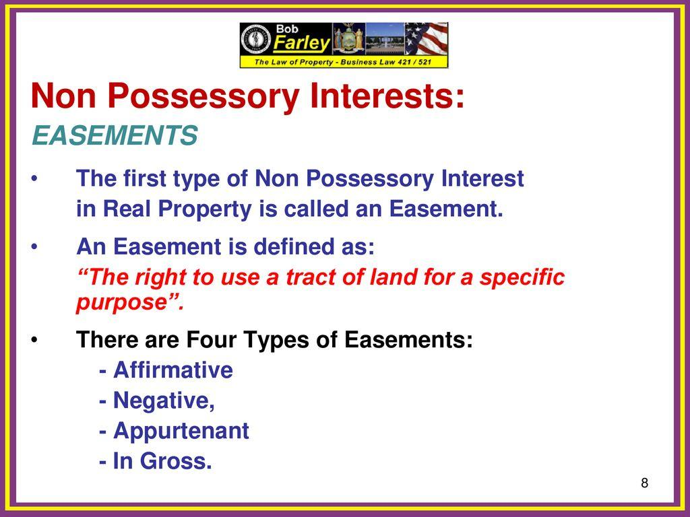

The interconnected nature of real estate and finance often encompasses complex concepts such as nonpossessory interests and encumbrances. These concepts are essential to a wide range of professionals, including investors, real estate experts, and algorithmic traders. Nonpossessory interests refer to rights that enable individuals to use or restrict the use of someone else's property without owning it, such as through easements or leases. Encumbrances, on the other hand, involve claims against a property by third parties, affecting its value and transferability through entities such as liens or mortgages.

Understanding nonpossessory interests and encumbrances is crucial because they directly impact decision-making processes in investing and trading. Within the context of algorithmic trading, these legal and financial arrangements play a vital role in asset valuation and risk management. Thorough knowledge of how these factors influence real estate and financial markets can aid in crafting effective trading strategies and in the optimization of portfolios. As markets continue to evolve, incorporating insights from these areas remains critical for ensuring prudent asset management and achieving financial success.



## Table of Contents

## Understanding Nonpossessory Interests

Nonpossessory interests in real estate grant individuals or entities specific rights to use or restrict the use of another person's property without holding title to that property. These interests arise under various circumstances, often stemming from legal agreements or court orders, and they embody certain types like easements and leases.

An easement is a common type of nonpossessory interest that allows the holder to use a portion of another's property for a specific purpose. For example, utility companies often hold easements that permit them to install and maintain power lines on private lands. Easements can be affirmative, allowing specific actions, or negative, prohibiting certain uses by the property owner.

Leases represent another prevalent form of nonpossessory interest, wherein tenants hold rights to occupy and use a landlord’s property under stipulated terms without ownership. This arrangement is governed by the lease agreement, which outlines rights, responsibilities, and terms of use for the lessee.

While holders of nonpossessory interests do not possess the property itself, they maintain rights that can affect both its current use and future transferability. For instance, an easement may restrict a property's development potential, thereby impacting its value when transferred. These rights are legally binding and can significantly influence property management and investment strategies.

Overall, nonpossessory interests play a key role in real estate dynamics, as their implications extend beyond immediate land use, influencing long-term property valuation and transaction attributes. Understanding these interests is crucial for stakeholders in the property market to ensure informed decision-making and strategic planning.

## Types and Implications of Encumbrances

An encumbrance represents a legal claim or restriction on a property imposed by a party other than the property owner, which can significantly affect the property's value, usage, and transferability. Understanding the nature and impact of various encumbrances is crucial for property owners, potential buyers, and financial investors seeking to make informed decisions in real estate transactions.

### Common Types of Encumbrances

1. **Liens**: A lien is a legal right or interest that a creditor has in a debtor's property, granted until a debt obligation is satisfied. Common liens include mortgage liens, judgment liens, and tax liens. These can deter potential buyers due to the obligations they impose. For example, a mortgage lien ensures the lender has a claim on the property if the loan isn't repaid, leading to foreclosure.

2. **Mortgages**: While technically a type of lien, mortgages deserve a distinct mention due to their prevalence and impact. A mortgage is a loan secured against the property, giving the lender the right to sell the property if the borrower defaults. Mortgages lower market value due to the financial liability associated with the property.

3. **Easements**: An easement grants a third party the right to use a portion of another's property for a specific purpose, such as access roads or utility lines. While easements do not reduce ownership, they can restrict how the property is used and developed, potentially diminishing its market appeal.

4. **Restrictive Covenants**: These are binding legal obligations written into the deed of a property by a seller which restrict the way the property can be used or modified. They are often established by subdivision developers to maintain a certain look or function of a neighborhood, affecting property appeal and value.

5. **Encroachments**: Encroachments occur when a property owner builds something that partially or wholly intrudes on a neighbor's property. Encroachments can lead to disputes or legal action, impacting the property's desirability and value, as resolution might require removal of structures or negotiation of land use rights.

### Implications of Encumbrances

The presence of encumbrances implies additional risk and potential complexity in property transactions and ownership. These claims can reduce a property's market value, as potential buyers must consider the legal and financial obligations that accompany ownership. For example, properties with multiple liens or restrictions may not only involve higher financial risks but also limit the owner's enjoyment and intended use of the property.

Additionally, encumbrances can have broader financial implications, influencing a property’s assessed value for tax purposes and the ability to refinance or obtain future loans. In financial trading, properties with substantial encumbrances may be less liquid, as buyers may avoid properties with complex legal histories or constraints.

Overall, an understanding of the types and implications of encumbrances is pivotal in real estate dealings. Assessing such factors can mitigate risks, inform pricing strategies, and guide negotiation tactics, ensuring more informed and beneficial outcomes in property transactions and asset management decisions.

## Nonpossessory Interests and Encumbrances in Real Estate

Nonpossessory interests and encumbrances are significant components of real estate transactions, influencing both buyer decisions and property valuation. These legal constructs define how a property can be used and the rights retained by others, often without transferring ownership. Understanding these aspects is crucial for any buyer or investor involved in real estate.

A nonpossessory interest allows an individual or entity to use a property or restrict its use despite not holding the title. Common examples include easements, such as the right to cross a neighbor's land for access to public utilities, and leases, which grant a tenant exclusive possession for a specific period. These interests, even after the property changes hands, influence both its marketability and how future developments or enhancements can proceed. Thus, potential buyers must be aware of any existing nonpossessory interests as they may impose limitations on the desired use of the property.

Encumbrances, on the other hand, represent claims or restrictions placed on a property by parties other than the owner. These can arise in various forms including liens, mortgages, easements, and restrictive covenants. A lien, such as a tax or mechanic's lien, obligates the property to satisfy a debt, impacting both its transferability and value. As such, a thorough title search becomes pivotal during the due diligence phase of a real estate transaction. This search helps reveal any encumbrances that might affect the buyer's ability to utilize or resell the property effectively.

Both nonpossessory interests and encumbrances have enduring implications. They often persist beyond the transaction, affecting future property assessments and the decisions of subsequent owners or investors. Therefore, understanding their presence and scope can influence current buyer decisions and long-term investment strategies, highlighting the importance of comprehensive title investigations and legal evaluations before acquisition.

## The Role of Encumbrances in Algorithmic Trading

In [algorithmic trading](/wiki/algorithmic-trading), encumbrances play a significant role in asset valuation and risk management. Encumbrances, such as liens or mortgages, represent claims on assets that can affect their [liquidity](/wiki/liquidity-risk-premium) and market value. Understanding these encumbrances becomes crucial for traders looking to optimize their portfolios and manage associated risks effectively.

Assets encumbered with multiple claims often present higher risks. For instance, a property with several liens indicates potential financial obligations that may impede its transferability and reduce its value. In the context of algorithmic trading, these encumbrances must be accounted for in trading models to avoid overvaluation of assets, which could distort trading strategies and lead to suboptimal portfolio performance.

Traders employ data algorithms to quantify the risk presented by encumbrances. Incorporating encumbrance data involves aggregating relevant financial metrics as part of the asset's risk assessment. For example, a simple computation of the encumbrance-to-value ratio (EVR) can provide a preliminary assessment of the asset's financial obligations relative to its market value:

$$
\text{EVR} = \frac{\text{Total Encumbrances}}{\text{Market Value of Asset}}
$$

A higher EVR indicates a greater proportion of encumbrances relative to the asset's value, prompting a reevaluation of its inclusion in a trading portfolio. Implementing such metrics into trading algorithms can help traders mitigate risks by flagging assets that exceed predetermined risk thresholds.

Furthermore, regulatory compliance often necessitates that trading strategies adhere to financial standards, particularly concerning risk exposure. Encumbrance analysis supports compliance by ensuring that trading models reflect accurate financial representations of assets. By integrating encumbrance data, algorithms can dynamically adjust trading actions based on real-time assessments, thereby aligning portfolios with both market opportunities and regulatory frameworks.

Overall, comprehending and integrating encumbrance details into algorithmic trading systems is pivotal for assessing true asset values, managing risk efficiently, and maintaining compliance with financial regulations. This strategic incorporation ultimately aids in achieving optimized portfolio performance.

## Portfolio Optimization and Risk Management

In portfolio optimization and risk management, encumbrances play a significant role by influencing an asset's liquidity and the decision-making process for its inclusion in trading portfolios. Encumbrances, by their nature, can impose restrictions on property, possibly affecting its marketability and value. This directly impacts algorithmic trading strategies, where analyzing these factors becomes essential for balancing potential returns with associated risks.

Algorithmic traders execute numerous trades quickly and efficiently, often relying on quantitative models that require vast datasets. Including encumbrance data within these datasets allows traders to comprehensively assess a property's financial encumbrances, such as liens or mortgages, and potential legal risks. Such information is crucial for accurately predicting an asset's behavior and expected returns, aiding in the design of robust trading algorithms.

For an optimal trading strategy, it is important to quantify and incorporate the risk associated with encumbrances into the portfolio management process. This can be approached using mathematical tools such as Value at Risk (VaR) or Conditional Value at Risk (CVaR), which help in estimating potential losses in a portfolio. For instance, a Python script could be used to calculate these risk metrics:

```python
import numpy as np

def calculate_var(returns, confidence_level=0.95):
    mean = np.mean(returns)
    std_dev = np.std(returns)
    var = mean - std_dev * np.abs(np.percentile(returns, (1-confidence_level) * 100))
    return var

def calculate_cvar(returns, confidence_level=0.95):
    var = calculate_var(returns, confidence_level)
    cvar = np.mean([r for r in returns if r < var])
    return cvar
```

This tool helps traders determine the level of risk present and adapt their strategies accordingly by prioritizing assets with lower encumbrance-related risks, thus facilitating better liquidity and minimizing potential downtimes.

Moreover, understanding encumbrances supports enhanced portfolio performance through targeted diversification. By identifying assets that, despite their encumbrances, offer unique diversification benefits, traders can build portfolios that are not only resilient to market fluctuations but also optimized for maximum returns under varying conditions.

In conclusion, a meticulous analysis of encumbrances is a vital aspect of algorithmic trading as it aids in comprehensive risk assessment and the optimization of trading portfolios to achieve strong financial outcomes.

## Conclusion

Understanding nonpossessory interests and encumbrances is crucial for effectively navigating real estate investments and the intricacies of algorithmic trading. Nonpossessory interests, such as easements and leases, grant the right to use or limit the use of a property without ownership, impacting property utilization and transferability. Similarly, encumbrances like liens, mortgages, and restrictive covenants impose claims or restrictions on property, directly affecting its market value and liquidity.

In real estate, these factors play a significant role in property valuation and decision-making. A precise grasp of existing encumbrances is essential before finalizing any property transaction, ensuring informed investment choices. This knowledge extends to algorithmic trading, where the inclusion of encumbrance data is vital for accurate asset valuation and risk management. Encumbrances can substantially affect an asset’s risk profile and, consequently, trading strategies. For instance, assets burdened with numerous encumbrances may require advanced risk assessment algorithms to ensure optimal portfolio performance.

As trading strategies become increasingly sophisticated, integrating encumbrance analysis within algorithmic models is essential. This integration assists traders in aligning their portfolios with financial goals while mitigating associated risks. By incorporating comprehensive encumbrance evaluations, traders can achieve a balanced approach to asset selection, optimizing potential returns against inherent risks.

The financial landscape continues to evolve rapidly, and the ability to adapt by including these critical analyses in strategy formulation is indispensable for future success in both real estate and trading sectors.

## References & Further Reading

[1]: ["Real Estate and Property Law for Dummies"](https://www.dummies.com/book/academics-the-arts/law/property-law/property-law-for-dummies-292795/) by Alan R. Romero

[2]: Barlow Burke, "Real Estate Transactions: Examples & Explanations," 6th Edition, Wolters Kluwer.

[3]: ["The Complete Guide to Real Estate Finance for Investment Properties: How to Analyze Any Single-Family, Multifamily, or Commercial Property"](https://www.amazon.com/Complete-Estate-Finance-Investment-Properties/dp/0471647128) by Steve Berges

[4]: ["Principles of Real Estate Practice"](https://www.amazon.com/Principles-Real-Estate-Practice-7th/dp/1955919313) by Stephen Mettling and David Cusic

[5]: Mall Itzhak Ben-David, "The Real Effect of Real Estate Market Cycles on Real Estate Investment Trusts," Journal of Finance, 71(5), 2057-2086.

[6]: ["Algorithmic Trading and DMA: An Introduction to Direct Access Trading Strategies"](https://www.amazon.com/Algorithmic-Trading-DMA-introduction-strategies/dp/0956399207) by Barry Johnson

[7]: ["Understanding Algorithms and Data Structures: A Practical Approach"](https://bradfieldcs.com/algos/) by Hemant Jain