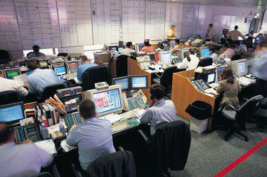

End-of-day orders are a crucial aspect of financial markets that allow investors to execute transactions at the close of the trading day. These orders are placed with the intention that they will be executed at or right before the market closes. The importance of end-of-day orders in stock trading lies in their ability to help investors and traders capture the closing price, which is often seen as a significant indicator of a stock’s daily performance. By waiting until the market's final moments, traders can assess the day’s trading activities and market sentiment to make informed decisions.

Algorithmic trading, a major advancement in the financial industry, involves the use of computer programs to execute trading strategies based on pre-set rules. The integration of algorithmic trading with end-of-day orders enhances the efficiency and precision of executing these trades. By automating the process, algorithms can quickly analyze large volumes of market data, identify trends, and execute orders at optimal times, thereby reducing human error and emotional bias. This symbiotic relationship between algorithmic trading and end-of-day orders enables traders to implement sophisticated strategies with greater accuracy and timing.

Understanding end-of-day trading strategies is vital for modern investors aiming to maximize their portfolio performance. These strategies can provide insights into market trends, inform investment decisions, and aid in managing risks. As trading continues to evolve with technological advancements, comprehending the nuances of end-of-day orders, particularly in combination with algorithmic trading, becomes increasingly important. This article intends to explore the dynamics of end-of-day orders, their role in financial markets, and their integration with algorithmic trading. By delving into these concepts, investors can better grasp the tools available to them and improve their trading outcomes in the ever-evolving world of finance.

## Table of Contents

## Understanding End-of-Day Orders

End-of-day orders are a specific type of order used in stock trading that are executed at or near the end of the trading day. These orders are particularly useful in minimizing the impact of short-term price fluctuations and are designed to manage the closing price volatility that can be influenced by day traders or market noise. The primary purpose of end-of-day orders is to enter or exit positions at close to the market's last trading price, which is often viewed by traders as the most accurate reflection of a stock's value for that day.

Unlike other types of market orders, which can be executed at any time during the trading session, end-of-day orders are specifically timed to be triggered just before the market closes. This timing is crucial as it provides a sense of the stock's value after a full day of trading activities. In contrast, types of orders like limit orders or stop orders may execute immediately upon fulfillment of certain price conditions regardless of the time, which can occur at any moment throughout the trading day.

One significant benefit of end-of-day orders is their ability to help traders mitigate the risks associated with intraday price movements caused by temporary news or market volatility. By focusing on the end-of-day price, investors may better position themselves to capture the overall trend without being swayed by interim fluctuations. Furthermore, utilizing end-of-day orders can lead to enhanced decision-making as it allows for the consideration of closing market data and the assimilation of information that has unfolded throughout the day.

End-of-day orders are particularly effective in scenarios where traders aim to adjust large portfolio holdings without influencing the intraday market dynamics. Institutional investors or fund managers often employ these orders to execute substantial buy or sell programs without attracting unnecessary attention or causing significant price distortion during the trading session. 

A common example of end-of-day order usage is in passive investment strategies, where fund managers replicate an index by purchasing securities at their closing price to match the index performance. Here, the precision of the closing price is imperative to maintain index tracking accuracy, highlighting the practical application of end-of-day orders in achieving strategic investment objectives. 

Moreover, end-of-day orders can be used efficiently in scenarios such as stock rebalancing, tax harvesting at the close of the fiscal year, or when firms need to adhere to specific compliance requirements that dictate market positions at the day's end. These examples underscore the strategic integration of end-of-day orders in maintaining portfolio alignment and optimizing trade execution consistency.

## The Role of Algorithmic Trading in Modern Markets

Algorithmic trading, often referred to as algo trading, is the process of executing trades using pre-programmed instructions that consider variables such as time, price, and [volume](/wiki/volume-trading-strategy). This method automates trading strategies to optimize profits and minimize risks in the financial marketplace. Its rise in prominence is linked to its ability to provide consistent and systematic decision-making capabilities, which is crucial in the fast-paced trading environment.

Algorithmic trading systems process vast amounts of data at an unprecedented speed, allowing traders to make informed decisions based on comprehensive market analyses. These systems employ complex algorithms capable of analyzing historical data, identifying patterns, and executing trades when certain criteria are met. For instance, algorithms can be designed to trade based on technical indicators, statistical [pair trading](/wiki/pair-trading) strategies, or [machine learning](/wiki/machine-learning) models trained to predict price movements. This ability to process data continuously not only enhances the chances of capitalizing on market opportunities but also helps in adapting to changing market conditions swiftly.

One notable advantage of using algorithms, particularly for placing and managing end-of-day orders, is their capacity to reduce human error and emotional bias. By automating decisions, traders and investors can ensure that trades are executed as intended without the distractions of minute-by-minute market fluctuations. Algorithms can also optimize end-of-[day trading](/wiki/day-trading-spy) strategies by scanning through numerous securities and executing trades in a volume-optimized manner, which might be difficult for a human trader to achieve manually.

The speed, efficiency, and precision of [algorithmic trading](/wiki/algorithmic-trading) surpass human capabilities significantly. Algo trading systems can execute trades in milliseconds, a crucial advantage in modern markets where price opportunities can dissipate in seconds. Moreover, the precision of these systems allows for the execution of complex trading strategies that require meticulous timing and volume accuracy, ultimately maximizing return on investment.

Algorithmic trading impacts market [liquidity](/wiki/liquidity-risk-premium) and price discovery by providing consistent buy and sell orders, which can reduce market spreads and contribute to smoother trading operations. With the ability to handle large volumes of trading, algorithms ensure that markets maintain liquidity, enabling easier entry and [exit](/wiki/exit-strategy) for investors. This impact improves price discovery by allowing prices to reflect all available information efficiently. However, excessive reliance on algo trading may lead to episodes of market [volatility](/wiki/volatility-trading-strategies), with sudden and large trades potentially causing rapid price changes.

The increasing role of algorithmic trading in modern financial markets is transforming how trades are executed and managed. Its ability to enhance trading strategies while increasing market participation emphasizes the importance of understanding its mechanisms and impacts. As technology continues to advance, the integration of algorithms in trading activities is set to grow, shaping the future landscape of global markets.

## Integrating End-of-Day Orders with Algorithmic Trading

Combining end-of-day orders with algorithmic trading strategies provides several advantages for modern investors. Automating end-of-day orders through algorithmic trading enhances accuracy by eliminating manual intervention errors. Algorithms can execute predefined strategies consistently, ensuring that orders are placed precisely at the market close. This consistency is crucial for capturing specific trading signals that are relevant at the day's end, optimizing the execution of complex strategies without relying on human judgment.

Predictive analytics and machine learning play pivotal roles in enhancing end-of-day order strategies. These technologies analyze vast quantities of historical and real-time data to identify patterns and predict future price movements. Machine learning models can be trained to recognize the trading signals most effective at market close, facilitating more informed decision-making. For instance, a machine learning model might analyze indicators like volume spikes or specific technical indicators to optimize the timing and size of end-of-day orders, thus increasing the potential for profitability.

Despite these advantages, integrating algorithms with traditional end-of-day trading practices presents challenges. One primary consideration is ensuring data quality, as inaccurate data can lead to poor model performance. Traders must also address the risk of overfitting, where models become too tailored to historical data and fail to generalize to new market conditions. Additionally, system robustness and latency issues can affect the execution efficiency of trading algorithms. Thus, rigorous [backtesting](/wiki/backtesting) and real-time monitoring are necessary to ensure algorithms perform as expected across various market conditions.

Successful strategies that integrate end-of-day orders with algorithmic trading include statistical [arbitrage](/wiki/arbitrage) and trend-following models. In [statistical arbitrage](/wiki/statistical-arbitrage), algorithms can exploit mean-reversion tendencies of stock prices towards the close. An example involves identifying pairs of stocks that tend to revert to a calculated equilibrium and executing end-of-day orders when prices deviate significantly from this equilibrium. In trend-following strategies, machine learning models might be employed to detect price trends that are likely to persist until the market closes, allowing traders to capitalize on these trends with precision-timed end-of-day orders. These strategies showcase the potential for enhanced profitability when combining the strengths of end-of-day orders and algorithmic trading.

## Benefits and Risks of End-of-Day Algo Trading

End-of-day algorithmic trading offers numerous benefits that can enhance trading efficiency and outcomes for investors. By using algorithmic approaches, traders can automate the process of placing end-of-day orders, allowing for precise and data-driven decision-making. Algorithms can analyze large datasets, identify patterns, and execute trades at optimal times without human intervention. This reduces the emotional biases that often cloud manual trading decisions and helps in maintaining a disciplined trading approach.

A key advantage of end-of-day algo trading is the ability to process and react to data swiftly. Algorithms can execute trades based on predetermined criteria, such as technical indicators or statistical models, ensuring trades are carried out consistently with the trader's strategy. This speed and efficiency are particularly crucial in modern financial markets, where rapid price movements can occur.

Despite its benefits, algorithmic end-of-day trading carries certain risks. Market volatility can pose challenges, as rapid price changes might lead to significant losses if algorithms are not well-calibrated. Technical glitches, such as software bugs or connectivity issues, can disrupt trading activities and result in unintended trades or missed opportunities. Thus, it is vital for algo traders to conduct thorough testing and maintain robust infrastructures.

The scalability of algorithmic trading systems allows traders to oversee multiple markets and instruments simultaneously. However, this scalability comes with its limitations. Customizable algorithms require periodical adjustments to remain effective amid changing market conditions, which can consume considerable resources and expertise.

Regulatory considerations are crucial in algorithmic trading. Financial authorities worldwide set stringent rules to prevent market manipulation and ensure fair practices. Traders must ensure compliance by rigorously testing their algorithms and maintaining transparency with regulatory bodies. This often involves detailed documentation and back-testing of strategies to demonstrate their reliability and adherence to market standards.

Best practices for mitigating risks in end-of-day algorithmic trading include employing fail-safes and monitoring systems to detect anomalies. Regular stress-testing of algorithms under various market scenarios can help identify potential flaws and enhance robustness. Many traders also adopt a real-time monitoring approach, allowing them to pause or adjust algorithms during unexpected market events swiftly.

In summary, while algorithmic approaches for end-of-day trading present numerous advantages, they also introduce specific risks and challenges that require careful management. By adhering to best practices, conducting thorough testing, and ensuring regulatory compliance, traders can effectively leverage the benefits while minimizing the associated risks.

## Conclusion

In summary, end-of-day orders and algorithmic trading represent significant components in the contemporary financial market landscape. End-of-day orders offer investors a strategic advantage by allowing them to execute trades based on comprehensive market analysis conducted throughout the trading day, thus minimizing emotional decision-making and optimizing trade timing. Algorithmic trading, with its capability to process vast amounts of market data rapidly, facilitates the efficient execution of such orders, enhancing accuracy and precision. This integration underscores the necessity for traders and investors to have a profound understanding of these concepts to effectively enhance their trading strategies.

Recognizing the intricacies of both end-of-day orders and algorithmic trading is crucial for participants aiming to improve their trading performance. As financial markets continue to grow increasingly sophisticated with the advent of technological advancements, embracing these methodologies offers a more systematic approach to trading. Investors and traders are therefore encouraged to incorporate these techniques into their strategies to gain a competitive edge, ensuring they remain adaptive to evolving market conditions.

Looking forward, the future of trading is undeniably aligned with technological progression, offering immense potential for automation and efficiency. With the continuous development of machine learning and predictive analytics, the capacity of algorithmic trading strategies is set to expand, offering unprecedented levels of precision and adaptability. As such, traders and investors willing to embrace these technological advances will likely find themselves well-positioned in the fast-paced landscape of modern finance.

For those interested in further exploring end-of-day order and algorithmic trading strategies, numerous resources are available. These include academic journals on financial engineering, online courses on algorithmic trading, and software tools that offer simulated trading environments to test and refine trading algorithms. Engaging with these resources can provide valuable insights and skills necessary for mastering the complex yet rewarding domain of modern trading strategies.

## References & Further Reading

[1]: ["Algorithmic Trading: Winning Strategies and Their Rationale"](https://www.wiley.com/en-us/Algorithmic+Trading%3A+Winning+Strategies+and+Their+Rationale-p-9781118460146) by Ernest P. Chan

[2]: Jovanovic, F., & Schinckus, C. (2017). ["Algorithmic Trading and its Socio-Economic Implications."](https://www.researchgate.net/publication/329897630_When_Financial_Economics_Influences_Physics_The_Role_of_Econophysics) Routledge.

[3]: Aldridge, I. (2013). ["High-Frequency Trading: A Practical Guide to Algorithmic Strategies and Trading Systems."](https://www.ahmetbeyefendi.com/wp-content/uploads/2020/07/High-Frequency-Trading-Irene-Aldridge.pdf) Wiley.

[4]: Kissell, R. (2014). ["The Science of Algorithmic Trading and Portfolio Management."](https://www.sciencedirect.com/book/9780124016897/the-science-of-algorithmic-trading-and-portfolio-management) Elsevier.

[5]: Narang, R. K. (2013). ["Inside the Black Box: A Simple Guide to Quantitative and High Frequency Trading."](https://onlinelibrary.wiley.com/doi/book/10.1002/9781118662717) Wiley.