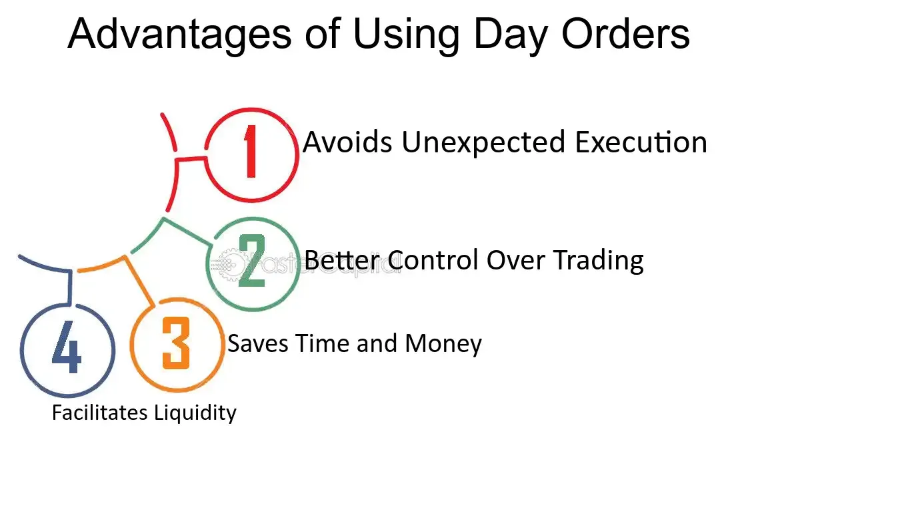

## Table of Contents

## What is an End of Day (EOD) order?

An End of Day (EOD) order is a type of trading order that is set to be executed at the end of the trading day. This means that if you place an EOD order, your trade will happen right before the market closes. Traders use EOD orders to make sure their trades happen at a specific time, which can be helpful for planning and managing their investments.

EOD orders can be useful for people who want to buy or sell stocks but don't have time to watch the market all day. By setting an EOD order, you can go about your day and know that your trade will be completed at the end of the trading day. This can help reduce the stress of trying to time the market perfectly and allow you to focus on other things.

## How does an EOD order work in the stock market?

An EOD order in the stock market is a special type of order that you set to happen at the very end of the trading day. When you place an EOD order, you tell your broker that you want to buy or sell a stock right before the market closes. This means that if you put in an EOD order in the morning, nothing will happen until the last few minutes of trading. This can be helpful if you want to make sure your trade happens at a specific time without having to watch the market all day.

Using an EOD order can be a good strategy for people who are busy during the day but still want to trade stocks. For example, if you decide in the morning that you want to buy a certain stock, you can set an EOD order and then go about your day. At the end of the trading day, your order will be executed automatically. This way, you don't have to worry about missing the right time to trade because your order will happen no matter what, as long as the market is open.

## What are the basic steps to place an EOD order?

To place an EOD order, start by logging into your trading account on your broker's website or app. Once you're logged in, go to the section where you can place orders. Look for an option that says something like "End of Day" or "EOD" order. If you can't find it, you might need to check with your broker's customer support to see if they offer this type of order.

Next, you'll need to enter the details of your order. Choose the stock you want to buy or sell, and then enter the number of shares. Make sure to set the order type to "EOD" so it will be executed at the end of the trading day. After you've entered all the details, review your order to make sure everything is correct. Once you're happy with it, submit the order. Your broker will then take care of executing the trade at the end of the trading day.

## What types of financial instruments can be traded using EOD orders?

EOD orders can be used to trade many different types of financial instruments. The most common ones are stocks, which are shares in a company that you can buy and sell. You can also use EOD orders for exchange-traded funds (ETFs), which are like baskets of stocks that track an index or a sector. Some brokers might also let you use EOD orders for options, which are contracts that give you the right to buy or sell a stock at a certain price.

In addition to stocks, ETFs, and options, EOD orders might be available for other financial instruments depending on your broker. For example, some brokers might allow EOD orders for futures contracts, which are agreements to buy or sell something at a future date. It's important to check with your broker to see what types of financial instruments they support for EOD orders, as not all brokers offer the same options.

## What are the primary benefits of using EOD orders for beginners?

Using EOD orders can be really helpful for beginners because they make trading easier and less stressful. When you set an EOD order, you don't have to watch the market all day. You can decide in the morning what you want to do and then go about your day. Your order will happen at the end of the trading day without you having to do anything more. This is great for people who are new to trading and might feel overwhelmed by trying to time the market perfectly.

Another big benefit of EOD orders for beginners is that they help you plan your trades better. Since you know exactly when your trade will happen, you can think about your strategy and make decisions without the pressure of the market moving around during the day. This can help you learn and get more comfortable with trading without the stress of watching the market every minute. Plus, it can help you avoid making quick decisions that you might regret later.

## How do EOD orders affect market liquidity?

EOD orders can affect market [liquidity](/wiki/liquidity-risk-premium), but it's a bit complicated. Liquidity means how easy it is to buy or sell something without changing its price too much. When lots of people use EOD orders, it can lead to more trading happening right at the end of the day. This can make the market a bit more busy at that time, which might help with liquidity because there are more buyers and sellers.

On the other hand, if everyone tries to trade at the same time, it can also make the market less liquid. Imagine everyone wants to sell their stocks at the end of the day, but not many people want to buy. This can make it harder to sell your stocks without lowering the price. So, while EOD orders can increase trading activity at the end of the day, they can also create some challenges for liquidity if everyone is trying to do the same thing at the same time.

## What are the potential risks associated with EOD orders?

Using EOD orders can have some risks. One big risk is that the price at the end of the day might not be what you expected. Since EOD orders happen right before the market closes, the price can change a lot in the last few minutes. If the price goes down a lot, you might end up buying or selling at a worse price than you wanted.

Another risk is that EOD orders can make the market less liquid at the end of the day. If lots of people are trying to buy or sell at the same time, it can be harder to get the price you want. This means you might have to accept a lower price if you're selling or pay more if you're buying. It's important to think about these risks before you decide to use EOD orders.

## How can advanced traders optimize their strategies using EOD orders?

Advanced traders can use EOD orders to their advantage by planning their trades around the end-of-day market movements. They might look at how prices tend to change right before the market closes and use that information to set their EOD orders. For example, if they notice that a certain stock often goes up at the end of the day, they might set an EOD order to buy that stock, hoping to get it at a good price. This way, they can take advantage of regular patterns in the market without having to watch it all day.

Another way advanced traders can optimize their strategies is by using EOD orders to manage their risk. They might set EOD orders to sell stocks that they think might go down in value overnight or over the weekend. By doing this, they can lock in their profits or cut their losses at the end of the trading day. This helps them control their investments better and avoid big surprises when the market opens again.

## What are the differences between EOD orders and other types of orders like market orders or limit orders?

EOD orders are different from market orders and limit orders because they are set to happen at the end of the trading day. A market order is an order to buy or sell a stock right away at the best available price. This means that as soon as you place a market order, it will be executed, and you'll get the current price. On the other hand, a limit order lets you set a specific price at which you want to buy or sell a stock. If the stock reaches that price at any time during the trading day, the order will be executed. EOD orders, however, won't happen until the end of the day, no matter what the price is during the day.

EOD orders can be helpful if you want to make sure your trade happens at a specific time without having to watch the market all day. They are good for people who are busy but still want to trade stocks. Market orders and limit orders, on the other hand, are more about getting the best price or making sure you don't pay more than you want to. Market orders are quick and simple but might not get you the best price if the market is moving fast. Limit orders give you more control over the price but might not be executed if the stock never reaches your set price.

## How do regulations impact the use of EOD orders in different markets?

Regulations can affect how EOD orders work in different markets. Each country has its own rules about trading, and these rules can change how and when you can use EOD orders. For example, some countries might have strict times for when the market opens and closes, which means your EOD order will only happen at those specific times. Other countries might have rules about what types of orders you can use, so you need to check if EOD orders are allowed where you are trading.

Also, some markets might have rules to stop too much trading at the end of the day. This is because a lot of EOD orders can make the market busy and might cause prices to change a lot. Regulators might put limits on how many EOD orders can happen at once to keep the market fair and stable. It's important for traders to know these rules and follow them to make sure their EOD orders work the way they want.

## Can EOD orders be used effectively in algorithmic trading?

Yes, EOD orders can be used effectively in [algorithmic trading](/wiki/algorithmic-trading). In algorithmic trading, computers use math formulas to decide when to buy or sell stocks. By using EOD orders, these computers can set trades to happen at the end of the trading day without having to watch the market all day. This can be helpful because it lets the algorithm focus on other things during the day and still make sure the trades happen at a specific time.

One way EOD orders can be useful in algorithmic trading is by helping to manage risk. The algorithm can use EOD orders to sell stocks at the end of the day if it thinks the prices might go down overnight or over the weekend. This way, the algorithm can lock in profits or cut losses at a set time, which helps keep the trading strategy on track. EOD orders can also be part of a bigger plan that looks at how prices change at the end of the day and uses that information to make smarter trades.

## What are some case studies or real-world examples where EOD orders significantly impacted trading outcomes?

In one real-world example, a trader used EOD orders to take advantage of a pattern they noticed in a tech stock. The stock often went up at the end of the day, so the trader set EOD orders to buy the stock right before the market closed. Over time, this strategy helped the trader make good profits because they were able to buy the stock at a lower price earlier in the day and sell it at a higher price at the end of the day. This shows how EOD orders can be used to take advantage of regular market patterns.

Another example comes from a [hedge fund](/wiki/hedge-fund-trading-strategies) that used EOD orders to manage risk. The fund noticed that some of their stocks were more likely to drop in price overnight. To avoid big losses, they set EOD orders to sell these stocks at the end of the trading day. This strategy helped them lock in their profits and avoid the risk of the stock going down when the market was closed. It's a good example of how EOD orders can be used to protect investments and manage risk effectively.

## References & Further Reading

[1]: ["Algorithmic Trading: Winning Strategies and Their Rationale"](https://www.wiley.com/en-us/Algorithmic+Trading%3A+Winning+Strategies+and+Their+Rationale-p-9781118460146) by Ernest P. Chan

[2]: Jovanovic, F., & Schinckus, C. (2017). ["Algorithmic Trading and its Socio-Economic Implications."](https://www.researchgate.net/publication/329897630_When_Financial_Economics_Influences_Physics_The_Role_of_Econophysics) Routledge.

[3]: Aldridge, I. (2013). ["High-Frequency Trading: A Practical Guide to Algorithmic Strategies and Trading Systems."](https://www.ahmetbeyefendi.com/wp-content/uploads/2020/07/High-Frequency-Trading-Irene-Aldridge.pdf) Wiley.

[4]: Kissell, R. (2014). ["The Science of Algorithmic Trading and Portfolio Management."](https://www.sciencedirect.com/book/9780124016897/the-science-of-algorithmic-trading-and-portfolio-management) Elsevier.

[5]: Narang, R. K. (2013). ["Inside the Black Box: A Simple Guide to Quantitative and High Frequency Trading."](https://onlinelibrary.wiley.com/doi/book/10.1002/9781118662717) Wiley.