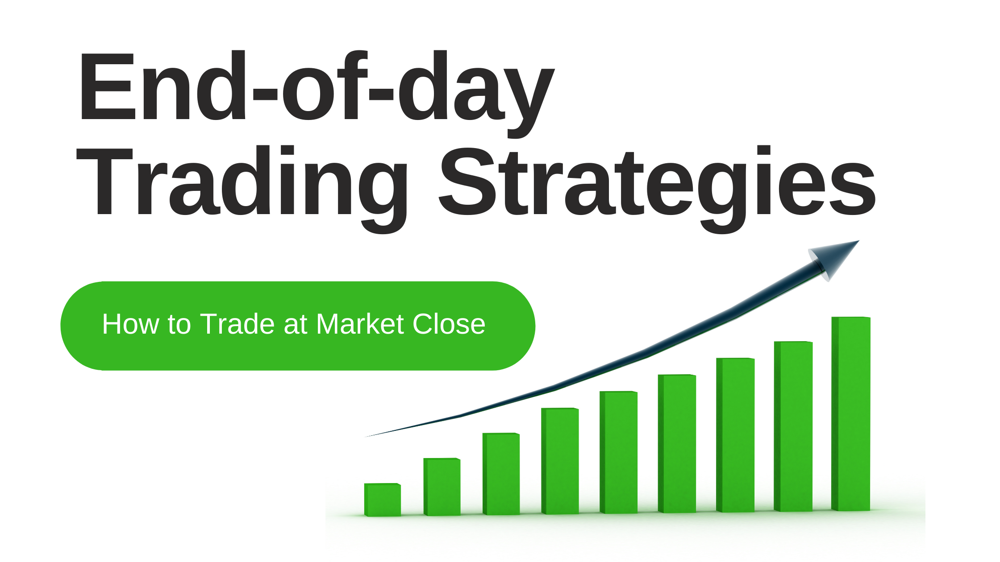

## Table of Contents

## What is end-of-day trading?

End-of-day trading is a strategy where traders buy and sell stocks near the end of the trading day. They look at how the stock market moved during the day and make their decisions based on that. The idea is to use the day's information to predict what might happen next and make trades that will be profitable when the market closes.

This type of trading can be good because it lets traders take advantage of the day's trends and news. However, it can also be risky because the market can be unpredictable, especially at the end of the day. Traders need to be careful and quick to make the right moves before the market closes.

## Why is end-of-day trading important for beginners?

End-of-day trading is important for beginners because it helps them learn how the stock market works without too much stress. When you trade at the end of the day, you have time to look at what happened during the day and think about what might happen next. This can make it easier for beginners to understand the market and make better decisions. They don't have to worry about quick changes in the market that can happen during the day.

Another reason end-of-day trading is good for beginners is that it can be less risky. Since you are making trades near the end of the day, you have less time for the market to change a lot. This can help beginners avoid big losses that can happen if the market moves a lot during the day. By starting with end-of-day trading, beginners can build their confidence and skills before trying more complicated trading strategies.

## What are the basic principles of end-of-day trading strategies?

The first principle of end-of-day trading is to review the day's market activity. This means looking at how stocks moved during the day, what news came out, and any other events that might affect the market. By doing this, you can see patterns and trends that can help you decide which stocks to buy or sell. It's important to take your time and not rush into decisions, as you have until the market closes to make your trades.

Another key principle is to set clear entry and exit points. This means deciding at what price you will buy a stock and at what price you will sell it. Having these points set before you start trading helps you stick to your plan and avoid making emotional decisions. It's also a good idea to use stop-loss orders, which automatically sell your stock if it drops to a certain price, to limit your losses.

Lastly, managing risk is crucial in end-of-day trading. This means not putting all your money into one stock and spreading your investments across different stocks. It's also important to only invest money you can afford to lose. By following these principles, you can make more informed decisions and increase your chances of success in end-of-day trading.

## How can one identify the best times for end-of-day trading?

To identify the best times for end-of-day trading, you need to pay attention to when the market is most active. Usually, the last hour of trading is a good time because a lot of people are making their final trades of the day. This can cause more movement in stock prices, which gives you a chance to buy or sell at good prices. Also, looking at the market's patterns over time can help you see when stocks tend to move the most at the end of the day.

Another thing to think about is the time when important news or reports come out. Sometimes, companies release their earnings or other news near the end of the trading day. This can cause big changes in stock prices, so it's a good time to trade if you know about the news ahead of time. By keeping an eye on the clock and the news, you can find the best times to do your end-of-day trading.

## What are some common end-of-day trading indicators and how do they work?

Some common end-of-day trading indicators are moving averages, the Relative Strength Index (RSI), and volume. Moving averages help traders see the average price of a stock over a certain period, like 50 or 200 days. By comparing the current price to the moving average, traders can see if a stock is trending up or down. If the price is above the moving average, it might be a good time to buy because the stock is doing well. If it's below, it might be a good time to sell because the stock is not doing as well.

The Relative Strength Index (RSI) is another useful indicator. It measures how fast and how much a stock's price is changing. The RSI goes from 0 to 100. If the RSI is above 70, it means the stock might be overbought and could go down soon. If it's below 30, the stock might be oversold and could go up. This helps traders decide when to buy or sell a stock at the end of the day. Volume is also important. It shows how many shares of a stock were traded that day. High volume at the end of the day can mean more people are interested in the stock, which can affect its price.

These indicators work together to give traders a better idea of what's happening with a stock. By looking at moving averages, RSI, and volume, traders can make more informed decisions about buying or selling at the end of the day. It's important to use these indicators as part of a bigger plan and not just rely on one of them. This way, traders can use the information they get to make the best trades possible before the market closes.

## How does one set up an effective end-of-day trading routine?

Setting up an effective end-of-day trading routine starts with gathering all the information you need. You should look at the stock market's activity throughout the day, read any news that might affect the stocks you're interested in, and check the performance of your chosen stocks. It's helpful to keep a trading journal where you write down what you see and think about how it might affect your trades. This way, you can make better decisions based on what you've learned.

Next, decide on your entry and exit points before the market closes. This means choosing the prices at which you will buy and sell your stocks. Using stop-loss orders can help you manage risk by automatically selling a stock if it drops too much. It's also important to manage your money wisely by not putting all your money into one stock and only investing what you can afford to lose. By following this routine every day, you can improve your chances of making successful trades at the end of the day.

## What are the risks associated with end-of-day trading and how can they be mitigated?

End-of-day trading can be risky because the market can change a lot in the last hour of trading. Sometimes, news comes out at the end of the day that can make stock prices go up or down quickly. This can be hard to predict and might cause you to lose money if you're not careful. Another risk is that you might make decisions based on emotions instead of a plan, which can lead to bad trades. If you don't set clear entry and exit points, you might hold onto a stock too long or sell it too soon.

To reduce these risks, it's important to have a good plan and stick to it. Before the market closes, look at the day's trading activity and any news that might affect your stocks. Use this information to set your entry and exit points, and don't change them just because you feel nervous or excited. Using stop-loss orders can help you limit your losses by selling a stock automatically if it drops too much. Also, make sure to spread your money across different stocks and only invest what you can afford to lose. By doing these things, you can make end-of-day trading safer and more successful.

## Can you explain advanced end-of-day trading techniques for experienced traders?

Advanced end-of-day trading techniques for experienced traders often involve using multiple technical indicators together to get a more complete picture of the market. One technique is to combine moving averages with the Relative Strength Index (RSI) and volume to confirm trends and potential reversal points. For example, if a stock's price is above its 50-day moving average, the RSI is below 70 (not overbought), and the volume is high, it might be a good time to buy. By looking at these indicators together, experienced traders can make more accurate predictions and find better opportunities for end-of-day trades.

Another advanced technique is to use candlestick patterns to predict short-term price movements. Candlestick patterns like the "doji" or "hammer" can signal that a stock's price might reverse soon. Experienced traders can use these patterns, along with other indicators, to decide when to enter or exit a trade at the end of the day. They might also use more complex strategies like options trading to hedge their positions or take advantage of expected price movements. By combining these advanced techniques, experienced traders can increase their chances of making profitable end-of-day trades.

## How do market trends and news impact end-of-day trading decisions?

Market trends and news can really affect end-of-day trading decisions. If a stock has been going up all day, traders might want to buy it at the end of the day, thinking it will keep going up. On the other hand, if a stock has been going down, traders might decide to sell it before the market closes. These trends give traders clues about what might happen next, so they can make smarter choices about which stocks to trade.

News can also make a big difference. If a company announces good news like high earnings or a new product, its stock price might go up at the end of the day. Traders who know about this news might buy the stock to make a profit. But if the news is bad, like a company losing money or facing a lawsuit, the stock price could go down. Traders need to keep an eye on the news and use it to decide when to buy or sell stocks at the end of the day. By paying attention to both market trends and news, traders can make better end-of-day trading decisions.

## What role does technical analysis play in end-of-day trading strategies?

Technical analysis is really important for end-of-day trading because it helps traders understand how stocks have moved during the day and what might happen next. By looking at charts and using tools like moving averages and the Relative Strength Index (RSI), traders can see if a stock is going up or down. This helps them decide if they should buy or sell a stock before the market closes. For example, if a stock's price is above its moving average and the RSI isn't too high, it might be a good time to buy.

Using technical analysis also helps traders manage their risks better. They can set clear entry and exit points based on what the charts show, so they know when to get into or out of a trade. This can stop them from making quick, emotional decisions that might lead to losses. By looking at the day's market activity through technical analysis, traders can make smarter choices and increase their chances of making money at the end of the day.

## How can one backtest and optimize end-of-day trading strategies?

To backtest and optimize end-of-day trading strategies, you need to look at how well your strategy would have worked in the past. You can do this by using old stock market data to see what would have happened if you had used your strategy back then. There are special computer programs and tools that can help you with this. You put in your rules for buying and selling stocks, and the program shows you how much money you would have made or lost. By doing this, you can see if your strategy is good or if you need to change it to make it better.

Once you've backtested your strategy, you can start to optimize it. This means making small changes to your rules to see if they make your strategy work better. You might try different entry and exit points, or use different technical indicators to see what works best. Keep testing these changes with the old data to find the best way to trade. By backtesting and optimizing, you can feel more confident that your end-of-day trading strategy will work well when you use it for real.

## What are the psychological aspects of end-of-day trading and how can traders manage them?

End-of-day trading can be stressful because you have to make decisions quickly before the market closes. This can lead to feelings like fear and excitement, which might make you act without thinking. For example, if a stock's price is going down fast at the end of the day, you might feel scared and sell it too soon. Or if a stock is going up, you might get too excited and buy more than you should. These feelings can make you do things that aren't part of your trading plan, which can lead to losing money.

To manage these feelings, it's important to stick to your plan and not let your emotions control your trades. One way to do this is by setting clear rules for when to buy and sell stocks before the market closes. Using stop-loss orders can also help, because they automatically sell a stock if it drops too much, so you don't have to make a quick decision when you're feeling stressed. It's also a good idea to take breaks and not trade every day, so you don't get too tired or overwhelmed. By keeping your emotions in check and following your plan, you can make better end-of-day trading decisions.

## What are some examples of successful EOD trading strategies?

End-of-day (EOD) trading strategies capitalize on analyzing daily market movements to identify potential trades, typically using technical indicators to make informed decisions. Several EOD strategies have proven effective across various market conditions:

### Williams %R Trading Strategy

The Williams %R is a [momentum](/wiki/momentum) indicator that reflects overbought and oversold conditions in a market. It is calculated using the formula:

$$

\text{Williams \%R} = \frac{\text{Highest High} - \text{Close}}{\text{Highest High} - \text{Lowest Low}} \times -100 
$$

where $\text{Highest High}$ and $\text{Lowest Low}$ are typically observed over a 14-day period. The indicator produces values between -100 and 0. A value closer to 0 indicates that the asset is overbought, suggesting a sell opportunity, whereas a value closer to -100 indicates an oversold condition, suggesting a buy. Using this information, traders can determine optimal entry and exit points by identifying reversals in the market's momentum.

### Mean Reversion Strategies

Mean reversion strategies are based on the concept that price levels will revert to a mean or average over time. This is predicated on the statistical phenomenon of regression to the mean. Traders utilize historical price data to identify periods when the price deviates substantially from its historical average, expecting a correction towards the mean. A simple mean reversion strategy might look like:

$$
\text{Signal} = \text{Current Price} - \text{Average Price}
$$

If the $\text{Signal}$ is significantly positive, it indicates a potentially overvalued condition, prompting a sell. Conversely, a negative signal suggests a buying opportunity. These strategies often employ Bollinger Bands or standard deviation channels as visual aids for identifying deviations from the mean.

### Moving Average Strategies

Moving average strategies, such as the 200-day moving average, analyze long-term trends by smoothing out price data to establish the general direction of an asset. The 200-day moving average is calculated by taking the average closing prices of an asset over the last 200 days. A simple Python implementation could be:

```python
import pandas as pd

# Assuming 'data' is a pandas DataFrame with a column 'Close' for closing prices
data['200_MA'] = data['Close'].rolling(window=200).mean()

# Generate trading signals
data['Signal'] = 0
data['Signal'][200:] = np.where(data['Close'][200:] > data['200_MA'][200:], 1, -1)
```

When the asset's price is above the 200-day moving average, this suggests a bullish trend, presenting a buy signal. Conversely, a price below the moving average indicates a bearish trend, signaling a potential sell.

These strategies exemplify how EOD trading can utilize historical and technical analysis to create actionable insights, emphasizing trends and reversions pivotal for making trading decisions.

## How can we optimize EOD strategies for better performance?

To enhance the performance of end-of-day (EOD) trading strategies, robust backtesting remains an essential practice. Backtesting allows traders to refine their strategies by analyzing vast historical data, which can significantly improve the reliability and predictability of trading outcomes. During backtesting, it is prudent to use a dataset that mirrors the current market context to ensure resilience across different conditions. Traders often employ the following Python code snippet to conduct basic backtesting:

```python
import pandas as pd

def backtest_strategy(data, strategy):
    results = []
    for index, row in data.iterrows():
        result = strategy(row)
        results.append(result)
    return pd.DataFrame(results)

# Example of strategy function
def example_strategy(row):
    # Implement the logic for trading decision on each row here
    # This function should return a result or a decision
    return {"date": row["date"], "decision": "hold"}

# Assuming 'market_data' is a DataFrame with historical market data
results = backtest_strategy(market_data, example_strategy)
```

Incorporating risk management tools such as stop-loss orders is another critical [factor](/wiki/factor-investing) in optimizing EOD strategies. Stop-loss orders help protect against adverse market movements by automatically closing a position when the asset's price reaches a predetermined level. This mechanism ensures that losses are minimized during unexpected market [volatility](/wiki/volatility-trading-strategies). The formula for a traditional stop-loss is straightforward:

$$
\text{Stop-Loss Price} = \text{Entry Price} - \text{Maximum Acceptable Loss}
$$

Diversifying trades across multiple instruments is an effective method to mitigate risk and enhance overall strategy performance. By spreading capital over various assets, traders can reduce exposure to the volatility of a single instrument. This approach aligns with portfolio theory, which asserts that diversification can lead to optimal risk-adjusted returns.

To implement diversification in a trading strategy, consider analyzing the correlation between different financial instruments. Pairing assets with low or negative correlations can increase diversification benefits. Below is an example of how to compute the correlation matrix for a portfolio using Python:

```python
# Assuming 'portfolio_data' is a DataFrame with columns of daily returns for each asset
correlation_matrix = portfolio_data.corr()

print("Correlation Matrix:")
print(correlation_matrix)
```

By employing these techniques—backtesting, risk management, and diversification—traders improve their chances of achieving consistent and sustainable success with EOD trading strategies.

## References & Further Reading

[1]: Taleb, N. N. (2007). ["The Black Swan: The Impact of the Highly Improbable"](https://www.nytimes.com/2007/04/22/books/chapters/0422-1st-tale.html) Random House.

[2]: Murphy, J. J. (1999). ["Technical Analysis of the Financial Markets: A Comprehensive Guide to Trading Methods and Applications"](https://www.amazon.com/Technical-Analysis-Financial-Markets-Comprehensive/dp/0735200661) New York Institute of Finance.

[3]: Brock, W., Lakonishok, J., & LeBaron, B. (1992). ["Simple Technical Trading Rules and the Stochastic Properties of Stock Returns."](https://www.jstor.org/stable/2328994) The Journal of Finance, 47(5), 1731-1764.

[4]: Pring, M. J. (2002). ["Technical Analysis Explained, Fifth Edition: The Successful Investor's Guide to Spotting Investment Trends and Turning Points"](https://www.amazon.com/Technical-Analysis-Explained-Fifth-Successful/dp/0071825177) McGraw-Hill Education.

[5]: Chan, E. P. (2009). ["Quantitative Trading: How to Build Your Own Algorithmic Trading Business"](https://github.com/ftvision/quant_trading_echan_book) Wiley.