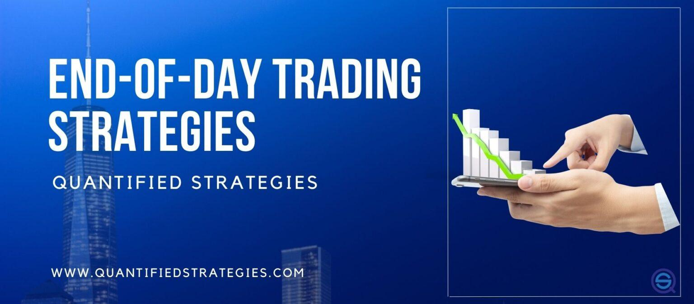

End-of-day (EOD) trading strategies have become an integral component of algorithmic trading, recognized for their efficiency and the convenience of reducing the necessity for constant market monitoring. Unlike intraday methodologies, which require real-time decision-making based on fluctuating market conditions, EOD strategies emphasize the analysis of an entire day’s price movements. At the market's close, comprehensive data is available, facilitating more informed trading decisions.

EOD strategies operate by evaluating daily closing prices to predict optimal entry and exit points. They generally rely on technical analysis, utilizing indicators such as moving averages, volume analysis, and momentum indicators. This data-driven approach allows traders to distill actionable insights, minimizing the emotional and psychological pressures often associated with more frequent trading methods.



Significantly, EOD strategies can align well with diverse trading goals and risk profiles, providing a balanced approach to market involvement. By enabling traders to assess trades once the market closes, they cut down on the need for excessive monitoring while still capturing potential gains. Consequently, these strategies hold the prospect of leading to successful trading outcomes when properly executed.

## Table of Contents

## Understanding End-of-Day Trading Strategies

End-of-day (EOD) trading strategies involve making trading decisions based on the analysis of market data gathered after the closure of trading activities for the day. These strategies generally utilize technical indicators to uncover potential trading opportunities. By analyzing the entire day's market dynamics, traders can make more informed decisions compared to the rapid and often fragmented nature of intraday trading.

EOD trading strategies leverage various technical indicators to evaluate market conditions and predict future price movements. Commonly used indicators include moving averages, which help in identifying trends; the relative strength index (RSI), which provides insights on overbought or oversold conditions; and the stochastic oscillator, which compares a particular closing price of a security to a range of its prices over a certain period. These indicators assist traders in recognizing patterns and making decisions on potential entry or exit points.

Unlike day trading, which requires constant monitoring and quick decision-making, EOD trading allows a more relaxed approach. Trades are typically executed after the market has closed, granting traders sufficient time to analyze data and consider their strategies without the pressure of real-time market fluctuations. This comprehensive view at the end of the day can help in reducing emotional trading errors and facilitates a more strategic approach to trading.

Python is often used to automate EOD trading strategies. A simple script can be developed to fetch end-of-day data, apply technical indicators, and generate signals for potential trades. Below is an example script that calculates a moving average crossover signal:

```python
import pandas as pd

# Assuming `data` is a DataFrame with historical price data including 'Close' prices
data['20_MA'] = data['Close'].rolling(window=20).mean()
data['50_MA'] = data['Close'].rolling(window=50).mean()

# Generating buy/sell signals based on moving average crossover
data['Signal'] = 0
data.loc[data['20_MA'] > data['50_MA'], 'Signal'] = 1  # Buy signal
data.loc[data['20_MA'] < data['50_MA'], 'Signal'] = -1  # Sell signal

# Displaying the first few rows of the DataFrame with signals
print(data[['Close', '20_MA', '50_MA', 'Signal']].head())
```

This script demonstrates the implementation of a simple moving average crossover strategy, which issues buy signals when the short-term moving average crosses above the long-term moving average and sell signals when it crosses below. This type of strategy benefits from the comprehensive daily data analysis typical of EOD strategies.

## Advantages of End-of-Day Trading Strategies

End-of-day (EOD) trading strategies provide traders with several advantages, making them an attractive option for those engaging in [algorithmic trading](/wiki/algorithmic-trading). One of the primary benefits is the ability to make more informed trading decisions by analyzing the complete day's data. By waiting until the end of the trading day to evaluate price movements and market trends, traders can evaluate comprehensive data sets that reflect the full spectrum of daily trading activities. This approach contrasts with intraday trading, where decisions must be made based on incomplete data, potentially leading to less accurate predictions.

EOD strategies also significantly reduce the need for constant market monitoring. Traders employing EOD methods typically review data and initiate trades once per day, decreasing the psychological burden associated with continuous observation and rapid decision-making. This reduction in stress not only enhances the trader's quality of life but also supports a more disciplined and systematic approach to trading.

Another notable advantage of EOD trading strategies is the potential for lower brokerage fees. Since these strategies do not rely on frequent buy and sell transactions, traders incur fewer transaction costs, which can erode profits in more active trading styles. By executing trades less frequently, traders can minimize the impact of brokerage fees on their overall returns, thus enhancing long-term profitability.

In summary, end-of-[day trading](/wiki/day-trading-spy) strategies offer significant benefits, including enhanced decision-making capabilities through comprehensive data analysis, reduced stress due to decreased monitoring requirements, and cost savings from lower brokerage fees. These advantages make EOD strategies a viable and efficient option for traders looking to optimize their trading practices.

## Implementing EOD Strategies in Algorithmic Trading

Algorithmic trading offers a robust framework for implementing end-of-day (EOD) trading strategies, primarily due to its capability to handle and analyze large datasets efficiently. To implement EOD strategies effectively within an algorithmic trading context, the following steps are essential:

1. **Selecting the Appropriate Market and Asset**: The first step involves choosing a market and asset class that aligns with the trader's goals and expertise. Different markets, such as equities, forex, or commodities, exhibit distinct characteristics and behaviors. For instance, the equity market is known for its volatility, especially during market open and close, making it suitable for EOD strategies that capitalize on these dynamics.

2. **Analyzing Market Data**: Once the market and assets are selected, traders must collect and analyze daily market data. This typically involves the use of technical indicators such as moving averages, Bollinger Bands, or the Relative Strength Index (RSI) to identify trends and potential entry and exit points. The analysis can also integrate fundamental data if the strategy supports it, offering a more comprehensive understanding of market conditions.

3. **Placing Trades Before the Next Market Session**: EOD strategies require that trades are executed at the close of the current market session or during the opening of the next session. This timing ensures that all relevant data from the trading day is considered. Automated trading systems can be programmed to implement these trades based on pre-defined rules and indicators.

4. **Backtesting**: Crucial to the implementation process is the backtesting of the chosen strategy. Backtesting involves running the EOD strategy against historical data to assess its performance across various market conditions. This process helps in identifying the strategy's strengths and weaknesses and in making necessary adjustments before deploying it live. Traders often use software platforms like Python's PyAlgoTrade or zipline for backtesting.

   ```python
   import pandas as pd
   import pyalgotrade
   from pyalgotrade.stratanalyzer import returns

   # Sample code for backtesting
   historical_data = pd.read_csv('market_data.csv')
   strategy = MyEODStrategy(historical_data)
   strat_analyzer = returns.Returns()
   results = strategy.run()
   navalues = results.getNetReturn().getNaNValues()
   ```

By following these steps, traders can leverage algorithmic trading systems to effectively implement EOD strategies, maximizing their potential for success. Continuous monitoring and iterative refinements based on [backtesting](/wiki/backtesting) results are vital elements that help optimize strategy performance under changing market conditions.

## Examples of Successful EOD Trading Strategies

End-of-day (EOD) trading strategies capitalize on analyzing daily market movements to identify potential trades, typically using technical indicators to make informed decisions. Several EOD strategies have proven effective across various market conditions:

### Williams %R Trading Strategy

The Williams %R is a [momentum](/wiki/momentum) indicator that reflects overbought and oversold conditions in a market. It is calculated using the formula:

$$

\text{Williams \%R} = \frac{\text{Highest High} - \text{Close}}{\text{Highest High} - \text{Lowest Low}} \times -100 
$$

where $\text{Highest High}$ and $\text{Lowest Low}$ are typically observed over a 14-day period. The indicator produces values between -100 and 0. A value closer to 0 indicates that the asset is overbought, suggesting a sell opportunity, whereas a value closer to -100 indicates an oversold condition, suggesting a buy. Using this information, traders can determine optimal entry and exit points by identifying reversals in the market's momentum.

### Mean Reversion Strategies

Mean reversion strategies are based on the concept that price levels will revert to a mean or average over time. This is predicated on the statistical phenomenon of regression to the mean. Traders utilize historical price data to identify periods when the price deviates substantially from its historical average, expecting a correction towards the mean. A simple mean reversion strategy might look like:

$$
\text{Signal} = \text{Current Price} - \text{Average Price}
$$

If the $\text{Signal}$ is significantly positive, it indicates a potentially overvalued condition, prompting a sell. Conversely, a negative signal suggests a buying opportunity. These strategies often employ Bollinger Bands or standard deviation channels as visual aids for identifying deviations from the mean.

### Moving Average Strategies

Moving average strategies, such as the 200-day moving average, analyze long-term trends by smoothing out price data to establish the general direction of an asset. The 200-day moving average is calculated by taking the average closing prices of an asset over the last 200 days. A simple Python implementation could be:

```python
import pandas as pd

# Assuming 'data' is a pandas DataFrame with a column 'Close' for closing prices
data['200_MA'] = data['Close'].rolling(window=200).mean()

# Generate trading signals
data['Signal'] = 0
data['Signal'][200:] = np.where(data['Close'][200:] > data['200_MA'][200:], 1, -1)
```

When the asset's price is above the 200-day moving average, this suggests a bullish trend, presenting a buy signal. Conversely, a price below the moving average indicates a bearish trend, signaling a potential sell.

These strategies exemplify how EOD trading can utilize historical and technical analysis to create actionable insights, emphasizing trends and reversions pivotal for making trading decisions.

## Challenges and Risks in EOD Trading

End-of-day (EOD) trading strategies are advantageous for many traders, but they are not without their challenges and risks. One primary concern is the reduced [liquidity](/wiki/liquidity-risk-premium) towards the end of the trading day. Lower trading volumes can result in wider bid-ask spreads, making it difficult to execute trades at desired prices. This liquidity constraint can lead to slippage, where the actual execution price differs from the intended price, thus impacting profitability.

Price gaps present another significant risk. These gaps occur between the market's close and the next day's opening, often fueled by overnight news releases or events. Such unexpected market movements can affect open positions adversely. For instance, a company announcement or geopolitical event occurring outside trading hours can lead to a substantial gap, resulting in a position being closed at a less favorable price than anticipated.

Traders employing EOD strategies must adopt robust risk management measures to mitigate these potential pitfalls. Overnight risk management strategies are crucial in safeguarding investments from the uncertainties associated with holding positions overnight. Incorporating stop-loss orders can help limit losses if the market moves unfavorably. Additionally, setting price alerts or employing algorithmic tools to monitor global news can help in anticipating potential price gaps.

In summary, while EOD trading strategies offer several benefits, understanding and managing the associated risks—such as liquidity constraints and price gaps—is imperative for successful trading outcomes. Proper risk management strategies play a vital role in protecting against the inherent uncertainties of EOD trading.

## Optimizing EOD Strategies for Better Performance

To enhance the performance of end-of-day (EOD) trading strategies, robust backtesting remains an essential practice. Backtesting allows traders to refine their strategies by analyzing vast historical data, which can significantly improve the reliability and predictability of trading outcomes. During backtesting, it is prudent to use a dataset that mirrors the current market context to ensure resilience across different conditions. Traders often employ the following Python code snippet to conduct basic backtesting:

```python
import pandas as pd

def backtest_strategy(data, strategy):
    results = []
    for index, row in data.iterrows():
        result = strategy(row)
        results.append(result)
    return pd.DataFrame(results)

# Example of strategy function
def example_strategy(row):
    # Implement the logic for trading decision on each row here
    # This function should return a result or a decision
    return {"date": row["date"], "decision": "hold"}

# Assuming 'market_data' is a DataFrame with historical market data
results = backtest_strategy(market_data, example_strategy)
```

Incorporating risk management tools such as stop-loss orders is another critical [factor](/wiki/factor-investing) in optimizing EOD strategies. Stop-loss orders help protect against adverse market movements by automatically closing a position when the asset's price reaches a predetermined level. This mechanism ensures that losses are minimized during unexpected market [volatility](/wiki/volatility-trading-strategies). The formula for a traditional stop-loss is straightforward:

$$
\text{Stop-Loss Price} = \text{Entry Price} - \text{Maximum Acceptable Loss}
$$

Diversifying trades across multiple instruments is an effective method to mitigate risk and enhance overall strategy performance. By spreading capital over various assets, traders can reduce exposure to the volatility of a single instrument. This approach aligns with portfolio theory, which asserts that diversification can lead to optimal risk-adjusted returns.

To implement diversification in a trading strategy, consider analyzing the correlation between different financial instruments. Pairing assets with low or negative correlations can increase diversification benefits. Below is an example of how to compute the correlation matrix for a portfolio using Python:

```python
# Assuming 'portfolio_data' is a DataFrame with columns of daily returns for each asset
correlation_matrix = portfolio_data.corr()

print("Correlation Matrix:")
print(correlation_matrix)
```

By employing these techniques—backtesting, risk management, and diversification—traders improve their chances of achieving consistent and sustainable success with EOD trading strategies.

## Conclusion

End-of-day trading strategies in algorithmic trading provide a balanced method for interacting with financial markets. By utilizing comprehensive data from the entire trading day, traders can make well-informed decisions that suit different risk profiles and trading goals. These strategies minimize the constant monitoring required in intraday trading, allowing traders to focus on broader market movements observed throughout the day.

Implementing EOD strategies effectively requires diligence in collecting and analyzing market data, as well as a keen understanding of market trends. Continuous optimization, such as refining algorithms through backtesting and incorporating risk management tools, is critical to improving strategy performance. By leveraging algorithmic trading platforms, traders can swiftly execute their EOD strategies, adapting to market conditions as they evolve.

Ultimately, EOD strategies offer traders a method to engage with markets using a systematic approach, potentially leading to successful trading outcomes when applied with precision and adaptive enhancements.

## Frequently Asked Questions (FAQ)

### Frequently Asked Questions (FAQ)

**What is the main benefit of EOD trading strategies compared to intraday trading?**

End-of-day (EOD) trading strategies offer a unique advantage over intraday trading by allowing traders to make decisions based on the comprehensive market data available at the close of each trading day. This means traders are less exposed to the stress of constant market fluctuations and can make more informed decisions with the complete data set. In contrast, intraday trading requires continuous monitoring and quick decision-making, potentially leading to higher stress and emotional trading errors. Furthermore, EOD trading often incurs lower brokerage fees due to reduced trading frequency, making it a cost-effective approach.

**How do end-of-day trading strategies work in the context of algorithmic trading?**

Within algorithmic trading, EOD strategies leverage sophisticated algorithms to process daily market data efficiently. These strategies involve analyzing the day's closing prices, volumes, and other relevant technical indicators to identify potential trading opportunities for the following session. The process generally includes selecting the appropriate market and assets, running the algorithm to analyze end-of-day data, and automatically placing trade orders based on the algorithm's output. Backtesting is an integral part of this process, as it confirms the strategy's viability under various market conditions before its implementation.

**What are the common indicators used in EOD trading strategies?**

EOD trading strategies frequently utilize technical indicators that help in analyzing market trends and making predictions. Commonly used indicators include:

1. **Moving Averages (MA):** These help in identifying trends by smoothing out price data. The 200-day moving average is particularly popular for detecting long-term trends.

2. **Williams %R:** A momentum indicator that reflects the level of the closing price relative to the high-low range over a set period, useful for determining overbought or oversold conditions.

3. **Relative Strength Index (RSI):** Measures the magnitude of recent price changes to evaluate overbought or oversold conditions.

4. **Bollinger Bands:** These consist of a middle band (SMA) and two outer bands, providing a relative definition of high and low price levels.

These indicators aid traders in making data-driven decisions about entry and [exit](/wiki/exit-strategy) points in the market based on full-day data.

**What are the risks associated with holding overnight positions in EOD strategies?**

Holding overnight positions in EOD strategies exposes traders to several risks:

1. **Price Gaps:** Overnight news and events can lead to significant price gaps when the market opens the next day. These gaps can hinder executing trades at desired prices.

2. **Market Volatility:** Unpredictable market movements during off-hours can affect open positions adversely, potentially leading to losses.

3. **Liquidity Risks:** Lower liquidity at the end of trading sessions can increase the spread between buy and sell prices, impacting trading costs.

4. **Unexpected Events:** Geopolitical developments or economic announcements outside regular hours can result in unforeseen market reactions.

To mitigate these risks, traders often incorporate risk management tools such as stop-loss orders and diversify their holdings to limit potential losses from adverse overnight movements.

## References & Further Reading

[1]: Taleb, N. N. (2007). ["The Black Swan: The Impact of the Highly Improbable"](https://www.nytimes.com/2007/04/22/books/chapters/0422-1st-tale.html) Random House.

[2]: Murphy, J. J. (1999). ["Technical Analysis of the Financial Markets: A Comprehensive Guide to Trading Methods and Applications"](https://www.amazon.com/Technical-Analysis-Financial-Markets-Comprehensive/dp/0735200661) New York Institute of Finance.

[3]: Brock, W., Lakonishok, J., & LeBaron, B. (1992). ["Simple Technical Trading Rules and the Stochastic Properties of Stock Returns."](https://www.jstor.org/stable/2328994) The Journal of Finance, 47(5), 1731-1764.

[4]: Pring, M. J. (2002). ["Technical Analysis Explained, Fifth Edition: The Successful Investor's Guide to Spotting Investment Trends and Turning Points"](https://www.amazon.com/Technical-Analysis-Explained-Fifth-Successful/dp/0071825177) McGraw-Hill Education.

[5]: Chan, E. P. (2009). ["Quantitative Trading: How to Build Your Own Algorithmic Trading Business"](https://github.com/ftvision/quant_trading_echan_book) Wiley.