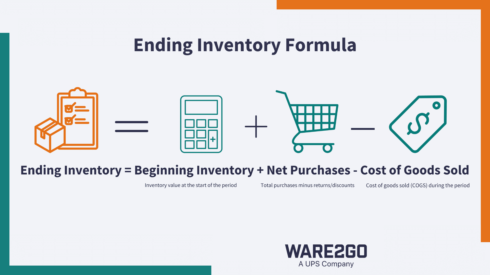

## Table of Contents

## What is ending inventory and why is it important for businesses?

Ending inventory is the value of goods that a business has in stock at the end of an accounting period. It includes all the products that are ready to be sold but have not been sold yet. This number is important because it helps businesses know how much they have left to sell and how much they need to order for the next period.

Knowing the ending inventory is crucial for businesses because it affects their financial statements and helps them plan for the future. For example, if a business has a high ending inventory, it might mean they need to sell more or order less next time. On the other hand, a low ending inventory might mean they need to order more to meet customer demand. By keeping track of ending inventory, businesses can make better decisions about buying, selling, and managing their stock.

## How do you calculate ending inventory using the basic formula?

To calculate ending inventory, you start with the inventory you had at the beginning of the period. Then, you add any new inventory you bought during that time. After that, you subtract the inventory that you sold. The simple formula for this is: Ending Inventory = Beginning Inventory + Purchases - Cost of Goods Sold.

This calculation helps businesses know exactly what they have left at the end of a period. It's important because it tells them if they need to order more products or if they have too much stock. By understanding their ending inventory, businesses can make better plans for the future and keep their operations running smoothly.

## What are the different methods used to value ending inventory?

There are three main methods to value ending inventory: FIFO, LIFO, and the weighted average cost method. FIFO stands for "First In, First Out." It means that the first items bought are the first ones sold. So, the cost of the oldest inventory is used to calculate the ending inventory value. LIFO means "Last In, First Out." Here, the newest items bought are considered sold first. The cost of the most recent inventory is used to find the ending inventory value. The weighted average cost method takes the average cost of all the items in inventory to value the ending inventory.

Each method can affect a business's financial statements differently. FIFO usually shows a higher ending inventory value when prices are going up because it uses older, lower costs. This can make profits look higher. LIFO, on the other hand, can show a lower ending inventory value during rising prices because it uses newer, higher costs. This can make profits look lower. The weighted average cost method smooths out price changes and gives a middle ground between FIFO and LIFO. Businesses choose the method that best fits their needs and helps them manage their finances well.

## Can you explain the First-In, First-Out (FIFO) method and its impact on ending inventory valuation?

The First-In, First-Out (FIFO) method is a way to value ending inventory that assumes the first items bought are the first ones sold. Imagine you own a store and you buy new products all the time. With FIFO, when you sell something, you consider it as selling the oldest product in your stock first. So, if you started with apples bought at $1 each and later bought more at $1.20 each, the apples sold would be counted as the $1 ones first.

Using FIFO can affect how much your ending inventory is worth, especially when prices are going up. If prices rise over time, the cost of the items left in your inventory will be based on the newer, higher prices. This means your ending inventory value will be higher because it's made up of the more expensive, recently bought items. This can make your profits look higher too, since the cost of goods sold is lower, using the older, cheaper prices. So, FIFO can make your business look more profitable on paper when prices are increasing.

## How does the Last-In, First-Out (LIFO) method work and when might it be advantageous to use it?

The Last-In, First-Out (LIFO) method is a way to value ending inventory where you assume the last items you bought are the first ones you sell. It's like if you keep adding new boxes of cereal to the front of a shelf, and when someone buys one, they take from the front. So, if you bought cereal at $2 a box recently and had older cereal at $1.50 a box, the cereal you sell would be counted as the $2 ones first. This means the cost of goods sold will be based on the newer, higher prices, and the ending inventory will be valued using the older, lower prices.

LIFO can be advantageous to use when prices are going up. Since the cost of goods sold is higher with LIFO (because it uses the newer, more expensive items first), it can lower the profit on paper. This might sound bad, but it can actually help businesses save on taxes because lower profits mean less tax to pay. Also, LIFO can be good for businesses that want to show a more conservative financial position, as it makes their ending inventory value lower and their profits look smaller. This method is especially useful in industries where inventory costs change a lot, like in oil and gas or car manufacturing.

## What is the Weighted Average Cost method and how is it applied to ending inventory?

The Weighted Average Cost method is a way to value ending inventory that takes the average cost of all the items you have. It's like if you mixed all your costs together and used that average number to figure out what your inventory is worth. To find the average cost, you add up the total cost of all the items you bought and divide it by the total number of items. Then, you use this average cost to value the ending inventory.

Using the Weighted Average Cost method can be helpful when the prices of your items keep changing. It smooths out those changes and gives you a middle ground between other methods like FIFO and LIFO. This way, your ending inventory value won't jump around as much when prices go up or down. It's a good choice if you want a steady and fair way to value your inventory.

## How does the Specific Identification method differ from other inventory valuation methods?

The Specific Identification method is different from other inventory valuation methods because it tracks each item in inventory individually. Instead of using averages or assuming a certain order of sales, this method keeps a record of the cost of each specific item. For example, if you sell jewelry, you would know exactly which piece was sold and at what price it was bought. This method is useful for businesses that sell unique or high-value items where each item can be easily identified and tracked.

Unlike FIFO, LIFO, or the Weighted Average Cost methods, the Specific Identification method does not make any assumptions about which items are sold first. This means that the cost of goods sold and the ending inventory value will directly reflect the actual items sold and the items left in stock. This method can be more accurate but also more time-consuming and costly to manage, especially for businesses with large inventories of similar items. It's most practical for businesses dealing with items that have serial numbers or other unique identifiers.

## What are the tax implications of choosing different inventory valuation methods?

Choosing different inventory valuation methods can affect how much tax a business has to pay. When prices are going up, using the FIFO method can make your ending inventory value higher because it's based on the newer, more expensive items. This means your profits will look higher too, which can lead to paying more taxes. On the other hand, using the LIFO method can lower your ending inventory value because it's based on older, cheaper items. This makes your profits look smaller, so you might pay less in taxes.

The Weighted Average Cost method usually falls somewhere in between FIFO and LIFO. It smooths out the price changes, so your ending inventory value and profits won't swing as much. This can lead to a more stable tax situation, but it won't give you the tax savings that LIFO might during times of rising prices. The Specific Identification method, which tracks each item individually, can be accurate but might not give a clear tax advantage one way or the other. It all depends on which items you sell and when. So, businesses need to think carefully about which method to use because it can make a big difference in their tax bill.

## How can changes in inventory valuation methods affect financial statements and business decisions?

Changing inventory valuation methods can really change how a business looks on paper. If a company switches from FIFO to LIFO during a time when prices are going up, their ending inventory value will go down. This is because LIFO uses the cost of the newest, more expensive items for the cost of goods sold, leaving the older, cheaper items in inventory. This makes profits look smaller, which can lower the taxes the business has to pay. But it also makes the company's financial health look less good because of the lower profits and inventory value. On the other hand, switching to FIFO can make the ending inventory value and profits look bigger, which might make the business look more successful but could lead to paying more taxes.

These changes can also affect the decisions business owners make. If a company uses LIFO and sees lower profits, they might decide to cut costs or hold off on big investments to save money. They might also think about ordering less inventory if they see their stock value is low. On the flip side, if they switch to FIFO and see higher profits, they might feel more confident to invest in growing the business or buying more stock. It's important for business owners to understand how these methods can change their financial statements because it can guide their planning and decision-making.

## What are the International Financial Reporting Standards (IFRS) guidelines on inventory valuation?

The International Financial Reporting Standards (IFRS) have specific rules about how businesses should value their inventory. According to IFRS, businesses can use either the FIFO method or the weighted average cost method to value their inventory. The LIFO method is not allowed under IFRS. This means that if a company follows IFRS, they can't use LIFO to figure out how much their inventory is worth at the end of a period. The goal of these rules is to make sure that financial statements are clear and easy to compare across different countries.

IFRS also says that businesses need to value their inventory at the lower of cost or net realizable value. This means that if the cost of the inventory is higher than what you can sell it for, you should use the lower selling price to value it. This rule helps make sure that businesses don't overvalue their inventory, which can give a more realistic picture of their financial health. By following these guidelines, companies can make sure their financial reports are accurate and useful for investors and other people who look at their numbers.

## How do you handle obsolete or damaged goods in ending inventory calculations?

When you have obsolete or damaged goods, you need to take them out of your ending inventory calculations. Obsolete goods are items that are too old or out of date to sell, and damaged goods are items that got broken or messed up. You can't count these items as part of your ending inventory because they won't bring in any money when you try to sell them. So, you need to figure out how much these goods cost you and subtract that from your total inventory value.

To do this, first, you check your inventory and find all the obsolete or damaged items. Then, you look at your records to see how much you paid for these items. Once you know their cost, you subtract it from your total inventory value. This gives you a more accurate picture of what your ending inventory is really worth. By doing this, you make sure your financial statements show the true value of the goods you can actually sell.

## What advanced techniques or software can be used to optimize ending inventory management and valuation?

Advanced techniques and software can help businesses manage and value their ending inventory more effectively. One popular method is using an Enterprise Resource Planning (ERP) system. ERP systems bring together all parts of a business, like inventory, sales, and finance, into one place. This makes it easier to keep track of inventory levels in real-time and helps businesses make better decisions about ordering and selling. ERP systems can also use complex calculations to value inventory using different methods like FIFO or weighted average cost, making sure the numbers are accurate and up-to-date.

Another useful tool is inventory management software. This type of software helps businesses keep an eye on their stock levels, track sales, and predict future needs. It can alert you when inventory is running low or when there's too much of something, helping to prevent overstocking or running out of popular items. Some inventory management software even uses [artificial intelligence](/wiki/ai-artificial-intelligence) (AI) to analyze sales data and suggest the best times to reorder products. By using these advanced tools, businesses can optimize their ending inventory, making sure it's valued correctly and managed efficiently.

## What is the importance of understanding ending inventory?

Ending inventory, also referred to as closing inventory, is an essential element of financial reporting, playing a pivotal role in assessing a company's financial health and operational efficiency. It encompasses the value of goods that remain unsold at the end of an accounting period, reflecting a business's capability to manage its stock effectively. This value is not only integral to the balance sheet but also critically impacts other financial statements, particularly the income statement through its relationship with the cost of goods sold (COGS).

The relationship between ending inventory and COGS is direct and significant. The formula to calculate COGS in a basic inventory accounting system is:

$$
\text{COGS} = \text{Beginning Inventory} + \text{Purchases} - \text{Ending Inventory}
$$

In this calculation, ending inventory is subtracted from the sum of beginning inventory and purchases, directly influencing the cost of goods sold. A higher ending inventory value decreases COGS, potentially inflating gross profit. Conversely, a lower ending inventory increases COGS, which may erode gross profit margins. Therefore, precise computation of ending inventory is critical for accurate financial reporting and performance measurement.

Inaccurate ending inventory figures can lead to skewed financial statements, posing challenges for compliance and taxation. For example, overstating ending inventory results in lower COGS and higher reported profits than actually achieved, potentially increasing tax liabilities. Conversely, understating ending inventory produces opposite effects, decreasing net income and could lead to tax underpayment issues.

Furthermore, knowing the exact value of ending inventory aids in assessing a company’s [liquidity](/wiki/liquidity-risk-premium) and inventory turnover—a measure of how quickly inventory is sold and replaced over a period. Businesses with inefficient ending inventory management might face challenges such as overstocking, leading to increased holding costs, or stockouts, which can halt sales and negatively impact customer satisfaction.

In sum, ending inventory is more than merely a balance sheet entry; it's a vital indicator of a company's financial stability and operational prowess. Accurate determination and reporting are paramount not only for compliance and tax considerations but also for strategic decision-making in purchasing, production, and sales planning.

## What are the methods for calculating ending inventory?

In supply chain management, accurately calculating ending inventory is essential for obtaining precise financial statements and guiding strategic business decisions. Various methods exist for calculating ending inventory, each with its unique benefits and considerations.

**Physical Count Method:** This method necessitates a manual counting of every item in stock at the end of an accounting period. Though it provides an accurate inventory count, the process is often time-consuming and labor-intensive, making it best suited for businesses with manageable inventory levels or when precise accuracy is crucial.

**Weighted Average Cost Method:** This method determines the average cost of all inventory items available for sale during a period. The average cost per unit is calculated by dividing the total cost of goods available for sale by the total units available for sale. The formula is:

$$
\text{Weighted Average Cost Per Unit} = \frac{\text{Cost of Goods Available for Sale}}{\text{Total Units Available for Sale}}
$$

This average cost is then used to value ending inventory. The Weighted Average Cost Method is beneficial for businesses with a homogeneous inventory mix and frequent inventory movement, providing a smooth approximation of inventory value over time.

**FIFO (First-In, First-Out):** The FIFO method assumes that the first items purchased are the first to be sold, meaning the ending inventory comprises the most recently purchased goods. Under inflationary conditions, FIFO results in a higher ending inventory value and lower cost of goods sold, which can lead to higher reported profits. This method is advantageous for perishable goods where older inventory must be sold first.

**LIFO (Last-In, First-Out):** Contrarily, LIFO assumes that the last items purchased are the first to be sold, meaning the ending inventory comprises older stock. During periods of rising prices, LIFO results in a lower ending inventory value and a higher cost of goods sold, reducing taxable income. This method benefits industries that experience significant price changes and wish to lower tax liabilities.

**Retail Inventory Method:** This method is useful for retailers. It estimates ending inventory by calculating the cost-to-retail price ratio. By applying this ratio to the ending inventory at retail prices, businesses can approximate the ending inventory at cost:

$$
\text{Ending Inventory at Cost} = \text{Ending Inventory at Retail} \times \text{Cost-to-Retail Ratio}
$$

This method is practical for retailers needing quick interim financial assessments without undertaking a full inventory count.

**Gross Profit Method:** Widely used for interim financial statements, the Gross Profit Method estimates ending inventory by using the historical gross profit margin. It calculates the cost of goods sold and deducts it from the cost of goods available for sale, deriving the ending inventory cost. This approach is less precise and should generally be supplemented with physical counts or other methods for accuracy.

Each method provides different perspectives on inventory valuation, offering businesses flexibility in adapting to their specific financial and operational needs. Selecting the appropriate method is crucial for reflecting accurate financial conditions and guiding inventory management strategies.

## What are the best practices for optimizing ending inventory?

Regular physical counts and cycle counting are foundational practices for ensuring inventory accuracy. Engaging in regular physical counts involves systematically verifying the inventory through a manual count, often supplemented by technological tools such as barcode scanners to enhance speed and accuracy. This foundational activity prevents discrepancies in inventory records, which can cause financial misstatements and operational inefficiencies. Alternatively, cycle counting involves counting a small portion of the inventory regularly throughout the year, allowing continuous verification without the significant operational disruption of a full inventory count.

Implementing ABC Analysis is another strategic approach. This method categorizes inventory into three classes: A, B, and C. Category A includes items with the highest value but typically lower in quantity; B includes items with moderate value and quantity; and C encompasses items with the lowest value but the highest quantity. This categorization helps prioritize management efforts, ensuring that the most critical stock is continuously monitored and optimally maintained.

Just-in-Time (JIT) inventory principles further optimize inventory levels by ensuring that goods are only purchased or produced as needed for imminent sale or use. The goal of JIT is to minimize carrying costs and reduce excess stock, thereby enhancing capital efficiency. This requires stable supplier relationships and precise demand prediction to avoid shortages.

Maintaining safety stock levels is another critical practice. Safety stock acts as a buffer against demand variability and supply chain disruptions. The precise amount of safety stock held depends on several factors, including lead time variability and demand fluctuations. A common formula to determine safety stock is:

$$
\text{Safety Stock} = Z \times \sigma_{LT} \times \sqrt{\text{LT}}
$$

where $Z$ is the desired service level (from the normal distribution), $\sigma_{LT}$ is the standard deviation of lead time demand, and $\text{LT}$ is the lead time.

Finally, demand forecasting is an essential process for adjusting inventory levels to align with market trends. Reliable forecasting uses historical data and market analysis to anticipate future demand, which enables better procurement and production scheduling. Technologies such as [machine learning](/wiki/machine-learning) can enhance forecast accuracy. In Python, libraries like Pandas for data manipulation and Scikit-learn for model implementation offer robust tools for improving demand forecasts:

```python
import pandas as pd
from sklearn.ensemble import RandomForestRegressor
from sklearn.model_selection import train_test_split

# Sample data loading
data = pd.read_csv('sales_data.csv')
features = data[['feature1', 'feature2', 'feature3']]
target = data['demand']

# Splitting data
X_train, X_test, y_train, y_test = train_test_split(features, target, test_size=0.2, random_state=42)

# Model training
model = RandomForestRegressor()
model.fit(X_train, y_train)

# Predict future demand
predictions = model.predict(X_test)
```

By implementing these best practices, businesses can effectively manage ending inventory, ensure operational efficiency, and enhance financial performance.

## References & Further Reading

[1]: Bergstra, J., Bardenet, R., Bengio, Y., & Kégl, B. (2011). ["Algorithms for Hyper-Parameter Optimization."](https://dl.acm.org/doi/10.5555/2986459.2986743) Advances in Neural Information Processing Systems 24.

[2]: ["Advances in Financial Machine Learning"](https://www.amazon.com/Advances-Financial-Machine-Learning-Marcos/dp/1119482089) by Marcos Lopez de Prado

[3]: ["Evidence-Based Technical Analysis: Applying the Scientific Method and Statistical Inference to Trading Signals"](https://www.amazon.com/Evidence-Based-Technical-Analysis-Scientific-Statistical/dp/0470008741) by David Aronson

[4]: ["Machine Learning for Algorithmic Trading"](https://github.com/stefan-jansen/machine-learning-for-trading) by Stefan Jansen

[5]: ["Quantitative Trading: How to Build Your Own Algorithmic Trading Business"](https://github.com/LucindaYa/quant-resources/blob/master/Quantitative%20Trading%20How%20to%20Build%20Your%20Own%20Algorithmic%20Trading%20Business.pdf) by Ernest P. Chan