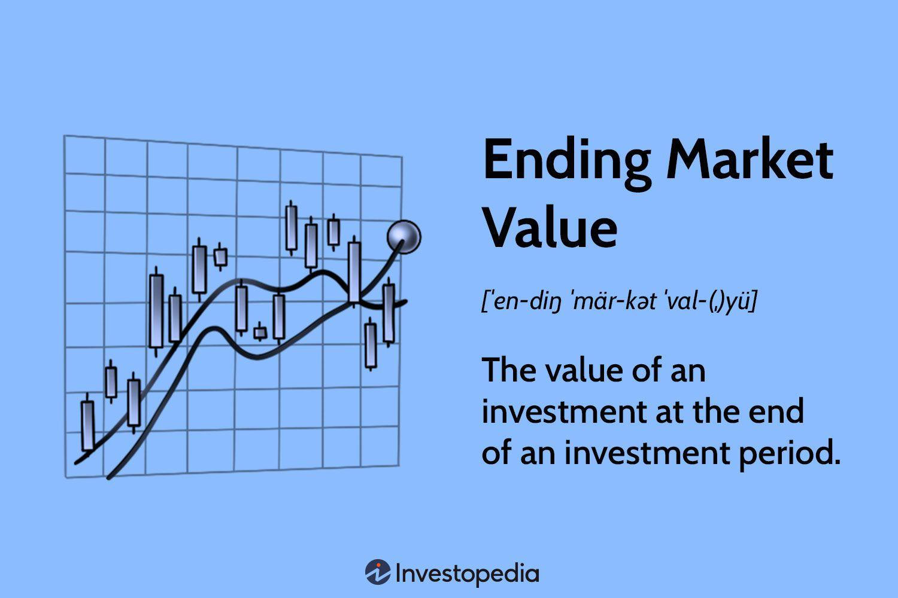

In the rapidly changing financial landscape, understanding the intricacies of investment analysis and algorithmic trading is critical. As investors navigate a dynamic market environment, assessing the Ending Market Value (EMV) of investments becomes essential for informed decision-making. EMV, which calculates the value of an investment at the end of a specified period, serves as a fundamental metric in evaluating investment performance and aligning strategies with market realities.

The significance of EMV lies in its ability to provide investors with a clear picture of how their assets have appreciated or depreciated over time. This metric aids in the accurate financial reporting of investment portfolios, ensuring that all assets are marked to their current market value. Such precision is crucial for maintaining transparency and fostering trust among stakeholders.



In parallel, algorithmic trading has revolutionized investment strategies by leveraging financial calculations to automate and optimize trade execution. Through pre-set criteria and sophisticated algorithms, investors can swiftly respond to market changes, enhancing trade efficiency and minimizing human error. The integration of EMV within algorithmic trading systems allows for a proactive adjustment to market fluctuations, ensuring investment strategies remain robust in varying financial conditions.

Readers will gain insights into the intersection of EMV and algorithmic trading, exploring how this synergy influences modern financial decision-making. By mastering financial metrics and understanding algorithmic methodologies, investors can enhance their strategic approach, navigating complex market dynamics with greater confidence and accuracy.

## Table of Contents

## Understanding Ending Market Value (EMV)

Ending Market Value (EMV) is a financial metric that signifies the value of an investment at the end of a specified period. This measure is essential for aligning investments with their current market value, ensuring precise financial reporting and analysis. EMV is a critical tool in accounting and private equity, offering invaluable insights into the performance of investments over time.

EMV is particularly useful in assessing how an investment has performed from the beginning of the period to the conclusion. This involves a historical analysis of market values, which is crucial for understanding both growth and depreciation prospects of specific securities or entire portfolios. Accurately calculating EMV allows investors to make informed decisions based on the relative change in an investment's value, thereby supporting effective portfolio management and strategic planning.

Moreover, EMV serves as a benchmark for evaluating investment strategies and outcomes, providing transparent and measurable data points to assess financial gains or losses. This metric assists in identifying trends, forecasting future market movements, and maintaining compliance with financial reporting standards, all of which are vital for investors, analysts, and auditors.

## Calculating EMV

The Ending Market Value (EMV) determines the value of an investment at the end of a specific period. To calculate EMV, the formula used is:

$$
\text{EMV} = \text{BMV} \times (1 + r)
$$

where BMV represents the Beginning Market Value, and $r$ refers to the interest rate for the period. This calculation provides investors with a clear view of how their investment has grown or depreciated over time.

By employing the EMV formula, investors can evaluate both individual securities and portfolios comprising various asset classes. For instance, a portfolio containing a mix of stocks, bonds, and other instruments can be assessed uniformly, aiding investors in understanding the performance of different assets under unified terms. This assists in comparing diverse investments and making informed decisions based on calculated outcomes. 

Furthermore, implementing this formula simplifies financial analysis, enabling investors to forecast potential growth or losses, and thereby adjust their strategies to optimize returns. Whether dealing with growth investments or income portfolios, calculating EMV offers critical insights that guide decision-making and strategic investment planning.

## Example of EMV Application

Consider a scenario where an investment security has a beginning market value (BMV) of $100,000. The expected annual [interest rate](/wiki/interest-rate-trading-strategies), or rate of return, for this security is set at 10%. To compute the Ending Market Value (EMV) at the conclusion of the investment period, apply the formula:

$$
\text{EMV} = \text{BMV} \times (1 + r)
$$

where:
- $\text{BMV}$ is the Beginning Market Value, $100,000 in this case.
- $r$ is the interest rate, expressed as a decimal, here 0.10 for 10%.

Substituting the values into the formula, the calculation proceeds as follows:

$$
\text{EMV} = 100,000 \times (1 + 0.10) = 100,000 \times 1.10 = 110,000
$$

Thus, the ending market value of the investment would be $110,000.

Such calculations are fundamental for understanding the performance of individual investment securities over time. They also play a crucial role in managing investment portfolios that include a mixture of asset classes such as stocks, bonds, and options. Accurately determining EMV helps investors assess the growth or depreciation in value of their investments, allowing for strategic adjustments based on financial goals and market conditions. Moreover, by using calculations like these, investors can align their portfolios with expected economic shifts and interest rate environments, optimizing financial outcomes.

## Algorithmic Trading and Financial Metrics

Algorithmic trading, often referred to as 'algo trading,’ involves the use of computer algorithms to automate investment strategies according to predefined criteria. This automation allows traders to execute orders rapidly and accurately, leveraging financial metrics to improve trade execution and operational efficiency. A key advantage of [algorithmic trading](/wiki/algorithmic-trading) is its capacity to handle vast amounts of data quickly, enabling traders to act on real-time market conditions and specific financial metrics.

Financial metrics, such as market value and Ending Market Value (EMV), play a crucial role in optimizing the effectiveness of algorithmic trading systems. Market value and EMV provide traders and their algorithms with a current snapshot of investment values. This data is essential for making informed trading decisions, whether selling, purchasing, or holding positions in financial markets. By integrating EMV into algorithmic trading models, traders can evaluate potential changes in market conditions, adjusting their strategies to maximize returns or minimize risks.

In practice, algorithmic trading systems are typically designed using a blend of financial theory and computational techniques. The algorithms are developed in programming languages such as Python, which offer robust libraries for data analysis and financial calculations. Below is an example of a basic Python code snippet illustrating how EMV might be calculated and utilized within a trading algorithm:

```python
def calculate_emv(bmv, interest_rate):
    return bmv * (1 + interest_rate)

def trading_strategy(bmv, interest_rate, market_signal):
    emv = calculate_emv(bmv, interest_rate)
    if market_signal == "buy" and emv > threshold:
        execute_trade("buy", emv)
    elif market_signal == "sell" and emv < threshold:
        execute_trade("sell", emv)
    else:
        hold_position()

# Example usage
bmv = 100000  # Beginning Market Value
interest_rate = 0.10  # 10% interest rate
market_signal = "buy"
threshold = 105000
trading_strategy(bmv, interest_rate, market_signal)
```

Real-time data and calculations form the backbone of successful algorithmic trading strategies. High-frequency trading, a subset of algorithmic trading, showcases the significance of this capability, as it relies on milliseconds to make profitable trades. The precision in calculations, speed of execution, and ability to adjust to market fluctuations are what make algorithmic trading an essential tool in modern finance. By incorporating real-time financial metrics, traders ensure their algorithms respond appropriately to current market environments, thus maintaining competitiveness and effectiveness in dynamic financial markets.

## The Interplay Between EMV and Algo Trading

Ending Market Value (EMV) serves as a crucial data point for algorithmic systems striving to efficiently respond to market dynamics. By encapsulating the financial performance of assets at given intervals, EMV facilitates a foundational metric from which algorithms can gauge market conditions. This metric is particularly valuable for algorithms designed to process and react to large datasets in real-time.

Algorithms can utilize EMV calculations to enhance the speed and accuracy of investment decisions. By automatically updating EMV in light of new information, these systems can swiftly adjust trading strategies to align with current market conditions. For instance, an algorithm might employ EMV as a determinant to either increase or decrease the weight of a particular asset in a portfolio. Python programming is often used to implement this logic. Here is an example code snippet demonstrating how EMV can be integrated into a simple trading algorithm:

```python
def calculate_emv(bmv, rate):
    return bmv * (1 + rate)

def execute_trade(bmv, rate, threshold, is_buy_signal):
    emv = calculate_emv(bmv, rate)
    if emv > threshold and is_buy_signal:
        return "Buy"
    elif emv < threshold and not is_buy_signal:
        return "Sell"
    return "Hold"

# Example
beginning_market_value = 100000
interest_rate = 0.10
threshold_value = 105000
buy_signal = True

action = execute_trade(beginning_market_value, interest_rate, threshold_value, buy_signal)
print(action)  # Output will be "Buy" as the EMV (110,000) exceeds threshold and there's a buy signal
```

The integration of EMV within algorithmic frameworks not only aids in the rapid assessment of market potential but also supports more precise trading outcomes. By considering EMV, algorithms can better quantify asset performance and adjust trades accordingly. This precision in analysis empowers traders to adopt strategies that optimize both the timing and execution of trades, thereby potentially increasing profitability.

The symbiotic relationship between EMV and algorithmic trading underscores the importance of leveraging accurate financial metrics for improved market analysis. As markets continue to evolve, the ability to align algorithmic systems with dynamic financial indicators like EMV will remain an essential aspect of strategic trading success.

## Challenges and Future Trends

Algorithmic trading, despite offering increased efficiency and precision, encounters multiple challenges primarily characterized by market [volatility](/wiki/volatility-trading-strategies) and regulatory concerns. Market volatility can amplify risks, as algorithmic systems may struggle to adapt quickly to sudden price movements, leading to significant financial losses. This stochastic nature of financial markets requires robust risk management strategies to ensure stability and profitability.

Regulatory concerns also pose substantial hurdles for algorithmic trading. The increasing scrutiny by financial authorities aims to prevent market manipulation and ensure transparent operations. Compliance with these regulations demands sophisticated algorithms capable of maintaining ethical trading standards while maximizing performance. Failure to adhere to these can result in legal penalties and damage to an investing firm's reputation.

Looking forward, advancements in [artificial intelligence](/wiki/ai-artificial-intelligence) (AI) and [machine learning](/wiki/machine-learning) present promising avenues for evolution in trading systems. AI-powered algorithms can process massive datasets rapidly, uncovering patterns and insights that were previously elusive. Integrating AI with algorithmic trading could enhance predictive accuracy, allowing traders to anticipate market trends before they emerge. Machine learning models can continuously improve by learning from historical data, offering adaptive strategies that can adjust to changing market conditions.

Python code can simulate such advancements. For instance, implementing an AI-enhanced trading algorithm might involve setting up a [neural network](/wiki/neural-network) to predict stock price movements based on historical data:

```python
import numpy as np
from sklearn.model_selection import train_test_split
from sklearn.neural_network import MLPRegressor

# Sample data: assume we have features X and target y
X = np.array([...])  # Feature matrix
y = np.array([...])  # Target prices

# Split the data into training and testing sets
X_train, X_test, y_train, y_test = train_test_split(X, y, test_size=0.2, random_state=42)

# Initialize a neural network model
model = MLPRegressor(hidden_layer_sizes=(100,), activation='relu', solver='adam', max_iter=500)

# Train the model
model.fit(X_train, y_train)

# Predictions
predicted_prices = model.predict(X_test)
```

These technologies, while innovative, come with their set of challenges, including the need for vast computational resources, data quality assurance, and the management of model interpretability. Investors and trading firms must thus focus on understanding and navigating these challenges to remain competitive. Remaining adaptable and knowledgeable about emerging technologies and regulatory landscapes will be essential to achieving strategic success in the financial markets. 

As AI and machine learning increasingly augment algorithmic trading, the potential for more sophisticated, adaptable, and resilient trading strategies presents an exciting frontier for the industry.

## Conclusion

Mastering financial metrics and algorithmic strategies is indispensable for modern investors navigating a complex and dynamic financial landscape. Understanding the Ending Market Value (EMV) offers a tangible measure that guides investment decisions, providing clarity on the growth or depreciation of investments over time. By accurately marking investments to current market values, EMV enhances the precision with which algorithmic trading systems can operate. This integration allows investors to optimize their strategies by relying on data-driven insights and systematic approaches to trading.

Algorithmic trading leverages the precision provided by EMV calculations to execute trades at optimal points, capitalizing on market efficiencies. By setting predefined criteria and harnessing real-time data, these systems can rapidly respond to market volatility and adjust investment positions accordingly. This capacity for swift adaptation is crucial for maintaining a competitive edge in fast-paced financial markets.

Furthermore, staying informed about emerging trends and technologies is vital for strategic investment success. As financial markets continue to evolve, innovations such as artificial intelligence and machine learning are expected to drive further advancements in trading systems. These technologies promise to refine algorithmic strategies and enhance the accuracy of financial predictions, supporting more robust and informed decision-making.

Investors who maintain their knowledge of these advancements and adapt their approaches accordingly will be well-positioned to thrive in today's highly competitive markets. By emphasizing both financial analysis through metrics like EMV and the strategic implementation of algorithmic trading, investors can navigate the complexities of modern finance with increased confidence and success.

## References & Further Reading

[1]: Bergstra, J., Bardenet, R., Bengio, Y., & Kégl, B. (2011). ["Algorithms for Hyper-Parameter Optimization."](https://proceedings.neurips.cc/paper/2011/file/86e8f7ab32cfd12577bc2619bc635690-Paper.pdf) Advances in Neural Information Processing Systems 24.

[2]: ["Advances in Financial Machine Learning"](https://www.amazon.com/Advances-Financial-Machine-Learning-Marcos/dp/1119482089) by Marcos Lopez de Prado

[3]: ["Evidence-Based Technical Analysis: Applying the Scientific Method and Statistical Inference to Trading Signals"](https://www.amazon.com/Evidence-Based-Technical-Analysis-Scientific-Statistical/dp/0470008741) by David Aronson

[4]: ["Machine Learning for Algorithmic Trading"](https://github.com/stefan-jansen/machine-learning-for-trading) by Stefan Jansen

[5]: ["Quantitative Trading: How to Build Your Own Algorithmic Trading Business"](https://www.amazon.com/Quantitative-Trading-Build-Algorithmic-Business/dp/1119800064) by Ernest P. Chan