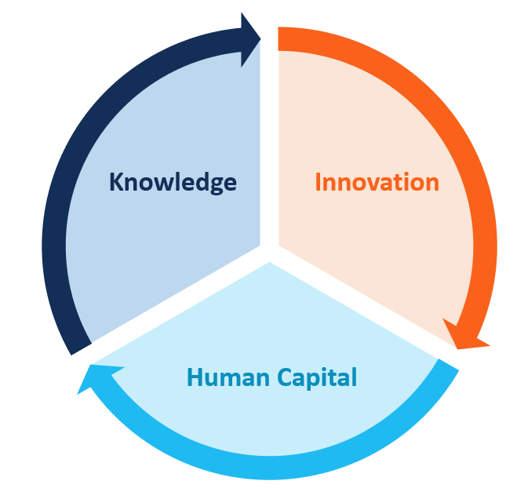

## Table of Contents

## What is Endogenous Growth Theory?

Endogenous Growth Theory is an economic model that explains how economic growth happens within a country. Unlike older models that saw growth as coming from outside factors, this theory says that growth comes from inside the economy. It focuses on things like technology, knowledge, and human skills. These things can grow over time and help the economy get bigger.

A big idea in this theory is that investments in things like education and research can lead to more growth. When people learn more or come up with new ideas, they can create new products or ways of doing things. This can make businesses more productive and the whole economy can benefit. The theory also says that the more people invest in these areas, the faster the economy can grow. It's like a cycle where growth leads to more investment, which leads to even more growth.

## How does Endogenous Growth Theory differ from Exogenous Growth Theory?

Endogenous Growth Theory and Exogenous Growth Theory are two different ways economists explain how economies grow. Exogenous Growth Theory, also known as the neoclassical growth model, says that economic growth comes from factors outside the economy, like technological advances that just happen without anyone really controlling them. In this model, growth is seen as something that happens to the economy, not something the economy can influence much on its own. The main idea is that growth rates will eventually slow down because the benefits of new technology spread out over time.

On the other hand, Endogenous Growth Theory believes that growth comes from within the economy. It focuses on how investments in things like education, research, and development can lead to new ideas and technologies. This theory suggests that the economy can keep growing at a steady rate if people keep investing in these areas. Unlike the exogenous model, endogenous growth theory sees growth as something the economy can actively influence through its own actions, creating a cycle where more investment leads to more growth, which then encourages even more investment.

In simple terms, exogenous growth theory sees economic growth as something that happens to an economy from the outside, while endogenous growth theory sees it as something the economy can create for itself through internal efforts. This difference in perspective leads to different ideas about how to encourage economic growth, with endogenous growth theory putting more emphasis on policies that support education and innovation.

## Who are the key economists associated with Endogenous Growth Theory?

The main economists linked to Endogenous Growth Theory are Paul Romer and Robert Lucas. Paul Romer is really important because he helped start this way of thinking about growth. In the 1980s, he wrote about how ideas and technology could keep an economy growing. He said that if people invest in things like research and education, they can come up with new ideas that make the whole economy better. This was a big change from older ideas about growth, and it helped a lot of other economists start thinking in new ways.

Robert Lucas also played a big part in this theory. He focused on how human skills and knowledge, what he called "human capital," can drive growth. Lucas believed that if people learn more and get better at what they do, the whole economy can grow faster. His ideas fit well with Romer's, and together they helped shape how we think about economic growth today. Both Romer and Lucas showed that growth doesn't just happen by chance; it can come from what people do inside their own economy.

## What are the main components of Endogenous Growth Theory?

Endogenous Growth Theory says that growth comes from inside the economy. It focuses on things like technology, knowledge, and people's skills. The theory believes that when people invest in things like research and education, they can come up with new ideas. These new ideas can make businesses more productive, which helps the whole economy grow. Unlike older theories, Endogenous Growth Theory says that growth can keep going if people keep investing in these areas. It's like a cycle where more investment leads to more growth, which then encourages even more investment.

The main idea is that growth is not just something that happens by chance. It can be influenced by what people do inside their economy. For example, when companies spend money on research, they might invent new products or better ways of doing things. This can make them more efficient and profitable. Also, when people go to school and learn new skills, they can do their jobs better, which helps the economy too. Endogenous Growth Theory says that if a country keeps investing in these kinds of things, it can keep growing over time.

## How does human capital contribute to economic growth according to Endogenous Growth Theory?

Human capital, which means the skills, knowledge, and experience that people have, is really important for economic growth according to Endogenous Growth Theory. This theory says that when people learn more and get better at what they do, they can help the whole economy grow. For example, if someone goes to school and learns how to use new technology, they can do their job better. This makes their company more productive, which can lead to more growth in the economy. The theory believes that if a country keeps investing in education and training, it can keep growing over time.

In simple terms, human capital is like a tool that helps the economy get bigger. When people have more skills and knowledge, they can come up with new ideas and ways of doing things. This can lead to new products or better ways to make things, which can make businesses more successful. Endogenous Growth Theory says that this cycle of learning and growing can keep going if people keep investing in human capital. So, by focusing on education and training, a country can help its economy grow faster and keep growing in the future.

## What role do technological innovations play in Endogenous Growth Theory?

Technological innovations are super important in Endogenous Growth Theory. This theory says that new ideas and technologies can help an economy grow. When people invent new things or find better ways to do stuff, it can make businesses more productive. For example, if someone comes up with a new machine that makes it easier to build cars, the car company can make more cars faster. This helps the company grow and can also help the whole economy because more cars can be sold.

The theory believes that if a country keeps investing in research and development, it can keep coming up with new technologies. This means the economy can keep growing over time. It's like a cycle where more investment leads to more innovations, which then leads to more growth. So, by focusing on creating new technologies, a country can help its economy get bigger and keep growing in the future.

## Can you explain the concept of 'increasing returns to scale' in the context of Endogenous Growth Theory?

Increasing returns to scale is an important idea in Endogenous Growth Theory. It means that when a company or an economy gets bigger, it can produce more stuff without needing to use a lot more resources. For example, if a company doubles the amount of workers and machines it uses, it might be able to make more than double the amount of products. This happens because bigger companies can do things more efficiently. They can use new technologies and ideas that smaller companies might not be able to afford. In Endogenous Growth Theory, this idea helps explain how an economy can keep growing over time if it keeps investing in things like research and education.

This concept is different from the old idea of diminishing returns, where adding more workers or machines would eventually lead to less extra production. In Endogenous Growth Theory, increasing returns to scale means that the economy can keep growing faster if it keeps coming up with new ideas and technologies. When people invest in research and learning, they can create new ways to do things that make the whole economy more productive. This cycle of growth and investment can keep going, helping the economy get bigger and bigger over time.

## How does Endogenous Growth Theory address the issue of diminishing returns?

Endogenous Growth Theory tackles the problem of diminishing returns by focusing on how new ideas and technology can keep an economy growing. Diminishing returns means that if you keep adding more workers or machines, you might not get as much extra production as before. But Endogenous Growth Theory says that if you invest in things like research and education, you can come up with new ways to do things. These new ideas can help businesses be more productive, even if they get bigger. So, instead of slowing down, the economy can keep growing faster because of these new innovations.

This theory suggests that the economy can avoid the problem of diminishing returns by constantly creating new knowledge and technology. When people learn more and come up with new ideas, they can find better ways to use resources. This means that even as the economy grows, it can still produce more without needing a lot more inputs. By focusing on increasing returns to scale, Endogenous Growth Theory shows how an economy can keep growing over time through its own efforts, rather than being limited by diminishing returns.

## What empirical evidence supports Endogenous Growth Theory?

There is some evidence that supports Endogenous Growth Theory. One example is how countries that spend more on research and development tend to grow faster. For instance, studies have shown that countries with higher levels of investment in R&D often have higher rates of economic growth. This fits with the idea that new ideas and technologies can help an economy grow. Another piece of evidence comes from looking at how education affects growth. Countries that invest more in education usually see their economies grow faster. This supports the theory's idea that human capital, or the skills and knowledge people have, can drive economic growth.

More evidence comes from looking at industries and companies. Companies that spend more on innovation and new technology often grow faster than those that don't. This shows that the cycle of investment, innovation, and growth that Endogenous Growth Theory talks about can really happen. Also, when we look at different regions within a country, we often see that areas with more educated people and more research happening tend to have stronger economic growth. All these examples help show that Endogenous Growth Theory's ideas about how growth comes from inside the economy can be seen in the real world.

## How have policy implications been derived from Endogenous Growth Theory?

Endogenous Growth Theory has led to some big ideas about what governments should do to help their economies grow. One main idea is that governments should spend more money on education. This theory says that when people learn more and get better skills, they can help the economy grow. So, policies that make education better and easier to get can help a country's economy. Another policy idea is that governments should support research and development. This means giving money or other help to companies and universities to come up with new ideas and technologies. By doing this, governments can help their economies grow faster because new ideas can make businesses more productive.

Another policy that comes from Endogenous Growth Theory is about encouraging innovation. This can mean things like giving tax breaks to companies that spend money on research or making it easier for new businesses to start up. The theory says that if a country keeps coming up with new ideas, it can keep growing. So, policies that help innovation can be really important. Also, the theory suggests that governments should think about how to spread knowledge and technology around the economy. This can mean helping small businesses get access to new technologies or making sure that everyone can learn about new ideas. By doing these things, governments can help their economies grow in a way that keeps going over time.

## What are the criticisms and limitations of Endogenous Growth Theory?

Some people think Endogenous Growth Theory has problems. One big issue is that it's hard to measure things like human capital and technology. These things are important in the theory, but they can be tricky to put a number on. This makes it tough to test the theory and see if it's right. Another criticism is that the theory might not work the same way in every country. Some places might not have the money or the right setup to invest a lot in research and education. So, what works in one country might not work in another.

Also, some people worry that Endogenous Growth Theory focuses too much on new ideas and technology. They think that other things, like how much people save or how easy it is to start a business, are just as important for growth. Critics say the theory might not explain everything about how economies grow. It's good at showing how new ideas can help, but it might miss other important parts of the story.

## How has Endogenous Growth Theory evolved since its inception?

Since Paul Romer and Robert Lucas first talked about Endogenous Growth Theory in the 1980s, it has changed a lot. At first, the theory was all about how new ideas and technology could help an economy grow. Economists started to see that if people kept investing in things like research and education, the economy could keep growing over time. This was a big change from older ideas that said growth came from outside the economy. As more people started to think about this, they came up with new ways to look at how growth happens. They started to focus more on things like human capital, which means the skills and knowledge people have, and how these things can drive growth.

Over time, Endogenous Growth Theory has gotten more detailed. Economists have added new ideas to the theory, like how different parts of the economy can affect each other. For example, they've looked at how businesses, schools, and governments can work together to help growth. They've also started to think about how things like the environment and social issues can play a role in economic growth. As the theory has grown, it's helped people come up with new ways to help economies grow, like policies that support education and innovation. Even though the theory has changed, it still focuses on the idea that growth comes from inside the economy and can keep going if people keep investing in the right things.

## References & Further Reading

[1]: Romer, P. M. (1990). [Endogenous Technological Change](https://web.stanford.edu/~klenow/Romer_1990.pdf). Journal of Political Economy, 98(5), S71-S102.

[2]: Aghion, P., & Howitt, P. (1992). [A Model of Growth through Creative Destruction](https://www.jstor.org/stable/2951599). Econometrica, 60(2), 323-351.

[3]: Lopez de Prado, M. (2018). [Advances in Financial Machine Learning](https://www.amazon.com/Advances-Financial-Machine-Learning-Marcos/dp/1119482089). Wiley.

[4]: Chan, E. (2013). [Algorithmic Trading: Winning Strategies and Their Rationale](https://github.com/NehrenD/algo_trading_and_quant_strategies). Wiley.

[5]: Schilling, M. A., & Phelps, C. C. (2007). [Interfirm Collaboration Networks: The Impact of Large-Scale Network Structure on Firm Innovation](https://www.jstor.org/stable/20122273). Management Science, 53(7), 1113-1126.

[6]: Jansen, S. (2020). [Machine Learning for Algorithmic Trading](https://github.com/stefan-jansen/machine-learning-for-trading). Packt Publishing.

[7]: Chan, E. P. (2009). [Quantitative Trading: How to Build Your Own Algorithmic Trading Business](https://github.com/ftvision/quant_trading_echan_book). Wiley.

