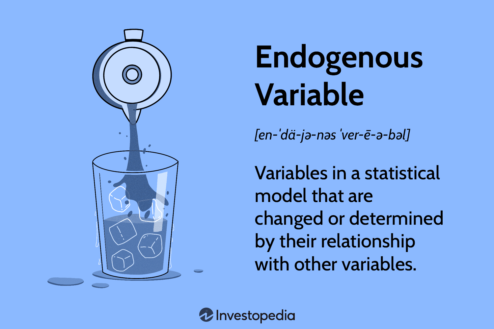

Economics and finance are domains characterized by intricate concepts and models that seek to elucidate the behaviors and outcomes of markets. In this landscape, one of the crucial concepts is the 'endogenous variable'. This concept frequently appears in economic modeling and algorithmic trading, playing a pivotal role in understanding and predicting market dynamics. An endogenous variable is one whose value is determined by other variables within the model, providing insights into the causal relationships that drive economic phenomena.

The significance of understanding endogenous variables lies in their ability to help traders and economists predict market movements and economic outcomes more effectively. By incorporating these variables into models, analysts can gain a clearer view of how different factors within a market or economy interact and influence each other. This understanding is particularly valuable in algorithmic trading, where the ability to accurately model and predict market behaviors can lead to enhanced trading strategies and outcomes.



This article seeks to unpack the concept of endogenous variables, examining their importance in economics and their application in algorithmic trading. By contrasting endogenous variables with exogenous variables, which are determined by factors outside the model, we can enhance our understanding of their unique roles and impacts. Through examples and discussions, we will explore how acknowledging and addressing endogenous variables can lead to more robust models and insights in both economic analysis and trading strategies.

## Table of Contents

## Understanding Endogenous Variables

Endogenous variables are integral components of econometric and financial models, representing elements whose values are influenced by other variables within the same model. In essence, they are recalibrated internally based on the interplay of various dynamics represented in the model. For instance, in a conventional supply and demand framework, the price of a commodity is an endogenous variable. It is not static but varies according to shifts in supply and demand curves.

In the context of econometrics, endogenous variables are often synonymous with dependent variables. Their dependency is not arbitrary but structured, as these variables exhibit a correlation with other factors within the model. This correlation signifies a cause-and-effect relationship, a critical aspect for analysts and economists as they interpret economic dynamics and predict market behaviors. When variables are endogenously determined, it typically denotes that the output is a result of changes in some input variables in the model.

Mathematically, given a simple linear regression model $Y = \beta_0 + \beta_1X + \epsilon$, $Y$ represents an endogenous variable if it is determined within the context of the model by the independent variable $X$ and the error term $\epsilon$. Here, the changes in $X$ have a direct impact on the outcomes for $Y$, illustrating the interdependency that characterizes endogenous variables.

Understanding the role of endogenous variables is crucial for interpreting causality in economic models. Causality, a core principle in economics and financial modeling, emphasizes the relationships where one set of economic activities or variables leads to specific economic outcomes. Endogenous variables are pivotal in identifying such causal relationships as they inherently respond to the variations induced by other elements in the model, allowing practitioners to analyze how different scenarios could unfold under various types of shocks or policy changes.

## Endogenous vs. Exogenous Variables

Contrasting with endogenous variables, exogenous variables are independent elements not influenced by other variables within the model. This distinction is fundamental in econometric modeling, as it helps in identifying the sources of variance within a model.

Exogenous factors are typically external influences impacting the model without being affected by the internal dynamics of the system. Common examples include government policy changes, regulatory impacts, technological advancements, and unexpected market shocks, such as natural disasters or geopolitical events. These factors serve as inputs to the model, driving changes without being subject to feedback from the model's endogenous components.

In a regression model, manipulating endogenous variables allows researchers to observe how changes within the system affect the dependent variables. For instance, if we consider a simple linear regression model represented by:

$$
Y = \beta_0 + \beta_1 X_1 + \beta_2 X_2 + \epsilon
$$

where $Y$ is the dependent variable, $X_1$ might be an endogenous variable (e.g., consumer demand) while $X_2$ might be exogenous (e.g., temperature). The inherent feedback loop within the model allows $X_1$ to reflect changes in $Y$, while $X_2$ remains unaffected by $Y$.

A practical example is the impact of rainfall on agricultural output. Rainfall acts as an exogenous variable affecting crop yield but not directly influenced by the crop production process. On the other hand, the effect of fertilizer on yield is endogenous because it depends on its application rate, which can be adjusted based on observed outcomes, influence by farmers' decisions and strategies.

This distinction is pivotal in correct model specification and avoids biases often introduced by incorrectly treating endogenous variables as exogenous. Analysts often employ statistical techniques and tests, such as Durbin-Wu-Hausman, to detect and address potential endogeneity, thus ensuring more reliable and valid model outcomes.

## Examples of Endogenous Variables

In financial contexts, endogenous variables are vital identifiers of market interdependencies. Stock prices often emerge as classic examples of such variables because they are subject to fluctuations influenced by internal factors like company performance metrics and prevailing market sentiment. For instance, changes in a corporation's revenue, profit margins, or anticipated future growth can directly impact its stock price, indicating that stock price is driven by variables within the system it is being analyzed.

Economically, consumer spending represents a significant endogenous variable, intricately linked to income levels and tax policies. When income increases or tax rates decrease, consumer spending generally tends to rise, reflecting the impact of these internal factors on purchasing patterns. This relationship is critical for economists seeking to understand and forecast economic activities and trends.

In [algorithmic trading](/wiki/algorithmic-trading), trading [volume](/wiki/volume-trading-strategy) can be modeled as an endogenous variable, since it is influenced by the results of previous trades and the availability of new market data. For instance, a trading algorithm might analyze the interdependence between trade volumes and price changes within a particular market. In this scenario, the algorithm anticipates and adapts to changes based on the volume of trades executed and how these affect market dynamics. By programming such interdependencies, trading models can offer refined analysis and prediction capabilities.

By accurately identifying and modeling endogenous variables such as these, analysts and economists can develop more precise and actionable insights into financial systems and economies. This allows for a deeper understanding of how internal and interrelated factors drive the behaviors observed in these complex systems.

## Endogenous Variables in Algorithmic Trading

Algorithmic trading leverages mathematical models and computational algorithms to predict market movements, where the role of endogenous variables is pivotal. Endogenous variables are central within these models as they reflect the interdependencies inherent in financial data, such as the impact of trading decision feedback loops on market variables.

For instance, trading algorithms often regard price movements and trade volumes as interdependent. This relationship suggests that changes in one of these variables can cause fluctuations in the other, thereby identifying both as endogenous variables. When trading volumes increase, it can signal anticipated price changes, highlighting their interconnected nature. Utilizing this interdependency, algorithmic trading strategies can better capture the nuances of market movements.

The QuantConnect platform exemplifies the use of endogenous variables in practical applications. By integrating historical [volatility](/wiki/volatility-trading-strategies) and trading volume into their algorithms, QuantConnect facilitates prediction models that account for past market behaviors to forecast future stock movements. The utilization of endogenous variables allows traders using the platform to refine their strategies by understanding the latent interconnections between various market factors.

Understanding endogeneity in trading systems is crucial for enhancing prediction accuracy. By acknowledging the feedback loop between endogenous variables, trading models can optimize their strategies. This involves the use of sophisticated methods and tools to adjust predictions dynamically as new market data emerges, leading to more robust decision-making frameworks. In essence, integrating endogenous variables into algorithmic trading not only improves model precision but also empowers traders to swiftly adapt to shifting market conditions, thereby optimizing their trading strategies.

## Addressing Endogeneity in Models

Managing endogeneity is essential for ensuring the reliability and accuracy of econometric and financial models. Endogeneity, which arises when a predictor variable is correlated with the error term in a regression model, can lead to biased and inconsistent parameter estimates. To address this issue, econometricians and analysts employ techniques like Instrumental Variables (IV) and Two-Stage Least Squares (2SLS).

Instrumental Variables (IV) are variables that are used as substitutes in models to account for endogeneity. An effective instrument must satisfy two primary conditions: it must be correlated with the endogenous explanatory variable and uncorrelated with the error term in the model. This approach allows for the consistent estimation of causal effects by isolating the variation in the endogenous predictors that is independent of the error term.

Two-Stage Least Squares (2SLS) is a method that extends the IV approach by explicitly using a two-step procedure. In the first stage, the endogenous variables are regressed on the instruments and any other exogenous variables in the model. This step generates predicted values of the endogenous variables that are purged of endogeneity. In the second stage, the original model is re-estimated using these predicted values as replacements for the endogenous variables. This process ensures that the estimates of the coefficients on the endogenous variables are consistent and unbiased. The 2SLS estimator is a popular choice when dealing with simultaneous equation models and is widely used to correct endogeneity in economic applications.

Python libraries, such as `statsmodels`, provide robust implementations of IV and 2SLS techniques, which allow practitioners to address endogeneity with ease. Here's a basic example of how 2SLS can be implemented in Python using `statsmodels`:

```python
import statsmodels.api as sm
from statsmodels.sandbox.regression.gmm import IV2SLS

# Assume y is the dependent variable, x1 is endogenous, x2 is exogenous, z is the instrument

# First stage regression
first_stage = sm.OLS(x1, sm.add_constant(z)).fit()
x1_hat = first_stage.predict(sm.add_constant(z))  # Predicted values of x1

# Second stage regression using predicted values of x1
model_2sls = sm.OLS(y, sm.add_constant(np.column_stack((x1_hat, x2)))).fit()

print(model_2sls.summary())
```

Dealing with endogeneity is a critical task for economists and analysts. Effective management of this issue involves selecting appropriate instruments and methodologies, which leads to more precise modeling and reliable predictions. This not only enhances the robustness of economic and financial models but is also crucial for deriving valid policy recommendations and strategic decisions in complex economic environments.

## Conclusion

Endogenous variables are crucial for understanding the intricate web of economic and financial relationships, particularly in systems as dynamic and volatile as the stock market. By recognizing and accurately addressing the issue of endogeneity in models, analysts can significantly enhance the predictive power of these models. This understanding allows for the development of strategies that not only yield more accurate predictions of market movements but also furnish deeper insights into economic behavior.

In practice, incorporating models that account for endogenous variables enables traders and economists to optimize their decision-making processes. These models consider the internal causality and interdependencies within the system, allowing for more nuanced analyses. For instance, in a stock market context, understanding how factors like investor sentiment and trading volume (endogenous variables) impact stock prices can guide strategic trading decisions.

Furthermore, the interplay between endogenous and exogenous variables provides a comprehensive perspective on market and economic phenomena. While endogenous variables are influenced by the internal workings of the model, exogenous variables bring in factors from outside the system, like governmental policy changes or international economic events, which can drastically alter market conditions. Together, these variables allow models to capture a full spectrum of influences, leading to a more holistic and robust analysis.

In summary, the integration of endogenous variables into economic and financial models is essential for the precision and effectiveness of analytical strategies. Addressing endogeneity is not merely a technical task but a fundamental necessity to produce reliable forecasts and strategic insights, providing a more comprehensive understanding of market dynamics and economic systems.

## References & Further Reading

[1]: Enders, W. (2014). *Applied Econometric Time Series*. Wiley.

[2]: Wooldridge, J. M. (2019). *Introductory Econometrics: A Modern Approach*. Cengage Learning.

[3]: Tsay, R. S. (2010). *Analysis of Financial Time Series*. Wiley.

[4]: Morales, E. F. (2001). [*"Algorithmic trading systems: Understanding endogeneity."*](https://www.sciencedirect.com/science/article/pii/S0378426621000480) Journal of Economic Dynamics and Control.

[5]: Stock, J. H., & Watson, M. W. (2015). *Introduction to Econometrics*. Pearson.

[6]: Angrist, J. D., & Pischke, J. S. (2008). *Mostly Harmless Econometrics: An Empiricist's Companion*. Princeton University Press.

[7]: Hamilton, J. D. (1994). *Time Series Analysis*. Princeton University Press.

[8]: Hansen, L. P. (1982). ["Large sample properties of generalized method of moments estimators."](https://www.jstor.org/stable/1912775) Econometrica. 

[9]: Hastie, T., Tibshirani, R., & Friedman, J. (2009). *The Elements of Statistical Learning: Data Mining, Inference, and Prediction*. Springer. 

[10]: Campbell, J. Y., Lo, A. W., & MacKinlay, A. C. (1997). *The Econometrics of Financial Markets*. Princeton University Press.