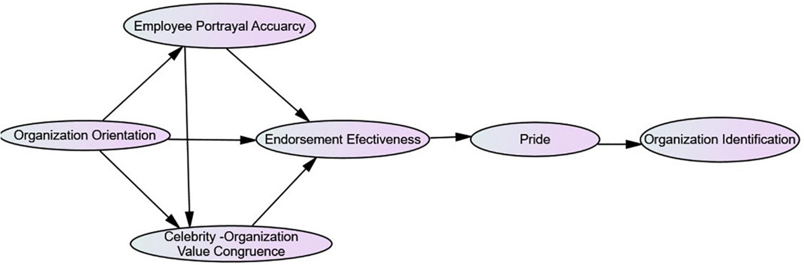

Algorithmic trading and marketing endorsers represent two distinct yet interconnected areas within the financial markets. The rapid advancements in technology have ushered in a new era where algorithmic trading is not only a domain for large institutions but has also become accessible to individual traders. This access enables them to benefit from automated trading strategies driven by complex algorithms and sophisticated data analysis. Algorithmic trading relies on the use of computer programs to follow a defined set of instructions (an algorithm) to place a trade, aiming for as high a profit as possible at speeds and frequencies that a human trader cannot match. These systems can analyze multiple markets and execute trades at a speed and frequency that are impractical for human traders to duplicate.

Simultaneously, marketing endorsers play a crucial role in promoting these cutting-edge technologies. Endorsers are individuals or organizations that use their influence and credibility to support products or services, effectively bridging the gap between complex algorithmic trading technologies and potential users. In today's digital age, marketing endorsers can amplify the reach and visibility of trading platforms, making them more attractive to both new and seasoned traders.

This article aims to provide a comprehensive guide on the best practices for using marketing endorsers in the context of algorithmic trading. By understanding how to effectively merge the technical aspects of algorithmic trading with strategic endorsements, traders and organizations can enhance their market reach and operational efficiency. This combination is essential in a fast-paced industry where staying ahead of the competition requires both innovative trading solutions and impactful marketing strategies.

Understanding these best practices not only helps maximize brand visibility and user engagement but also ensures a disciplined approach to introducing trading technologies to the market. As the financial industry continues to evolve, both algorithmic trading and marketing endorsements will play integral roles in shaping the future landscape, urging continuous learning and adaptation.

## Table of Contents

## Understanding Marketing Endorsers in Algorithmic Trading

Marketing endorsers are pivotal in enhancing the reach and comprehension of algorithmic trading solutions. By leveraging their credibility, endorsers can effectively connect complex trading technologies with potential users, facilitating a smoother user experience. In the realm of algorithmic trading, where technical jargon and sophisticated models often dominate, endorsers play a crucial role in simplifying these concepts for a broader audience.

Endorsers contribute significantly by offering testimonials that provide personal insights into the effectiveness and benefits of trading platforms. Such endorsements often serve as a bridge, reducing the perceived risk associated with adopting new technologies. By sharing authentic experiences, endorsers help demystify algorithmic strategies, making them more accessible to non-expert users. Moreover, the educational component of an endorsement cannot be overstated. Through explainer videos, webinars, and social media engagement, endorsers can elucidate how algorithmic trading solutions can be integrated into existing financial strategies, thereby enhancing user knowledge and confidence.

Choosing the appropriate endorser is a strategic decision that involves assessing several factors such as credibility, market relevance, and their digital influence. Credibility is paramount; an endorser with a strong reputation in finance or technology can lend significant weight to the promotion of [algorithmic trading](/wiki/algorithmic-trading) products. Market relevance ensures that the endorser resonates with the target demographic, thus enhancing the reach of the endorsement. Additionally, an endorser's influence across social media platforms and financial forums determines their ability to effectively engage potential users.

An effective endorser must possess the ability to translate complex algorithmic trading concepts into digestible and relatable insights. This requires an understanding of both the technical aspects of algorithmic trading and the communication skills to convey these aspects meaningfully. The ability to simplify intricate concepts such as algorithmic models, [backtesting](/wiki/backtesting), and execution speed is essential for relatability. This can assist potential users in recognizing the practical benefits of algorithmic trading, ultimately aiding in informed decision-making.

In conclusion, marketing endorsers serve as valuable conduits in the dissemination of algorithmic trading solutions to a wider audience. By skillfully navigating the complexities of finance and communication, endorsers create a favorable environment for the adoption and understanding of algorithmic trading technologies.

## Best Practices for Engaging Marketing Endorsers

Engaging marketing endorsers effectively in the context of algorithmic trading requires strategic alignment and thoughtful execution. A primary step in ensuring successful engagement is to identify target audience demographics and align endorser profiles accordingly. By understanding the specific interests, age groups, and professional backgrounds of the intended audience, firms can select endorsers who resonate well and can communicate effectively with that audience subset.

Transparency is paramount in the relationship between the endorsers and the algorithmic trading firm. Clear disclosure of any financial or material relationships builds trust and fulfills legal obligations. This not only strengthens the credibility of the endorsement but also aligns with ethical marketing practices.

Focusing on authentic and experience-based endorsements is crucial. Authenticity ensures that the endorser genuinely supports the algorithmic trading service, which enhances trust among potential users. An endorsement based on personal experience or detailed understanding of the services is more impactful and believable, thereby fostering a strong connection with the target audience.

Providing endorsers with comprehensive knowledge of the algorithmic products is vital. This can be achieved through detailed briefings, hands-on experience with the trading platforms, or access to data and performance metrics. Well-informed endorsers are better equipped to communicate the benefits and nuances of the trading solutions, contributing to a more convincing promotion.

Regular monitoring and measurement of the impact of endorsement activities on brand awareness and user engagement are essential for success. This can involve various metrics like social media engagement rates, website traffic analysis, and conversion tracking. Tools such as Google Analytics or social media insights can offer valuable data to evaluate the effectiveness of the endorsements. By assessing these metrics, firms can identify successful strategies and adapt them to improve future endorsement campaigns.

In summary, engaging marketing endorsers effectively requires a strategic approach that involves audience alignment, transparency, authenticity, comprehensive product knowledge, and diligent monitoring and measurement, all of which contribute significantly to the growth and acceptance of algorithmic trading solutions in the market.

## Algorithmic Trading Best Practices Leveraged by Endorsers

In the context of algorithmic trading, marketing endorsers play a crucial role by effectively communicating the value of trading solutions to a wider audience. A key aspect they can highlight is the rigorous backtesting and optimization processes that underpin many algorithmic trading strategies. Endorsers can illustrate how these processes involve historical data analysis to test the viability and performance of a trading algorithm before it is deployed in live markets. By leveraging statistical techniques and computational resources, backtesting helps in fine-tuning strategies to maximize returns and manage risks.

Endorsers can also stress the importance of continuous learning and adaptation inherent in algorithmic trading strategies. The financial markets are dynamic, and algorithms must accommodate evolving patterns and trends. This involves regular updates and improvements to algorithms based on new data and insights. Endorsers can convey how continuous learning frameworks, such as [machine learning](/wiki/machine-learning) algorithms, are utilized to keep strategies up-to-date and effective. These practices ensure that trading algorithms remain competitive by learning from both successes and failures.

Another critical area that endorsers can focus on is promoting a disciplined approach to algorithmic trading. This includes emphasizing risk management and diversification strategies. Risk management involves setting stop-loss limits, employing hedging strategies, and using position sizing techniques to protect against significant losses. Diversification, on the other hand, spreads out risk across various instruments and markets to mitigate exposure. Endorsers can explain how these disciplined strategies are integral to maintaining a stable and profitable trading system.

Marketing the value proposition of algorithmic trading platforms also entails highlighting features such as low latency execution and advanced analytics. Low latency ensures that trades are executed almost instantaneously, which is vital in high-frequency trading environments where speed is a critical [factor](/wiki/factor-investing). Advanced analytics, including real-time data processing and predictive modeling, provide traders with deeper insights into market movements. Endorsers can illuminate these technological advantages, demonstrating how they contribute to aligning trading actions with market opportunities.

Lastly, educating potential users about the operational and technical support provided by trading platforms is essential. Endorsers can showcase how these platforms offer comprehensive resources such as technical support, user-friendly interfaces, educational materials, and webinars. Providing adequate support ensures that traders can effectively use the trading tools and take full advantage of their features, thereby enhancing user satisfaction and adoption of algorithmic trading solutions.

## Legal and Ethical Considerations in Endorsements

In the context of algorithmic trading, ensuring compliance with marketing and advertising regulations is essential for maintaining trust and integrity in financial markets. Regulations such as the Financial Industry Regulatory Authority (FINRA) guidelines in the United States, the Financial Conduct Authority (FCA) rules in the United Kingdom, and the European Securities and Markets Authority (ESMA) requirements in Europe mandate transparency and accountability in advertising financial products[1].

One of the primary requirements under these regulations is the disclosure of financial relationships between endorsers and algorithmic trading firms. Transparency allows potential users to assess the objectivity of the endorsements being made. For instance, if an endorser receives compensation or other benefits, this must be clearly communicated to prevent misleading the audience about the endorser's impartiality.

Promoting ethical advertising practices is critical to maintaining consumer trust. Endorsements must accurately reflect the capabilities and limitations of algorithmic trading platforms. Overstating performance, downplaying risks, or providing biased testimonials can lead to reputational damage and legal penalties. Thus, algorithmic trading firms and endorsers should ensure that all promotional content adheres to local and international standards governing truth in advertising.

Misrepresentation of trading capabilities could lead to significant consumer harm, as algorithmic trading involves complex financial instruments that [carry](/wiki/carry-trading) inherent risks. Endorsers must avoid implying guaranteed outcomes or certainty of returns, which could result in users having unrealistic expectations. Instead, disclaimers and clarifications about the volatile nature of the trading environment should be prominently featured in communications.

Furthermore, endorsers should be encouraged to provide balanced viewpoints, acknowledging the potential risks associated with algorithmic trading. This includes discussing the possibility of financial loss, the need for rigorous risk management strategies, and the importance of thorough market research and continuous strategy evaluation. By presenting a holistic picture, endorsers can help consumers make informed decisions, contributing to a more transparent and fair financial ecosystem.

Endorsers can leverage these practices to foster a culture of openness and reliability, reinforcing the credibility of both the endorsement and the algorithmic trading firm.

### References

1. U.S. Securities and Exchange Commission. (2021). "Advertising and Marketing Rules for Financial Markets: An Overview." [SEC Website](https://www.sec.gov/)

## Measuring the Impact of Endorsement on Algorithmic Trading

To effectively measure the impact of endorsements on algorithmic trading, various strategies and tools can be employed to assess changes in engagement, market reach, and overall business performance. The integration of analytics tools is crucial for tracking key metrics such as engagement rates and conversion rates following endorsement activities. These metrics provide quantitative data that indicates how well the audience responds to endorsed content.

### Engagement and Conversion Metrics

Analytics platforms like Google Analytics or more specialized trading analytics tools can track user interactions and conversion events. Conversion rates, defined as the ratio of users who take a desired action (e.g., signing up for a trading platform) to the total number of users who viewed an endorsement, are particularly useful. This can be represented mathematically as:

$$
\text{Conversion Rate (\%)} = \left( \frac{\text{Number of Conversions}}{\text{Total Visitors}} \right) \times 100
$$

### Consumer Perception and Trust

Surveys and feedback sessions are instrumental in gauging consumer perception and trust. These can be conducted through online questionnaires or direct interviews with users post-engagement. Feedback can include both quantitative ratings and qualitative comments, which can provide insights into consumer sentiment and the perceived credibility of the endorser.

### Brand Awareness and Market Reach

A comparative analysis of brand awareness before and after the endorsement campaign can highlight the effectiveness of the strategy. This can involve measuring metrics such as website traffic, social media mentions, and share of voice in industry discussions. Tools like Brandwatch or social listening platforms can track these indicators over time.

### Sales and User Base Growth

Monitoring sales figures and user base growth post-endorsement offers concrete evidence of the campaign's success. An increase in sales or a surge in new user registrations can be attributed to effective endorsement, assuming other variables remain constant. This can be measured by comparing the average growth rate of these metrics before and after the endorsement:

$$
\text{Growth Rate} = \left( \frac{\text{Value After Endorsement} - \text{Value Before Endorsement}}{\text{Value Before Endorsement}} \right) \times 100
$$

### Strategy Refinement

Using performance data derived from these analyses enables firms to fine-tune their strategies. For example, if data shows higher engagement through specific platforms or with particular audience segments, future endorsements can be better targeted. Python libraries like Pandas and Matplotlib can aid in data analysis and visualization to guide strategic decisions.

By continually leveraging data and adapting strategies, firms can optimize their endorsement efforts for greater impact in promoting algorithmic trading solutions.

## Conclusion

Marketing endorsers can play a crucial role in broadening the appeal and acceptance of algorithmic trading solutions. Their influence is paramount in translating complex financial concepts into accessible narratives for the wider audience. However, to harness the full potential of these endorsers, firms must engage in meticulous strategic planning, ensuring that both the promotional goals and ethical standards are aligned. Such alignment requires setting clear objectives and maintaining transparency to foster trust among potential users.

Moreover, the inherently dynamic nature of algorithmic trading necessitates ongoing education and adaptability from both endorsers and trading platforms. As the technology and methodologies in algorithmic trading evolve, endorsers need to continuously augment their understanding to effectively communicate advancements and address customer inquiries. This mutual progression ensures that endorsers remain a credible source of information and influence.

By implementing best practices in endorsements, traders can secure a meaningful competitive edge. These practices include selecting endorsers whose audience aligns with the target demographics, ensuring that endorsers have a solid grasp of the products, and regularly assessing the impact of their campaigns. This approach not only increases brand visibility but also strengthens consumer trust in algorithmic solutions, ultimately driving user engagement and adoption.

Looking ahead, future trends in marketing endorsements are expected to be more sophisticated and personalized, enabled by advancements in data analytics and AI. These technologies can provide deeper insights into consumer behavior, allowing for more tailored and effective endorsement strategies. This evolution may involve the use of AI to analyze market trends swiftly or to personalize communications at scale, enhancing the precision and relevance of endorsements and further boosting their impact.

## References & Further Reading

[1]: Bergstra, J., Bardenet, R., Bengio, Y., & Kégl, B. (2011). ["Algorithms for Hyper-Parameter Optimization."](https://dl.acm.org/doi/10.5555/2986459.2986743) Advances in Neural Information Processing Systems 24.

[2]: ["Advances in Financial Machine Learning"](https://www.amazon.com/Advances-Financial-Machine-Learning-Marcos/dp/1119482089) by Marcos Lopez de Prado

[3]: ["Evidence-Based Technical Analysis: Applying the Scientific Method and Statistical Inference to Trading Signals"](https://www.amazon.com/Evidence-Based-Technical-Analysis-Scientific-Statistical/dp/0470008741) by David Aronson

[4]: ["Machine Learning for Algorithmic Trading"](https://github.com/stefan-jansen/machine-learning-for-trading) by Stefan Jansen

[5]: ["Quantitative Trading: How to Build Your Own Algorithmic Trading Business"](https://www.amazon.com/Quantitative-Trading-Build-Algorithmic-Business/dp/1119800064) by Ernest P. Chan