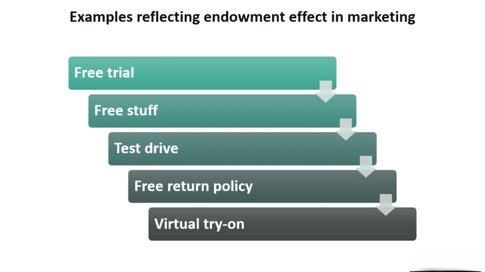

## Table of Contents

## What is the endowment effect?

The endowment effect is a psychological phenomenon where people value something more highly just because they own it. Imagine you have a mug. You might think it's worth more than someone who doesn't own it, even if it's the same mug. This happens because owning things makes us feel attached to them, and we don't want to give them up easily.

This effect can influence our decisions in everyday life. For example, it can make us reluctant to sell things we own, even if someone offers a good price. It also affects how we make choices about buying and selling. Understanding the endowment effect can help us make better decisions by recognizing when our feelings of ownership might be clouding our judgment.

## How does the endowment effect influence decision-making?

The endowment effect can really change how we make choices. When we own something, we start to think it's more valuable than it really is. This can make us not want to sell things we own, even if someone offers a good price. For example, if you have a bike, you might not want to sell it for what it's actually worth because you feel attached to it. This feeling of attachment can make us hold onto things longer than we should, or ask for more money than the item is worth.

This effect also affects how we buy things. We might be less willing to trade or exchange something we own for something new, even if the new thing is better or more useful. This can stop us from making good choices about what to keep and what to let go of. By understanding the endowment effect, we can try to see things more clearly and make decisions based on what's really best for us, not just because we feel attached to what we own.

## Can you provide an example of the endowment effect in everyday life?

Imagine you have a concert ticket that you bought for $50. Someone offers to buy it from you for $60, but you say no. You feel like the ticket is worth more than $60 to you because it's yours. This is the endowment effect at work. Even though $60 is more than what you paid, you value the ticket higher just because you own it.

This effect can also show up when you're cleaning out your closet. You might find a shirt you haven't worn in years, but when you think about giving it away or selling it, you feel like it's too valuable to let go. Even though the shirt is just taking up space, your ownership makes you think it's worth more than it really is. Understanding this can help you make better choices about what to keep and what to let go.

## What psychological factors contribute to the endowment effect?

The endowment effect happens because of a few psychological reasons. One big reason is loss aversion. This means we feel the pain of losing something more than the joy of gaining something new. When we own something, we don't want to lose it, so we think it's more valuable. Another reason is our emotional attachment to things we own. We start to feel like the things we own are a part of us, so giving them up feels hard.

Another [factor](/wiki/factor-investing) is the status quo bias, which is our tendency to prefer things to stay the same. We feel comfortable with what we have, so we don't want to change it. This makes us value our possessions more than we should. All these factors together make us see our things as more valuable just because they're ours, and this can affect how we make decisions about buying, selling, and keeping things.

## How does the endowment effect relate to loss aversion?

The endowment effect and loss aversion are closely connected. Loss aversion is when we feel the pain of losing something more than the happiness of gaining something new. This feeling makes us want to keep what we already have. When we own something, loss aversion kicks in and makes us think it's more valuable than it really is. That's why we don't want to sell our things, even if someone offers a good price.

Because of loss aversion, the endowment effect happens. We feel attached to our things and don't want to lose them. This attachment makes us value our possessions more than others might. So, when we think about giving something away or selling it, the fear of losing it makes us hold onto it more tightly. Understanding this connection can help us see when our feelings might be making us value things too much just because they're ours.

## What are some common criticisms or limitations of the endowment effect?

Some people think the endowment effect might not be as strong or common as we think. They say that sometimes, the way experiments are set up can make the endowment effect seem bigger than it really is. For example, in some studies, people might feel pressured to keep what they own because they think they won't get another chance to buy it. This can make it look like they value their things more than they really do.

Another criticism is that the endowment effect might not happen in every situation. It might depend on the person, the thing they own, and the situation they're in. Some people might not feel the endowment effect at all, or it might be weaker for them. Also, if someone knows about the endowment effect, they might be able to make decisions without letting it affect them as much. So, while the endowment effect is real, it's not a rule that applies to everyone all the time.

## How has the endowment effect been studied experimentally?

Researchers have studied the endowment effect by setting up experiments where people are given something to own and then asked if they want to trade it for something else. One famous experiment used coffee mugs. In this study, some people were given a mug and then asked if they would trade it for a pen or some money. Other people, who didn't get a mug, were asked if they would buy the same mug. The people who owned the mug wanted more money to give it up than the people who didn't own it were willing to pay. This showed that owning the mug made people value it more.

These experiments often try to see how much people value things they own compared to things they don't. Another way researchers study the endowment effect is by looking at real-life situations, like buying and selling homes or stocks. They find that people often want more money to sell their home than others are willing to pay, which can be explained by the endowment effect. By doing these different kinds of studies, researchers learn more about how the endowment effect works and how strong it is in different situations.

## What are the implications of the endowment effect for marketers and businesses?

The endowment effect can really help marketers and businesses understand how people make choices about buying and selling things. When people feel like they own something, even if it's just for a little while, they start to think it's more valuable. Marketers can use this by letting people try products for free or giving them samples. Once people feel like they own the product, they might be more likely to buy it because they value it more.

Businesses can also use the endowment effect to set prices. If they know people value things they own more, they might be able to sell used or second-hand items for more money than they're really worth. This is because the people selling these items feel attached to them and think they're worth more. Understanding the endowment effect helps businesses make better decisions about how to sell their products and how to price them.

## How can understanding the endowment effect improve personal financial decisions?

Understanding the endowment effect can help you make better choices with your money. It shows you why you might feel like your things are worth more than they really are just because you own them. If you know about this, you can think more clearly when you're deciding whether to sell something. You might be more willing to let go of things you don't need if you realize your feelings of attachment are making you think they're more valuable than they are. This can help you make money by selling things you don't use anymore.

It can also help you when you're buying things. The endowment effect might make you want to keep something you already own instead of trading it for something new that could be better or more useful. By understanding this, you can make choices based on what's really best for you, not just because you feel attached to what you already have. This way, you can save money and make smarter decisions about what to buy and keep.

## What role does ownership duration play in the endowment effect?

The length of time you own something can make the endowment effect stronger. When you have something for a long time, you start to feel more attached to it. This attachment makes you think the thing is more valuable than it really is. For example, if you've had a guitar for many years, you might feel it's worth a lot more than someone who just sees it for the first time. The longer you own something, the more memories and feelings you connect to it, which can make it harder to let go.

This means that the endowment effect can grow over time. If you're trying to sell something you've owned for a long time, you might want more money for it than someone else thinks it's worth. Knowing this can help you make better choices. You might realize that your feelings about how long you've owned something are making you value it too much. By understanding this, you can try to see the item more clearly and make decisions that are better for your wallet.

## How does cultural context affect the strength of the endowment effect?

The endowment effect can be different in different cultures. In some places, people might feel more attached to their things than in others. For example, in cultures where people really value their personal items and see them as part of their identity, the endowment effect might be stronger. People in these cultures might not want to sell their things easily, even if someone offers a good price, because they feel a strong connection to what they own.

On the other hand, in cultures where sharing and community are more important, the endowment effect might be weaker. People might be more willing to give away or trade their things because they don't feel as attached to them. Understanding how culture affects the endowment effect can help businesses and marketers make better plans. They can think about how people in different places might feel about owning things and adjust their strategies to fit those feelings.

## What are the latest research findings on the endowment effect and its applications?

Recent research on the endowment effect has shown that it can be influenced by how we think about our possessions. A study found that when people are asked to think about why they own something, the endowment effect can get weaker. This is because thinking about the reasons for owning something can make people see their items more clearly and not just feel attached to them. Another interesting finding is that the endowment effect can change depending on how we feel. If we're in a good mood, we might not feel as attached to our things, which can make the endowment effect weaker.

These findings have important applications for businesses and personal finance. For example, companies can use these insights to create marketing strategies that help people feel less attached to their current products, making them more likely to buy new ones. They might encourage customers to think about why they own certain items or create a positive shopping experience to lessen the endowment effect. For personal finance, understanding these new findings can help people sell things they don't need anymore by thinking about why they own them, leading to better financial decisions and less clutter.

## References & Further Reading

[1]: Kahneman, D. & Tversky, A. (1979). ["Prospect Theory: An Analysis of Decision under Risk."](https://www.jstor.org/stable/1914185) Econometrica, Vol. 47, No. 2, pp. 263-291.

[2]: Thaler, R. (1980). ["Toward a Positive Theory of Consumer Choice."](https://www.sciencedirect.com/science/article/pii/0167268180900517) Journal of Economic Behavior & Organization, Vol. 1, Issue 1, pp. 39-60.

[3]: Platt, M., et al. (2020). ["Neural circuits underlying the influence of gaze patterns on decision-making in the context of the endowment effect."](https://www.pnas.org/doi/10.1073/pnas.2309232121) PLOS Biology.

[4]: Turner, J.A., & Black, F. (2016). ["Psychological Ownership and the Endowment Effect: Why People Value the Same Object More When They Own It."](https://pubmed.ncbi.nlm.nih.gov/27920960/) Psychological Science.

[5]: Lo, A.W. (2012). ["Adaptive Markets: Financial Evolution at the Speed of Thought."](https://www.jstor.org/stable/j.ctvc77k3n) Princeton University Press.