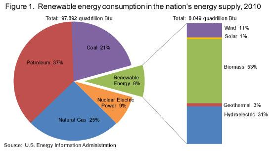

## Table of Contents

## What is alternative data in the context of energy?

Alternative data in the context of energy refers to information that is not typically used in traditional energy market analysis. This can include data from sources like satellite imagery, social media, and IoT devices. For example, satellite images can show how full oil storage tanks are, which can help predict oil prices. Social media can give insights into public opinion on energy policies, and IoT devices can track energy usage in real-time.

This kind of data is valuable because it can provide new insights and help make better predictions about energy markets. Traditional data, like government reports and company financials, can be slow to update and may not capture the full picture. Alternative data can fill these gaps and give a more complete view of what's happening in the energy sector. By using alternative data, companies and investors can make smarter decisions and stay ahead of market trends.

## How does alternative data differ from traditional data sources in the energy sector?

Alternative data in the energy sector comes from new and unusual places, like satellites, social media, and smart devices. This data is different from traditional data, which comes from things like government reports, company financial statements, and industry surveys. Traditional data is what people have been using for a long time to understand the energy market, but it can be slow to update and might not show the whole picture.

On the other hand, [alternative data](/wiki/best-alternative-data) can give you real-time information and insights that you can't get from traditional sources. For example, satellite images can show how much oil is in storage tanks, and social media can tell you what people are thinking about energy policies. This kind of data can help you see trends and changes in the energy market faster and more clearly than traditional data.

Using alternative data alongside traditional data can give a fuller picture of what's happening in the energy sector. While traditional data is still important and useful, alternative data can fill in the gaps and help make better predictions and decisions. This is why more and more people in the energy industry are starting to use alternative data to stay ahead of the game.

## What are some common sources of alternative data for energy analysis?

Alternative data for energy analysis comes from places that are different from the usual sources. One common source is satellite imagery. Satellites can take pictures of oil storage tanks and show how full they are. This helps people guess how much oil is available and what might happen to oil prices. Another source is social media. By looking at what people are saying on social media, analysts can learn about public opinions on energy policies and new technologies. This can help predict how people might react to changes in the energy market.

Another source of alternative data is IoT devices, or smart devices. These devices can track how much energy people use in their homes or businesses in real-time. This data can show patterns in energy use that traditional data might miss. For example, it can show when people use the most electricity during the day. Lastly, there are also sensors and drones that can collect data about things like wind speeds and solar radiation. This information can help with planning and managing renewable energy sources like wind and solar power.

Using these alternative data sources can give a more complete picture of the energy sector. They help fill in the gaps left by traditional data, like government reports and company financials, which can be slow to update. By combining alternative and traditional data, analysts can make better predictions and decisions about the energy market.

## How can alternative data be used to predict energy market trends?

Alternative data can help predict energy market trends by giving new and fast information that traditional data might miss. For example, satellite images can show how full oil storage tanks are. If the tanks are getting fuller, it might mean there's too much oil and the price could go down. If they're getting emptier, it might mean there's not enough oil and the price could go up. This kind of real-time data helps people make quick guesses about what will happen next in the energy market.

Another way alternative data helps is by looking at what people are saying on social media. If a lot of people are talking about switching to electric cars, it might mean the demand for oil will go down in the future. This can help predict how the energy market might change because of new technology or changes in what people want. By using this kind of data, companies and investors can make smarter choices and get ready for what's coming in the energy sector.

## What are the challenges in collecting and analyzing alternative data for energy?

Collecting and analyzing alternative data for energy can be hard because it comes from many different places. For example, satellite images, social media posts, and data from smart devices all need to be gathered and put together. This can be a lot of work and needs special tools and skills. Also, the data might not be in a form that's easy to use right away. It might need to be cleaned up and changed before it can be used to make predictions about the energy market.

Another challenge is making sure the data is correct and useful. Sometimes, alternative data can be messy or not complete. For example, social media posts can be hard to understand because people use slang or talk about many different things. Also, satellite images might be hard to read if the weather is bad. It's important to check the data carefully to make sure it's right before using it to make decisions. This can take a lot of time and effort, but it's necessary to make good predictions about energy market trends.

## Can you explain how satellite imagery is used as an alternative data source in the energy industry?

Satellite imagery is used in the energy industry to get information that you can't see from the ground. For example, satellites can take pictures of oil storage tanks. By looking at these pictures, people can see how full the tanks are. If the tanks are very full, it might mean there is a lot of oil and the price could go down. If the tanks are almost empty, it might mean there isn't enough oil and the price could go up. This helps people guess what will happen to oil prices before the official reports come out.

Using satellite imagery is helpful because it gives real-time information. Traditional data, like government reports, can take a long time to update. But with satellites, you can see changes happening right away. This can be really useful for making quick decisions in the energy market. However, it can be hard to read the images correctly because things like weather can make them blurry. So, people need to be careful and check the images carefully to make sure they are using the right information.

## What role does social media play in gathering alternative data for energy insights?

Social media is a big help in gathering alternative data for energy insights because it shows what people are thinking and talking about. For example, if a lot of people are posting about electric cars and wanting to switch from gas cars, it can tell energy companies that the demand for oil might go down in the future. This helps them plan for changes in the energy market. Also, social media can show what people think about new energy policies or technologies. If people are talking a lot about solar power or wind energy, it can mean these sources will become more important.

Using social media data can be tricky because it's not always easy to understand what people mean in their posts. They might use slang or talk about many different things at once. But, if you can figure out the main ideas, it gives a good picture of what the public thinks. This helps energy companies and investors make better guesses about what will happen in the energy market. By looking at social media, they can stay ahead of trends and make smarter choices.

## How do energy companies integrate alternative data into their existing data systems?

Energy companies integrate alternative data into their existing systems by using special software and tools. They collect data from places like satellites, social media, and smart devices. Then, they use programs that can handle big amounts of data to put it all together with their traditional data, like government reports and company financials. This software helps clean up the data and make it ready to use. It can be hard work because the data from different places might not be in the same form, but once it's all put together, it gives a better picture of what's happening in the energy market.

Once the alternative data is integrated, energy companies use it to help make decisions. They look at the new information along with their old data to see trends and predict what might happen next. For example, if satellite images show oil storage tanks are getting fuller, they might guess that oil prices will go down. Or, if social media shows a lot of people talking about electric cars, they might think the demand for oil will drop in the future. By using both types of data, energy companies can make smarter choices and stay ahead in the fast-changing energy market.

## What are the ethical considerations when using alternative data in the energy sector?

When using alternative data in the energy sector, it's important to think about privacy. A lot of alternative data comes from places like social media or smart devices. This means it could include personal information about people. Energy companies need to be careful to use this data in a way that respects people's privacy. They should make sure they have permission to use the data and that they keep it safe. If they don't, they could get in trouble and lose people's trust.

Another ethical consideration is making sure the data is used fairly. Sometimes, alternative data can show things about certain groups of people, like how much energy they use or what they think about energy policies. Companies need to be careful not to use this information in a way that could hurt or treat these groups unfairly. They should use the data to help everyone and make good decisions for the energy market, not just to benefit themselves or certain people. By thinking about these ethical issues, energy companies can use alternative data in a way that is good for everyone.

## How can machine learning enhance the analysis of alternative data in energy markets?

Machine learning can make analyzing alternative data in energy markets a lot easier. It can look at big amounts of data from places like satellites, social media, and smart devices. This kind of data can be messy and hard to understand, but [machine learning](/wiki/machine-learning) can find patterns and make sense of it. For example, it can use satellite images to guess how full oil storage tanks are and predict what might happen to oil prices. This helps energy companies make better decisions faster.

Also, machine learning can learn from the data over time. It can see how things like social media posts or energy use from smart devices change and use that to make better predictions about the energy market. For example, if more people are talking about electric cars on social media, machine learning can figure out that the demand for oil might go down. By using machine learning, energy companies can get a clearer picture of what's happening in the energy market and plan for the future.

## What case studies demonstrate successful use of alternative data in energy decision-making?

One good example of using alternative data in energy decision-making is how hedge funds use satellite images to predict oil prices. A company called Kayrros uses satellite data to look at oil storage tanks around the world. They can see how full the tanks are and guess if there's too much or not enough oil. This helps them predict if oil prices will go up or down. By using this information, they can make smart choices about buying and selling oil, and they've made a lot of money doing it.

Another example is how energy companies use social media to understand what people think about energy policies. A company called Brandwatch looks at what people are saying on social media about things like electric cars and renewable energy. They found out that more people are interested in switching to electric cars, which means the demand for oil might go down in the future. By knowing this, energy companies can plan better and invest in things like electric car charging stations. This helps them stay ahead in the energy market and make decisions that are good for the future.

## What future trends are expected in the use of alternative data for energy analysis?

In the future, more and more energy companies will use alternative data to make better decisions. They will use things like satellite images, social media, and data from smart devices to get a clearer picture of what's happening in the energy market. This will help them predict things like oil prices and changes in energy demand faster and more accurately. As technology gets better, it will be easier to collect and analyze this data, making it a big part of how energy companies work.

Another trend we might see is the use of [artificial intelligence](/wiki/ai-artificial-intelligence) and machine learning to make sense of alternative data. These tools can look at huge amounts of data and find patterns that humans might miss. This will help energy companies make even better predictions about the future of energy. As these technologies become more common, they will change how energy companies plan and make decisions, making the whole energy market smarter and more efficient.

## How can alternative data be implemented in algo trading?

Traders utilizing alternative data in [algorithmic trading](/wiki/algorithmic-trading) must establish robust data processing and management systems to effectively capitalize on these rich data sources. The primary challenge lies in handling the sheer [volume](/wiki/volume-trading-strategy) and complexity of data, necessitating efficient storage solutions and scalable computing infrastructure. It's crucial to implement technologies that ensure data integrity, accuracy, and low-latency access for real-time trading applications.

Machine learning (ML) and artificial intelligence (AI) are at the forefront of analyzing alternative data, providing the tools to identify patterns and derive actionable insights. These technologies help automate the process of sifting through large datasets to find correlations that might inform trading strategies. Artificial intelligence algorithms, particularly those leveraging [deep learning](/wiki/deep-learning), can handle high-dimensional data and uncover relationships that are not immediately apparent through traditional analytical methods.

The development of predictive models is essential for transforming alternative data into viable trading strategies. This process typically involves three key stages: data preprocessing, model training, and deployment. Data preprocessing ensures the data is clean and normalized, addressing issues such as missing values or inconsistent formats. During model training, historical data is used to fit the model, enabling it to recognize patterns and predict future trends when presented with new data. The predictive capability of these models can be represented mathematically as follows:

$$
P(y | X) = f(X; \theta) + \epsilon
$$

Here, $P(y | X)$ represents the predicted outcome based on input data $X$, $f$ is the model function parameterized by $\theta$, and $\epsilon$ is the error term. By continuously refining $\theta$ using new data, traders can enhance the model's predictive accuracy.

Efficient implementation demands close collaboration between data scientists and trading experts. This partnership ensures that the developed models are not only technically sound but also aligned with market dynamics and trading objectives. Data scientists bring expertise in modeling and computing, while traders provide market insights and practical considerations necessary for deploying strategies effectively.

Leveraging alternative data in algorithmic trading presents traders with new opportunities to gain an edge in volatile markets. However, success hinges on establishing a robust infrastructure, harnessing advanced analytical techniques, and fostering interdisciplinary collaboration, thereby optimizing the entire trading workflow from data acquisition to strategy execution.

## References & Further Reading

[1]: O'Sullivan, J., & Patel, S. (2019). ["Satellite Imagery and Market Dynamics: Practical Applications in Trading."](https://www.amazon.com/Survey-Economics-Principles-Applications-Pearson/dp/0132556073) Journal of Financial Markets.

[2]: ["Satellite Imagery and Algorithmic Trading: Harnessing Alternative Data for Market Insights."](https://www.theatlantic.com/magazine/archive/2019/05/stock-value-satellite-images-investing/586009/) Satellite Today.

[3]: Kearns, M., & Nevmyvaka, Y. (2013). ["Machine Learning for Market Microstructure and High-Frequency Trading."](https://www.cis.upenn.edu/~mkearns/papers/KearnsNevmyvakaHFTRiskBooks.pdf) National Bureau of Economic Research.

[4]: Lopez de Prado, M. (2018). ["Advances in Financial Machine Learning."](https://www.amazon.com/Advances-Financial-Machine-Learning-Marcos/dp/1119482089) Wiley.

[5]: Chan, E. P. (2009). ["Quantitative Trading: How to Build Your Own Algorithmic Trading Business."](https://github.com/ftvision/quant_trading_echan_book) Wiley.

[6]: Jansen, S. (2018). ["Machine Learning for Algorithmic Trading."](https://books.google.com/books/about/Hands_On_Machine_Learning_for_Algorithmi.html?id=tx2CDwAAQBAJ) Packt Publishing.

[7]: Bekkerman, R., & Bilenko, M. (Eds.). (2011). ["Scaling Up Machine Learning: Parallel and Distributed Approaches."](https://dl.acm.org/doi/10.1145/2107736.2107740) Cambridge University Press.