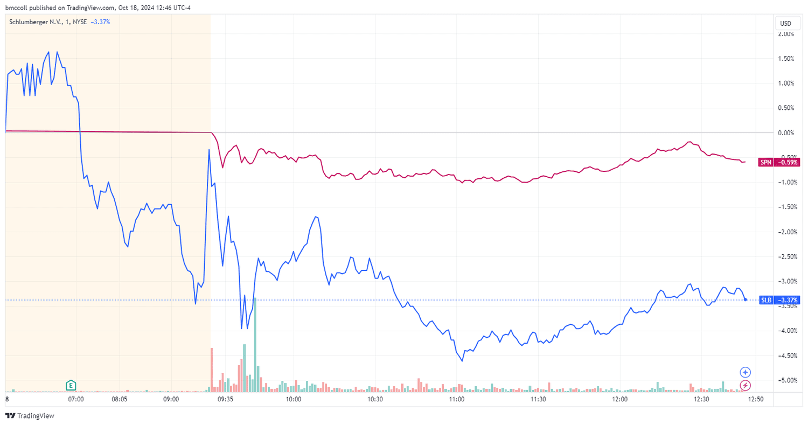

Algorithmic trading is a dynamic and rapidly evolving field where traders constantly seek new strategies and tools to maintain a competitive edge. Among these innovations, the use of alternative data has emerged as a critical asset, providing unique insights beyond the traditional data sources. This type of data encompasses a wide range of non-traditional information, such as satellite imagery, social sentiment, and geo-location data, reimagining how market trends and movements can be understood and predicted. 

In the energy sector, alternative data has proven particularly valuable. The intricate and volatile nature of energy markets, which are influenced by geopolitical tensions, environmental regulations, and shifting supply chains, necessitates a nuanced approach to data analysis and strategy development. Traders focusing on energy sectors increasingly rely on alternative data to anticipate market fluctuations with greater precision. By leveraging unconventional data sources, such as real-time fuel consumption metrics or satellite imagery monitoring energy resource distribution, they gain insights that traditional data sources might overlook.

This article explores how energy alternative data is integrated into algorithmic trading and its potential impact on market strategies. By examining these new data sources, industry professionals can better predict market movements, make informed decisions, and optimize their trading models to maintain their competitive advantage.

## Table of Contents

## Understanding Alternative Data

Alternative data refers to non-traditional data sources that provide valuable insights and fresh perspectives for investors seeking a competitive edge. Unlike conventional financial data, which typically includes balance sheets, earnings reports, and historical price data, [alternative data](/wiki/best-alternative-data) sources encompass a broader array of information that can reveal hidden market signals and trends. This type of data is particularly valued in the expanding field of [algorithmic trading](/wiki/algorithmic-trading), where novel datasets can significantly enhance predictive models and investment strategies.

One of the primary categories of alternative data is satellite imagery, which provides visual data about various physical phenomena on Earth. For example, satellite images can be used to assess the [volume](/wiki/volume-trading-strategy) of oil reserves by analyzing shadows in storage tanks or monitoring crop health and yields in agricultural sectors. Advanced [machine learning](/wiki/machine-learning) techniques are often employed to process and analyze these images, extracting meaningful patterns that can indicate shifts in supply and demand or predict future price movements.

Social sentiment data is another critical source of alternative data. This data is derived from monitoring social media platforms, online forums, and news websites to gauge public opinion and sentiment regarding specific stocks, commodities, or market sectors. Sentiment analysis algorithms can quantify public mood and highlight emerging trends or shifts in consumer behavior. This information can be instrumental for traders in anticipating market reactions and adjusting their strategies accordingly.

Geo-location data, which tracks the movement and location of people or vehicles, offers unique insights into economic activity and consumer behavior. For instance, analyzing foot traffic patterns around retail stores or monitoring the movements of logistical fleets can provide indications of economic trends, retail performance, and supply chain dynamics. This data is typically obtained via GPS signals, mobile applications, or connected devices, opening new avenues for real-time analysis and forecasting.

In the energy sector, alternative data extends to include specific metrics such as fuel consumption, energy production metrics, and satellite data that showcase the distribution of natural resources. For example, data on fuel consumption can highlight changes in demand, while energy production metrics, like electricity output or renewable energy generation, can signal shifts in supply. Satellite imagery can further provide data on infrastructure development, resource depletion, and environmental impacts, enhancing the comprehensiveness of energy market analyses.

The adoption of alternative data in trading involves utilizing sophisticated models to transform complex datasets into actionable strategies. Machine learning and [artificial intelligence](/wiki/ai-artificial-intelligence) play vital roles in this transformation, enabling the processing of vast amounts of unstructured data and the extraction of relevant insights. Algorithms are trained on historical datasets to learn patterns and behaviors, which are then applied to new, incoming data from alternative sources to generate predictions and optimize trading decisions.

Overall, alternative data enriches traditional data sources, allowing traders to capture a more nuanced understanding of market dynamics. By leveraging technological advancements to harness this wealth of information, traders can develop more robust strategies, enhance predictive accuracy, and ultimately gain a competitive advantage in the financial markets.

## Role of Energy Alternative Data in Trading

Energy alternative data provides traders with the ability to capture market signals that traditional data sources often miss. This data assists in predicting energy prices, demands, and other market dynamics by offering real-time insights. For instance, satellite imagery can reveal the levels of oil reserves or detect flaring activities at oil drilling sites, enabling traders to gauge supply levels more accurately.

Data providers such as Orbital Insight and Kpler leverage satellite technology to track global flows of energy commodities. Orbital Insight employs geospatial analytics to monitor industrial activities, such as the number of oil tankers in port, providing an indication of supply and demand fluctuations. Kpler focuses on tracking the movement of commodities like oil and natural gas, using satellite and maritime data to provide insights into global energy flows.

The integration of Internet of Things (IoT) devices in energy systems further enhances the breadth of data available for trading models. IoT sensors can be deployed in various phases of energy production and distribution to collect data on equipment performance, energy usage, and environmental conditions. This information feeds into predictive analytics and machine learning models to optimize trading strategies. For example, by analyzing data from smart meters, traders can forecast electricity demand patterns and price rises.

In summary, energy alternative data enriches the decision-making process by offering detailed and timely information beyond conventional datasets, thus enabling more informed trading strategies in the energy markets.

## Implementing Alternative Data in Algo Trading

Traders utilizing alternative data in algorithmic trading must establish robust data processing and management systems to effectively capitalize on these rich data sources. The primary challenge lies in handling the sheer volume and complexity of data, necessitating efficient storage solutions and scalable computing infrastructure. It's crucial to implement technologies that ensure data integrity, accuracy, and low-latency access for real-time trading applications.

Machine learning (ML) and artificial intelligence (AI) are at the forefront of analyzing alternative data, providing the tools to identify patterns and derive actionable insights. These technologies help automate the process of sifting through large datasets to find correlations that might inform trading strategies. Artificial intelligence algorithms, particularly those leveraging [deep learning](/wiki/deep-learning), can handle high-dimensional data and uncover relationships that are not immediately apparent through traditional analytical methods.

The development of predictive models is essential for transforming alternative data into viable trading strategies. This process typically involves three key stages: data preprocessing, model training, and deployment. Data preprocessing ensures the data is clean and normalized, addressing issues such as missing values or inconsistent formats. During model training, historical data is used to fit the model, enabling it to recognize patterns and predict future trends when presented with new data. The predictive capability of these models can be represented mathematically as follows:

$$
P(y | X) = f(X; \theta) + \epsilon
$$

Here, $P(y | X)$ represents the predicted outcome based on input data $X$, $f$ is the model function parameterized by $\theta$, and $\epsilon$ is the error term. By continuously refining $\theta$ using new data, traders can enhance the model's predictive accuracy.

Efficient implementation demands close collaboration between data scientists and trading experts. This partnership ensures that the developed models are not only technically sound but also aligned with market dynamics and trading objectives. Data scientists bring expertise in modeling and computing, while traders provide market insights and practical considerations necessary for deploying strategies effectively.

Leveraging alternative data in algorithmic trading presents traders with new opportunities to gain an edge in volatile markets. However, success hinges on establishing a robust infrastructure, harnessing advanced analytical techniques, and fostering interdisciplinary collaboration, thereby optimizing the entire trading workflow from data acquisition to strategy execution.

## Challenges and Considerations

Integrating alternative data into trading strategies is not without its challenges. One of the primary concerns is ensuring the quality and proper integration of this data. Alternative data often originates from diverse and unconventional sources, such as satellite images, social media trends, or Internet of Things (IoT) sensors. These sources can vary widely in terms of the format, accuracy, and update frequency, necessitating rigorous validation to ensure data reliability. Traders face the task of confirming the accuracy, consistency, and relevance of data, which frequently involves extensive preprocessing. This stage might include cleaning the data, normalizing disparate formats, and synthesizing these with traditional data sets for cohesive analysis.

Significant regulatory considerations present another layer of complexity. As alternative data might include sensitive information, traders need to navigate the complex landscape of privacy laws and data protection regulations. The challenge is compounded by the fact that these regulations can vary dramatically between jurisdictions, meaning traders must possess a robust understanding of legal compliance, particularly when engaged in international trading activities. These legal constraints necessitate that firms adopt stringent data governance frameworks to protect sensitive information and avoid contraventions that could lead to substantial penalties.

The utilization of alternative data also requires substantial infrastructure investments. Handling large volumes of diverse data streams demands high-capacity storage systems along with advanced computational facilities. These infrastructures must be scalable to process and analyze data in real-time or near real-time, demanding significant enhancements to computational power and storage capabilities. In many cases, transitioning to cloud-based solutions can provide the needed scalability and flexibility. This infrastructural requirement also extends to hiring specialized personnel, such as data scientists and IT professionals, to manage the technological demands associated with alternative data processing and analysis.

Overall, while integrating alternative data poses substantial challenges, the potential benefits in terms of refined market insights and enhanced trading strategies provide strong motivation for traders to tackle these hurdles systematically.

## Future Prospects of Energy Alternative Data

The adoption of alternative data for algorithmic trading in the energy sector is anticipated to grow significantly due to continuing advancements in data collection technologies. These innovations promise to refine the precision and detail of alternative data, thereby enhancing the efficacy of trading models. As technology evolves, new data acquisition methods, such as improved satellite imagery, advanced sensors, and more sophisticated IoT devices, will generate richer datasets that offer deeper insights into the energy market's dynamics.

Future developments are expected to encourage greater integration between traditional and alternative data sources. Such synergies have the potential to produce more comprehensive insights into market conditions. For instance, merging conventional economic indicators with geospatial and environmental data could enable traders to discern patterns and correlations that were previously obscure. This data fusion could lead to constructing more robust predictive models, improving market forecasts, and enhancing decision-making precision.

Traders who proficiently integrate alternative data into their strategies are likely to achieve substantial advantages in predicting market shifts. The capability to analyze diverse datasets offers an opportunity to identify emerging trends early and respond proactively to market changes. For example, by leveraging machine learning algorithms, traders can process and interpret large volumes of alternative data to forecast price movements and demand fluctuations more accurately. This capability not only enhances competitive positioning but also supports more agile and informed trading strategies, aligning with the fast-paced nature of modern financial markets. 

As the sector matures, stakeholders, including data providers, technology developers, and traders, must collaborate to overcome existing challenges, such as data quality and regulatory compliance, to fully exploit the potential of alternative data in energy trading. Through these efforts, the energy sector can anticipate an era of unprecedented innovation, characterized by enhanced predictive accuracy and strategic foresight.

## Conclusion

Energy alternative data is rapidly becoming a pivotal asset in algorithmic trading, providing traders with detailed insights that were previously unobtainable through traditional data sources. These insights have the potential to significantly reshape market strategies, enhancing both the accuracy and profitability of trading activities. However, the effective adoption of these advanced data sources is not without its challenges. Traders must first overcome substantial hurdles related to data management and integration. High-quality data, which is both consistent and relevant, is crucial for the development of predictive algorithms. Implementing robust data processing systems and investing in infrastructure to manage large datasets is essential for successful integration.

Furthermore, the evolving landscape of technology continually enhances the potential utility of alternative data. Advancements in data collection and processing, driven by machine learning and artificial intelligence, are expected to further elevate the role of alternative data. These technologies allow traders to process vast amounts of real-time data, enabling more precise predictions of market movements. The combination of traditional and alternative data sources presents an opportunity to gain a comprehensive understanding of market trends and behaviors.

To fully leverage the advantages of energy alternative data, traders must remain adaptive and innovative. This includes staying abreast of the latest technological developments and maintaining a willingness to integrate new types of data into their trading strategies. As the trading environment continues to evolve, those who proficiently incorporate advanced alternative data analytics into their operations will likely achieve a competitive edge. The future of algorithmic trading will likely witness an increasing reliance on alternative data, as its potential to drive efficiency and profitability becomes ever more evident.

## References & Further Reading

[1]: O'Sullivan, J., & Patel, S. (2019). ["Satellite Imagery and Market Dynamics: Practical Applications in Trading."](https://www.amazon.com/Survey-Economics-Principles-Applications-Pearson/dp/0132556073) Journal of Financial Markets.

[2]: ["Satellite Imagery and Algorithmic Trading: Harnessing Alternative Data for Market Insights."](https://www.theatlantic.com/magazine/archive/2019/05/stock-value-satellite-images-investing/586009/) Satellite Today.

[3]: Kearns, M., & Nevmyvaka, Y. (2013). ["Machine Learning for Market Microstructure and High-Frequency Trading."](https://www.cis.upenn.edu/~mkearns/papers/KearnsNevmyvakaHFTRiskBooks.pdf) National Bureau of Economic Research.

[4]: Lopez de Prado, M. (2018). ["Advances in Financial Machine Learning."](https://www.amazon.com/Advances-Financial-Machine-Learning-Marcos/dp/1119482089) Wiley.

[5]: Chan, E. P. (2009). ["Quantitative Trading: How to Build Your Own Algorithmic Trading Business."](https://github.com/ftvision/quant_trading_echan_book) Wiley.

[6]: Jansen, S. (2018). ["Machine Learning for Algorithmic Trading."](https://books.google.com/books/about/Hands_On_Machine_Learning_for_Algorithmi.html?id=tx2CDwAAQBAJ) Packt Publishing.

[7]: Bekkerman, R., & Bilenko, M. (Eds.). (2011). ["Scaling Up Machine Learning: Parallel and Distributed Approaches."](https://dl.acm.org/doi/10.1145/2107736.2107740) Cambridge University Press.