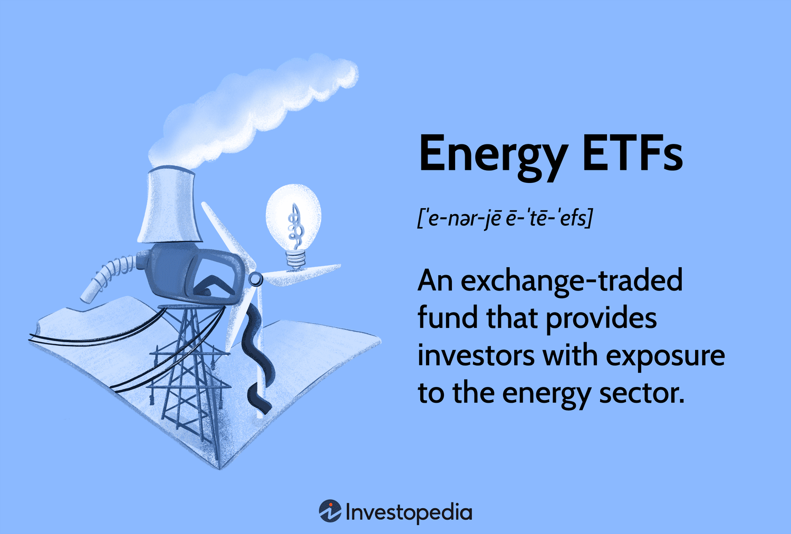

## Table of Contents

## What are energy commodities?

Energy commodities are types of goods that people use to create energy. These include things like oil, natural gas, coal, and even electricity. People and businesses buy and sell these commodities on special markets, where the prices can change a lot based on how much is available and how much people need.

These commodities are really important because they help run our cars, heat our homes, and power our factories. When the prices of energy commodities go up, it can make other things more expensive too, like gas at the pump or the cost of electricity. That's why many people pay close attention to what's happening in the energy markets.

## What are ETFs and how do they work?

ETFs, or Exchange Traded Funds, are like baskets of different investments that you can buy and sell on a stock exchange, just like you would with a single stock. They are made up of a collection of assets, like stocks, bonds, or commodities, and they track the performance of these assets. This means if you buy an ETF that follows the S&P 500, you're basically investing in all the companies in that index at once.

When you invest in an [ETF](/wiki/etf-trading-strategies), you're spreading your money across many different investments, which can help reduce the risk compared to putting all your money into one stock. ETFs are popular because they are easy to buy and sell, and they often have lower fees than other types of funds. Plus, they offer a way to invest in a wide range of assets without having to buy each one separately.

## How can ETFs provide access to energy commodities?

ETFs can give you a way to invest in energy commodities without having to buy the actual oil, gas, or coal. Instead, you can buy shares in an ETF that tracks the prices of these energy commodities. For example, there are ETFs that follow the price of oil or natural gas, so when these commodities go up or down in price, the value of the ETF changes too.

These ETFs can be a good choice if you want to invest in energy but don't want to deal with the complexities of trading futures contracts, which is how energy commodities are often bought and sold. By investing in an ETF, you can spread your risk across different energy sources and companies. This can make it easier and less risky than trying to predict the price movements of individual commodities.

## What are the benefits of investing in energy commodities through ETFs?

Investing in energy commodities through ETFs can be a smart choice because it's easier and less risky than buying the actual commodities. When you invest in an ETF, you're spreading your money across many different energy sources like oil, gas, and coal. This means you're not putting all your eggs in one basket, which can help protect your investment if one type of energy commodity doesn't do well.

ETFs also let you invest in energy commodities without having to deal with the complicated world of futures contracts, which is how these commodities are usually traded. Instead, you can simply buy and sell shares of the ETF on a stock exchange, just like you would with any other stock. This makes it easier for you to get into the energy market without needing a lot of special knowledge or experience.

## What are the risks associated with energy commodities ETFs?

Investing in energy commodities ETFs comes with some risks you should know about. One big risk is that the prices of energy commodities like oil and gas can go up and down a lot. This means the value of your ETF can change quickly, which might make you lose money if you need to sell it when the price is low. Another risk is that these ETFs often use futures contracts to track the price of energy commodities, and these contracts can be tricky. If the market for these futures changes in a way that the ETF managers didn't expect, it can affect the value of the ETF.

Another thing to watch out for is that energy commodities ETFs can be affected by big events around the world. For example, if there's a war or a natural disaster that changes how much oil or gas is available, it can cause the prices to jump around. This makes the ETF more risky because it's hard to predict what will happen next. Also, these ETFs often have higher fees than other types of ETFs, which can eat into your returns over time. So, while energy commodities ETFs can be a good way to invest in the energy market, they come with their own set of challenges and risks.

## How do you choose the right energy commodities ETF for your portfolio?

When [picking](/wiki/asset-class-picking) an energy commodities ETF for your portfolio, start by thinking about what you want to achieve with your investment. Are you looking to spread your risk across different types of energy like oil, gas, and coal, or are you more interested in focusing on one specific type? Once you know your goals, look at the different ETFs available and see which ones match what you're looking for. Some ETFs track the price of a specific commodity, while others might include a mix of different energy sources.

Next, consider the costs and risks involved. ETFs can have different fees, so look for ones with lower costs to keep more of your money working for you. Also, think about how much the price of the ETF might go up and down. Energy commodities can be very volatile, so if you don't like big swings in your investments, you might want to choose an ETF that's less risky. Reading about the ETF's past performance and understanding how it's managed can help you make a better decision.

Lastly, it's a good idea to see how the ETF fits into your overall investment plan. If you already have a lot of energy investments, adding another energy ETF might not be the best choice for spreading your risk. On the other hand, if you're looking to get into the energy market for the first time, an ETF could be a simple way to do that. Always think about how each new investment will work with the rest of your portfolio to help you reach your financial goals.

## What are some popular energy commodities ETFs available in the market?

There are several popular energy commodities ETFs that people often look at. One well-known one is the United States Oil Fund (USO), which tries to match the price of oil. It's a good choice if you want to invest in oil without buying it directly. Another popular ETF is the United States Natural Gas Fund (UNG), which focuses on the price of natural gas. This ETF can be a good way to invest in natural gas without having to deal with the complexities of the natural gas market.

Another ETF to consider is the Invesco DB Energy Fund (DBE), which spreads your investment across different types of energy commodities like oil, natural gas, and heating oil. This can be a good option if you want to diversify your energy investments and reduce risk. Lastly, the iShares Global Energy ETF (IXC) is a bit different because it invests in energy companies rather than the commodities themselves. This ETF can be a good choice if you want exposure to the energy sector but prefer to invest in companies rather than the raw materials.

These ETFs offer different ways to get into the energy market, each with its own approach and risks. By choosing the right one, you can find a good fit for your investment goals and comfort with risk.

## How do energy commodities ETFs compare to other investment vehicles like mutual funds or direct commodity investments?

Energy commodities ETFs are different from mutual funds and direct commodity investments in some key ways. ETFs are traded on stock exchanges like regular stocks, so you can buy and sell them easily throughout the day. They often have lower fees than mutual funds, which can be a big plus. ETFs also give you a way to invest in energy commodities without having to deal with the complexities of futures contracts, which you would need if you were investing directly in commodities. This makes ETFs a simpler and more accessible option for many investors.

Mutual funds, on the other hand, are managed by professionals who pick a mix of investments for you. They are not traded during the day like ETFs; instead, you buy and sell them at the end of the day based on their net asset value. Mutual funds can be a good choice if you want someone else to manage your investments, but they often have higher fees than ETFs. Direct commodity investments, like buying oil or gas futures, can be riskier and more complicated. You need to understand the futures market well, and the prices can be very volatile. ETFs offer a way to get exposure to commodities without the same level of risk and complexity.

## What role do energy commodities ETFs play in portfolio diversification?

Energy commodities ETFs can help spread out your investments, making your portfolio more balanced. When you invest in different types of assets, like stocks, bonds, and commodities, you're not putting all your money in one place. This can help protect your money because if one type of investment does badly, the others might do better. Energy commodities ETFs let you add energy to your mix without having to buy the actual oil or gas, which can be tricky and risky.

Adding energy commodities ETFs to your portfolio can also help you take advantage of changes in the energy market. The prices of energy commodities like oil and gas can go up and down a lot, and by having some of your money in these ETFs, you might benefit from these price changes. This can be a good way to grow your investments, but it's important to remember that it also comes with more risk. Balancing this risk with other, more stable investments can make your overall portfolio stronger and more likely to do well over time.

## How do geopolitical events and market trends affect energy commodities ETFs?

Geopolitical events can really shake up energy commodities ETFs. When there's a war, a new law, or a big change in a country that makes a lot of oil or gas, it can change how much of these energy commodities are available. If there's less oil or gas because of these events, the prices go up, and the ETFs that follow these commodities go up too. But if more oil or gas becomes available because of new deals between countries, the prices might go down, and so will the value of the ETFs. So, keeping an eye on what's happening around the world can help you understand what might happen to your energy commodities ETFs.

Market trends also play a big role in how energy commodities ETFs do. If a lot of people start using electric cars instead of ones that run on gas, the demand for oil might go down, and that can make the price of oil drop. On the other hand, if new technology makes it easier to find and use natural gas, the price of natural gas might go down because there's more of it. These trends can make the value of energy commodities ETFs go up or down, so it's important to watch what's happening in the energy industry. By understanding these trends, you can make better choices about when to buy or sell your ETFs.

## What are the tax implications of investing in energy commodities ETFs?

When you invest in energy commodities ETFs, you need to think about taxes. These ETFs often use futures contracts to track the price of energy commodities like oil and gas. When these contracts are sold or expire, it can create what's called "capital gains" or "losses." If the ETF makes money from these contracts, you might have to pay taxes on those gains. The tax rate can be different depending on how long you've held the ETF. If you've held it for less than a year, you'll pay a higher tax rate on the gains. If you've held it for more than a year, you might pay a lower rate.

Another thing to know is that energy commodities ETFs can also give you what's called "K-1 forms" instead of the usual "1099 forms" for taxes. K-1 forms are used for partnerships, and they can make your taxes a bit more complicated. You might need to report income from the ETF on your tax return, and the timing of when you get these forms can be later than usual, which can make filing your taxes trickier. It's a good idea to talk to a tax professional to make sure you're doing everything right and taking advantage of any tax breaks you can get.

## How can advanced investors use energy commodities ETFs for strategic trading and hedging?

Advanced investors can use energy commodities ETFs to make money from short-term price changes in the energy market. They might buy these ETFs when they think the price of oil or gas will go up, and sell them when they think the price will go down. This kind of trading can be risky, but it can also be rewarding if you're good at guessing where the market is headed. By using ETFs, advanced investors can quickly get in and out of the energy market without having to deal with the complicated futures contracts that are usually needed to trade commodities directly.

Energy commodities ETFs can also be used for hedging, which means protecting other investments from big price swings. If an investor has a lot of money in energy companies, they might buy an ETF that goes down when the price of oil goes up. This way, if the price of oil suddenly drops and hurts their energy company stocks, the ETF might go up in value and help balance out the losses. Hedging with ETFs can be a smart way to manage risk, but it takes a good understanding of how different investments are connected to each other.

## What are the risks and challenges in energy commodities investment?

Commodity markets are characterized by their inherent [volatility](/wiki/volatility-trading-strategies), primarily driven by geopolitical tensions and supply-demand dynamics. This volatility poses significant risks for investors, especially when engaging with futures-based Exchange-Traded Funds (ETFs). Two notable risk factors in these markets are contango and backwardation, which relate to the futures pricing structure.

Contango occurs when the futures price of a commodity is higher than the expected future spot price, leading to a situation where investors who hold futures contracts incur losses when they roll over these contracts. This situation is represented by the formula:

$$
\text{Roll Yield} = \text{Spot Price} - \text{Futures Price}
$$

In the case of contango, the roll yield is negative, which results in a loss for investors. Conversely, backwardation is when the futures price is lower than the future spot price, offering a positive roll yield and potential profits for investors who are rolling over contracts. Understanding these pricing anomalies is crucial for managing the inherent risks associated with futures-based ETFs.

Political instability can significantly impact energy commodity prices. Conflicts or sanctions affecting major oil-producing regions often lead to supply disruptions, causing price spikes. For instance, tensions in the Middle East have historically impacted global oil prices. Similarly, natural disasters such as hurricanes can ravage critical infrastructure, leading to abrupt changes in supply and demand dynamics.

To navigate these challenges effectively, diversification is essential. By spreading investments across various commodities and regions, investors can mitigate the risks of exposure to any single market event. Moreover, algorithmic strategies play a pivotal role in managing risks in energy commodity investments. Algorithms can swiftly process large datasets, identifying patterns and market inefficiencies that human investors might miss. This capability allows investors to make informed decisions, optimizing entry and [exit](/wiki/exit-strategy) points to minimize losses and capitalize on favorable market conditions.

In conclusion, investors must adopt a strategic approach to managing the risks inherent in energy commodities. By understanding market dynamics, leveraging diversification, and utilizing advanced algorithmic strategies, investors can effectively mitigate volatility and position their portfolios for long-term success.

## References & Further Reading

[1]: Dorfman, B. (2014). ["The ETFs that Track Oil, Natural Gas, and Other Commodities"](https://www.abrdn.com/en-us/investor/insights-and-research/commodities-and-etfs-a-new-era-of-accessible-investing). Kiplinger.

[2]: Fabozzi, F. J., & Fuss, R. (Eds.). (2010). ["Handbook of Commodity Investing"](https://archive.org/details/handbookofcommod0000fabo). Wiley.

[3]: Gorton, G., & Rouwenhorst, K. G. (2006). "Facts and Fantasies about Commodity Futures." Financial Analysts Journal, 62(2), 47–68. [DOI:10.2469/faj.v62.n2.4083](https://www.nber.org/papers/w10595)

[4]: "Algorithmic Trading: Winning Strategies and Their Rationale" by Ernie Chan. [Link](https://www.wiley.com/en-us/Algorithmic+Trading%3A+Winning+Strategies+and+Their+Rationale-p-9781118460146)

[5]: Strongin, S., & Greene, M. (2000). "Understanding the Implications of Increasing ETF Usage for Commodity Markets." Goldman Sachs Global Investment Research. [Goldman Sachs](https://www.goldmansachs.com/)

[6]: Aldridge, I. (2013). ["High-Frequency Trading: A Practical Guide to Algorithmic Strategies and Trading Systems"](https://books.google.com/books/about/High_Frequency_Trading.html?id=6l0DDQAAQBAJ). Wiley.