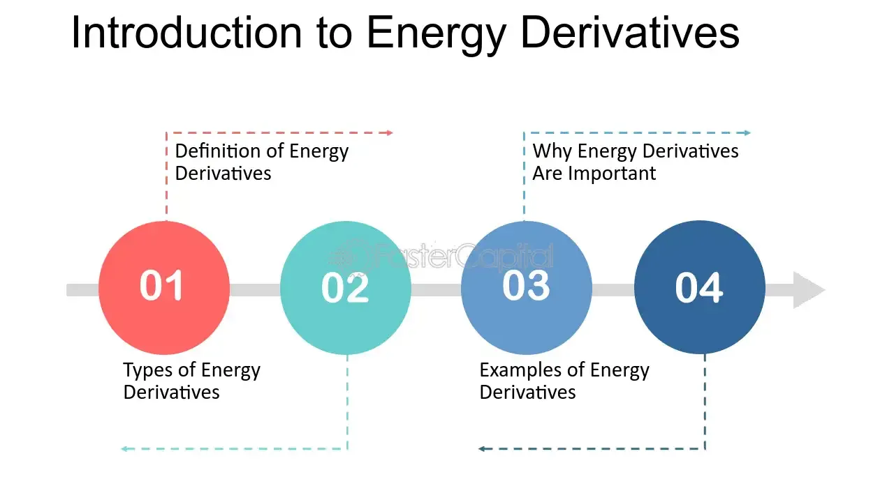

## Table of Contents

## What are energy derivatives?

Energy derivatives are financial instruments that get their value from the price of energy products like oil, natural gas, and electricity. They help companies and investors manage the risk of price changes in these energy products. For example, if a company uses a lot of oil and is worried that oil prices might go up, it can use energy derivatives to lock in a price now, protecting itself from future price increases.

There are different types of energy derivatives, such as futures, options, and swaps. Futures contracts are agreements to buy or sell energy at a set price on a specific future date. Options give the buyer the right, but not the obligation, to buy or sell energy at a set price before a certain date. Swaps are agreements between two parties to exchange cash flows based on the price of energy over time. These tools help businesses and investors manage their exposure to energy price fluctuations and plan their budgets more effectively.

## Why are energy derivatives important in the energy market?

Energy derivatives are really important in the energy market because they help companies and investors manage the risk of big changes in energy prices. Imagine a company that needs a lot of natural gas to run its factories. If the price of natural gas goes up a lot, it could hurt the company's profits. By using energy derivatives like futures or options, the company can lock in a price for natural gas now, so it knows how much it will have to pay later. This helps the company plan its budget better and avoid surprises.

These derivatives also make the energy market more stable and efficient. When lots of people use energy derivatives, it creates a big market where everyone can see what others think about future energy prices. This shared information helps set a fair price for energy and makes it easier for companies to buy and sell energy products. Overall, energy derivatives help everyone in the energy market manage risks better and keep the market running smoothly.

## What are the main types of energy derivatives?

The main types of energy derivatives are futures, options, and swaps. Futures contracts are agreements where someone agrees to buy or sell energy at a set price on a specific future date. For example, an airline might use a futures contract to buy jet fuel at today's price, even if it won't need the fuel for a few months. This helps the airline avoid the risk of fuel prices going up.

Options are another type of energy derivative. They give the buyer the right, but not the obligation, to buy or sell energy at a set price before a certain date. If an electricity company thinks the price of natural gas might go down, it could buy an option to buy gas at today's price. If the price does go down, the company can buy gas cheaper on the open market and let the option expire. But if the price goes up, the company can use the option to buy at the lower price it locked in.

Swaps are agreements between two parties to exchange cash flows based on the price of energy over time. For example, a power plant might agree to a swap where it pays a fixed price for natural gas, while the other party pays based on the market price. This way, the power plant knows exactly how much it will pay for gas, no matter what happens to the market price. Swaps help companies manage their exposure to price changes and plan their budgets more effectively.

## How do energy futures work?

Energy futures are like promises to buy or sell energy at a set price on a future date. Imagine you run a company that needs a lot of oil. You're worried that the price of oil might go up next month, which would be bad for your business. So, you can buy an oil futures contract today. This contract says you'll buy oil at today's price next month, no matter what the actual price is then. If the price of oil goes up, you're happy because you locked in a lower price. If it goes down, you might pay a bit more than the market price, but at least you knew what you were going to pay.

These futures contracts are traded on special places called exchanges, like the New York Mercantile Exchange. People who want to buy or sell energy futures can meet there and make deals. The price of the futures changes every day based on what people think the price of energy will be in the future. This helps everyone in the market see what others think about future prices, which can make the market more stable. Energy futures are important because they help companies and investors manage the risk of big price changes and plan their budgets better.

## What are energy options and how do they differ from futures?

Energy options are like special tickets that give you the right, but not the duty, to buy or sell energy at a set price before a certain date. Imagine you think the price of natural gas might go down next month. You can buy an option to buy gas at today's price. If the price does go down, you can buy gas cheaper on the open market and just let the option expire without using it. But if the price goes up, you can use your option to buy gas at the lower price you locked in. This way, you can protect yourself from price increases without having to commit to buying the gas if the price goes down.

The big difference between options and futures is that with futures, you have to buy or sell the energy on the set date no matter what. With options, you can choose whether to use them or not. This makes options more flexible but also a bit more complicated. Futures are like a firm promise, while options are like a "maybe" ticket. Both help companies and investors manage the risk of energy price changes, but they do it in different ways.

## Can you explain the role of swaps in energy derivatives?

Swaps in energy derivatives are like agreements between two people to swap money based on the price of energy over time. Imagine a power plant that needs a lot of natural gas. The plant might agree to a swap where it pays a fixed price for the gas, and the other person pays based on the actual market price. This way, the power plant knows exactly how much it will pay for gas, no matter what happens to the market price. It's like locking in a price to make budgeting easier.

Swaps help companies manage the risk of big price changes in energy. If the market price of gas goes up, the power plant doesn't have to worry because it's paying the fixed price it agreed on. But if the market price goes down, the plant might end up paying a bit more than it would on the open market. Still, the plant knows what it will pay, which helps it plan better. Swaps are important because they let companies control their costs and avoid surprises from wild price swings in the energy market.

## What are some common underlying assets for energy derivatives?

Energy derivatives usually get their value from things like oil, natural gas, and electricity. Oil is a big one because so many people and companies use it. Cars, airplanes, and factories all need oil, so its price can affect a lot of businesses. Natural gas is also important because it's used to heat homes and power factories. Electricity is another key asset because everyone uses it every day, and its price can change a lot depending on the weather or how much people are using.

These assets are what make energy derivatives useful. When the price of oil, natural gas, or electricity goes up or down, the value of the derivative changes too. This helps companies and investors guess what might happen to energy prices in the future and plan accordingly. For example, an airline might use an oil derivative to lock in a good price for jet fuel, or a power company might use a natural gas derivative to manage its costs. By using these derivatives, businesses can avoid big surprises and keep their budgets stable.

## How do market participants use energy derivatives for hedging?

Market participants use energy derivatives for hedging to protect themselves from big changes in energy prices. Imagine a company that needs a lot of oil to run its business. If the price of oil goes up, it could hurt the company's profits. To avoid this, the company can use energy derivatives like futures or options. For example, it can buy a futures contract to lock in today's price for oil that it will need in the future. This way, even if the price of oil goes up, the company knows exactly how much it will pay, and it can plan its budget better.

Another way market participants hedge is by using options. If a company thinks the price of natural gas might go down, it can buy an option to buy gas at today's price. If the price does go down, the company can buy gas cheaper on the open market and let the option expire without using it. But if the price goes up, the company can use the option to buy gas at the lower price it locked in. This flexibility helps the company manage its costs and avoid surprises. By using energy derivatives for hedging, businesses can focus on running their operations without worrying too much about wild swings in energy prices.

## What are the risks associated with trading energy derivatives?

Trading energy derivatives can be risky because the prices of things like oil and natural gas can change a lot. If you buy a futures contract and the price of the energy goes down, you might lose money because you have to buy it at a higher price than what it's worth now. The same thing can happen with options if you pay for the right to buy or sell energy at a certain price, but then the market price moves against you. These price changes can be hard to predict, and they can lead to big losses if you're not careful.

Another risk is called counterparty risk. This means that the person or company you're trading with might not be able to keep their promise. If you have a swap agreement and the other person can't pay what they owe, you could be left with a big problem. Also, trading energy derivatives can be complicated, and if you don't understand them well, you might make bad decisions. That's why it's important to know what you're doing and to be ready for the ups and downs that come with trading these financial tools.

## How do regulations impact the trading of energy derivatives?

Regulations are rules made by governments and special groups to keep trading energy derivatives fair and safe. They make sure everyone follows the same rules and that the market works well. For example, rules might say that people who trade energy derivatives need to show how much money they have and report their trades. This helps stop big problems and makes sure that everyone can trust the market. Without these rules, some people might try to cheat or make bad deals, which could hurt others and make the market unstable.

These regulations also affect how much it costs to trade energy derivatives. Companies that want to trade might have to pay more to follow the rules, like hiring special people to make sure they're doing everything right. But these costs can help protect everyone in the market. For example, after the big financial crisis in 2008, new rules were made to make sure that big problems like that don't happen again. So, while regulations might make trading a bit harder or more expensive, they're important for keeping the energy derivatives market safe and fair for everyone.

## What are some advanced strategies used in trading energy derivatives?

Advanced strategies in trading energy derivatives often involve using a mix of different types of derivatives, like futures, options, and swaps, to manage risk and make the most of market changes. One common strategy is called a spread trade. This is when a trader buys one futures contract and sells another at the same time. For example, they might buy a futures contract for oil that will be delivered in one month and sell a contract for oil that will be delivered in three months. The idea is to make money from the difference in prices between the two contracts. This can help traders make money even if the overall price of oil doesn't change much.

Another advanced strategy is called a delta hedge. This is used a lot with options. When you buy an option, its value changes based on the price of the energy it's tied to. A delta hedge helps balance out these changes by buying or selling the actual energy product. For example, if you buy an option on natural gas, you might also buy or sell some natural gas to make sure that if the option's value goes down, you can make up for it with the natural gas you're holding. This can be tricky to manage, but it can help reduce the risk of losing money if the market moves against you.

## Can you provide real-world examples of how energy derivatives are used in different industries?

Airlines use energy derivatives to manage the cost of jet fuel, which is a big part of their expenses. For example, an airline might buy a futures contract for jet fuel to lock in today's price for fuel they'll need in the future. This way, even if the price of jet fuel goes up, the airline knows exactly how much they'll pay, and they can plan their budget better. If the price goes down, they might pay a bit more than they would on the open market, but at least they're protected from big price jumps. This helps the airline keep ticket prices stable and avoid big surprises.

Power companies also use energy derivatives, especially for natural gas and electricity. A power plant might use a swap to pay a fixed price for natural gas, while the other party pays based on the market price. This helps the power plant know exactly how much it will pay for gas, which is important for keeping electricity prices steady for customers. If the market price of gas goes up, the power plant doesn't have to worry because it's paying the fixed price it agreed on. This way, the company can manage its costs and make sure it can provide reliable electricity without big price swings affecting its customers.

## References & Further Reading

[1]: Till, H., & Eagleeye, J. (2007). "Energy Derivatives: Trading Emerging Markets and Risk Management." Risk Books.

[2]: Geman, H. (2005). ["Commodity Derivatives: Markets and Applications."](https://download.e-bookshelf.de/download/0000/5675/90/L-G-0000567590-0015270354.pdf) Wiley Finance.

[3]: Chance, D. M., & Brooks, R. (2015). "An Introduction to Derivatives and Risk Management." Cengage Learning.

[4]: Narang, R. K. (2013). ["Inside the Black Box: A Simple Guide to Quantitative and High-Frequency Trading."](https://onlinelibrary.wiley.com/doi/book/10.1002/9781118662717) Wiley.

[5]: Johnson, B. G. (2010). "Algorithmic Trading & DMA: An Introduction to Direct Access Trading Strategies." 4Myeloma Press.