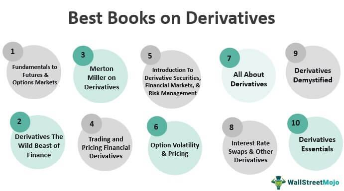

In today's dynamic financial landscape, energy derivatives and algorithmic trading play pivotal roles. Energy derivatives are financial instruments whose value is derived from energy commodities such as oil, natural gas, and electricity. These instruments are essential for managing risks associated with fluctuating energy prices and for capitalizing on market opportunities. Companies utilize energy derivatives to hedge against price volatility, stabilize costs, and better plan their budgets. Common forms of energy derivatives include futures, options, and swaps, each offering specific advantages in terms of risk management and speculation on price movements.

Algorithmic trading, on the other hand, employs computer algorithms to execute trades based on predefined criteria, transforming energy markets by making trading more efficient and data-driven. The ability of algorithms to process vast amounts of data quickly and execute trades at speed allows traders to respond swiftly to market changes, thus enhancing market efficiency. This method of trading facilitates improved price discovery and reduced transaction costs, ultimately contributing to a more liquid and transparent market.



This article examines the intersection of these financial instruments, exploring how energy derivatives and algorithmic trading synergize to influence energy markets. It aims to illuminate how these elements interact to reshape the energy sector, providing insights into modern trading strategies and the role of advanced technologies in the evolution of global energy markets. Understanding these mechanisms is crucial for stakeholders and analysts who wish to navigate or study the contemporary energy trading environment.

## Table of Contents

## Understanding Energy Derivatives

Energy derivatives are financial contracts whose value is tied to underlying energy commodities such as crude oil, natural gas, and electricity. These derivatives are versatile instruments that enable market participants to manage risks associated with volatile energy prices, or to speculate on future price movements.

**Types of Energy Derivatives**

1. **Futures Contracts**: Futures are standardized agreements to buy or sell a specific quantity of an energy commodity at a predetermined price on a set future date. They are traded on exchanges and are used extensively for hedging and speculative purposes. For example, a crude oil futures contract might oblige the purchase of 1,000 barrels at $70 per barrel for delivery in three months.

2. **Options Contracts**: Options give the holder the right, but not the obligation, to buy (call option) or sell (put option) an energy commodity at a specified price before a certain date. These contracts provide flexibility to manage price risks without the obligation of futures.

3. **Swaps**: Swaps are over-the-counter (OTC) contracts where two parties exchange cash flows based on different price indices of energy commodities. They are often used to hedge against fluctuations in interest rates or currency exchange rates that might affect energy prices.

**Hedging and Speculation**

Energy derivatives are crucial for hedging against price fluctuations. Companies involved in the production, distribution, or consumption of energy products often face significant exposure to volatile prices. By using energy derivatives, these companies can lock in prices, thus stabilizing their costs and facilitating effective financial planning. For example, an airline might use jet fuel futures to hedge against an expected rise in fuel costs.

On the other hand, speculators use these derivatives to profit from anticipated price movements in energy commodities. By accurately predicting future price changes, they can capitalize on the opportunities presented by market [volatility](/wiki/volatility-trading-strategies).

**Market Liquidity and Price Discovery**

Energy derivatives contribute significantly to market [liquidity](/wiki/liquidity-risk-premium), enabling the seamless buying and selling of contracts without causing large price changes. This liquidity is vital for the smooth operation of energy markets and ensures that participants can enter or [exit](/wiki/exit-strategy) positions with ease.

Furthermore, derivatives play an important role in price discovery—the process of determining the price of a commodity through the interactions of buyers and sellers in the market. The prices in the derivatives market provide valuable insights into market expectations of future movements in commodity prices, assisting in more informed decision-making.

In summary, energy derivatives such as futures, options, and swaps are essential tools that facilitate risk management, enhance market liquidity, and aid in price discovery, making them integral components of modern energy markets.

## Role of Energy Derivatives in Energy Markets

Energy markets are crucial to the global economy, with energy derivatives playing a key role in facilitating efficient trading and risk management. These financial instruments allow market participants to address the inherent risks associated with fluctuating energy prices. By using energy derivatives, companies can lock in prices for future delivery of commodities, thereby stabilizing their cost structures and safeguarding against adverse price movements.

Energy derivatives come in various forms, including futures, options, and swaps. Futures contracts obligate the buyer to purchase, and the seller to sell, a specific quantity of an energy commodity at a predetermined price on a specified future date. Options provide the holder the right, but not the obligation, to buy or sell these commodities at an agreed price, offering flexibility in dynamic markets. Swaps entail exchanging cash flows based on the price changes of an energy commodity, allowing participants to benefit from price movements without owning the physical assets.

These derivatives are instrumental in investment diversification. They enable traders and investors to gain exposure to the energy sector with reduced risk, as they provide opportunities to profit from price fluctuations without direct investment in the underlying physical assets. This indirect exposure can significantly enhance a portfolio's performance by capturing the sector's dynamic nature while mitigating some of the associated risks.

Moreover, energy derivatives contribute to market liquidity and enhance price discovery. They facilitate a more active trading environment by allowing a broader range of participants, from producers and consumers to speculators and arbitrageurs, to engage in the market. This increased participation helps in achieving more accurate pricing, reflecting the fundamental forces of supply and demand and ensuring that prices are not just a reflection of past trades but also of future market expectations.

Through the strategic use of energy derivatives, companies operating across the energy supply chain can hedge against adverse price fluctuations. This hedging capability enables such firms to secure stable pricing for their commodities, ensuring business continuity and financial stability even in volatile market conditions. As a result, energy derivatives are essential tools for managing financial risks and supporting efficient price mechanisms in global energy markets.

## Algorithmic Trading in Energy Markets

Algorithmic trading, or algo trading, is a sophisticated approach that leverages computer algorithms to execute trades based on predefined criteria and comprehensive data analysis. This modern methodology optimizes the execution speed and efficiency of trades across multiple markets, a crucial feature for the fast-paced energy sector where price fluctuations occur rapidly.

Traditional trading in energy markets can be fraught with inefficiencies due to human errors and slower reaction times. Algo trading mitigates these shortcomings by enabling automated trading that processes vast quantities of market data in real-time, resulting in more effective decision-making processes. By systematically analyzing factors such as historical prices, market trends, and trading signals, [algorithmic trading](/wiki/algorithmic-trading) facilitates superior price discovery, diminishes transaction costs, and heightens overall market efficiency.

One of the significant advantages of algo trading in energy markets is the capability to exploit [arbitrage](/wiki/arbitrage) opportunities. Arbitrage involves taking advantage of price differences for the same asset in different markets. Algorithms can be programmed to identify discrepancies in energy prices between various exchanges or regions almost instantaneously and execute trades to capitalize on these discrepancies before they disappear. This function boosts liquidity and enhances the price competition within markets, indirectly benefiting end consumers.

Additionally, algorithmic trading allows energy market participants to optimize their trading strategies by leveraging real-time data to make informed decisions. For instance, an algorithm may continuously monitor energy demand forecasts, weather patterns, and geopolitical events that influence energy prices. Traders can then adjust their positions accordingly to hedge against adverse price movements or enhance their portfolios.

The mathematical models underpinning algo trading can be intricate. For instance, one might use simple moving averages or more complex stochastic calculus models to predict price movements. Here's a sample Python code snippet illustrating a simple moving average crossover strategy:

```python
import numpy as np
import pandas as pd

# Sample data
data = pd.DataFrame({
    'Date': pd.date_range(start='1/1/2023', periods=100),
    'Price': np.random.random(size=100) * 100
})

# Calculate moving averages
data['Short_MA'] = data['Price'].rolling(window=5).mean()
data['Long_MA'] = data['Price'].rolling(window=20).mean()

# Generate signals
data['Buy_Signal'] = np.where(data['Short_MA'] > data['Long_MA'], 1, 0)
data['Sell_Signal'] = np.where(data['Short_MA'] < data['Long_MA'], -1, 0)

print(data.head(10))
```

This algorithmically-driven strategy applies two moving averages to historical price data and generates buy or sell signals based on moving average crossovers.

In summary, algorithmic trading stands as a transformative force in energy markets, paving the way for more precise, efficient, and data-driven trading decisions. Its abilities to enhance market liquidity, price discovery, and strategy sophistication position it as a vital component of contemporary energy trading operations.

## Advantages and Risks of Energy Derivatives and Algo Trading

Energy derivatives and algorithmic trading are powerful tools in modern energy markets, each with distinct advantages and associated risks. 

The primary advantages of energy derivatives lie in their ability to manage risk, stabilize prices, and enhance market liquidity. Companies involved in the energy sector use derivatives such as futures, options, and swaps to hedge against significant price volatility, stabilizing their costs and enabling more accurate budget planning. This risk management capability is particularly vital given the often unpredictable fluctuations in the prices of energy commodities like [crude oil](/wiki/crude-oil) and natural gas.

Algorithmic trading, on the other hand, offers the benefits of enhanced efficiency and speed. By employing computer algorithms to execute trades, market participants can transact quickly and handle large volumes of trades that would be impractical for human traders. This rapid execution across multiple markets is crucial in the fast-paced energy sector, where timely responses to market movements can significantly impact profitability. Additionally, algorithmic trading contributes to improved price discovery and reduced transaction costs, making markets more efficient.

Despite these advantages, both energy derivatives and algorithmic trading come with inherent risks. Energy markets can be highly volatile, and the use of derivatives may expose participants to substantial financial losses if not managed carefully. Counterparty risk, where the other party in a derivatives contract might default, also poses significant concerns.

Algorithmic trading introduces its own set of challenges. The reliance on technology means that technical failures or errors in programming can lead to significant financial consequences. Additionally, the complex algorithms used can mask underlying risks, making it difficult for traders and regulators to fully understand and mitigate potential issues. Regulatory challenges also arise, as the rapid evolution of trading technology can outpace the development of appropriate oversight frameworks.

Mitigating these risks requires robust risk management practices. Market participants must employ strategies such as diversification to spread risk and reduce potential losses. Regulatory compliance is equally important, necessitating adherence to evolving rules and standards to avoid legal repercussions. Continuous monitoring and analysis of market conditions are crucial to anticipate and respond to changing dynamics effectively. By adopting such measures, traders and companies can harness the benefits of energy derivatives and algorithmic trading while minimizing potential downsides.

## Implementing Algo Trading in Energy Derivatives Market

Implementing algorithmic trading (algo trading) in the energy derivatives market necessitates the deployment of sophisticated technological infrastructure capable of high-speed data processing and real-time analytics. Energy markets are characterized by their volatility and rapid price fluctuations, influenced by a variety of factors, including geopolitical events, weather conditions, and supply-demand dynamics. As a result, the ability to process vast amounts of data quickly and efficiently is critical for maintaining a competitive edge.

High-frequency trading ([HFT](/wiki/high-frequency-trading-strategies)) algorithms, a subset of algo trading, rely on low-latency execution systems that can capitalize on transient market inefficiencies. Achieving minimal latency requires not only robust hardware, such as high-performance computing (HPC) and direct market access (DMA) systems, but also optimized software solutions. These solutions must be adept at assimilating multidimensional data—including market feeds, news, and macroeconomic indicators—and generating actionable insights in milliseconds.

Adaptability is another crucial consideration for traders employing algorithmic strategies in energy markets. Market participants must ensure that their algorithms are dynamic and capable of self-optimization in response to evolving market conditions. This entails implementing [machine learning](/wiki/machine-learning) models and [artificial intelligence](/wiki/ai-artificial-intelligence) (AI) techniques that allow trading systems to learn from historical data patterns and adjust strategies accordingly. Python, with its extensive libraries such as TensorFlow and PyTorch, is widely used for developing and testing such models.

The integration of software algorithms with trading strategies also underscores the demand for skilled professionals who possess a comprehensive understanding of both the technical elements of algorithm development and the specific nuances of energy markets. Professionals in this space must be well-versed in programming languages like Python and R, while also having a deep knowledge of energy market dynamics, including regulatory frameworks and commodity pricing mechanisms.

Therefore, successful implementation of algo trading in the energy derivatives market is contingent upon a deep synergy between cutting-edge technology and market expertise. Mastery of these components enables traders not only to design sophisticated algorithms tailored to specific trading objectives but also to effectively mitigate associated risks, such as algorithmic malfunction or unexpected market events. As technology continues to advance, the role and complexity of algo trading in energy markets are expected to grow, driving an ongoing evolution in market practices and participants' strategic approaches.

## Conclusion

Energy derivatives and algorithmic trading have significantly transformed the energy market by offering innovative solutions for risk management and enhancing the efficiency of trading operations. As technology continues to advance and trading strategies become more sophisticated, the landscape of energy markets is poised for ongoing evolution. This evolution necessitates a deep understanding of the intricate dynamics of financial instruments like futures, options, and swaps, along with the algorithmic techniques that drive trading decisions.

Future developments in technology, such as machine learning and artificial intelligence, are expected to further refine algorithmic trading strategies, making them more adaptive to market changes and capable of processing vast amounts of data quickly. This will enable traders to identify patterns and opportunities with greater precision, thereby facilitating more informed decision-making and better risk management.

For participants and scholars in energy markets, grasping the complexities of these financial tools and trading mechanisms is crucial. As the markets grow more intricate, energy derivatives will continue to be essential for stabilizing prices and providing liquidity, while algorithmic trading will play a critical role in optimizing trade execution and minimizing costs. Collectively, these elements will remain vital in shaping the way energy commodities are bought, sold, and managed on a global scale, ultimately influencing the broader economic and environmental landscape.

## References & Further Reading

[1]: Till, H., & Eagleeye, J. (2007). "Energy Derivatives: Trading Emerging Markets and Risk Management." Risk Books.

[2]: Geman, H. (2005). ["Commodity Derivatives: Markets and Applications."](https://download.e-bookshelf.de/download/0000/5675/90/L-G-0000567590-0015270354.pdf) Wiley Finance.

[3]: Chance, D. M., & Brooks, R. (2015). "An Introduction to Derivatives and Risk Management." Cengage Learning.

[4]: Narang, R. K. (2013). ["Inside the Black Box: A Simple Guide to Quantitative and High-Frequency Trading."](https://onlinelibrary.wiley.com/doi/book/10.1002/9781118662717) Wiley.

[5]: Johnson, B. G. (2010). "Algorithmic Trading & DMA: An Introduction to Direct Access Trading Strategies." 4Myeloma Press.