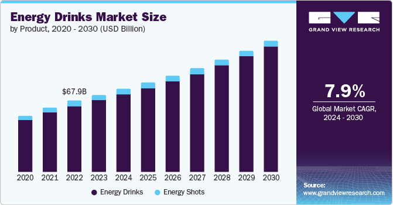

## Table of Contents

## What is an energy drink?

An energy drink is a type of drink that gives you a quick burst of energy. It usually has things like caffeine, sugar, and other stuff that can make you feel more awake and alert. People often drink them when they're tired or need a boost to get through the day or during sports and exercise.

These drinks can be helpful, but they can also be bad for you if you drink too many. Too much caffeine can make your heart beat faster, make it hard to sleep, and even make you feel nervous or shaky. It's important to drink them in moderation and not rely on them too much for energy.

## How did the energy drink industry start?

The energy drink industry started in Japan in the 1960s with a drink called Lipovitan-D. This drink was made to help people feel more energetic and was popular with factory workers and truck drivers who needed to stay awake and alert. The drink had a lot of caffeine and B-vitamins, which are good for energy. It became very popular in Japan and showed that there was a big market for these kinds of drinks.

In the 1980s, the idea of energy drinks spread to other parts of the world. In Austria, a man named Dietrich Mateschitz tried a Thai energy drink called Krating Daeng. He thought it could be popular in Europe and worked with the Thai company to create a new drink called Red Bull. Red Bull was launched in Austria in 1987 and then in other countries. It became very famous and helped make energy drinks popular all over the world. Now, there are many different energy drink brands and they are sold everywhere.

## What are the main ingredients in energy drinks?

Energy drinks have a few main ingredients that help give you energy. The most important one is caffeine. Caffeine is a stimulant that makes you feel more awake and alert. It's found in coffee, tea, and some sodas too. Energy drinks usually have a lot more caffeine than these other drinks. Another common ingredient is sugar. Sugar gives you a quick burst of energy, but it can also make your energy levels go up and down quickly.

Besides caffeine and sugar, energy drinks often have other things like B-vitamins, taurine, and ginseng. B-vitamins help your body turn food into energy. Taurine is an amino acid that some people think can help with energy and focus, but scientists are still studying it. Ginseng is a plant that some people believe can boost energy and reduce stress. These ingredients can help make you feel more energetic, but they might not work the same for everyone.

## Who are the major players in the energy drink market?

The energy drink market has a few big companies that are very popular. Red Bull is one of the biggest names. It was one of the first energy drinks and it's sold all over the world. Monster Energy is another big player. It's known for its strong taste and cool cans. It's really popular with young people and athletes. Rockstar Energy Drink is also a major brand. It's known for having different flavors and being popular in the United States.

Another important company is PepsiCo, which owns the brand called Rockstar. They also have a drink called Mountain Dew Kickstart, which is a mix of energy drink and soda. Coca-Cola has its own energy drink called Monster Energy, which they sell through a partnership with Monster Beverage Corporation. These big companies spend a lot of money on ads and sponsoring events to make their drinks more popular. They also keep coming up with new flavors and types of energy drinks to keep people interested.

There are also smaller companies that are trying to get a piece of the energy drink market. Brands like 5-hour Energy and C4 Energy are becoming more popular. They focus on different things, like having less sugar or being good for working out. Even though they are smaller, they can still be important in the energy drink market because they offer something different from the big brands.

## What is the target demographic for energy drinks?

The main people who buy energy drinks are young adults, especially those between the ages of 18 and 34. This group likes the energy boost that these drinks give them. They often drink them when they're studying, working out, or going out with friends. Energy drink companies know this, so they make ads that show young, active people having fun and doing cool things.

Energy drinks are also popular with athletes and people who do a lot of physical activities. These people use the drinks to get more energy and focus during their sports or workouts. Some energy drinks are made just for this group, with special ingredients that are supposed to help with performance. But energy drinks are not just for young people and athletes. Some older adults and even teenagers drink them too, although companies usually tell teenagers not to drink them because of the caffeine.

## How has the energy drink industry evolved over the years?

The energy drink industry started small in Japan in the 1960s with a drink called Lipovitan-D. It was popular with workers who needed energy. Then, in the 1980s, a man named Dietrich Mateschitz tried a Thai energy drink and decided to make a new drink called Red Bull. Red Bull became very famous and helped make energy drinks popular all over the world. Now, there are many different energy drink brands and they are sold everywhere.

Over the years, the energy drink industry has grown a lot. Big companies like Monster Energy and Rockstar joined the market and made their own drinks. They started making different flavors and types of energy drinks to keep people interested. The industry also started making drinks for special groups, like athletes and people who work out. They added new ingredients that were supposed to help with performance. Today, energy drinks are a big business and they keep changing to meet what people want.

## What are the health concerns associated with energy drinks?

Energy drinks can be bad for your health if you drink too many. They have a lot of caffeine, which can make your heart beat faster and make it hard to sleep. If you drink too much caffeine, you might feel nervous or shaky. Energy drinks also have a lot of sugar, which can lead to weight gain and other health problems like diabetes if you drink them a lot. Some people even get sick to their stomach or have headaches after drinking energy drinks.

Kids and teenagers should be careful with energy drinks because their bodies are still growing. The caffeine and other ingredients can be too strong for them and can cause problems like not being able to focus or feeling anxious. Even adults should not drink too many energy drinks. It's important to drink them in moderation and not rely on them too much for energy. If you're worried about your health, it's a good idea to talk to a doctor about how much caffeine is safe for you.

## How are energy drinks regulated around the world?

Energy drinks are regulated differently in different countries. In the United States, the Food and Drug Administration (FDA) oversees them, but they are treated more like dietary supplements than like food or drugs. This means companies don't have to prove that their drinks are safe before selling them, but they have to follow rules about what they can say on their labels. Some states and schools in the U.S. have their own rules about selling energy drinks to kids.

In Europe, energy drinks are more tightly controlled. The European Food Safety Authority (EFSA) sets limits on how much caffeine can be in drinks and warns about the risks of drinking too much. Some countries in Europe, like Lithuania and Latvia, have even banned selling energy drinks to people under 18. In other places like Australia and Canada, energy drinks are also regulated, with rules about how much caffeine they can have and warnings about health risks. Overall, different countries have different rules to try to keep people safe from the risks of energy drinks.

## What marketing strategies are used by energy drink companies?

Energy drink companies use a lot of different ways to get people to buy their drinks. They often show ads with young, active people doing cool things like sports or going to parties. This makes people think that drinking their energy drink will help them have fun and be more energetic. They also sponsor big events like music festivals and sports competitions. This way, their brand gets seen by a lot of people who might want to try their drink. They use social media a lot too, making fun videos and posts that get shared a lot.

Another way energy drink companies market their drinks is by making a lot of different flavors and types. They come up with new drinks that are supposed to be good for specific things, like working out or staying up late. This makes people want to try the new flavors and see if they work. They also put their drinks in cool cans and bottles that stand out on store shelves. By always coming up with new stuff and making their drinks look exciting, energy drink companies keep people interested and wanting to buy more.

## How does the energy drink industry impact the economy?

The energy drink industry makes a big impact on the economy. It creates a lot of jobs, from making the drinks to selling them in stores. Big companies like Red Bull and Monster Energy spend a lot of money on ads and sponsoring events, which helps other businesses too. When people buy energy drinks, they also pay taxes, which helps the government have money for important things like schools and roads.

The energy drink industry also helps the economy by making new products and flavors. This keeps people interested and wanting to buy more. When companies make new drinks, they need to do research and find new ingredients, which can lead to more jobs and help other parts of the economy. Overall, the energy drink industry is a big part of the economy and helps it grow in many ways.

## What are the latest trends in the energy drink industry?

The energy drink industry is always changing to keep up with what people want. One big trend is making drinks that are healthier. Companies are making energy drinks with less sugar or no sugar at all. They are also using natural ingredients like green tea and fruit extracts instead of a lot of caffeine. People like these drinks because they want to be healthier but still get an energy boost.

Another trend is making energy drinks for specific times or activities. There are drinks made just for working out, with ingredients that help with performance. There are also drinks made for staying up late or studying. Companies are trying to make drinks that fit into people's lives in different ways. This keeps people interested and wanting to try new things.

## What future developments are expected in the energy drink market?

In the future, energy drink companies will keep trying to make their drinks healthier. They will use more natural ingredients and less sugar. People want to be healthy but still need an energy boost, so companies will make drinks that fit this need. They might also add new things like vitamins and minerals that help with energy and health. This way, they can keep people interested and make more money.

Another thing that will happen is more drinks made for specific times or activities. Companies will make energy drinks just for working out, studying, or staying up late. They will use special ingredients that help with these activities. This will make people want to try new drinks and see if they work. Energy drink companies will keep changing to meet what people want and stay ahead in the market.

## References & Further Reading

[1]: Grand View Research. (2021). ["Energy Drinks Market Size, Share & Trends Analysis Report."](https://www.grandviewresearch.com/industry-analysis/energy-drinks-market)

[2]: European Commission. (n.d.). ["Food Information to Consumers – Legislation."](https://food.ec.europa.eu/food-safety/labelling-and-nutrition/food-information-consumers-legislation_en)

[3]: Clauson, K. A., Shields, K. M., McQueen, C. E., & Persad, N. (2008). ["Safety issues associated with commercially available energy drinks."](https://pubmed.ncbi.nlm.nih.gov/18595815/)30100-5/fulltext) Journal of the American Pharmacists Association, 48(3), e55-e63.

[4]: Mintel. (2021). ["Energy Drinks – UK – June 2021."](https://store.mintel.com/report/uk-sports-and-energy-drinks-market-report-2021)

[5]: ["Advances in Financial Machine Learning"](https://www.amazon.com/Advances-Financial-Machine-Learning-Marcos/dp/1119482089) by Marcos Lopez de Prado

[6]: ["Machine Learning for Algorithmic Trading"](https://github.com/stefan-jansen/machine-learning-for-trading) by Stefan Jansen