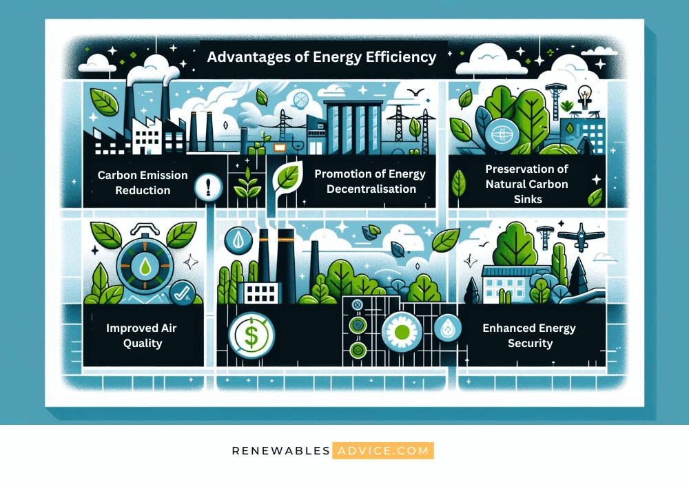

## Table of Contents

## What are energy-efficient buildings?

Energy-efficient buildings are designed to use less energy while still providing comfort and functionality. They use special materials and technologies to keep the inside temperature just right without wasting energy. For example, they might have better insulation to keep heat in during winter and out during summer. They also use smart systems to control lighting and heating, turning them off when not needed.

These buildings help save money on energy bills and are better for the environment. By using less energy, they reduce the amount of fossil fuels burned, which means less pollution and fewer greenhouse gases. This is important because it helps fight climate change. Many countries have rules to encourage or require new buildings to be energy-efficient, making it a common practice in construction today.

## How do energy-efficient buildings save energy?

Energy-efficient buildings save energy by using smart designs and technology. They have special walls, roofs, and windows that keep heat inside during winter and outside during summer. This means they don't need to use as much heating or air conditioning to stay comfortable. They also use systems that turn off lights and control heating when no one is around, so energy isn't wasted.

Another way these buildings save energy is by using energy-efficient appliances and lighting. For example, LED lights use a lot less energy than old-fashioned bulbs. Also, things like fridges and washing machines in these buildings are chosen because they use less power. All these little savings add up to make a big difference in how much energy the building uses overall.

By saving energy, these buildings help the environment too. They use less electricity, which often comes from burning fossil fuels. When less fuel is burned, fewer harmful gases go into the air. This helps slow down climate change and makes the air cleaner for everyone. So, energy-efficient buildings are good for both your wallet and the planet.

## What are the initial investment costs associated with energy-efficient buildings?

Building an energy-efficient building can cost more at the start than a regular building. You need to spend money on special materials like better insulation for walls and roofs, and high-quality windows that keep heat in or out. Also, you might need to install smart systems that control lighting and heating, which can be expensive. These systems turn off lights and adjust temperatures when no one is around, saving energy but adding to the upfront cost.

Even though the initial costs are higher, there are ways to make it easier. Sometimes, governments give money or tax breaks to people who build energy-efficient buildings. This can help cover some of the extra costs. Also, if you plan to own the building for a long time, the money you save on energy bills can make up for the higher starting costs over time. So, while it might seem expensive at first, it can pay off in the long run.

## What are the long-term financial benefits of investing in energy-efficient buildings?

Investing in energy-efficient buildings can save you a lot of money over time. These buildings use less energy for heating, cooling, and lighting, which means lower utility bills every month. The savings add up year after year, making the higher initial cost worth it. For example, if you save $1,000 a year on energy, after 10 years, you've saved $10,000. That can make a big difference in your budget.

Another long-term benefit is that energy-efficient buildings often have higher property values. People are willing to pay more for a building that saves them money on energy and is good for the environment. Also, some governments offer tax breaks or other incentives for owning energy-efficient buildings, which can add to your savings. So, even though it costs more to build at first, the long-term financial benefits can be really good.

## How does government policy affect the investment in energy-efficient buildings?

Government policies can make a big difference in whether people invest in energy-efficient buildings. Some governments offer money or tax breaks to help with the higher costs of building them. These incentives can make it easier for people to decide to build energy-efficient because it helps pay for the extra costs. Also, governments can set rules that say new buildings have to be energy-efficient. This means that even if it costs more to build, everyone has to do it, so it becomes the normal way to build.

These policies can also help in the long run by making energy-efficient buildings more common. When more buildings are built this way, the technology and materials get cheaper because more people are using them. This can make it even easier for future buildings to be energy-efficient without costing as much. So, government policies can encourage people to invest in energy-efficient buildings now and make it easier and cheaper in the future.

## What are the environmental benefits of energy-efficient buildings?

Energy-efficient buildings help the environment a lot. They use less energy, which means they burn fewer fossil fuels. When we burn less coal, oil, or gas, we put fewer harmful gases into the air. These gases, like carbon dioxide, are a big reason why the Earth is getting warmer. By using less energy, energy-efficient buildings help slow down climate change. This is important because it helps keep the planet cooler and safer for everyone.

Another way energy-efficient buildings help the environment is by reducing pollution. When we use less energy, there's less need for power plants that burn dirty fuels. This means less smoke and chemicals go into the air, making it cleaner to breathe. Also, by using less energy, we save natural resources like coal and oil, which are limited. So, energy-efficient buildings not only help fight climate change but also make our air cleaner and save important resources for the future.

## What are the potential drawbacks of investing in energy-efficient buildings?

One big problem with energy-efficient buildings is that they cost more to build at the start. You need to buy special materials like better insulation and high-quality windows, and install smart systems to control heating and lighting. All these things add up and make the initial cost higher than for regular buildings. Even though there might be government help like tax breaks, the extra money you need to spend at the beginning can be a lot.

Another issue is that it can be hard to get your money back quickly. While energy-efficient buildings save you money on energy bills over time, it can take years before you make back the extra money you spent to build them. If you don't plan to own the building for a long time, you might not see all the savings. This makes some people think twice about whether it's worth the investment, especially if they need to see a return on their money sooner.

Also, there can be some technical problems. The smart systems and new technology used in energy-efficient buildings can sometimes break down or need special maintenance. This can be annoying and might cost extra money to fix. So, even though energy-efficient buildings are good for the environment and can save money in the long run, these challenges can make people hesitant to invest in them.

## How can the performance of energy-efficient buildings be measured and verified?

To measure and check how well an energy-efficient building is doing, you can look at how much energy it uses. This is usually done by keeping track of the building's energy bills and comparing them to what a regular building would use. There are special tools called energy meters that can be put in the building to see exactly how much electricity, gas, and water it uses every day. By looking at this data over time, you can see if the building is saving energy like it should.

Another way to check the performance is by doing something called an energy audit. This is when experts come and look at the whole building to see where it might be losing energy. They check things like the walls, windows, and heating systems to make sure they are working right. After the audit, they give a report that says how well the building is doing and what can be done to make it even better. This helps make sure the building stays energy-efficient and keeps saving money and helping the environment.

## What technologies are most commonly used to enhance energy efficiency in buildings?

One of the most common technologies used to make buildings more energy-efficient is better insulation. This means using special materials in the walls, floors, and roofs to keep heat inside during winter and outside during summer. Good insulation helps the building stay warm or cool without using as much energy for heating or air conditioning. Another important technology is energy-efficient windows. These windows have special coatings or layers that help keep heat in or out, depending on the season. They also let in lots of natural light, so you don't need to use as many lights during the day.

Smart systems are also very popular for saving energy. These systems can control things like lights, heating, and cooling automatically. For example, they can turn off lights when no one is in a room or adjust the temperature when the building is empty. This helps stop energy from being wasted. Another technology is LED lighting, which uses much less energy than old-fashioned bulbs and lasts a lot longer. Energy-efficient appliances like fridges, washing machines, and air conditioners also help a lot. These appliances are made to use less power while still doing their job well, which saves energy and money over time.

## How do energy-efficient buildings impact occupant comfort and health?

Energy-efficient buildings can make people feel more comfortable and healthy. They have good insulation and windows that help keep the inside temperature just right, no matter if it's hot or cold outside. This means you don't have to worry about being too hot in the summer or too cold in the winter. Also, these buildings often have fresh air systems that bring in clean air from outside and take out stale air. This helps people breathe better and feel healthier.

Another way energy-efficient buildings help is by using less energy, which means less pollution. When buildings use less electricity, fewer harmful gases are released into the air. This can make the air around the building cleaner, which is good for everyone's health. Plus, because these buildings are designed to be quiet and have good lighting, people inside can feel more relaxed and happy. So, living or working in an energy-efficient building can make a big difference in how comfortable and healthy you feel.

## What are the challenges in retrofitting existing buildings to be more energy-efficient?

Retrofitting existing buildings to be more energy-efficient can be tricky. One big challenge is the cost. It can be expensive to add things like better insulation, new windows, and smart systems to an old building. Sometimes, the building's structure makes it hard to do these changes without a lot of work. For example, if the walls are made of old materials, it might be tough to add new insulation without tearing them down. Also, the building might need to be empty while the work is done, which can be a problem if people are living or working there.

Another challenge is that not all old buildings are the same. Each one might need different things to become more energy-efficient. This means you have to do a lot of planning and maybe even hire experts to figure out the best way to retrofit each building. It can take a long time to do all this work, and sometimes it's hard to know if the changes will save as much energy as you hope. But even with these challenges, retrofitting can still be worth it because it helps save energy and makes the building better for the environment and the people inside.

## How does the lifecycle cost analysis influence the decision to invest in energy-efficient buildings?

Lifecycle cost analysis helps people decide if it's worth it to invest in energy-efficient buildings by looking at all the money spent over the building's whole life. This includes the cost to build it, the money spent on energy bills, and the cost to fix and maintain it. Even though energy-efficient buildings cost more to build at first, they use less energy, so the bills are lower. Over time, these savings can make up for the higher starting cost. The analysis also looks at things like tax breaks from the government, which can help pay for some of the extra costs.

This kind of analysis can show that even though energy-efficient buildings cost more at the start, they can save a lot of money in the long run. If you plan to own the building for many years, the lower energy bills and other savings can make the investment worth it. Lifecycle cost analysis helps people see the big picture and make a smart choice about whether to spend the extra money upfront for the long-term benefits. It's a way to make sure the decision is based on all the costs and savings over time, not just what it costs to build.

## Is Investing in Energy-Efficient Buildings a Good Choice?

Energy-efficient buildings are engineered to curtail energy consumption, offering both financial savings and environmental advantages. These structures integrate various technologies and design methodologies to achieve reduced energy usage. By incorporating renewable energy sources, such as solar and wind power, and utilizing energy-efficient systems, such buildings significantly decrease reliance on nonrenewable energy resources, thereby aligning with broader sustainability goals set by organizations and governments worldwide.

Investing in energy-efficient structures is increasingly seen as a strategic move towards sustainable development. These investments not only address global environmental concerns but also provide tangible economic benefits. For instance, reduced expenditure on utility bills can lead to substantial long-term savings for property owners. The adoption of energy-efficient technologies such as solar panels, energy-efficient appliances, and state-of-the-art insulation systems is typically reflected in lower operational costs. Solar panels, for instance, convert sunlight directly into electricity, which can be used to power homes and businesses, thereby reducing the reliance on traditional electricity grids.

The design of energy-efficient buildings involves the comprehensive consideration of energy flow and the incorporation of features that optimize energy retention and consumption. Advanced insulation materials are crucial in maintaining indoor temperatures, minimizing the need for heating and cooling systems. Energy-efficient appliances further enhance this model by reducing the electricity required for daily operations within these structures. An important formula often used in determining the energy efficiency of a building is the Energy Use Intensity (EUI), which is calculated as follows:

$$
\text{EUI} = \frac{\text{Total energy consumption (kBtu)}}{\text{Total building square footage (ft}^2\text{)}}
$$

Lower EUI values indicate better energy performance.

Green certifications, such as LEED (Leadership in Energy and Environmental Design), further accentuate the value of investing in energy-efficient buildings. These certifications offer guidelines and standards for constructing environmentally responsible and resource-efficient buildings. Achieving such standards not only assures compliance with environmental regulations but can also enhance the marketability and asset value of the property.

Overall, the investment in energy-efficient buildings represents a significant opportunity to contribute to a sustainable future while reaping economic gains through reduced operational costs and increased property values. The alignment of financial and environmental objectives through such investments underscores their importance in contemporary construction and real estate markets.

## What are the pros of energy-efficient building investments?

Energy-efficient building investments present a range of advantages, primarily centered around cost savings, environmental benefits, and financial incentives. These benefits have made such investments increasingly attractive to property owners and developers.

One of the primary economic advantages of energy-efficient buildings is the reduction in energy consumption, which translates into lower utility bills over time. By integrating technologies like solar panels, energy-efficient windows, and advanced heating, ventilation, and air conditioning (HVAC) systems, building owners can achieve substantial operational savings. For example, the installation of energy-efficient appliances and lighting systems can reduce electricity consumption by significant margins. Mathematically, the savings can be represented as:

$$
\text{Savings} = \text{Baseline Energy Cost} - \text{Current Energy Cost}
$$

where the Baseline Energy Cost is the cost before upgrades, and the Current Energy Cost is the cost after improvements.

In addition to cost savings, these buildings offer significant environmental benefits by reducing greenhouse gas emissions and facilitating a more sustainable lifestyle. By relying on renewable sources of energy and using materials that minimize carbon footprints, energy-efficient buildings help decrease carbon emissions, thus contributing positively to global sustainability efforts. This environmental impact aligns with several sustainability goals and offers a market advantage as consumers and renters become more environmentally conscious.

Government initiatives and tax credits further enhance the financial attractiveness of energy-efficient building investments. The Inflation Reduction Act of 2022, for instance, introduced various financial incentives aimed at promoting green innovations. These incentives often include tax credits for the installation of renewable energy sources, rebates for energy-efficient appliances, and other monetary benefits to offset the initial investment costs. Such incentives improve the return on investment for developers and property owners, accelerating the adoption of energy-efficient practices across the construction industry.

In summary, the compelling advantages of cost savings, environmental sustainability, and government-backed financial incentives make investing in energy-efficient buildings a judicious decision for those seeking long-term economic and ecological gains.

## References & Further Reading

[1]: EnergySage. ["How Much Do Solar Panels Cost?"](https://www.energysage.com/local-data/solar-panel-cost/)

[2]: ["Advances in Financial Machine Learning"](https://www.amazon.com/Advances-Financial-Machine-Learning-Marcos/dp/1119482089) by Marcos Lopez de Prado

[3]: ["Evidence-Based Technical Analysis: Applying the Scientific Method and Statistical Inference to Trading Signals"](https://www.amazon.com/Evidence-Based-Technical-Analysis-Scientific-Statistical/dp/0470008741) by David Aronson

[4]: United States Congress. ["Inflation Reduction Act of 2022."](https://www.congress.gov/bill/117th-congress/house-bill/5376)

[5]: U.S. Department of Energy. ["Energy Use Intensity (EUI): What It Means and How to Use It."](https://www.energystar.gov/buildings/benchmark/understand-metrics/what-eui)

[6]: ["Machine Learning for Algorithmic Trading"](https://github.com/stefan-jansen/machine-learning-for-trading) by Stefan Jansen