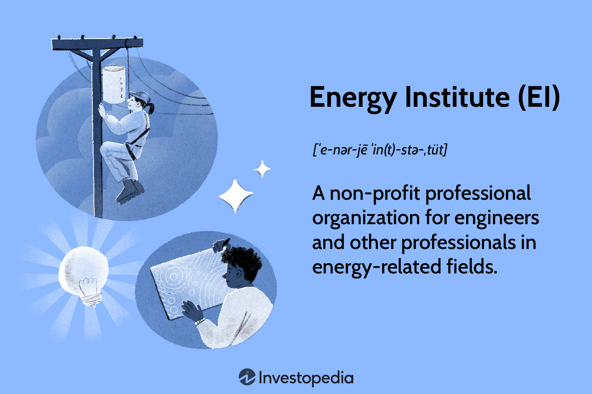

The energy sector is currently experiencing a transformation characterized by increased dynamism and complexity. This transition period emerges as nations globally prioritize more sustainable practices while grappling with the demands of modern energy consumption. Innovative technologies have become pivotal, reshaping how energy is traded and managed. Central to this transformation is the role of algorithmic trading, which optimizes trading processes by leveraging advanced computational techniques. 

Algorithmic trading refers to the use of computer algorithms to manage trading decisions, executing orders at speeds and frequencies beyond the capability of human traders. In the energy sector, this method aids in handling the intricacies associated with energy commodities, where prices fluctuate rapidly due to various factors like supply constraints, demand shifts, and policy changes.

The Energy Institute (EI) plays a crucial role in facilitating this transition by nurturing an environment conducive to innovation and skill enhancement. Focusing on the integration of cutting-edge technologies, the Institute contributes to redefining energy trading paradigms. It supports research and development endeavors, promoting practices that maximize efficiency and adaptability in energy markets.

The application of algorithmic trading in the energy sector offers numerous benefits. It enhances trading efficiency, reduces the manual workload for traders, and improves risk management by providing AI-driven decision-making aids. These advancements have proven instrumental in adapting to the variability of renewable energy sources. Nonetheless, algorithmic trading also presents challenges, such as the complexity of algorithm maintenance and the potential risks of over-reliance on automated processes.

By navigating these benefits and challenges, the energy sector stands at the cusp of a significant evolution. Embracing algorithmic trading and other innovative technologies paves the way for a more resilient and agile energy market, aligning with global efforts towards sustainability and efficiency. The Energy Institute's commitment to fostering these developments underscores its integral role in steering the energy sector towards a future defined by innovation and strategic resource management.

## Table of Contents

## Understanding the Energy Institute (EI)

The Energy Institute (EI) serves as a pivotal professional organization in the energy sector, dedicated to fostering advancements and sustainable practices within the industry. As a key player, EI focuses on promoting research, enhancing skill sets, and establishing best practices designed to meet the evolving demands of sustainable energy.

Founded to serve as a collective platform, EI facilitates collaboration among professionals, academics, and industry stakeholders globally. Its membership comprises individuals and organizations varying in scale and expertise, leading to a diverse network that extends EI's influence worldwide. This membership structure is integral to EI's ability to support industry evolution, providing opportunities for members to engage in knowledge sharing, professional development, and policy advocacy, further extending its impact across borders.

One significant aspect of the Energy Institute's work is its involvement in industry certifications and training programs. These initiatives are designed to equip energy professionals with the latest skills and insights necessary to thrive in a rapidly transforming landscape. The certifications offered by EI are recognized for their rigor and relevance, often setting the benchmark for industry standards worldwide. Training programs are tailored to address current challenges and future needs, ensuring that professionals are well-prepared to implement sustainable energy solutions.

EI's mission emphasizes support for the global energy transition, especially critical in the face of the ongoing climate emergency. This mission drives EI to champion initiatives focused on reducing carbon emissions, increasing the deployment of renewable energy technologies, and enhancing energy efficiency strategies. By aligning its objectives with global sustainability goals, the Energy Institute plays a crucial role in facilitating a shift towards more resilient and environmentally-friendly energy systems.

Through these efforts, EI not only accelerates advancements within the energy sector but also advocates for a broader adoption of sustainable practices, underscoring the importance of the industry’s commitment to mitigating climate change impacts.

## The Role of Algorithmic Trading in the Energy Sector

Algorithmic trading, a method utilizing complex mathematical models and automated systems for executing orders, has become integral to modern energy markets. This approach leverages AI and algorithms to manage intricate trading processes, providing significant advantages over traditional methods.

In the energy sector, [algorithmic trading](/wiki/algorithmic-trading) applies sophisticated algorithms to evaluate market conditions and execute trades at optimal times. This technology facilitates rapid decision-making, enabling traders to adapt swiftly to market dynamics. The use of algorithms allows for the analysis of vast datasets, extracting actionable insights that guide trading strategies.

The incorporation of AI and algorithms enhances trading efficiency by automating routine processes, thereby reducing the manual workload on traders. Traders benefit from the ability to process information from various sources, such as weather forecasts, market trends, and geopolitical events, which influence energy prices. This capability ensures that decisions are based on the most current data, reducing the lag associated with manual trading.

Case studies highlight the transformative impact of algorithmic trading. For example, a large European energy firm implemented algorithmic trading strategies and reported increased trading volumes and improved profit margins. Their systems could process and react to significant market changes faster than human traders, showcasing enhanced responsiveness and efficiency. This improvement was largely attributed to the algorithm’s ability to continuously analyze and adjust trading strategies in real-time.

Comparatively, traditional energy trading methods, which rely on human intuition and slower data processing, are less agile. These conventional approaches can suffer from biases and slower execution times, limiting the ability to capitalize on short-term market opportunities. Algorithms, by contrast, execute trades based on predefined criteria, minimizing errors associated with human judgment.

Algorithmic trading's ability to handle complex variables and react to real-time data positions it as a critical tool for modern energy traders, providing an edge in competitive markets. As energy markets continue to grow in complexity, the role of algorithmic trading is set to expand, offering new pathways for optimizing energy trading processes.

## Benefits of Algorithmic Trading for Energy Traders

Algorithmic trading, or algo trading, has revolutionized energy markets by boosting efficiency and profitability for traders. Through the automation of buying and selling processes, algorithms can analyze real-time data swiftly, reducing the manual workload significantly. This leads to faster execution times and helps traders capitalize on market opportunities that manual trading cannot match. Algorithms can process vast amounts of data far quicker than a human, allowing traders to focus on strategic decision-making.

The automation inherent in algorithmic trading ensures higher profitability. By leveraging cutting-edge technologies like [machine learning](/wiki/machine-learning) and [artificial intelligence](/wiki/ai-artificial-intelligence), energy traders harness the power of instant data analysis to make informed decisions with precision. AI algorithms identify patterns and trends in energy markets, predicting price movements more accurately than traditional methods. This enhanced predictability and real-time adaptability reduce the likelihood of human error and optimize profit margins.

Risk management also sees significant improvements with AI-driven decision-making processes. Algorithms assess potential risk factors by continuously monitoring market conditions, providing traders with robust guidelines to mitigate adverse outcomes. These AI systems can tailor risk assessments to align with specific trading strategies, accommodating the dynamic nature of energy markets and reducing exposure to unpredictable market fluctuations.

One of the critical advantages of algorithmic trading is its ability to adapt to the [volatility](/wiki/volatility-trading-strategies) associated with renewable energy sources. Given their intermittent nature, renewables present a challenge in ensuring consistent energy supply. Algorithms can swiftly react to this variability by adjusting trading strategies to balance supply and demand effectively. This flexibility is crucial for optimizing the use of renewables in the energy mix, promoting more sustainable trading practices.

Numerous examples demonstrate successful algorithmic applications in short-term energy trading. For instance, algorithmic strategies in intraday trading have shown superior performance by quickly reacting to sudden supply changes or unplanned shutdowns. These short-term strategies can align with real-time market movements, offering traders opportunities to secure competitive prices while maintaining grid stability.

In conclusion, algorithmic trading enhances trading efficiency, profitability, and risk management for energy traders, delivering a more adaptive approach to the challenges presented by renewable energy sources. Through continuous technological advancement, traders can leverage these tools to maintain a competitive edge in the evolving energy landscape.

## Challenges and Considerations

Algorithmic trading in the energy sector presents numerous challenges that need careful consideration for successful implementation. One of the primary complexities involves setting up and maintaining trading algorithms. These algorithms often require sophisticated programming skills and a deep understanding of both financial markets and energy-specific trading nuances. Effective algorithmic systems must integrate vast datasets, which can include variables like fluctuating market prices, energy demand, weather patterns, and geopolitical factors that influence energy supply chains.

Continuous adjustment of trading strategies is also imperative to remain competitive. Energy markets are inherently volatile, influenced by rapid changes in supply and demand dynamics—especially with the increasing integration of renewable energy sources. Algorithms must be updated periodically to incorporate new market data and predictive insights. This frequent need for recalibration ensures that the trading decisions remain accurate and profitable over time.

While algorithms can process and analyze large volumes of data far quicker than a human, achieving the optimal balance between human expertise and algorithmic processes is another crucial consideration. Human intuition and oversight remain indispensable for interpreting complex market signals that algorithms might miss. For instance, unexpected political events can disrupt market assumptions, requiring human intervention to adjust trading strategies accordingly.

Over-reliance on automated systems introduces the risk of systemic errors. Technical malfunctions or programming flaws can lead to significant financial losses. Consequently, robust risk management frameworks are essential. This involves developing redundant systems, regular stress testing of algorithms, and establishing contingency plans to address potential failures.

Transitioning from manual to fully automated trading systems also presents a structural challenge for organizations. This shift requires substantial investment in technology and training, as well as a cultural change within trading teams. Employees may need to adopt new skills and adapt to roles that emphasize oversight and strategic input rather than direct execution of trades.

In conclusion, while algorithmic trading offers remarkable efficiencies and opportunities for energy traders, these benefits come hand-in-hand with complex challenges. Addressing these issues proactively can enable energy companies to harness the full potential of automated trading systems while mitigating associated risks.

## Future Prospects and Innovations

The future of AI and algorithmic trading in the energy sector is poised for significant evolution, driven by ongoing advancements in technology and policy developments. The integration of AI into strategy development and data management represents a pivotal shift in how energy markets operate. AI algorithms can automate complex trading strategies by processing vast amounts of data rapidly, enabling more efficient decision-making and market adaptability. These capabilities not only improve the execution speed but also enhance the accuracy of trading models by learning from historical data and adapting to real-time market fluctuations.

AI's potential to unlock new opportunities for smarter and more sustainable trading is substantial. By harnessing machine learning and predictive analytics, AI can assist traders in identifying emerging market patterns and optimizing resource allocation. This is essential as the energy market becomes increasingly populated with intermittent renewable energy sources. Predictive AI can forecast production levels and price movements more accurately, ensuring that energy trading aligns with sustainability goals while maximizing economic returns.

The role of EU policies and market consolidation is also pivotal in influencing the adoption of algorithmic trading in the energy sector. The EU’s stringent regulatory frameworks are aimed at enhancing market transparency and ensuring a level playing field. These policies encourage the development of robust algorithmic trading systems that comply with regulatory requirements while promoting innovation. Market consolidation further facilitates the adoption of these technologies by creating larger entities with the necessary resources to invest in advanced AI-driven trading platforms. Such consolidation can lead to more standardized practices, reducing barriers to entry for smaller players through shared technological infrastructures.

Energy institutes are expected to play a crucial role in the continued evolution of algorithmic trading. By fostering research, collaboration, and training, these institutes can drive the development of AI technologies tailored to the energy market's unique challenges. They also serve as a bridge between industry stakeholders and policymakers, ensuring that technological advancements are aligned with both business objectives and regulatory frameworks. This synergy can facilitate the creation of innovative trading solutions that support a more efficient and sustainable energy market landscape.

In summary, the future of AI and algorithmic trading in the energy sector is shaped by technological advancements, regulatory frameworks, and institutional support. As AI continues to transform trading strategies and data management, its integration promises a smarter and more sustainable approach to energy trading. By navigating policy impacts and encouraging collaboration among industry players, energy institutes can reinforce the sector's capacity to embrace these innovations effectively.

## Conclusion

The Energy Institute (EI) has been instrumental in advancing innovative trading solutions in the swiftly evolving energy sector. Through its commitment to research and fostering best practices, the EI has become a pivotal entity in promoting algorithmic trading methodologies that enhance trading efficiency and effectiveness. Algorithmic trading presents numerous benefits in energy markets, offering increased trading efficiency, heightened accuracy, and significantly reduced manual workloads. By automating trading processes and leveraging real-time data analysis, energy traders can optimize their decision-making and improve profit margins.

Algorithmic trading leverages AI technologies to revolutionize energy trading processes, facilitating the seamless integration of vast data sets and advanced analytics to inform trading strategies. AI's role is critical in managing the complexities of energy trading, particularly with the growing volatility associated with renewable energy sources. Embracing these technologies promises not only improvements in trading operations but also substantial contributions to sustainable energy practices.

Ongoing research and collaboration remain essential to push the boundaries of what algorithmic trading can achieve in the energy sector. Cooperation between industry professionals and organizations such as the EI ensures continuous advancement in this field. Energy professionals are therefore encouraged to actively engage with EI initiatives and training programs to stay at the forefront of these technological developments. This active participation will drive the sector towards greater innovation, sustainability, and resilience in energy trading operations. The Energy Institute stands as a beacon for facilitating this transition, championing the integration of AI and algorithmic tools in crafting a smarter, more sustainable future in energy trading.

## References & Further Reading

[1]: Bergstra, J., Bardenet, R., Bengio, Y., & Kégl, B. (2011). ["Algorithms for Hyper-Parameter Optimization."](https://dl.acm.org/doi/10.5555/2986459.2986743) Advances in Neural Information Processing Systems 24.

[2]: ["Advances in Financial Machine Learning"](https://www.amazon.com/Advances-Financial-Machine-Learning-Marcos/dp/1119482089) by Marcos Lopez de Prado

[3]: ["Evidence-Based Technical Analysis: Applying the Scientific Method and Statistical Inference to Trading Signals"](https://www.amazon.com/Evidence-Based-Technical-Analysis-Scientific-Statistical/dp/0470008741) by David Aronson

[4]: ["Machine Learning for Algorithmic Trading"](https://github.com/stefan-jansen/machine-learning-for-trading) by Stefan Jansen

[5]: ["Quantitative Trading: How to Build Your Own Algorithmic Trading Business"](https://github.com/LucindaYa/quant-resources/blob/master/Quantitative%20Trading%20How%20to%20Build%20Your%20Own%20Algorithmic%20Trading%20Business.pdf) by Ernest P. Chan