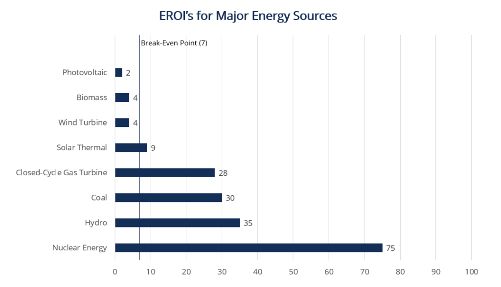

## Table of Contents

## What is Energy Return on Investment (EROI)?

Energy Return on Investment (EROI) is a way to measure how much energy we get back from the energy we put into getting that energy. Imagine you have to use some energy to find and use a new source of energy, like drilling for oil or building a wind farm. EROI tells us if the energy we get from that new source is worth the energy we spent to get it.

For example, if we use 1 unit of energy to get 10 units of energy back, the EROI is 10:1. This is a good EROI because we get a lot more energy back than we used. But if we use 1 unit of energy to get only 1 unit back, the EROI is 1:1, which is not good because we are just breaking even. EROI helps us understand if a new energy source is a smart choice for our energy needs.

## Why is EROI important in energy economics?

EROI is important in energy economics because it helps us figure out if using a certain type of energy is a good idea. When we look at different energy sources like oil, solar, or wind, we need to know if the energy we get back is worth the energy we spend to get it. If the EROI is high, it means we get a lot more energy back than we used, which is good for our economy. It makes energy cheaper and more available, which can help businesses grow and people live better lives.

On the other hand, if the EROI is low, it means we are spending a lot of energy just to get a little bit back. This can make energy more expensive and harder to get, which can slow down the economy. Knowing the EROI helps us make smart choices about which energy sources to use and how to use them. It's like deciding whether to buy a tool that will save you time and money in the long run, or one that will cost you more than it's worth.

## How is EROI calculated?

EROI is calculated by dividing the amount of energy you get from a source by the amount of energy you used to get that energy. For example, if you use 1 unit of energy to get 10 units of energy back, the EROI is 10 divided by 1, which gives you an EROI of 10:1. This means for every unit of energy you put in, you get 10 units back.

Calculating EROI can be tricky because you have to count all the energy used at every step. This includes the energy used to find the energy source, to build the equipment needed to get the energy, and to keep everything running. If you forget to include any of these steps, your EROI might not be accurate. That's why it's important to be careful and thorough when figuring out the EROI for different energy sources.

## What are the different types of EROI?

There are different types of EROI that help us look at energy in different ways. One type is called "standard EROI," which is the basic way to calculate it. You just divide the energy you get by the energy you used to get it. Another type is "extended EROI," which looks at more than just the energy used to get the energy. It also includes the energy used to build the machines and tools needed, and even the energy used to keep everything working.

Another type is "point of use EROI," which looks at how much energy is left after it's been moved to where it's needed. For example, if you use energy to move oil from where it's found to where it's used, you have to count that energy too. This type of EROI helps us see if the energy is still worth using after all the moving around. These different types of EROI help us understand energy better and make smarter choices about which energy sources to use.

## Can you provide a simple example of an EROI calculation?

Let's say you want to use solar panels to get energy from the sun. You spend 1 unit of energy to make and set up the solar panels. Once they're set up, the solar panels give you back 8 units of energy over their lifetime. To find the EROI, you divide the energy you get by the energy you used. So, it's 8 divided by 1, which gives you an EROI of 8:1. This means for every unit of energy you put into the solar panels, you get 8 units back.

Now, imagine you're drilling for oil instead. You use 2 units of energy to drill the well and get the oil out of the ground. From that well, you get 20 units of energy. To find the EROI, you divide the energy you get by the energy you used. So, it's 20 divided by 2, which gives you an EROI of 10:1. This means for every 2 units of energy you put into drilling, you get 20 units back. Both examples show how EROI helps us understand if an energy source is worth using.

## What factors can affect the EROI of an energy source?

Many things can change the EROI of an energy source. One big thing is how much energy it takes to find and get the energy out. For example, if you have to drill really deep to get oil, it takes more energy than if the oil is easy to reach. Also, the kind of technology you use matters. New technology might use less energy to do the same job, which can make the EROI better. The location where you get the energy from can also affect EROI. If you have to move the energy a long way to where it's needed, that uses more energy and can lower the EROI.

Another thing that can affect EROI is how much energy you need to keep everything running. This includes the energy used to maintain machines and tools. If you have to use a lot of energy to keep everything working, the EROI might go down. The quality of the energy source itself can also make a difference. If the energy source is not very good or runs out quickly, you might not get as much energy back as you hoped. All these factors together help decide if an energy source is worth using.

## How does EROI vary across different energy sources like solar, wind, and fossil fuels?

EROI can be quite different for different energy sources like solar, wind, and fossil fuels. For solar energy, the EROI can vary a lot depending on things like the location of the solar panels and the technology used. On average, solar panels might have an EROI around 5:1 to 10:1. This means for every unit of energy used to make and set up the panels, you get 5 to 10 units back. Wind energy usually has a higher EROI, often around 20:1 to 30:1. This is because once a wind turbine is built, it can produce a lot of energy with very little energy needed to keep it running.

Fossil fuels like oil and natural gas have different EROIs depending on how easy they are to get. In the past, oil had a very high EROI, sometimes as high as 100:1, because it was easy to find and get out of the ground. But now, as the easy-to-reach oil runs out, the EROI for oil can be much lower, sometimes around 5:1 to 10:1. Natural gas can have an EROI around 10:1 to 20:1. These numbers show that while fossil fuels used to be very efficient, their EROI is going down as we use up the best sources. Understanding these differences helps us make smart choices about which energy sources to use.

## What are the historical trends in EROI for major energy sources?

Over the years, the EROI for major energy sources has changed a lot. In the past, oil had a very high EROI because it was easy to find and get out of the ground. Back then, people could find big oil fields close to the surface, so they didn't need to use much energy to get the oil. This made the EROI for oil sometimes as high as 100:1. But as time went on and the easy-to-reach oil ran out, people had to start drilling deeper and in harder places. This meant using more energy to get the oil, which made the EROI go down. Nowadays, the EROI for oil can be around 5:1 to 10:1, much lower than it used to be.

For renewable energy sources like solar and wind, the EROI has been getting better over time. When solar panels and wind turbines were new, they had lower EROIs because it took a lot of energy to make them. But as technology got better, the EROI for these sources went up. Now, solar panels might have an EROI around 5:1 to 10:1, and wind turbines can have an EROI around 20:1 to 30:1. These numbers are getting better as we find new ways to make and use these technologies. This shows that while the EROI for fossil fuels is going down, the EROI for renewable energy is going up, which is good for the future.

## How does EROI influence energy policy and sustainability?

EROI is really important when people make rules about energy and think about how to keep the world sustainable. When the EROI of an energy source is high, it means we get a lot of energy back for the energy we use. This makes the energy cheaper and easier to get, so people might choose to use more of it. Governments might make rules to support these energy sources because they help the economy and make life better for people. For example, if solar energy has a good EROI, a government might give money to help people put solar panels on their houses.

On the other hand, if the EROI of an energy source is low, it means we don't get much energy back for the energy we use. This can make energy more expensive and harder to get. Governments might make rules to use less of these energy sources because they can hurt the economy. Also, thinking about EROI helps us understand if we can keep using an energy source for a long time. If we keep using energy sources with low EROI, like some types of oil, we might run out of them faster. This is why EROI is a big part of making energy policies that help us use energy in a way that keeps our world healthy and sustainable for the future.

## What are the challenges in accurately measuring EROI?

Measuring EROI can be really hard because you have to count all the energy used at every step. This means you need to include the energy used to find the energy source, to build the machines and tools needed, and to keep everything running. If you miss any of these steps, your EROI might not be right. Also, different people might use different ways to measure EROI, which can make it hard to compare numbers from different places or studies.

Another challenge is that EROI can change over time and depends a lot on where you are. For example, the EROI for oil can be different if you're drilling in an easy place or a hard place. And as technology gets better, the EROI for things like solar panels can go up. This means you need to keep updating your measurements to make sure they're still right. All these things make it tricky to get an accurate EROI, but it's important to try because it helps us make smart choices about energy.

## How can improvements in technology impact the EROI of renewable energy sources?

Improvements in technology can make the EROI of renewable energy sources better. When we find new ways to make solar panels or wind turbines, we can use less energy to build them. For example, new types of solar panels might be easier to make or use less material, which means less energy is needed. Also, better technology can make these energy sources last longer and work better, so they give us more energy back for the energy we put in. This makes the EROI go up, which is good because it means renewable energy becomes cheaper and easier to use.

Another way technology helps is by making it easier to store and use the energy we get from renewable sources. If we can store the energy from solar panels or wind turbines better, we can use it when we need it, not just when the sun is shining or the wind is blowing. This means we get more value from the energy we produce, which can also improve the EROI. As technology keeps getting better, the EROI for renewable energy is likely to keep going up, making it a smarter choice for our energy needs.

## What advanced methodologies are used to assess EROI in complex energy systems?

To assess EROI in complex energy systems, people use advanced methods like life cycle analysis (LCA). LCA looks at all the energy used from start to finish, including making the machines, getting the energy out, and even moving it to where it's needed. This helps make sure no energy is missed when figuring out the EROI. Another method is called input-output analysis, which looks at how energy moves through the whole economy. This can show how using energy in one place affects other places, making the EROI calculation more accurate.

These methods can be tricky because they need a lot of data and can be hard to do. But they are important because they help us see the big picture of energy use. By using these advanced methods, we can make better choices about which energy sources to use and how to use them in a way that's good for the economy and the environment.

## What is Understanding Energy Return on Investment (EROI)?

Energy Return on Investment (EROI) is a pivotal metric for assessing the efficiency and viability of different energy sources. It is expressed as a ratio of the amount of energy produced by a particular source to the energy invested in producing it. Mathematically, EROI is defined as:

$$
\text{EROI} = \frac{\text{Energy Output}}{\text{Energy Input}}
$$

High EROI values indicate energy sources that are cost-effective and efficient, as they produce a substantial amount of energy relative to the energy expended. For instance, traditional fossil fuels, such as coal, historically boasted high EROIs due to easily accessible deposits and established extraction technologies. However, as these resources become harder to extract, their EROI has decreased over time.

In contrast, renewable energy sources like wind and solar have varying EROIs. Technological advances and manufacturing improvements have significantly increased the EROI of these renewables, making them more competitive. Photovoltaic solar energy, with improvements in panel efficiency, has seen rising EROI values, bolstering its economic viability. Wind energy, particularly in locations with strong and consistent wind patterns, often exhibits high EROI values, reflecting its minimal energy input compared to output.

Nuclear energy represents another interesting case with a relatively high EROI, primarily due to its substantial energy output over time. However, it demands significant initial energy investment in the form of complex infrastructure and safety measures.

Understanding and analyzing EROI is crucial for judging the sustainability of energy projects and making informed investment decisions. EROI not only influences direct economic considerations but also impacts broader policy-making. Governments and investors often rely on EROI to steer towards sustainable, efficient, and economically sound energy portfolios.

By considering EROI in assessments, stakeholders can identify energy projects that promise optimal returns on investment while aligning with sustainability objectives. The disparity in EROIs among different energy types underlines the importance of this metric in shaping energy markets and guiding future investments.

## References & Further Reading

[1]: Hall, C. A. S., & Klitgaard, K. A. (2012). ["Energy and the Wealth of Nations: Understanding the Biophysical Economy"](https://www.amazon.com/Energy-Wealth-Nations-Understanding-Biophysical/dp/1441993975). Springer.

[2]: Murphy, D. J., & Hall, C. A. S. (2010). ["Year in review—EROI or energy return on (energy) invested."](https://nyaspubs.onlinelibrary.wiley.com/doi/10.1111/j.1749-6632.2009.05282.x) Geosphere.

[3]: Smil, V. (2017). ["Energy and Civilization: A History"](https://direct.mit.edu/books/book/3576/Energy-and-CivilizationA-History). MIT Press.

[4]: Lopez de Prado, M. (2018). ["Advances in Financial Machine Learning"](https://www.amazon.com/Advances-Financial-Machine-Learning-Marcos/dp/1119482089). Wiley.

[5]: Chan, E. (2008). ["Quantitative Trading: How to Build Your Own Algorithmic Trading Business"](https://github.com/ftvision/quant_trading_echan_book). Wiley.

[6]: Jansen, S. (2020). ["Machine Learning for Algorithmic Trading: Predictive models to extract signals from market and alternative data for systematic trading strategies with Python"](https://www.amazon.com/Machine-Learning-Algorithmic-Trading-alternative/dp/1839217715). Packt Publishing.

[7]: Aronson, D. R. (2007). ["Evidence-Based Technical Analysis: Applying the Scientific Method and Statistical Inference to Trading Signals"](https://onlinelibrary.wiley.com/doi/book/10.1002/9781118268315). Wiley.