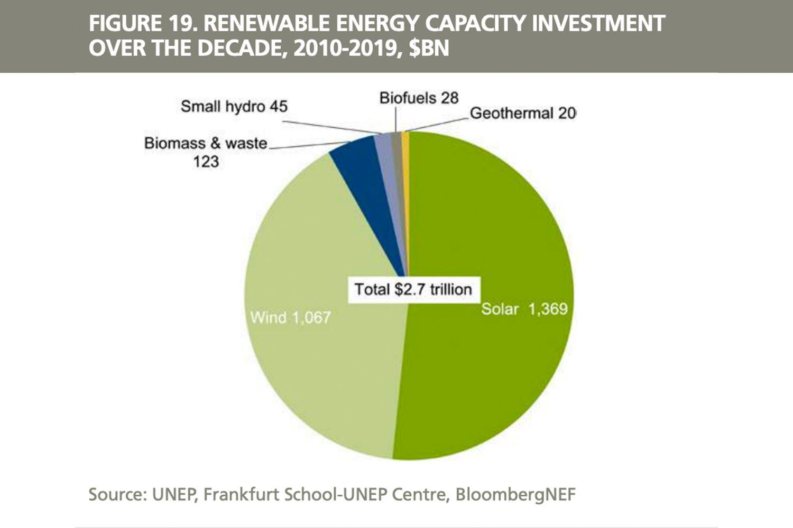

Understanding the dynamics of energy economics and investment strategies is crucial for navigating the modern financial landscape. As global energy resources face increasing scarcity, the role of Energy Return on Investment (EROI) calculations becomes paramount in determining the viability of different energy sources. EROI, defined as the ratio of energy obtained from an energy resource to the energy expended to harvest that energy, provides crucial insights into the economic and energetic efficiency of a source. A higher EROI indicates a more advantageous and efficient energy source, as it requires less energy input for a comparable or superior energy output.

In parallel to these energy considerations, the financial world has seen a transformative shift towards algorithmic trading, which utilizes computer algorithms to make trading decisions and execute orders based on predefined criteria. This data-driven approach allows traders and investors to capitalize on market dynamics with precision and speed, which is particularly valuable in volatile sectors like energy. By leveraging EROI insights, algorithmic trading can enhance strategic investment decisions, optimizing portfolios based on real-time data analysis. Advanced computational methods allow for the processing of massive datasets, offering opportunities to refine strategies and improve returns.



The convergence of EROI analysis and algorithmic trading highlights the evolving landscape of energy investments. As technology advances, automated systems increasingly provide precision and efficiency, revolutionizing how investors approach energy economics. Modern energy markets demand an integrated understanding of these components to navigate complexities effectively and seize opportunities for strategic investment.

## Table of Contents

## Understanding Energy Return on Investment (EROI)

Energy Return on Investment (EROI) is a pivotal metric for assessing the efficiency and viability of different energy sources. It is expressed as a ratio of the amount of energy produced by a particular source to the energy invested in producing it. Mathematically, EROI is defined as:

$$
\text{EROI} = \frac{\text{Energy Output}}{\text{Energy Input}}
$$

High EROI values indicate energy sources that are cost-effective and efficient, as they produce a substantial amount of energy relative to the energy expended. For instance, traditional fossil fuels, such as coal, historically boasted high EROIs due to easily accessible deposits and established extraction technologies. However, as these resources become harder to extract, their EROI has decreased over time.

In contrast, renewable energy sources like wind and solar have varying EROIs. Technological advances and manufacturing improvements have significantly increased the EROI of these renewables, making them more competitive. Photovoltaic solar energy, with improvements in panel efficiency, has seen rising EROI values, bolstering its economic viability. Wind energy, particularly in locations with strong and consistent wind patterns, often exhibits high EROI values, reflecting its minimal energy input compared to output.

Nuclear energy represents another interesting case with a relatively high EROI, primarily due to its substantial energy output over time. However, it demands significant initial energy investment in the form of complex infrastructure and safety measures.

Understanding and analyzing EROI is crucial for judging the sustainability of energy projects and making informed investment decisions. EROI not only influences direct economic considerations but also impacts broader policy-making. Governments and investors often rely on EROI to steer towards sustainable, efficient, and economically sound energy portfolios.

By considering EROI in assessments, stakeholders can identify energy projects that promise optimal returns on investment while aligning with sustainability objectives. The disparity in EROIs among different energy types underlines the importance of this metric in shaping energy markets and guiding future investments.

## Energy Economics and Its Impact on Investment

Energy economics is a vital framework for understanding the intricate processes involved in the production, distribution, and consumption of energy. These processes significantly impact commodity prices and electricity pricing, making energy economics a critical consideration for investors. This field of study focuses on how economic principles apply to energy resource management, linking it directly to the dynamics of the broader economy.

One of the core economic factors is the concept of supply and demand, which dictates the pricing and availability of energy commodities. In energy markets, supply can be influenced by various factors such as extraction technology, geopolitical events, and natural resource availability, while demand tends to reflect economic growth, industrial activity, and consumer behaviors. The interplay of these factors often leads to [volatility](/wiki/volatility-trading-strategies) in energy prices, affecting both short-term markets and long-term investments.

Technological advancements also play a pivotal role in shaping energy markets. Innovations such as improved extraction technologies, energy storage solutions, and increased efficiency in renewable energy systems can alter the cost structures and competitive landscape of energy sources. These advancements may lead to shifts in Energy Return on Investment (EROI), a critical metric that assesses the net energy gain from energy production processes. Higher EROIs typically indicate more economically viable energy sources, informing investor decisions.

Policy regulations are another crucial element influencing energy economics. Government policies, environmental regulations, and international agreements can affect energy pricing and availability. Policies promoting green energy can drive investments towards renewable sources, reflecting societal shifts towards sustainability. On the other hand, regulations on carbon emissions can increase costs in fossil fuel markets, altering their EROI and competitiveness.

Investors must consider these factors when evaluating potential energy investments. Fluctuations in energy economics can significantly impact financial returns, necessitating a thorough analysis of market conditions and trends. Renewable energy sources, which often have higher EROIs, present both opportunities and challenges. They align with global sustainability goals but may require navigating policy-driven incentives and market uncertainties.

The ongoing global transition towards renewable energy sources is reshaping the investment landscape. As countries aim to reduce carbon emissions and enhance energy sustainability, investments in renewable energy are expected to grow. This transition highlights the importance of EROI, as investors seek optimal returns from energy sources that are not only sustainable but also economically viable.

In conclusion, energy economics plays a crucial role in investment decisions, intertwining technological, economic, and policy-related factors. By understanding these dynamics, investors can strategically position themselves in the evolving energy landscape, capitalizing on the opportunities presented by high-EROI renewable sources and staying resilient amidst market fluctuations.

## Algorithmic Trading in Energy Markets

Algorithmic trading employs computational algorithms to execute trades, capitalizing on market opportunities based on predefined criteria. This automated, data-driven approach has increasingly permeated the energy sector, where the volatility and complexity of the market make precision and speed essential.

In the context of energy markets, algorithmic strategies are tailored to respond to real-time data and market trends. These strategies often incorporate insights from Energy Return on Investment (EROI), a crucial metric that assesses the efficiency and viability of energy sources. By integrating EROI data into trading algorithms, investors can refine their decision-making processes, optimizing portfolios for enhanced returns and efficiency.

High-frequency trading ([HFT](/wiki/high-frequency-trading-strategies)) and quantitative strategies are instrumental technologies in the energy sector. They offer significant advantages through their ability to analyze and act on vast amounts of data in milliseconds. For example, quantitative models might [factor](/wiki/factor-investing) in historical price patterns, weather forecasts affecting renewable energy supply, or geopolitical events impacting fossil fuel prices. These elements can be encoded into algorithms, allowing them to make informed trades rapidly in a highly competitive market.

To effectively integrate EROI into [algorithmic trading](/wiki/algorithmic-trading), an understanding of both the underlying energy economics and the mechanics of trading algorithms is necessary. A simple Python algorithm might look like this:

```python
import numpy as np
import pandas as pd

# Sample hypothetical data
energy_data = pd.DataFrame({
    'time': pd.date_range(start='1/1/2023', periods=100, freq='D'),
    'price': np.random.rand(100) * 100,
    'EROI': np.random.rand(100) * 10
})

# Example trading strategy based on EROI
def trading_signal(row):
    if row['EROI'] > 5 and row['price'] < 50:
        return 'Buy'
    elif row['EROI'] < 3:
        return 'Sell'
    else:
        return 'Hold'

energy_data['signal'] = energy_data.apply(trading_signal, axis=1)
```

This script uses EROI data along with price information to generate trading signals. A robust algorithm, however, would involve more sophisticated analytics, continuous data feeds, and advanced risk management protocols.

The implementation of algorithmic trading in energy markets necessitates a strong technological infrastructure, capable of handling large datasets and executing trades with minimal latency. Additionally, robust data analysis methods and risk management techniques are crucial for managing the inherent uncertainties of energy markets and maintaining a competitive edge.

In conclusion, algorithmic trading represents a significant advancement in energy market investments. By leveraging technology and integrating insights such as EROI, investors can enhance their strategic positioning, achieve greater efficiency, and unlock new opportunities in an increasingly dynamic sector.

## Strategic Implications for Investors

Understanding Energy Return on Investment (EROI) and energy economics is crucial for investors aiming to optimize their portfolios. EROI, a metric that measures the energy output relative to the energy input of a source, provides valuable insights into the efficiency and economic viability of different energy investments. By evaluating EROI alongside market dynamics, investors can make decisions that balance both risk and opportunity.

Diversification is a key strategy for investors seeking resilience against market fluctuations. This involves investing in a mix of traditional and renewable energy sources. Traditional energy sources, such as fossil fuels, often exhibit lower EROIs due to higher extraction and processing costs. However, they still play a significant role in global energy supply. In contrast, renewable sources like solar and wind typically show higher EROIs, driven by decreasing technological costs and the absence of fuel expenses.

Algorithmic trading emerges as a potent tool for investors, offering the ability to automate and optimize trading strategies. By utilizing computational algorithms that can rapidly process large datasets, investors can detect and exploit market inefficiencies that manual trading might miss. For example, a Python script could be used to implement a trading algorithm that buys or sells energy futures based on EROI indicators and real-time market data. This strategy can increase trading precision and reduce the time reacting to market movements.

```python
import pandas as pd
import numpy as np

# Example of a simple trading algorithm

def calculate_eroi(energy_output, energy_input):
    return energy_output / energy_input

def trading_signal(eroi, threshold=5):
    if eroi > threshold:
        return "Buy"
    elif eroi < threshold:
        return "Sell"
    else:
        return "Hold"

# Sample data
data = {
    'energy_output': [100, 150, 200],
    'energy_input': [10, 20, 30]
}

df = pd.DataFrame(data)
df['EROI'] = np.vectorize(calculate_eroi)(df['energy_output'], df['energy_input'])
df['Signal'] = df['EROI'].apply(trading_signal)
print(df)
```

As global energy transitions gain [momentum](/wiki/momentum), investors must stay informed about policy changes and technological advancements. Governments worldwide are enacting policies to support sustainable energy sources to reduce carbon emissions. These regulatory changes can have substantial impacts on energy market dynamics and investment returns. Thus, ongoing analysis and adaptation to policy environments are crucial for strategic positioning.

Long-term investment success increasingly hinges on integrating sustainability metrics, such as EROI, into financial analyses and decision-making processes. By incorporating these metrics, investors not only enhance their understanding of asset efficiency but also align with broader environmental and social governance ([ESG](/wiki/esg-investing)) goals, which are becoming central to modern investment strategies.

In conclusion, a nuanced understanding of EROI and energy economics, combined with the strategic use of algorithmic trading and diversification, will equip investors to navigate the evolving energy landscape effectively.

## Conclusion

The integration of Energy Return on Investment (EROI) calculations, energy economics, and algorithmic trading provides a robust framework for investors navigating the modern energy marketplace. EROI serves as an essential metric, guiding investors in evaluating the economic viability and sustainability of different energy sources. As energy resources evolve, particularly with the growing emphasis on renewables, EROI calculations become indispensable for assessing which projects promise higher returns relative to their energy input. 

Technological advancements in trading, notably algorithmic trading, equip investors with tools to effectively respond to the dynamic and often volatile nature of energy prices. By leveraging sophisticated algorithms, investors can execute trades with precision and speed, optimizing their portfolios in line with real-time data. Algorithmic strategies, when combined with EROI insights, enable a more informed approach to capturing market opportunities and managing risks, thereby enhancing potential returns and mitigating downside exposures.

As global efforts increasingly focus on sustainable energy solutions, EROI will remain a central factor in determining the long-term viability of energy projects. The transition towards cleaner energy practices underscores the need for strategic investments that incorporate sustainability metrics alongside traditional economic considerations. Harnessing algorithmic trading capabilities offers investors the advantage of efficiency and precision, facilitating proactive management of energy investments.

In conclusion, the successful navigation of energy markets in the future will be determined by a thorough understanding of energy dynamics coupled with the strategic use of trading technologies. As energy systems become more complex, integrating technological insights with economic analyses will be key to seizing new investment opportunities and achieving sustainable returns.

## References & Further Reading

[1]: Hall, C. A. S., & Klitgaard, K. A. (2012). ["Energy and the Wealth of Nations: Understanding the Biophysical Economy"](https://www.amazon.com/Energy-Wealth-Nations-Understanding-Biophysical/dp/1441993975). Springer.

[2]: Murphy, D. J., & Hall, C. A. S. (2010). ["Year in review—EROI or energy return on (energy) invested."](https://nyaspubs.onlinelibrary.wiley.com/doi/10.1111/j.1749-6632.2009.05282.x) Geosphere.

[3]: Smil, V. (2017). ["Energy and Civilization: A History"](https://direct.mit.edu/books/book/3576/Energy-and-CivilizationA-History). MIT Press.

[4]: Lopez de Prado, M. (2018). ["Advances in Financial Machine Learning"](https://www.amazon.com/Advances-Financial-Machine-Learning-Marcos/dp/1119482089). Wiley.

[5]: Chan, E. (2008). ["Quantitative Trading: How to Build Your Own Algorithmic Trading Business"](https://github.com/ftvision/quant_trading_echan_book). Wiley.

[6]: Jansen, S. (2020). ["Machine Learning for Algorithmic Trading: Predictive models to extract signals from market and alternative data for systematic trading strategies with Python"](https://www.amazon.com/Machine-Learning-Algorithmic-Trading-alternative/dp/1839217715). Packt Publishing.

[7]: Aronson, D. R. (2007). ["Evidence-Based Technical Analysis: Applying the Scientific Method and Statistical Inference to Trading Signals"](https://onlinelibrary.wiley.com/doi/book/10.1002/9781118268315). Wiley.