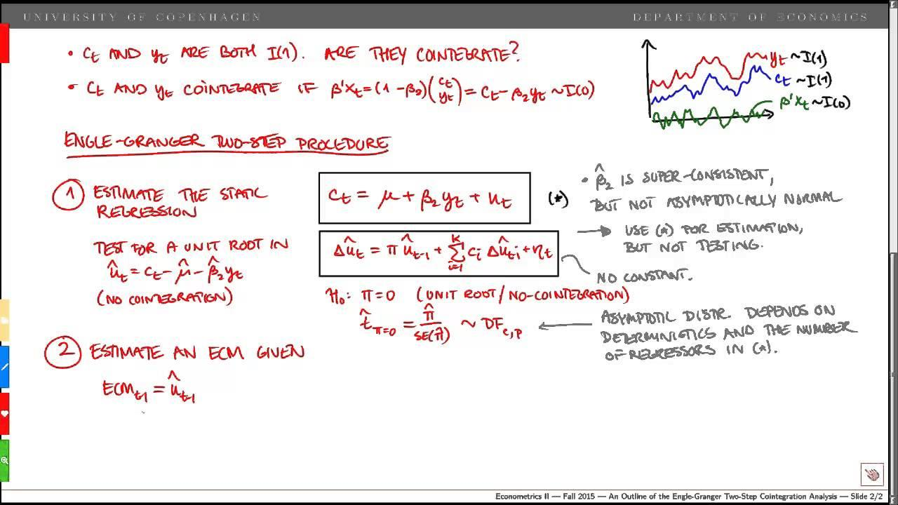

## Table of Contents

## What is Engle-Granger analysis?

Engle-Granger analysis is a method used in statistics and econometrics to find out if two or more time series data sets move together over time. This is called cointegration. Imagine you have data on the prices of two different stocks. If these prices tend to move together in the long run, even if they go up and down differently in the short term, they might be cointegrated. The Engle-Granger test helps you figure this out by first checking if the individual time series are not stationary, meaning their statistical properties like mean and variance change over time. Then, it looks at the residuals, or the differences, after you try to model one series as a function of the other. If these residuals are stationary, the series are likely cointegrated.

Once you know that two series are cointegrated, you can build a better model that takes into account both the short-term fluctuations and the long-term relationship between the series. This is useful in many fields, like finance, where understanding the relationship between different economic indicators or stock prices can help with making predictions or decisions. The Engle-Granger method was developed by Robert Engle and Clive Granger, who won the Nobel Prize in Economics in 2003 for their work on this and related topics. Their method has become a fundamental tool for economists and statisticians working with time series data.

## Who developed the Engle-Granger test?

The Engle-Granger test was developed by two economists named Robert Engle and Clive Granger. They came up with this test to help figure out if two sets of data, like the prices of two stocks, move together over time. This is important because if two things are moving together, it can help people make better predictions or decisions.

Engle and Granger's work on this test was so important that they won the Nobel Prize in Economics in 2003. Their test looks at whether the differences between two sets of data stay the same over time. If these differences are stable, then the two sets of data are said to be cointegrated, meaning they have a long-term relationship even if they go up and down differently in the short term.

## What is the purpose of conducting an Engle-Granger analysis?

The purpose of conducting an Engle-Granger analysis is to find out if two sets of data move together over time. This is important because it can help people understand if there's a long-term relationship between two things, like the prices of two different stocks or the levels of two economic indicators. If these two sets of data are found to be moving together, we say they are cointegrated. Knowing this can help in making better predictions or decisions, especially in fields like finance and economics.

The Engle-Granger test works by first checking if each set of data on its own is not stable, meaning its average and how much it varies can change over time. Then, it tries to see if the differences between the two sets of data become stable when one is used to predict the other. If these differences are stable, it means the two sets of data are cointegrated. This tells us that even though they might go up and down differently in the short term, they tend to move together in the long run.

## Can you explain the basic steps involved in performing an Engle-Granger test?

To perform an Engle-Granger test, you start by looking at the two sets of data you want to check for a long-term relationship. First, you need to see if each set of data on its own is not stable over time. This means checking if their averages and how much they vary can change. If both sets of data are not stable on their own, you can move to the next step. This is important because the test only works with data that isn't stable by itself.

Next, you try to predict one set of data using the other set. You do this by creating a simple model where one set of data is used to guess the values of the other set. Then, you look at the differences between the actual values and the values your model predicted. These differences are called residuals. The key part of the Engle-Granger test is to see if these residuals are stable over time. If they are, it means the two sets of data are cointegrated, which means they have a long-term relationship even if they go up and down differently in the short term.

## What are the key assumptions of the Engle-Granger test?

The Engle-Granger test has some important assumptions that you need to keep in mind when using it. First, it assumes that the two sets of data you are looking at are not stable on their own. This means that their averages and how much they vary can change over time. If the data were stable by themselves, the test wouldn't work because it's designed to find long-term relationships between sets of data that aren't stable on their own.

Another key assumption is that the relationship between the two sets of data is linear. This means that when you try to predict one set of data using the other, you're assuming that the relationship can be described by a straight line. If the relationship is more complicated, the Engle-Granger test might not give you the right answer. Also, the test assumes that the residuals, which are the differences between the actual values and the predicted values, should be stable over time if the two sets of data are cointegrated. If these residuals aren't stable, then the test suggests that there's no long-term relationship between the two sets of data.

## How does the Engle-Granger test differ from other cointegration tests like Johansen's?

The Engle-Granger test and Johansen's test are both used to find out if two or more sets of data move together over time, which is called cointegration. The main difference between them is how they approach the problem. The Engle-Granger test looks at two sets of data at a time and checks if they are cointegrated by first making sure each set of data is not stable on its own. Then, it tries to predict one set of data using the other and checks if the differences between the actual and predicted values are stable. This test is simpler and easier to understand, but it can only check for cointegration between two sets of data at a time.

On the other hand, Johansen's test can look at more than two sets of data at once. It's more complicated because it uses a different method to check for cointegration. Instead of looking at the differences between actual and predicted values, Johansen's test looks at the whole system of data and checks if there are any long-term relationships among all the sets of data. This makes it more powerful for finding cointegration in multiple sets of data, but it's also harder to use and understand. So, if you're only looking at two sets of data and want a simpler test, the Engle-Granger test might be better. But if you have more sets of data and want to check for multiple relationships, Johansen's test is a better choice.

## What is the null hypothesis in an Engle-Granger test?

In an Engle-Granger test, the null hypothesis is that there is no long-term relationship between the two sets of data you are looking at. This means that if you try to predict one set of data using the other, the differences between what you predict and what actually happens should not be stable over time.

If you find that these differences are stable, it means you can reject the null hypothesis. This tells you that there is a long-term relationship between the two sets of data, which is called cointegration. So, the Engle-Granger test helps you figure out if two things, like the prices of two stocks, move together in the long run even if they go up and down differently in the short term.

## How do you interpret the results of an Engle-Granger test?

When you do an Engle-Granger test, you're trying to find out if two sets of data have a long-term relationship. The test looks at the differences between what you predict and what actually happens. If these differences are stable over time, it means the two sets of data are cointegrated. In simple terms, this means that even though the two sets of data might go up and down differently in the short term, they tend to move together in the long run.

To interpret the results, you need to check if you can reject the null hypothesis. The null hypothesis says there's no long-term relationship between the two sets of data. If the test shows that the differences are stable, you can reject the null hypothesis. This means you've found evidence that the two sets of data are cointegrated. If the differences are not stable, you can't reject the null hypothesis, which means there's no long-term relationship between the two sets of data.

## What are the limitations of the Engle-Granger test?

The Engle-Granger test is a useful tool, but it has some limitations. One big limitation is that it can only check for cointegration between two sets of data at a time. If you have more than two sets of data and want to see if they all move together, you'll need to use a different test like Johansen's test. Another limitation is that the Engle-Granger test assumes the relationship between the two sets of data is a straight line. If the relationship is more complicated, the test might not give you the right answer.

Another problem with the Engle-Granger test is that it can be sensitive to which set of data you use to predict the other. If you switch which set of data you use as the predictor, you might get different results. This can make it hard to be sure about the long-term relationship between the two sets of data. Also, the test can sometimes give you the wrong answer if the data doesn't fit the test's assumptions well, like if the data is not stable in the right way. So, it's important to be careful and check your data carefully before using the Engle-Granger test.

## Can you provide an example of how Engle-Granger analysis is applied in economic research?

In economic research, the Engle-Granger analysis is often used to understand the long-term relationship between different economic indicators. For example, researchers might want to see if there is a long-term connection between the prices of oil and the overall inflation rate. They would start by collecting data on both oil prices and inflation over many years. After checking that both sets of data are not stable on their own, they would use the Engle-Granger test to see if the differences between what they predict for inflation using oil prices and the actual inflation rates are stable over time. If these differences are stable, it means that oil prices and inflation are cointegrated, suggesting that changes in oil prices could have a long-term impact on inflation.

This kind of analysis can be very helpful for policymakers and economists. If they find that oil prices and inflation are cointegrated, they might use this information to predict future inflation rates based on oil price movements. This could help them make better decisions about things like interest rates or economic policies. The Engle-Granger test gives them a way to check if the relationship they see between oil prices and inflation is real and not just a short-term coincidence. By understanding these long-term relationships, they can plan better for the future and help keep the economy stable.

## How can one address the issue of residual autocorrelation in Engle-Granger analysis?

When using the Engle-Granger test, you might find that the residuals, or the differences between what you predicted and what actually happened, are not random but show a pattern over time. This is called residual autocorrelation, and it can make your test results less reliable. If the residuals are autocorrelated, it means they are not as stable as you need them to be for the test to work properly. To fix this, you can use a method called the Augmented Dickey-Fuller (ADF) test on the residuals. The ADF test helps you check if the residuals are stable by adding extra terms to account for the autocorrelation.

If the ADF test shows that the residuals are stable after accounting for autocorrelation, then you can feel more confident about your Engle-Granger test results. Another way to address residual autocorrelation is by using a different cointegration test, like the Johansen test, which can handle multiple sets of data and is less sensitive to autocorrelation issues. By choosing the right method and making sure your residuals are as random as possible, you can get a clearer picture of whether the two sets of data you are studying really have a long-term relationship.

## What advanced techniques can be used to enhance the robustness of Engle-Granger test results?

To make the results of the Engle-Granger test more reliable, you can use a method called the Augmented Dickey-Fuller (ADF) test on the residuals. The residuals are the differences between what you predicted and what actually happened. If these residuals show a pattern over time, it can mess up your test results. The ADF test helps by adding extra terms to account for these patterns, which makes your residuals more random and stable. This way, you can be more sure that the long-term relationship you found between the two sets of data is real and not just a short-term coincidence.

Another advanced technique is to use a different cointegration test like the Johansen test. The Johansen test can look at more than two sets of data at once and is less sensitive to patterns in the residuals. This means it can give you a clearer picture of whether multiple sets of data move together over time. By using the Johansen test, you can check for long-term relationships in a more thorough way. Both the ADF test and the Johansen test can help you feel more confident in your findings and make better decisions based on the relationships you find in your data.

## What is Cointegration and How Can We Understand It?

Cointegration is a critical statistical concept used to identify and measure long-term equilibrium relationships between time series data sets. This concept is particularly significant in financial markets where the identification of cointegrated pairs helps in constructing effective pairs trading strategies. Pairs trading involves exploiting the mean-reverting behavior of two or more cointegrated financial instruments, such as stocks or exchange rates, by taking long and short positions to profit from deviations from their equilibrium relationship.

The notion of cointegration was introduced by Clive W.J. Granger, who, along with Robert F. Engle, was awarded the Nobel Prize in Economic Sciences in 2003 for their contributions to the field. Cointegration has since become a fundamental tool in financial econometrics, providing insights into the dynamic relationship between non-stationary time series. Unlike correlation, which measures the strength and direction of a linear relationship between two variables over the same time period, cointegration focuses on the shared stochastic trends and long-term persistence in the movements of the series.

Mathematically, two time series $X_t$ and $Y_t$ are said to be cointegrated if both series are integrated of order 1, $I(1)$, meaning they become stationary after differencing once, and there exists a linear combination $\alpha X_t + \beta Y_t$ that is stationary, $I(0)$. This stationary linear combination implies that while the individual series might wander widely over time, they maintain an equilibrium relationship, periodically reverting to a mean state.

To formally test for cointegration, the Engle-Granger two-step method can be utilized. The first step involves estimating the long-term equilibrium relationship between the two series through ordinary least squares regression, obtaining the residuals:

$$
\text{Residual}_t = X_t - \gamma Y_t
$$

where $\gamma$ is the estimated cointegrating coefficient. In the second step, these residuals are tested for stationarity using unit root tests such as the Augmented Dickey-Fuller (ADF) test. If the residuals are found to be stationary, the original time series are considered cointegrated.

Understanding cointegration provides foundational knowledge for the application of the Engle-Granger method, offering traders and analysts a robust framework for constructing and optimizing mean-reversion trading strategies. By recognizing the distinction between short-term correlation and long-term cointegration, traders can develop strategies that are better aligned with the inherent statistical properties of asset prices.

In summary, cointegration uncovers persistent relationships between non-stationary time series, offering valuable insights for trading in financial markets. By focusing on the long-term equilibrium between securities or market indices, traders can identify opportunities to capture returns from recurrent deviations in asset prices.

## What is an Overview of Engle-Granger Analysis?

The Engle-Granger method is a seminal approach for testing cointegration in time series data, introduced by Robert F. Engle and Clive W.J. Granger. Engle-Granger analysis is widely used in econometrics and finance due to its ability to identify long-term equilibrium relationships between non-stationary time series. The method is structured as a two-step procedure that offers simplicity and intuitive insight into the dynamics of paired data.

The first step involves estimating a long-term equilibrium relationship between the time series using ordinary least squares (OLS) regression. Two non-stationary time series $Y_t$ and $X_t$ are considered cointegrated if there exists a linear combination that results in a stationary series. The OLS regression can be expressed as follows:

$$
Y_t = \alpha + \beta X_t + \epsilon_t
$$

where $\epsilon_t$ is the residual term. The idea is to determine whether these residuals are stationary, indicating a stable long-term relationship despite potential short-term deviations.

Once the regression is estimated, the second step of Engle-Granger analysis is to test the residuals $\epsilon_t$ for stationarity. This is typically achieved using unit root tests such as the Dickey-Fuller or Augmented Dickey-Fuller (ADF) test. If the residuals are found to be stationary, it implies that the original time series are cointegrated.

$$
\Delta \epsilon_t = \gamma \epsilon_{t-1} + \sum_{i=1}^{k} \phi_i \Delta \epsilon_{t-i} + \nu_t
$$

where $\Delta$ denotes the difference operator, $k$ is the number of lagged difference terms included to account for serial correlation, and $\nu_t$ is the white noise error term. The null hypothesis of the ADF test posits the presence of a unit root, hence if rejected, the residuals are considered stationary.

The historical significance of this method arises from the foundational work of Engle and Granger, for which they were awarded the Nobel Prize in Economic Sciences in 2003. Their contribution has reinforced the importance of distinguishing between correlation and cointegration, especially in financial markets where misinterpretation can lead to suboptimal trading strategies.

Understanding the mechanics of Engle-Granger analysis is essential for traders, as it lays the groundwork for constructing reliable trading strategies based on long-term equilibrium relationships. By applying this method, traders can identify asset pairs exhibiting stable co-movements, opening avenues for mean-reversion trading strategies and risk management enhancements.

## References & Further Reading

[1]: Engle, R. F., & Granger, C. W. J. (1987). ["Co-integration and Error Correction: Representation, Estimation, and Testing."](https://www.jstor.org/stable/1913236?read-now=1) Econometrica, 55(2), 251-276.

[2]: Banerjee, A., Dolado, J. J., Galbraith, J. W., & Hendry, D. F. (1993). ["Co-integration, Error Correction, and the Econometric Analysis of Non-Stationary Data."](https://academic.oup.com/book/36111) Oxford University Press.

[3]: Harris, R., & Sollis, R. (2003). ["Applied Time Series Modelling and Forecasting."](https://archive.org/details/appliedtimeserie0000harr) Wiley.

[4]: Johansen, S. (1991). ["Estimation and Hypothesis Testing of Cointegration Vectors in Gaussian Vector Autoregressive Models."](https://www.econometricsociety.org/publications/econometrica/1991/11/01/estimation-and-hypothesis-testing-cointegration-vectors) Econometrica, 59(6), 1551-1580.

[5]: Tsay, R. S. (2005). ["Analysis of Financial Time Series,"](https://onlinelibrary.wiley.com/doi/book/10.1002/9780470644560) 2nd Edition. Wiley.