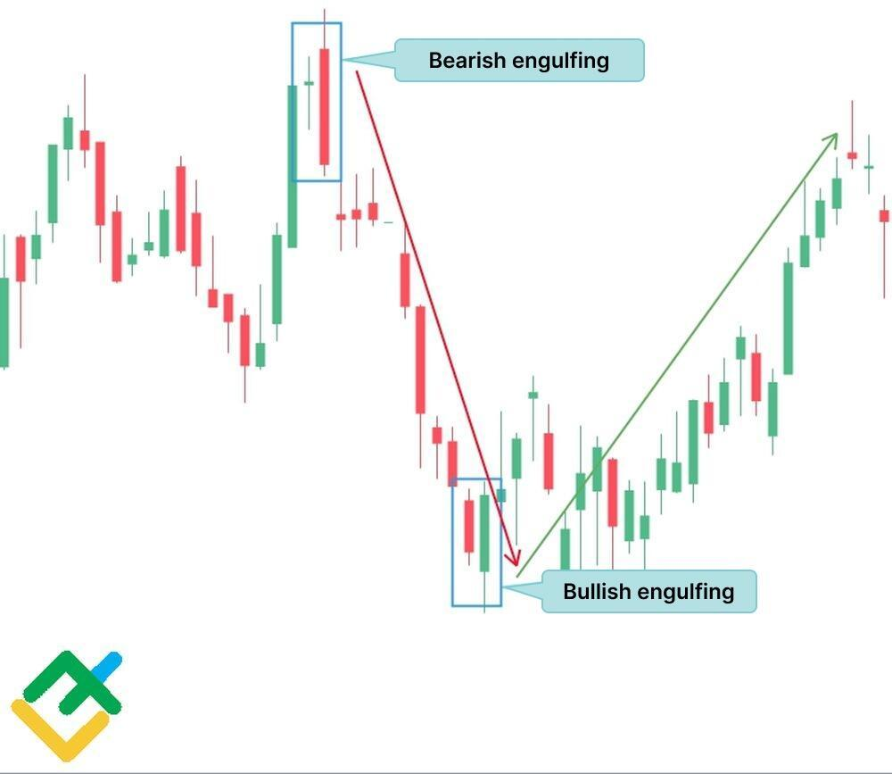

## Table of Contents

## What is the Engulfing Trading Strategy?

The Engulfing Trading Strategy is a popular method used by traders to predict potential reversals in the market. It involves looking for a specific pattern on a price chart called the "engulfing pattern." This pattern happens when a small candle is followed by a larger candle that completely engulfs the body of the smaller one. If the engulfing candle is bullish (green or white), it suggests that buyers are taking control and the price might go up. If it's bearish (red or black), it means sellers are in control and the price might go down.

To use the Engulfing Trading Strategy, traders watch for these engulfing patterns at key support or resistance levels. When they spot an engulfing pattern, they might decide to enter a trade in the direction of the engulfing candle. For example, if they see a bullish engulfing pattern at a support level, they might buy the asset, expecting the price to rise. Conversely, if they see a bearish engulfing pattern at a resistance level, they might sell or short the asset, anticipating a price drop. This strategy helps traders make decisions based on clear signals from the market.

## How does the Engulfing pattern form on a candlestick chart?

The Engulfing pattern on a candlestick chart is easy to spot. It happens when you see two candles next to each other. The first candle is small, and the second candle is big. The big candle completely covers or "engulfs" the body of the small candle. If the first candle is red (showing the price went down) and the second candle is green (showing the price went up), it's called a bullish engulfing pattern. If the first candle is green and the second is red, it's a bearish engulfing pattern.

This pattern shows a change in who's in control of the market. For the bullish engulfing pattern, it means buyers have taken over from sellers. The small red candle shows sellers were in charge at first, but then the big green candle shows buyers came in strong and pushed the price up higher than where it started with the small candle. For the bearish engulfing pattern, it's the opposite. The small green candle shows buyers were in control, but then the big red candle shows sellers came in and pushed the price down lower than where it started with the small candle. This can help traders decide when to buy or sell.

## What are the key differences between a bullish and bearish Engulfing pattern?

A bullish engulfing pattern happens when you see a small red candle followed by a big green candle. The green candle completely covers the red one. This shows that at first, sellers were in charge, but then buyers came in strong and pushed the price up higher than where it started with the small red candle. It's a sign that buyers might keep pushing the price up.

A bearish engulfing pattern is the opposite. It starts with a small green candle and then a big red candle comes next. The red candle covers the whole green one. This means buyers were in control at first, but then sellers took over and pushed the price down lower than where it started with the small green candle. It's a hint that sellers might keep pushing the price down.

These patterns help traders see when the market might be changing direction. A bullish pattern suggests it's a good time to buy, while a bearish pattern suggests it might be a good time to sell or short.

## Can you explain the psychology behind the Engulfing pattern?

The psychology behind the Engulfing pattern is all about how traders feel and what they do. When you see a bullish Engulfing pattern, it starts with a small red candle, which means sellers were pushing the price down a little. But then, a big green candle comes and covers the whole red one. This shows that buyers suddenly got really strong and excited. They jumped in and pushed the price up a lot, more than where it started with the red candle. It's like they saw the price drop and thought, "This is a great time to buy!" So, they bought a lot, making the price go up and showing everyone that they're now in control.

On the other hand, a bearish Engulfing pattern tells a different story. It begins with a small green candle, showing that buyers were in charge at first and pushing the price up a bit. But then, a big red candle comes and swallows the whole green one. This means sellers suddenly got strong and decided to sell a lot. They saw the price go up and thought, "It's too high, time to sell!" So, they sold a lot, pushing the price down lower than where it started with the green candle. This shows everyone that sellers are now in control and might keep pushing the price down.

## What are the ideal market conditions for using the Engulfing Trading Strategy?

The Engulfing Trading Strategy works best when the market is moving a lot. This means you should look for times when prices are going up and down a lot, not staying the same. When the market is moving like this, it's easier to spot the Engulfing patterns because they stand out more. Also, it's good to use this strategy when the market is at key levels, like support or resistance. These are points where the price often changes direction, so seeing an Engulfing pattern here can be a strong sign that the price is about to move in a new direction.

Another important thing is to use the Engulfing Trading Strategy in markets with clear trends. If the market has been going up or down for a while, an Engulfing pattern can show when that trend might be about to change. For example, if the market has been going down and you see a bullish Engulfing pattern, it might mean the price is about to start going up. So, the best times to use this strategy are when the market is moving a lot, at key levels, and during clear trends.

## How can a beginner identify an Engulfing pattern on a chart?

To identify an Engulfing pattern on a chart, a beginner should first look for two candles side by side. The first candle will be small, and the second candle will be big. The key thing to watch for is that the body of the big candle completely covers the body of the small candle. If the first candle is red and the second is green, you have a bullish Engulfing pattern. If the first candle is green and the second is red, you have a bearish Engulfing pattern. It's important to focus on the body of the candles, which is the thick part that shows the opening and closing prices.

When looking at a chart, beginners should also pay attention to where the Engulfing pattern happens. It's more meaningful if it shows up at important levels, like where the price often stops going down (support) or stops going up (resistance). If you see a bullish Engulfing pattern at a support level, it might mean the price is about to start going up. If you see a bearish Engulfing pattern at a resistance level, it might mean the price is about to start going down. By watching for these patterns and where they happen, beginners can start to understand when the market might be changing direction.

## What additional indicators should be used to confirm an Engulfing pattern?

To confirm an Engulfing pattern, traders often use other indicators to make sure their guesses are right. One common indicator is the Relative Strength Index (RSI). The RSI shows if a market is overbought or oversold. If you see a bullish Engulfing pattern and the RSI is below 30, it means the market might be ready to go up because it's been pushed down too much. If you see a bearish Engulfing pattern and the RSI is above 70, it might mean the market is ready to go down because it's been pushed up too much.

Another helpful indicator is the Moving Average Convergence Divergence (MACD). The MACD helps show the strength of a trend and if it might be changing. If the MACD line crosses above the signal line around the same time as a bullish Engulfing pattern, it can be a strong sign that the price might go up. If the MACD line crosses below the signal line with a bearish Engulfing pattern, it can be a strong sign that the price might go down. Using these extra indicators can help traders feel more confident about their decisions based on Engulfing patterns.

## What are the common entry and exit points when trading with an Engulfing pattern?

When trading with an Engulfing pattern, a common entry point for a bullish pattern is right after the big green candle closes. If you see a small red candle followed by a big green one that covers it, you can enter a buy trade once the big green candle finishes. For a bearish pattern, the entry point is right after the big red candle closes. If you see a small green candle followed by a big red one that covers it, you can enter a sell or short trade once the big red candle finishes. It's important to wait until the candle closes to make sure the pattern is complete before entering the trade.

For [exit](/wiki/exit-strategy) points, traders often use stop-loss and take-profit levels to manage their trades. A stop-loss is set below the low of the bullish Engulfing pattern to limit losses if the price goes down instead of up. For a bearish pattern, the stop-loss is set above the high of the pattern. The take-profit level can be set at a key resistance level for a bullish trade or a key support level for a bearish trade. Some traders also use a trailing stop to lock in profits as the price moves in their favor, allowing them to stay in the trade longer and potentially make more money.

## How does risk management play a role when implementing the Engulfing Trading Strategy?

Risk management is super important when you're using the Engulfing Trading Strategy. It helps you keep your losses small and protect your money. One way to do this is by setting a stop-loss. If you see a bullish Engulfing pattern and decide to buy, you can set a stop-loss just below the low of the pattern. This way, if the price goes down instead of up, you won't lose too much money. For a bearish pattern, you set the stop-loss just above the high of the pattern. This keeps you safe if the price goes up instead of down.

Another part of risk management is deciding how much money to use for each trade. You don't want to risk too much on one trade, so you might only use a small part of your money. This way, even if you lose on a trade, you still have plenty of money left to try again. Also, setting a take-profit level can help you make money and get out of the trade at the right time. If you see a bullish pattern, you might set your take-profit at a resistance level. For a bearish pattern, you'd set it at a support level. This helps you lock in your profits before the price changes direction.

## What are some real-world examples of successful trades using the Engulfing pattern?

Imagine a trader named Sarah who uses the Engulfing pattern to trade stocks. One day, she sees a small red candle followed by a big green candle on the chart of a stock she's watching. This bullish Engulfing pattern happens right at a support level, which is a price where the stock often stops going down. Sarah decides to buy the stock right after the big green candle closes. She sets her stop-loss just below the low of the pattern to limit her losses if the price goes down. A few days later, the stock price goes up to a resistance level, and Sarah sells the stock, making a nice profit.

Another example is a trader named Mike who trades [forex](/wiki/forex-system). He notices a bearish Engulfing pattern on the EUR/USD chart, with a small green candle followed by a big red one. This pattern appears at a resistance level, where the price often stops going up. Mike decides to short the EUR/USD right after the big red candle closes. He sets his stop-loss just above the high of the pattern to protect himself if the price goes up. Over the next few days, the price drops to a support level, and Mike closes his short position, making a good profit from the trade.

## How can the Engulfing Trading Strategy be integrated into a broader trading system?

The Engulfing Trading Strategy can be a great part of a bigger trading system. It's like a tool that helps traders guess when the market might change direction. When you see an Engulfing pattern, you can use it as a signal to buy or sell. But, it's smart to use other tools too. For example, you can look at the Relative Strength Index (RSI) to see if the market is overbought or oversold. If the RSI agrees with the Engulfing pattern, it makes your guess stronger. Also, you can use the Moving Average Convergence Divergence (MACD) to check if the trend is about to change. By mixing the Engulfing pattern with these other indicators, you can make better trading decisions and feel more sure about your trades.

Another way to use the Engulfing Trading Strategy in a bigger system is by setting clear rules for when to enter and leave trades. When you see an Engulfing pattern at a key level like support or resistance, that's your sign to enter the trade. But, you should also set a stop-loss to protect your money if the trade goes wrong. For example, if you're buying after a bullish Engulfing pattern, put your stop-loss just below the pattern's low. And, you can set a take-profit at a resistance level if you're buying, or a support level if you're selling. This way, you can make money and get out at the right time. By using the Engulfing pattern along with these rules and other tools, you can build a strong trading system that helps you trade smarter and safer.

## What are the limitations and potential pitfalls of relying solely on the Engulfing pattern for trading decisions?

Using only the Engulfing pattern for trading can be tricky because it doesn't always work. The pattern might show up, but the price can still go the other way. This happens because the market can be unpredictable and many other things can affect the price, like news or other traders' actions. If you rely just on the Engulfing pattern, you might miss these other important signs and make a bad trade. Also, the pattern can show up a lot, but not all of them will lead to big price changes. So, if you trade every time you see an Engulfing pattern, you might end up losing money on many small trades.

Another problem is that the Engulfing pattern can be clearer on some charts than others. For example, on a daily chart, the pattern might be easier to see and more reliable than on a 5-minute chart. If you're using a shorter time frame, you might see more false signals, which can lead to more losing trades. Plus, if you don't use other tools like the RSI or MACD to confirm the pattern, you're more likely to make a wrong guess about where the price is going. So, it's better to use the Engulfing pattern along with other indicators and not just by itself.

## References & Further Reading

[1]: ["Japanese Candlestick Charting Techniques"](https://www.amazon.com/Japanese-Candlestick-Charting-Techniques-Second/dp/0735201811) by Steve Nison

[2]: Geman, H., & Yor, M. (1996). ["Volatility Modelling."](https://engineering.nyu.edu/sites/default/files/2019-03/Carr-stochastic-volatility-levy-processes.pdf) Mathematical Finance, 6(4), 365-383.

[3]: ["Algorithmic Trading: Winning Strategies and Their Rationale"](https://www.wiley.com/en-us/Algorithmic+Trading%3A+Winning+Strategies+and+Their+Rationale-p-9781118460146) by Ernie Chan

[4]: Caginalp, G., & Laurent, H. (1998). ["Strategic Decision and Algorithmic Trading."](https://papers.ssrn.com/sol3/papers.cfm?abstract_id=932984) Applied Mathematical Finance, 5(3), 181-203.

[5]: ["Technical Analysis of the Financial Markets"](https://www.amazon.com/Technical-Analysis-Financial-Markets-Comprehensive/dp/0735200661) by John J. Murphy