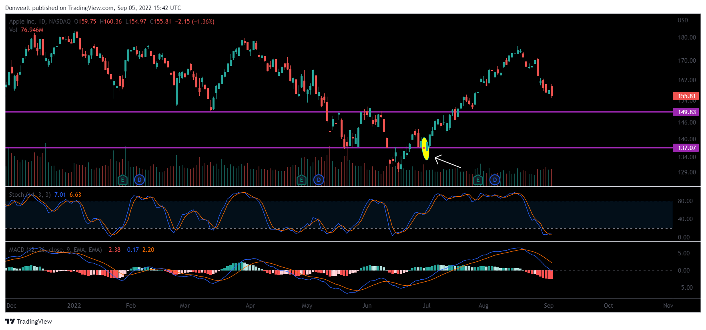

The Engulfing Candle strategy is recognized as a significant tool in algorithmic trading, primarily due to its effectiveness in identifying potential trend reversals in financial markets. This particular candlestick pattern comprises two candles: the first candle represents the current market trend, while the second, larger candle completely engulfs the body of the first, indicating a potential shift in market sentiment. This shift is critical for traders as it can signal a reversal in the market direction.

Algorithmic trading, which involves using computer programs to execute trading orders based on pre-set criteria, effectively utilizes the engulfing candle pattern to make trading decisions. The automation inherent in algorithmic trading allows for the constant monitoring of market conditions and the execution of trades based on the detection of this pattern. The system's ability to process vast amounts of data in real time enables traders to respond swiftly and capitalize on reversal signals, potentially leading to enhanced profitability.



This article provides an in-depth exploration of the Engulfing Candle strategy, emphasizing its application within algorithmic trading frameworks. The discussion will cover the nuances of the pattern, its role in trading algorithms, and a balanced view of its strengths and potential limitations as a trading strategy. By understanding these dynamics, traders can make informed decisions and effectively incorporate the Engulfing Candle pattern into their algorithmic trading strategies.

## Table of Contents

## Understanding Engulfing Candles

An Engulfing Candle pattern is a key indicator used in technical analysis, essential for identifying potential trend reversals in trading. This pattern comprises two candlesticks, where the second candle's body completely engulfs the body of the first candle, signaling a shift in market sentiment. The engulfment signifies that the momentum from the previous trend is weakening, potentially leading to a reversal.

There are two primary types of Engulfing Candle patterns: Bullish and Bearish. A Bullish Engulfing Candle occurs when a small bearish candle is followed by a larger bullish candle. This suggests that a downtrend could be reversing as buyers gain strength, absorbing the sellers' influence seen in the first candle. The psychological impact here is significant - as the second candle engulfs the first, it indicates that buyers are becoming more aggressive, leading to an upward price movement.

Conversely, a Bearish Engulfing Candle forms when a small bullish candle is followed by a larger bearish candle, indicating a potential reversal from an uptrend to a downtrend. Here, the sellers overpower the buyers, signaling a shift in market control. When the body of the bearish candle engulfs the body of the preceding bullish candle, it demonstrates that bearish sentiment is on the rise, potentially leading to a decline in prices.

To effectively deploy the Engulfing Candle pattern in [algorithmic trading](/wiki/algorithmic-trading) strategies, understanding its formation is crucial. The reliability of the pattern is further enhanced when it appears after a pronounced trend, either upward or downward. The larger the engulfing candle in relation to recent previous candles, the stronger the potential signal for reversal. This pattern is particularly potent when supported by increased trading [volume](/wiki/volume-trading-strategy), as it suggests heightened investor interest and commitment to the new direction.

Algorithmic trading systems can utilize this pattern by coding specific criteria to detect these conditions. For instance, a potential algorithm could include parameters like:

```python
# Example logic using fictional data structures
def is_engulfing(candle1, candle2):
    return (candle2.open < candle1.close and candle2.close > candle1.open) or \
           (candle2.open > candle1.close and candle2.close < candle1.open)

# Example usage
bullish_engulfing = is_engulfing(previous_bearish_candle, current_bullish_candle)
bearish_engulfing = is_engulfing(previous_bullish_candle, current_bearish_candle)
```

Through such implementations, traders can automate the detection of these patterns, thereby enhancing the decision-making process by swiftly identifying potential reversal opportunities.

Understanding the significance of Engulfing Candles and their role in indicating market sentiment shifts is fundamental to leveraging them effectively within trading algorithms. This awareness not only aids in identifying entry and [exit](/wiki/exit-strategy) points but also in refining risk management strategies by knowing when to anticipate potential market reversals.

## Identifying Engulfing Candles in Algo Trading

Algorithmic trading systems, particularly those utilizing the Engulfing Candle strategy, rely heavily on specific criteria to identify patterns signaling trend reversals. The Engulfing Candle pattern involves two candles, with the second candle entirely enveloping the body of the first, pointing to a shift in market sentiment. To automate the identification of these patterns, trading algorithms can be developed with precise parameters including candle size and volume changes, which are crucial markers of potential reversals.

Automated trading systems possess the capability to analyze vast datasets rapidly. By integrating criteria such as the relative size of the candles and variations in trading volume, these systems can efficiently detect Engulfing Candle patterns. For example, the detection process can involve assessing whether the closing price of the second candle exceeds the open price of the first candle in a bullish engulfing pattern, or if the closing price of the second falls below the open price of the first in a bearish engulfing pattern. Additionally, changes in volume can provide further confirmation, as significant volume often accompanies genuine trend reversals and strengthens the signal's reliability.

```python
def is_engulfing(candle1, candle2):
    # Assumes candles are dictionaries with 'open', 'close', 'high', 'low', and 'volume' keys
    # Check for bullish engulfing
    if candle2['close'] > candle2['open'] and candle1['close'] < candle1['open'] and \
            candle2['close'] > candle1['open'] and candle2['open'] < candle1['close']:
        return "bullish engulfing"
    # Check for bearish engulfing
    elif candle2['close'] < candle2['open'] and candle1['close'] > candle1['open'] and \
            candle2['close'] < candle1['open'] and candle2['open'] > candle1['close']:
        return "bearish engulfing"
    else:
        return "no engulfing"

# Example call
candle_1 = {'open': 100, 'close': 95, 'high': 101, 'low': 94, 'volume': 1500}
candle_2 = {'open': 97, 'close': 102, 'high': 103, 'low': 96, 'volume': 1800}
result = is_engulfing(candle_1, candle_2)
```

The automation aspect of algorithmic trading allows traders to respond swiftly to market dynamics without the lag inherent in manual trading. By implementing automated systems, traders can capitalize on reversal signals provided by engulfing patterns more effectively. This swift reaction capability is particularly advantageous in rapidly changing markets where time-sensitive decision-making is crucial for capturing opportunities and mitigating risks.

In summary, the ability to identify Engulfing Candle patterns through automated trading systems provides a substantial advantage by enabling faster, data-driven decision-making. As a result, these systems enhance the effectiveness of the Engulfing Candle strategy, making it a valuable component of algorithmic trading operations.

## Implementing the Engulfing Candle Strategy

To implement the Engulfing Candle strategy in algorithmic trading, it is crucial to set precise parameters that enable the algorithm to accurately detect this candlestick pattern. The Engulfing Candle pattern consists of two candlesticks, with the second completely engulfing the first, signaling potential trend reversals. The precise detection of this pattern requires analyzing various parameters, including the size of the candles and their relative positions.

Incorporating additional technical indicators can enhance the reliability of the signals generated by the Engulfing Candle pattern. These indicators might include moving averages, relative strength index (RSI), or volume analysis, which help validate the potential for a true trend reversal. By combining these indicators, traders can filter out false signals and increase the robustness of the trading strategy.

Key aspects of implementing this strategy involve defining clear entry and exit points. Entry points can be set when the algorithm identifies a valid Engulfing Candle pattern, accompanied by supporting signals from other technical indicators. Conversely, exit points can be determined by predefined conditions, such as when the price achieves a certain percentage change or when contrary signals are identified.

Risk management is fundamental to the success of the Engulfing Candle strategy. Setting stop-loss and take-profit levels is essential to protect against unfavorable market movements. Stop-loss orders limit potential losses by exiting a trade at a predetermined price. Meanwhile, take-profit levels secure profits when the price moves favorably, locking gains once the anticipated target is reached.

Implementing these elements within a trading algorithm can be achieved using programming languages such as Python. For example, traders can use libraries like Pandas for data analysis and TA-Lib for technical analysis:

```python
import talib
import pandas as pd

# Load historical data
data = pd.read_csv('market_data.csv')

# Identify Engulfing Candle pattern
engulfing = talib.CDLENGULFING(data['Open'], data['High'], data['Low'], data['Close'])

# Add additional indicator (e.g., Moving Average)
data['SMA'] = talib.SMA(data['Close'], timeperiod=20)

# Define entry condition
data['Entry'] = (engulfing != 0) & (data['Close'] > data['SMA'])

# Implement risk management
data['StopLoss'] = data['Entry'].apply(lambda x: calculate_stop_loss(x))
data['TakeProfit'] = data['Entry'].apply(lambda x: calculate_take_profit(x))
```

This sample code demonstrates how to load market data, identify the Engulfing Candle pattern using TA-Lib, and define entry conditions based on moving averages. Calculating stop-loss and take-profit levels should be done according to the trader's risk tolerance and market conditions, often requiring the development of custom functions.

By systematically implementing these components, traders can effectively use the Engulfing Candle strategy to automate trading decisions, reduce emotional biases, and enhance trading performance through precise and data-driven approaches.

## Advantages and Challenges

The integration of Engulfing Candles in algorithmic trading presents several advantages, notably through automating processes that traditionally require manual intervention. This automation mitigates emotional bias, which often clouds judgment in manual trading setups. By embedding this candlestick pattern into trading algorithms, traders can achieve faster decision-making and enhanced responsiveness to market reversals, potentially leading to increased profitability.

The automation of trading decisions is particularly beneficial for executing trades swiftly when an engulfing pattern is identified. Algorithms can be programmed to monitor financial markets continuously, ensuring that signals are acted upon immediately, something that human traders might not consistently accomplish due to psychological factors or slower reaction times. This swift response is crucial in capitalizing on [volatility](/wiki/volatility-trading-strategies), especially in markets where price movements occur rapidly.

Despite these advantages, there are notable challenges associated with using the Engulfing Candle strategy in algo trading. One prominent issue is the susceptibility to false signals. While engulfing patterns might suggest a trend reversal, they do not guarantee it. Market conditions, such as thin [liquidity](/wiki/liquidity-risk-premium) or news-driven fluctuations, can lead to false positives, where the pattern seemingly appears yet does not result in a trend change.

Furthermore, the risk of over-optimization presents a significant challenge. Over-optimization refers to tweaking algorithms to perform well on historical data but potentially failing in live market conditions. This phenomenon, often described as "curve fitting," can lead to an algorithm that is too tailored to past data, thus underperforming when faced with new and unforeseen market scenarios.

Managing these challenges entails implementing rigorous [backtesting](/wiki/backtesting) processes and incorporating other technical indicators to filter potential false alarms. The balancing act between fine-tuning and maintaining robustness is crucial to ensuring that the strategy remains effective across diverse trading environments.

## Risk Management in Algo Trading with Engulfing Candles

Risk management is a critical aspect when employing the Engulfing Candle strategy in algorithmic trading. It involves the use of various techniques to protect trading capital and maximize returns by minimizing the negative impact of unforeseen market movements.

Traders should implement stop-loss orders, which are predefined points at which a trading position is automatically closed to prevent further losses. For the Engulfing Candle strategy, stop-loss levels can be strategically placed just beyond the range of the engulfing pattern to secure the position against potential adverse market moves. For example, in a bullish setup, the stop-loss could be set below the low of the engulfing candle, whereas, in a bearish setup, it might be positioned above the high of the engulfing candle.

Position sizing is another essential component, used to determine the number of units to trade based on the risk tolerance of the trader. This approach helps in managing the total risk exposure per trade. One common method is the fixed fractional approach, where a set percentage of the trading capital is risked per trade. For example, risking 1% of capital on each trade means calculating the dollar risk per trade and then dividing it by the risk per unit (difference between entry price and stop-loss level) to determine position size.

Continuous monitoring and adjustment of the algorithm are crucial to cope with the ever-changing market conditions. This involves regular backtesting and optimization of the algorithm to ensure its robustness and adaptability. Incorporating [machine learning](/wiki/machine-learning) techniques can enhance the algorithm's ability to adjust to shifting market dynamics. For instance, using Python, a simple code snippet for adjusting a moving average based on historical data trends could look like this:

```python
import pandas as pd

def adjust_moving_average(prices, window=20):
    return prices.rolling(window=window, min_periods=1).mean()

# Example usage
price_data = pd.Series([100, 102, 101, 105, 107, 109])
adjusted_ma = adjust_moving_average(price_data)
print(adjusted_ma)
```

This flexibility allows the algorithm to remain effective by recalibrating essential parameters like the identification of engulfing patterns or risk management thresholds, thus ensuring continuity in trading performance.

In summary, effective risk management when using the Engulfing Candle strategy requires a disciplined approach towards stop-loss placements, position sizing, and continuous algorithm evaluation. These practices help traders navigate the complexities of financial markets, ultimately aiming for sustainable and profitable trading outcomes.

## Conclusion

The Engulfing Candle strategy stands out as an instrumental technique within algorithmic trading due to its capacity to provide clear signals for potential trend reversals. By focusing on patterns where one candlestick engulfs the previous one, traders can leverage these insights to anticipate market shifts more accurately. This strategy's integration into algorithmic systems allows for the automation of trade identification and execution, significantly decreasing the latency often associated with manual trading processes.

While the strategy promises enhanced efficiency and rapid execution, it is imperative for traders to remain vigilant about potential risks. One such risk is the occurrence of false signals, which can lead to unprofitable trades. These false signals may arise due, in part, to market volatility or errors in signal interpretation by the algorithm. To mitigate these risks, traders should not rely solely on Engulfing Candle patterns. Instead, incorporating complementary technical indicators, such as moving averages or [momentum](/wiki/momentum) oscillators, can enhance the robustness of the trading strategy. This multi-faceted analysis can increase the accuracy of reversal signals, bolstering trader confidence in their decision-making process.

Effective risk management further enhances the strategy's application. Establishing clearly defined stop-loss orders and take-profit levels is essential to limit potential losses and lock in gains, respectively. Position sizing—carefully determining the amount of capital allocated to each trade based on risk tolerance and market conditions—is another vital component. Moreover, continuous algorithm assessments and updates are necessary to ensure the trading model adapts to evolving market dynamics.

Conclusively, the Engulfing Candle strategy offers a valuable framework for traders seeking to capitalize on trend reversals. By blending automation with comprehensive risk management practices and reinforcing strategies with additional technical indicators, traders can optimize the potential of Engulfing Candles within their algorithmic trading endeavors.

## References & Further Reading

[1]: ["Japanese Candlestick Charting Techniques"](https://www.amazon.com/Japanese-Candlestick-Charting-Techniques-Second/dp/0735201811) by Steve Nison

[2]: Geman, H., & Yor, M. (1996). ["Volatility Modelling."](https://engineering.nyu.edu/sites/default/files/2019-03/Carr-stochastic-volatility-levy-processes.pdf) Mathematical Finance, 6(4), 365-383.

[3]: ["Algorithmic Trading: Winning Strategies and Their Rationale"](https://www.wiley.com/en-us/Algorithmic+Trading%3A+Winning+Strategies+and+Their+Rationale-p-9781118460146) by Ernie Chan

[4]: Caginalp, G., & Laurent, H. (1998). ["Strategic Decision and Algorithmic Trading."](https://papers.ssrn.com/sol3/papers.cfm?abstract_id=932984) Applied Mathematical Finance, 5(3), 181-203.

[5]: ["Technical Analysis of the Financial Markets"](https://www.amazon.com/Technical-Analysis-Financial-Markets-Comprehensive/dp/0735200661) by John J. Murphy